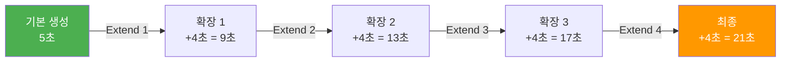
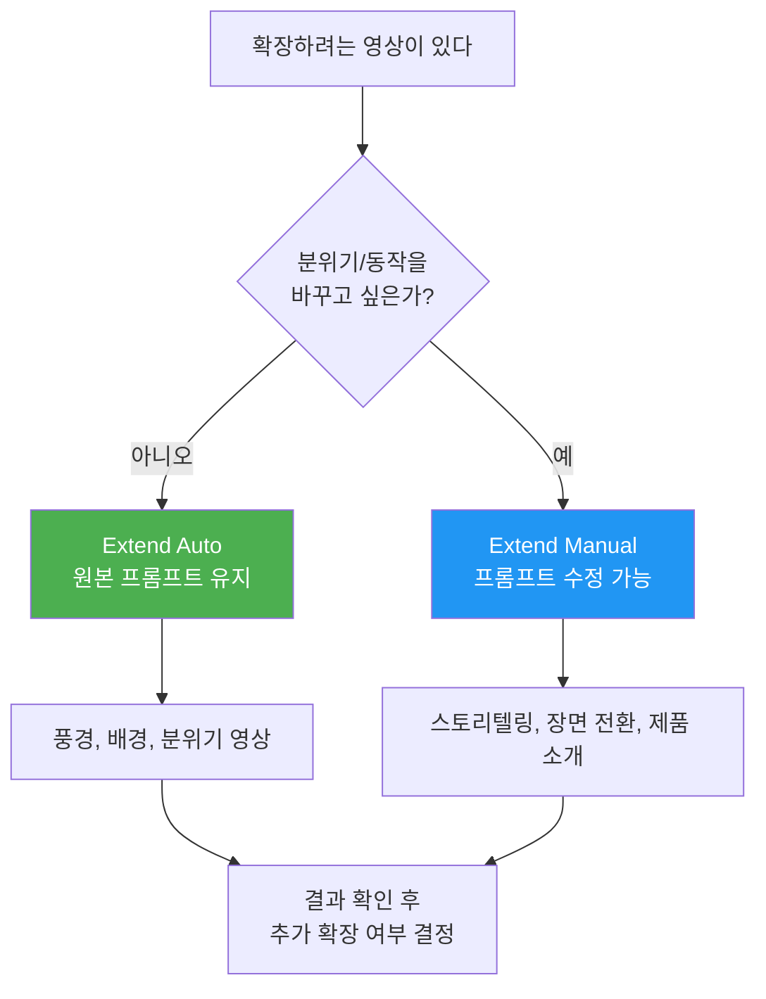
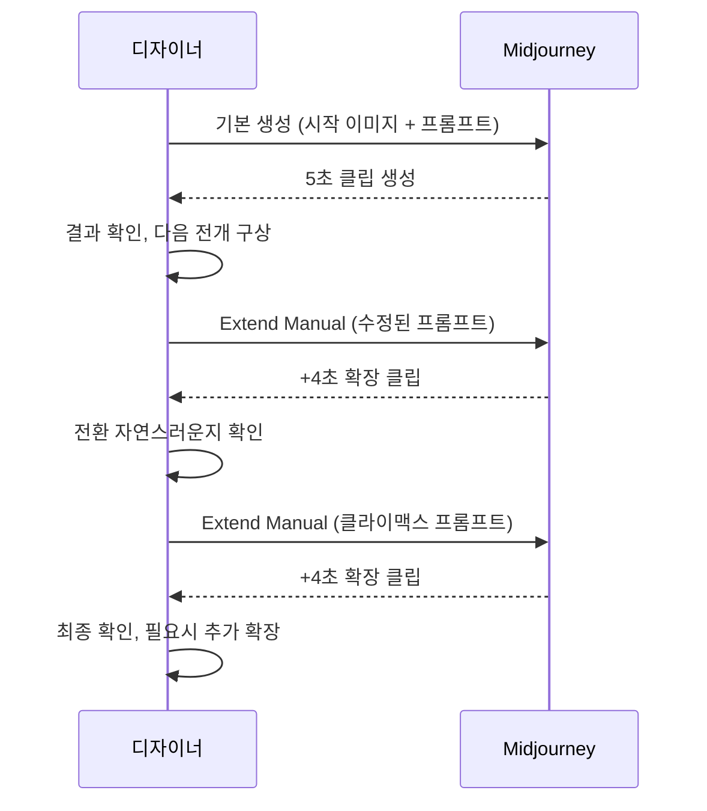
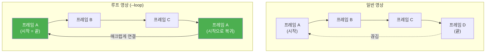
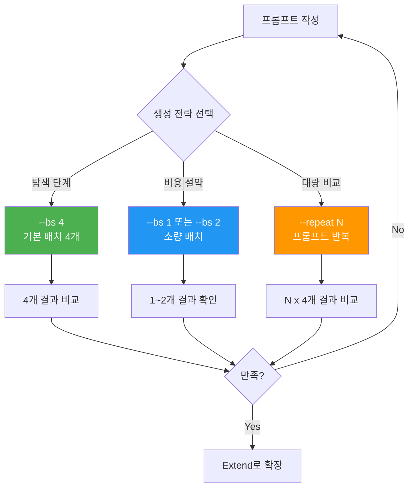
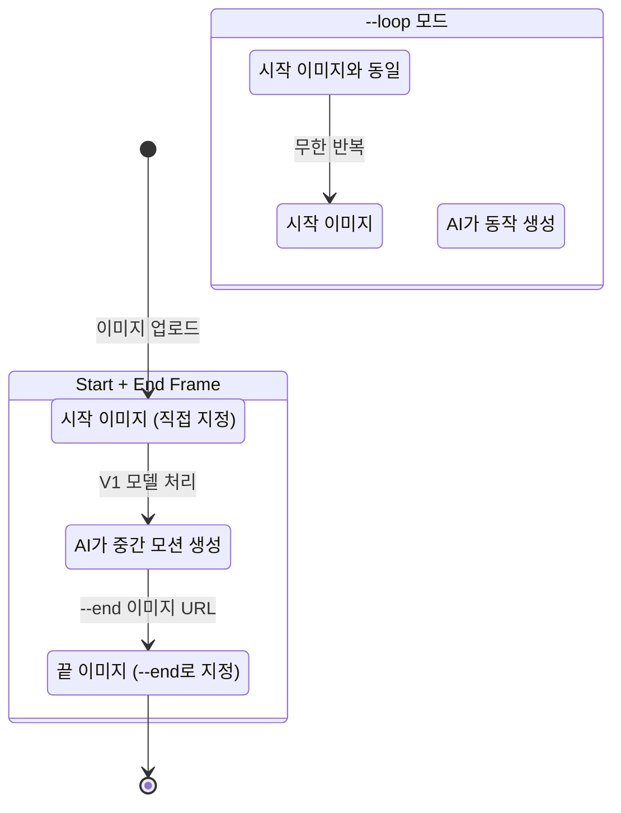

# 영상 확장과 반복 생성

> Extend로 5초를 21초로 늘리고, Loop로 끝없이 순환하며, Repeat로 최적의 결과를 발굴하는 Midjourney 비디오 고급 전략

## 개요

이 섹션에서는 Midjourney V1 비디오의 **Extend(확장)**, **Loop(루프)**, **Repeat/Batch Size(반복 생성)** 기능을 깊이 있게 다룹니다. 기본 5초짜리 영상을 최대 21초까지 늘리고, 시작과 끝이 자연스럽게 이어지는 무한 루프 영상을 만들며, 여러 변형을 동시에 생성해 최적의 결과를 선별하는 전략을 학습합니다.

**선수 지식**: [모션과 카메라 제어](10-ch10-midjourney-영상-생성/03-03-모션과-카메라-제어.md)에서 배운 카메라 무브먼트 프롬프트 작성법, `--motion`, `--raw`, `--end` 파라미터 활용법

**학습 목표**:
- Extend Auto와 Extend Manual의 차이를 이해하고 상황에 맞게 선택할 수 있다
- 최대 4회 확장으로 21초 시퀀스를 설계하고 내러티브를 구성할 수 있다
- `--loop` 파라미터로 심리스 루프 영상을 제작할 수 있다
- `--bs`와 `--repeat`를 활용한 반복 생성으로 최적 결과를 선별할 수 있다

## 왜 알아야 할까?

5초짜리 영상 하나로는 이야기를 전달하기 어렵습니다. SNS 릴스, 제품 소개, 배경 영상 — 어떤 용도든 "조금만 더 길었으면"이라는 생각이 들죠. 그런데 Midjourney V1은 처음부터 긴 영상을 한 번에 만들어주지 않습니다. 대신 **짧은 클립을 이어 붙이는 방식**으로 최대 21초까지 확장할 수 있는데요, 이 과정에서 프롬프트를 바꿔가며 **이야기를 발전**시킬 수 있다는 게 핵심입니다.

또한 디지털 사이니지나 웹 배경으로 사용할 **무한 반복 영상**, 소셜 미디어에서 시선을 끄는 **루프 콘텐츠**의 수요는 날로 커지고 있습니다. `--loop` 하나로 시작 프레임과 끝 프레임이 동일한 심리스 영상을 만들 수 있다면, 별도의 영상 편집 없이도 전문적인 루프 콘텐츠를 제작할 수 있습니다.

## 핵심 개념

### 개념 1: Extend — 영상을 이어 붙이는 타임라인 확장

> 💡 **비유**: 릴레이 소설을 떠올려보세요. 첫 번째 작가가 이야기를 시작하면, 다음 작가가 앞의 내용을 이어받아 새로운 전개를 더합니다. Extend는 바로 이 릴레이 소설 방식입니다 — 마지막 프레임을 "이전 작가의 마지막 문장"으로 받아서, 다음 구간의 이야기를 이어 쓰는 거죠.

Midjourney V1의 Extend 기능은 생성된 영상의 **마지막 프레임을 시작점으로 삼아** 추가 구간을 덧붙이는 방식으로 작동합니다. 기본 영상이 5초이고, 각 확장은 약 4초를 추가하므로 최대 4회 확장하면 **5 + 4 + 4 + 4 + 4 = 약 21초**의 영상을 만들 수 있습니다.

> 📊 **그림 1**: Extend를 통한 영상 확장 구조

> ⚠️ **확장 길이에 대한 참고**: Midjourney 공식 문서에서는 Extend가 영상의 길이를 늘려준다고 설명하며, 커뮤니티와 실사용 기준으로 **한 번의 확장당 약 4초**가 추가되는 것이 일반적입니다. 다만 이 수치는 모델 업데이트에 따라 변경될 수 있으므로, 정확한 확장 길이는 실제 생성 결과로 확인하는 것이 가장 확실합니다. 최대 확장 횟수는 4회이며, 결과적으로 **약 21초 내외**의 영상을 만들 수 있습니다.

두 가지 확장 모드가 있습니다:

| 모드 | 설명 | 적합한 상황 |
|------|------|------------|
| **Extend Auto** | 원래 프롬프트를 그대로 유지하며 자동 확장 | 동일한 분위기의 연속 장면, 자연 풍경 |
| **Extend Manual** | 프롬프트를 수정한 뒤 확장 | 이야기 전개, 장면 전환, 행동 변화 |

**Extend Auto**는 원본 프롬프트를 그대로 사용하므로, AI가 자연스러운 연속 동작을 만들어냅니다. "바닷가에서 석양을 바라보는 여성"이라는 프롬프트로 시작했다면, 카메라가 서서히 움직이거나 바람에 머리카락이 날리면서 자연스럽게 이어지는 장면이 생성되죠. 사용자가 별도로 개입할 필요 없이 **Extend 버튼(또는 Remix 비활성 상태에서 확장)**만 클릭하면 되므로, 가장 간편한 확장 방식입니다. 풍경 영상, 분위기 루프, 배경 영상처럼 **일관된 톤을 유지하는 것이 중요한 콘텐츠**에 최적입니다.

**Extend Manual**은 Remix 모드를 활성화한 상태에서 확장하는 방식입니다. 확장할 때마다 프롬프트를 수정할 수 있어서, 한 영상 안에서 **이야기를 전개**할 수 있습니다. 웹 인터페이스에서는 Remix가 켜져 있으면 Extend 클릭 시 프롬프트 편집 창이 뜨고, 여기서 새로운 지시를 입력하면 됩니다. 예를 들어:

- **5초 (기본)**: "A woman walks toward the ocean, golden hour lighting"
- **+4초 (확장 1)**: "A shark fin emerges from the water"
- **+4초 (확장 2)**: "The woman steps back in surprise"
- **+4초 (확장 3)**: "A dolphin leaps out of the water beside the shark fin"

이렇게 하면 약 17초짜리 미니 스토리가 완성됩니다!

> 📊 **그림 2**: Extend Auto vs Manual 선택 가이드

> ⚠️ **흔한 오해**: "Extend를 하면 전체 영상이 다시 렌더링된다"고 생각하는 분이 많습니다. 실제로는 **마지막 프레임부터 이어지는 새 구간만** 생성됩니다. 기존 구간은 변하지 않으므로 안심하고 실험할 수 있습니다.

### 개념 2: 내러티브 시퀀스 설계 — Extend Manual로 이야기 만들기

> 💡 **비유**: 4컷 만화를 생각해보세요. 기승전결의 각 칸이 하나의 Extend 구간입니다. 첫 칸에서 상황을 설정하고, 다음 칸에서 사건이 벌어지고, 세 번째 칸에서 반전이 오고, 마지막 칸에서 결말이 납니다. Extend Manual은 이 4컷 구조를 영상으로 구현하는 도구입니다.

Extend Manual의 진정한 가치는 **프롬프트 체인**을 통한 내러티브 구성에 있습니다. 단순히 길이만 늘리는 게 아니라, 각 구간마다 다른 행동과 분위기를 부여하여 하나의 스토리를 만들 수 있거든요.

> 📊 **그림 3**: 내러티브 시퀀스 설계 프로세스

**내러티브 시퀀스 설계 3원칙**:

1. **점진적 변화**: 확장마다 프롬프트를 급격히 바꾸면 부자연스러운 점프 컷이 됩니다. "걷는 여성"에서 갑자기 "우주 비행사"로 바꾸는 건 무리죠. 대신 **행동이나 환경을 한 단계씩** 변화시키세요.

2. **시각적 앵커 유지**: 주요 피사체(인물, 사물)를 프롬프트에 계속 포함시켜야 영상의 연속성이 유지됩니다. "A cat sitting on a windowsill"에서 시작했다면, 확장 시에도 "The cat..."으로 시작하세요.

3. **모션 일관성**: 이전 구간이 Low Motion이었는데 갑자기 격렬한 액션이 오면 어색합니다. `--motion` 파라미터도 전체 시퀀스에서 일관되게 유지하는 것이 좋습니다.

**실전 시퀀스 예시 — 제품 소개 영상**:

| 구간 | 시간 | 프롬프트 핵심 | 목적 |
|------|------|-------------|------|
| 기본 | 0-5초 | "A sleek perfume bottle on marble, soft lighting" | 제품 등장 |
| 확장 1 | 5-9초 | "Camera slowly orbits the perfume bottle, golden particles float" | 디테일 강조 |
| 확장 2 | 9-13초 | "Mist swirls around the bottle, flower petals fall" | 분위기 고조 |
| 확장 3 | 13-17초 | "Camera pulls back revealing a luxurious vanity table" | 라이프스타일 맥락 |

### 개념 3: Loop — 끝없이 순환하는 영상 만들기

> 💡 **비유**: 회전목마를 떠올려보세요. 마지막 말이 지나면 다시 첫 번째 말이 나타나죠. 관객 입장에서는 어디가 시작이고 어디가 끝인지 구분할 수 없습니다. `--loop`은 영상의 마지막 프레임이 첫 프레임으로 자연스럽게 돌아오게 만드는, 말 그대로 "회전목마" 기능입니다.

`--loop` 파라미터는 시작 프레임과 끝 프레임을 동일하게 만들어 **심리스 루프(Seamless Loop)** 영상을 생성합니다. 2025년 7월 업데이트로 도입된 이 기능은 웹 배경, 디지털 사이니지, SNS 콘텐츠 제작에 특히 유용합니다.

> 📊 **그림 4**: 일반 영상 vs 루프 영상 구조 비교

**`--loop` 사용법**:

프롬프트 끝에 `--loop`을 추가하기만 하면 됩니다. 웹 인터페이스에서는 Loop 버튼을 클릭할 수도 있습니다.

**루프에 적합한 피사체**:

| 적합도 | 피사체 유형 | 예시 |
|--------|-----------|------|
| 최적 | 추상적/스타일라이즈드 | 물결치는 그래디언트, 파티클 효과 |
| 적합 | 반복 동작이 자연스러운 것 | 타오르는 불꽃, 흘러가는 구름, 물결 |
| 보통 | 단순한 동작의 피사체 | 걷는 인물, 회전하는 오브젝트 |
| 도전적 | 복잡하고 사실적인 장면 | 여러 인물의 대화, 복잡한 도시 풍경 |

> 🔥 **실무 팁**: 루프 영상이 자연스러우려면 **시작과 끝이 비슷한 상태의 피사체**를 선택하세요. "촛불이 흔들리는 모습", "파도가 밀려왔다 빠지는 모습"처럼 순환적 성격을 가진 움직임이 가장 깔끔한 루프를 만들어줍니다. 반대로 "로켓이 발사되는 장면"처럼 일방향 동작은 루프가 부자연스러워질 수 있습니다.

### 개념 4: 반복 생성 전략 — --bs와 --repeat

> 💡 **비유**: 사진 촬영을 생각해보세요. 전문 사진작가가 한 장면에서 셔터를 한 번만 누르는 경우는 거의 없죠. 다양한 순간을 포착하기 위해 연속 촬영(버스트 모드)을 쓰고, 그중 최고의 한 장을 골라냅니다. `--bs`와 `--repeat`가 바로 이 버스트 모드 역할을 합니다.

AI 영상 생성은 근본적으로 **확률적 프로세스**입니다. 같은 프롬프트라도 매번 다른 결과가 나오기 때문에, 여러 번 생성해서 최적의 결과를 고르는 전략이 필수적입니다.

> 📊 **그림 5**: 반복 생성 전략과 비용 최적화

**`--bs` (Batch Size)**: 한 번의 프롬프트에서 생성되는 영상 수를 조절합니다.

- `--bs 4` (기본값): 4개의 영상을 동시에 생성
- `--bs 2`: 2개만 생성하여 GPU 시간 절약
- `--bs 1`: 1개만 생성 — 프롬프트를 이미 다듬은 후 최종 생성 시

**`--repeat` (반복)**: 동일한 프롬프트를 여러 번 실행합니다.

- Basic 플랜: `--repeat 2` ~ `--repeat 4`
- Standard 플랜: `--repeat 2` ~ `--repeat 10`
- Pro/Mega 플랜: `--repeat 2` ~ `--repeat 40`
- **주의**: Fast/Turbo 모드에서만 작동하며, Relax 모드에서는 사용 불가

**3단계 반복 생성 전략**:

1. **탐색 (Exploration)**: `--bs 4`로 프롬프트의 가능성을 넓게 탐색
2. **정제 (Refinement)**: 마음에 드는 결과의 프롬프트를 미세 조정 후 `--bs 2`로 재생성
3. **최종 선택 (Selection)**: 확정된 프롬프트로 `--bs 1`을 사용해 GPU 비용 최적화

> 💡 **알고 계셨나요?**: `--bs 4`로 4개의 영상을 만드는 것은 `--bs 1`로 4번 만드는 것보다 GPU 시간이 약간 더 효율적입니다. 배치 처리의 오버헤드가 줄어들기 때문이죠. 탐색 단계에서는 `--bs 4`를 적극 활용하세요!

### 개념 5: Start/End Frame — 시작과 끝을 직접 지정하기

> 💡 **비유**: 영화 스토리보드에서 "첫 장면"과 "마지막 장면"을 먼저 정해놓고 중간을 채우는 방식과 같습니다. 시작과 끝이 정해져 있으니 AI가 그 사이를 자연스럽게 채워주는 거죠.

2025년 7월 업데이트로 도입된 **Start Frame + End Frame** 제어는 영상의 출발점과 도착점을 모두 직접 지정할 수 있게 해줍니다. `--end` 파라미터에 이미지 URL을 넣으면, 시작 이미지에서 끝 이미지로 자연스럽게 전환되는 영상이 만들어집니다.

> 📊 **그림 6**: Start/End Frame과 Loop의 관계

**Start/End Frame 활용 시나리오**:

- **장면 전환 영상**: 낮 풍경 → 밤 풍경으로의 자연스러운 전환
- **제품 변신**: 원료 이미지 → 완성품 이미지
- **감정 변화**: 슬픈 표정 → 밝은 표정
- **계절 변화**: 봄 풍경 → 여름 풍경

**주의사항**: Start/End Frame은 **Manual 모드에서만** 작동합니다. Auto 모드에서는 End Frame을 지정할 수 없습니다.

## 실습: 적용해보기

### 활동 1: 제품 소개 시퀀스 설계하기

자신이 홍보하고 싶은 제품(또는 가상의 제품)을 하나 선택하고, 아래 시퀀스 플래닝 시트를 채워보세요.

| 구간 | 시간 | 모드 | 프롬프트 핵심 키워드 | 의도하는 모션 |
|------|------|------|-------------------|-------------|
| 기본 | 0-5초 | — | | |
| 확장 1 | 5-9초 | Auto / Manual | | |
| 확장 2 | 9-13초 | Auto / Manual | | |
| 확장 3 | 13-17초 | Auto / Manual | | |

**체크포인트 질문**:
- 각 구간의 프롬프트가 점진적으로 변화하는가?
- 시각적 앵커(제품)가 모든 프롬프트에 유지되는가?
- 최종 영상이 어떤 플랫폼(Instagram, 웹사이트 등)에서 사용될 것인지 고려했는가?

### 활동 2: 루프 영상 콘셉트 브레인스토밍

아래 3가지 용도에 맞는 루프 영상 콘셉트를 각각 1개씩 구상해보세요.

1. **웹사이트 히어로 배경**: 어떤 브랜드의 웹사이트인가? 어떤 무드를 줘야 하는가?
2. **SNS 프로필 영상**: 자신의 크리에이터 정체성을 어떻게 루프로 표현할 것인가?
3. **매장 디지털 사이니지**: 어떤 제품/서비스를 홍보하며, 고객의 시선을 어떻게 잡을 것인가?

각 콘셉트에 대해 다음을 정리하세요:
- 피사체 및 동작 설명
- `--motion low` vs `--motion high` 선택 이유
- 해당 피사체가 루프에 적합한 이유

### 활동 3: GPU 비용 시뮬레이션

다음 시나리오에서 어떤 반복 생성 전략이 가장 효율적인지 비교 분석해보세요.

**시나리오**: 인스타그램 릴스용 13초 제품 영상을 만들어야 합니다.

| 전략 | 생성 횟수 | 예상 GPU 비용 (상대값) | 장점 | 단점 |
|------|----------|---------------------|------|------|
| A: 매번 --bs 4 | | | | |
| B: 탐색 --bs 4 → 확정 --bs 1 | | | | |
| C: --bs 1로 --repeat 4 | | | | |

## 더 깊이 알아보기

### Extend의 탄생 — "왜 처음부터 긴 영상을 안 만들까?"

AI 영상 생성에서 "긴 영상을 한 번에 만드는 것"은 기술적으로 엄청난 도전입니다. 현재의 디퓨전 기반 비디오 모델은 시간이 길어질수록 **시간적 일관성(temporal coherence)**을 유지하기가 기하급수적으로 어려워지거든요. 10초만 넘어도 인물의 얼굴이 변하거나, 배경이 갑자기 바뀌는 현상이 흔하게 발생합니다.

이 문제를 해결하기 위해 업계에서 채택한 전략이 바로 **"짧은 세그먼트 + 확장(Extend)"** 방식입니다. 각 세그먼트에서만 일관성을 유지하면 되므로 품질 관리가 훨씬 수월하죠. Midjourney의 "5초 기본 + 약 4초씩 확장" 구조도 이 원리에 기반합니다. Runway Gen-3, Pika 등 다른 AI 영상 도구들도 비슷한 확장 메커니즘을 사용하는데, 이는 현 세대 AI 영상 기술의 근본적 한계이자 창의적 해결책인 셈입니다.

### 루프 영상의 예술적 계보

루프 영상은 AI 시대에 갑자기 등장한 게 아닙니다. 1800년대 **조에트로프(Zoetrope)**에서 시작된 "반복되는 움직임의 매력"은 GIF 아트, 시네마그래프(Cinemagraph)를 거쳐 오늘날의 AI 루프 영상으로 이어졌습니다. 특히 2010년대에 유행한 시네마그래프 — 사진처럼 보이지만 일부분만 움직이는 이미지 — 는 `--loop --motion low`로 만드는 Midjourney 루프 영상과 놀라울 정도로 닮아 있습니다. 기술은 바뀌었지만, "끝없이 반복되는 작은 움직임"이 주는 최면적 매력은 200년 전이나 지금이나 동일합니다.

## 흔한 오해와 팁

> ⚠️ **흔한 오해**: "Extend를 많이 할수록 무조건 좋은 영상이 된다"고 생각하기 쉽습니다. 하지만 확장을 거듭할수록 초기 프롬프트의 의도에서 벗어나는 **드리프트(drift)** 현상이 발생할 수 있습니다. 3회 이상 확장할 때는 특히 주의해서 각 구간의 결과를 확인하세요.

> 💡 **알고 계셨나요?**: `--loop`으로 만든 영상을 다시 Extend하면 어떻게 될까요? 루프 속성이 해제되면서 일반 영상처럼 이어집니다. 루프 영상은 그 자체로 완결된 형태이므로, 확장보다는 루프 품질 자체를 높이는 데 집중하는 것이 좋습니다.

> 🔥 **실무 팁**: 여러 개의 5초 클립을 각각 만든 뒤 외부 편집 도구(CapCut, Premiere 등)에서 이어 붙이는 것도 좋은 전략입니다. Extend는 AI가 연결 지점을 자동으로 이어주지만, 별도 클립을 편집으로 연결하면 **더 극적인 장면 전환**(페이드, 디졸브 등)을 적용할 수 있습니다. 두 방식을 상황에 따라 조합하세요.

> 🔥 **실무 팁**: 프레임 일관성을 위해 Start/End Frame을 활용할 때는, **두 이미지의 색감과 구도가 비슷한 것**을 선택하세요. 낮 사진에서 밤 사진으로 전환하는 것은 가능하지만, 실내에서 갑자기 우주 공간으로 바뀌는 건 AI가 자연스럽게 연결하기 어렵습니다.

## 핵심 정리

| 개념 | 설명 |
|------|------|
| **Extend Auto** | 원래 프롬프트를 유지하며 자동으로 약 4초씩 영상 확장 |
| **Extend Manual** | 프롬프트를 수정하며 약 4초씩 확장 — 내러티브 시퀀스 구성에 핵심 |
| **최대 확장** | 5초 기본 + 4회 확장 = 최대 약 21초 (모델 업데이트에 따라 변동 가능) |
| **--loop** | 시작 프레임 = 끝 프레임으로 심리스 루프 영상 생성 |
| **--end** | 끝 프레임 이미지를 직접 지정 (Manual 모드 전용) |
| **--bs N** | 배치 사이즈 — 한 프롬프트당 생성 영상 수 (1, 2, 4) |
| **--repeat N** | 동일 프롬프트 반복 실행 (Fast/Turbo 모드 전용) |
| **내러티브 3원칙** | 점진적 변화, 시각적 앵커 유지, 모션 일관성 |
| **루프 적합 피사체** | 추상적 패턴, 반복 자연 동작 (불꽃, 파도, 구름) |
| **Start/End Frame** | 시작과 끝 이미지를 지정하여 AI가 중간 모션 생성 |

## 다음 섹션 미리보기

이제 Extend, Loop, 반복 생성까지 마스터했으니, 마지막 섹션 [숏폼 영상 콘텐츠 제작 프로젝트](10-ch10-midjourney-영상-생성/05-05-숏폼-영상-콘텐츠-제작-프로젝트.md)에서는 이 모든 기술을 종합하여 **실전 숏폼 콘텐츠**를 기획부터 완성까지 만들어봅니다. Instagram Reels, TikTok, YouTube Shorts 등 플랫폼별 최적화 전략과 함께, 여러 클립을 조합한 미니 영상 프로젝트를 완성하게 됩니다.

## 참고 자료

- [Midjourney Video 공식 문서](https://docs.midjourney.com/hc/en-us/articles/37460773864589-Video) - V1 비디오 모델의 Extend, Loop, Batch Size 등 모든 파라미터에 대한 공식 레퍼런스
- [Looping and End Frame for Video 업데이트](https://updates.midjourney.com/looping-and-end-frame-for-video-video-in-the-discord-bot/) - 2025년 7월 업데이트로 추가된 --loop, --end, Discord 비디오 생성 기능 소개
- [Midjourney Repeat 파라미터 공식 문서](https://docs.midjourney.com/hc/en-us/articles/32757107922061-Repeat) - --repeat 파라미터의 구독별 제한과 사용법
- [Making Longer Videos in Midjourney — TitanXT Guide](https://www.titanxt.io/post/making-longer-videos-in-midjourney-a-simple-guide-to-extended-clips) - Extend Auto/Manual을 활용한 실전 영상 확장 가이드
- [How to Create Seamless Video Loops with MidJourney 7 — Geeky Gadgets](https://www.geeky-gadgets.com/midjourney-7-seamless-video-looping/) - Low/High Motion 루프 영상 제작 팁과 최적 피사체 선택 가이드

---
### 🔗 Related Sessions
- [v1 비디오 모델](10-ch10-midjourney-영상-생성/01-01-midjourney-비디오-모델-소개.md) (prerequisite)
- [image-to-video 워크플로우](10-ch10-midjourney-영상-생성/01-01-midjourney-비디오-모델-소개.md) (prerequisite)
- [--motion low](10-ch10-midjourney-영상-생성/02-02-image-to-video-정지-이미지에-생명-불어넣기.md) (prerequisite)
- [--motion high](10-ch10-midjourney-영상-생성/02-02-image-to-video-정지-이미지에-생명-불어넣기.md) (prerequisite)
- [모션 프롬프트](10-ch10-midjourney-영상-생성/01-01-midjourney-비디오-모델-소개.md) (prerequisite)
- [--raw(비디오)](10-ch10-midjourney-영상-생성/02-02-image-to-video-정지-이미지에-생명-불어넣기.md) (prerequisite)
- [--end 파라미터](10-ch10-midjourney-영상-생성/03-03-모션과-카메라-제어.md) (prerequisite)
- [카메라 무브먼트 신뢰도 체계](10-ch10-midjourney-영상-생성/03-03-모션과-카메라-제어.md) (prerequisite)
