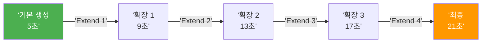
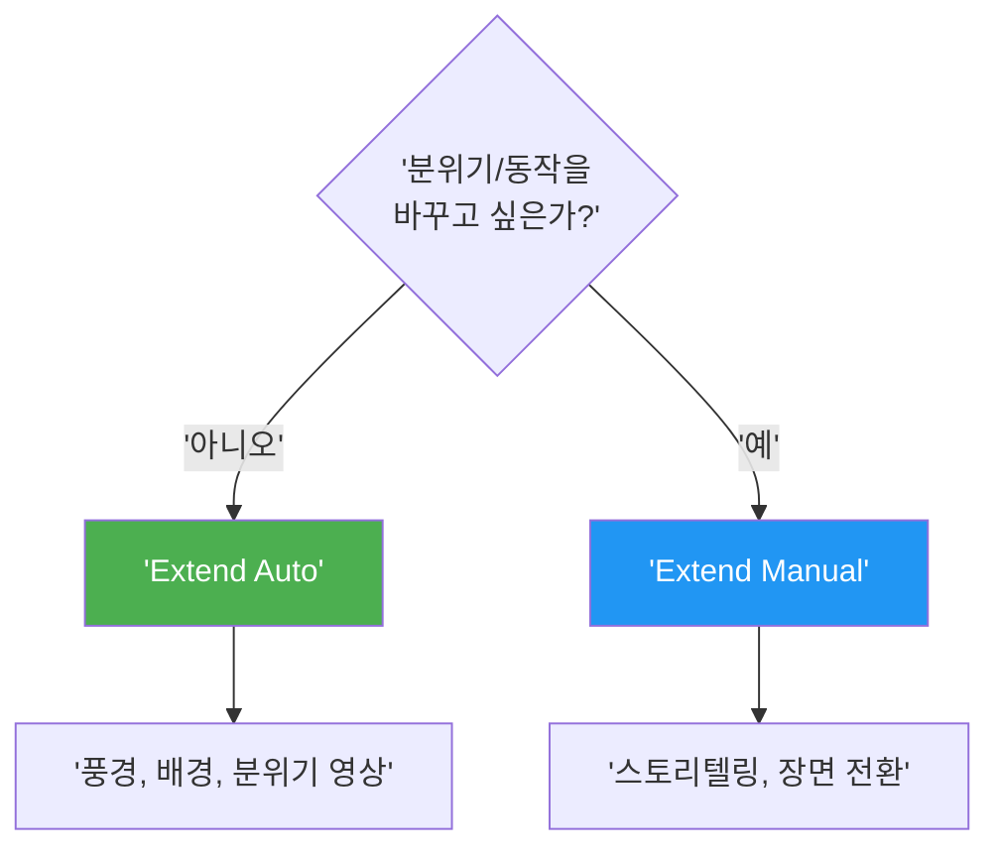
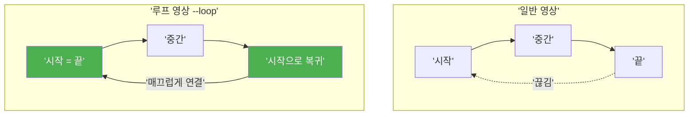

# 영상 확장과 반복 생성

> Extend로 5초를 21초로, Loop로 무한 순환, Repeat로 최적의 결과를 찾는 Midjourney 비디오 고급 전략

## 개요

Midjourney V1 비디오의 **Extend(확장)**, **Loop(루프)**, **Repeat/Batch Size(반복 생성)** 기능을 다룹니다. 기본 5초 영상을 최대 21초까지 늘리고, 심리스 루프 영상을 만들며, 여러 변형을 동시에 생성해 최적의 결과를 선별하는 전략을 학습합니다.

## Extend — 영상 타임라인 확장

Extend는 생성된 영상의 **마지막 프레임을 시작점으로 삼아** 추가 구간을 덧붙입니다. 기본 5초에 각 확장이 약 4초를 추가하므로, 최대 4회 확장으로 **약 21초** 영상을 만들 수 있습니다.



두 가지 확장 모드가 있습니다:

| 모드 | 설명 | 적합한 상황 |
|------|------|------------|
| **Extend Auto** | 원래 프롬프트를 유지하며 자동 확장 | 풍경, 배경, 분위기 유지 영상 |
| **Extend Manual** | Remix 모드로 프롬프트를 수정하며 확장 | 스토리텔링, 장면 전환, 제품 소개 |



### Extend Auto 프롬프트 예시

자연스러운 연속 장면이 필요할 때 원본 프롬프트를 유지한 채 Extend 버튼만 클릭합니다.

```
A serene lake at sunrise, mist rising from the water, cinematic --v 1
```


```
A candle flame flickering gently in a dark room, warm tones --v 1
```

```
Waves crashing on a rocky shoreline, aerial view, golden hour --v 1
```

### Extend Manual — 내러티브 시퀀스 설계

Extend Manual의 진정한 가치는 **프롬프트 체인**을 통한 내러티브 구성입니다. 각 구간마다 다른 행동과 분위기를 부여하여 하나의 스토리를 만들 수 있습니다.

**내러티브 설계 3원칙**:

1. **점진적 변화** — 확장마다 행동이나 환경을 한 단계씩 변화시킬 것
2. **시각적 앵커 유지** — 주요 피사체를 프롬프트에 계속 포함시킬 것
3. **모션 일관성** — `--motion` 파라미터를 전체 시퀀스에서 일관되게 유지할 것

**제품 소개 시퀀스 예시**:

```
A sleek perfume bottle on marble, soft studio lighting, cinematic --v 1
```


```
Camera slowly orbits the perfume bottle, golden particles float around it --v 1
```

```
Mist swirls around the bottle, flower petals fall gently --v 1
```

```
Camera pulls back revealing a luxurious vanity table with the perfume --v 1
```


| 구간 | 시간 | 프롬프트 핵심 | 목적 |
|------|------|-------------|------|
| 기본 | 0-5초 | 제품 클로즈업, 소프트 라이팅 | 제품 등장 |
| 확장 1 | 5-9초 | 카메라 오빗, 골든 파티클 | 디테일 강조 |
| 확장 2 | 9-13초 | 미스트, 꽃잎 낙하 | 분위기 고조 |
| 확장 3 | 13-17초 | 카메라 풀백, 화장대 전경 | 라이프스타일 맥락 |

## Loop — 무한 순환 영상

`--loop` 파라미터는 시작 프레임과 끝 프레임을 동일하게 만들어 **심리스 루프** 영상을 생성합니다. 웹 배경, 디지털 사이니지, SNS 콘텐츠에 특히 유용합니다.



**루프 적합도 가이드**:

| 적합도 | 피사체 유형 | 예시 |
|--------|-----------|------|
| 최적 | 추상적/스타일라이즈드 | 물결치는 그래디언트, 파티클 효과 |
| 적합 | 반복 동작이 자연스러운 것 | 타오르는 불꽃, 구름, 물결 |
| 보통 | 단순 동작의 피사체 | 걷는 인물, 회전 오브젝트 |
| 도전적 | 복잡하고 사실적인 장면 | 여러 인물의 대화, 복잡한 도시 |

### 루프 프롬프트 예시

```
Abstract flowing gradient, purple and blue tones, smooth motion --loop --v 1
```


```
A single candle flame flickering, dark background, cinematic --loop --motion low --v 1
```

```
Ocean waves gently rolling on a sandy beach, overhead view --loop --v 1
```


```
Cherry blossom petals falling slowly, soft pink tones --loop --motion low --v 1
```

## 반복 생성 전략 — --bs와 --repeat

AI 영상 생성은 **확률적 프로세스**이므로 같은 프롬프트라도 매번 다른 결과가 나옵니다. 여러 번 생성해서 최적의 결과를 고르는 전략이 필수적입니다.

**`--bs` (Batch Size)**: 한 번의 프롬프트에서 생성되는 영상 수

- `--bs 4` (기본값): 4개 동시 생성 — 탐색 단계에 최적
- `--bs 2`: 2개만 생성하여 GPU 시간 절약
- `--bs 1`: 1개만 생성 — 프롬프트 확정 후 최종 생성 시

**`--repeat N`**: 동일 프롬프트를 N번 반복 실행 (Fast/Turbo 모드 전용)

- Basic: 최대 4회 / Standard: 최대 10회 / Pro/Mega: 최대 40회

**3단계 반복 생성 전략**:

1. **탐색**: `--bs 4`로 가능성을 넓게 탐색
2. **정제**: 마음에 드는 결과의 프롬프트를 미세 조정 후 `--bs 2`로 재생성
3. **최종 선택**: 확정된 프롬프트로 `--bs 1`을 사용해 GPU 비용 최적화

```
A futuristic city skyline at night, neon reflections, cinematic --bs 4 --v 1
```

```
A futuristic city skyline at night, neon reflections, cinematic --bs 1 --v 1
```

## Start/End Frame — 시작과 끝 직접 지정

`--end` 파라미터에 이미지 URL을 넣으면, 시작 이미지에서 끝 이미지로 자연스럽게 전환되는 영상이 만들어집니다. **Manual 모드에서만** 작동합니다.

**활용 시나리오**: 낮→밤 전환, 원료→완성품, 슬픈 표정→밝은 표정, 봄→여름 풍경

```
[시작이미지URL] A landscape transitioning from day to night --end [끝이미지URL] --v 1
```


```
[원료이미지URL] Raw ingredients transforming into a finished dish --end [완성이미지URL] --v 1
```

## 실습

### 제품 소개 시퀀스 만들기

홍보하고 싶은 제품을 하나 선택하고, 아래 시퀀스 플래닝 시트를 채워 Extend Manual로 실행해보세요.

| 구간 | 시간 | 모드 | 프롬프트 핵심 키워드 | 의도하는 모션 |
|------|------|------|-------------------|-------------|
| 기본 | 0-5초 | — | | |
| 확장 1 | 5-9초 | Auto / Manual | | |
| 확장 2 | 9-13초 | Auto / Manual | | |
| 확장 3 | 13-17초 | Auto / Manual | | |

### 루프 영상 제작

아래 프롬프트를 기반으로 `--loop`을 적용하여 각각 생성하고, 어떤 피사체가 가장 자연스러운 루프를 만드는지 비교하세요.

```
Smoke rising from incense, dark background, ethereal mood --loop --motion low --v 1
```

```
A spinning geometric crystal, iridescent reflections --loop --v 1
```

## 팁과 주의사항

- **Extend는 기존 구간을 변경하지 않습니다** — 마지막 프레임부터 이어지는 새 구간만 생성되므로 안심하고 실험하세요
- **확장 드리프트 주의** — 3회 이상 확장 시 초기 프롬프트 의도에서 벗어나는 현상이 발생할 수 있습니다. 매 구간 결과를 확인하세요
- **루프 + Extend 비추천** — `--loop` 영상을 Extend하면 루프 속성이 해제됩니다. 루프 품질 자체를 높이는 데 집중하세요
- **루프에 적합한 피사체** — 촛불, 파도, 구름처럼 순환적 동작이 자연스러운 피사체를 선택하세요. 일방향 동작(로켓 발사 등)은 부자연스럽습니다
- **외부 편집 병행** — 별도 클립을 CapCut, Premiere 등에서 이어 붙이면 페이드, 디졸브 등 극적인 전환이 가능합니다
- **Start/End Frame 색감 일치** — 두 이미지의 색감과 구도가 비슷해야 AI가 자연스럽게 연결합니다
- **`--bs 4`가 효율적** — 배치 4개 생성이 `--bs 1`을 4번 돌리는 것보다 GPU 시간이 약간 더 절약됩니다

## 핵심 정리

| 개념 | 설명 |
|------|------|
| **Extend Auto** | 원래 프롬프트를 유지하며 약 4초씩 자동 확장 |
| **Extend Manual** | 프롬프트를 수정하며 약 4초씩 확장 — 내러티브 구성의 핵심 |
| **최대 확장** | 5초 + 4회 확장 = 최대 약 21초 |
| **--loop** | 시작 = 끝 프레임으로 심리스 루프 영상 생성 |
| **--end** | 끝 프레임 이미지를 직접 지정 (Manual 모드 전용) |
| **--bs N** | 배치 사이즈 — 한 프롬프트당 생성 수 (1, 2, 4) |
| **--repeat N** | 동일 프롬프트 반복 실행 (Fast/Turbo 전용) |
| **내러티브 3원칙** | 점진적 변화, 시각적 앵커 유지, 모션 일관성 |

## 다음 섹션 미리보기

다음 섹션 [숏폼 영상 콘텐츠 제작 프로젝트](10-ch10-midjourney-영상-생성/05-05-숏폼-영상-콘텐츠-제작-프로젝트.md)에서는 Extend, Loop, 반복 생성 기술을 종합하여 Instagram Reels, TikTok, YouTube Shorts 등 플랫폼별로 최적화된 실전 숏폼 콘텐츠를 기획부터 완성까지 만들어봅니다.
