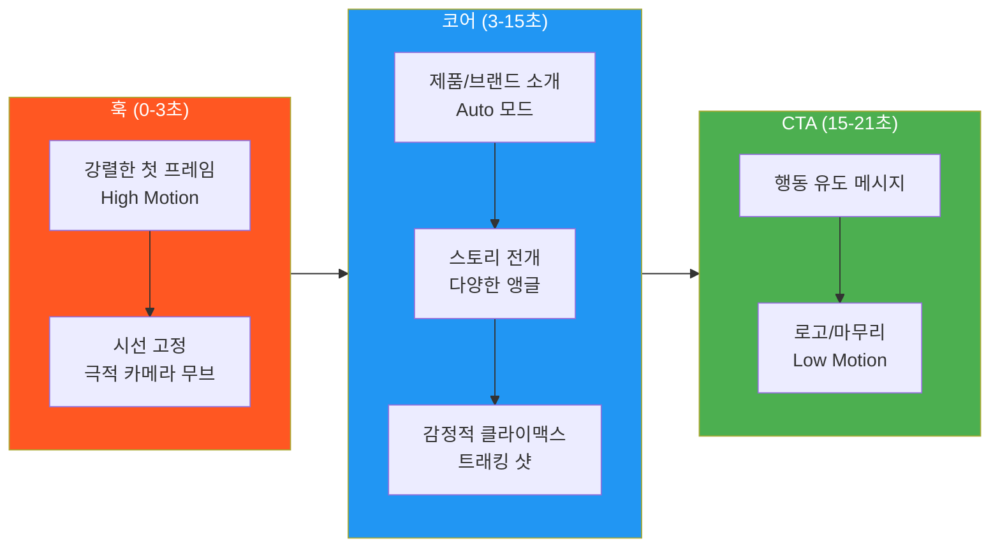
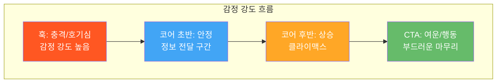
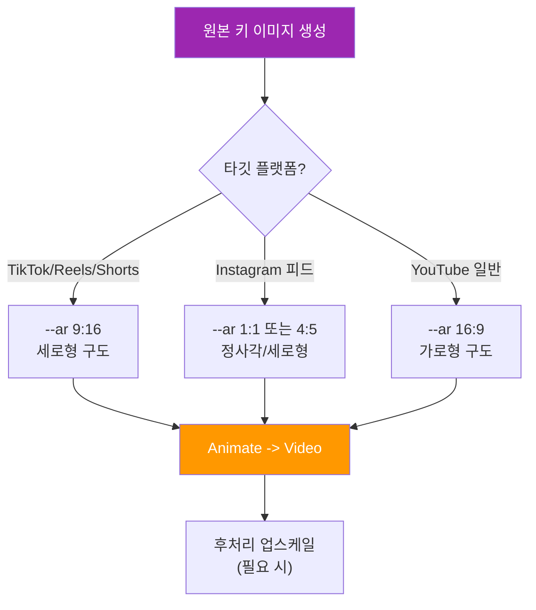
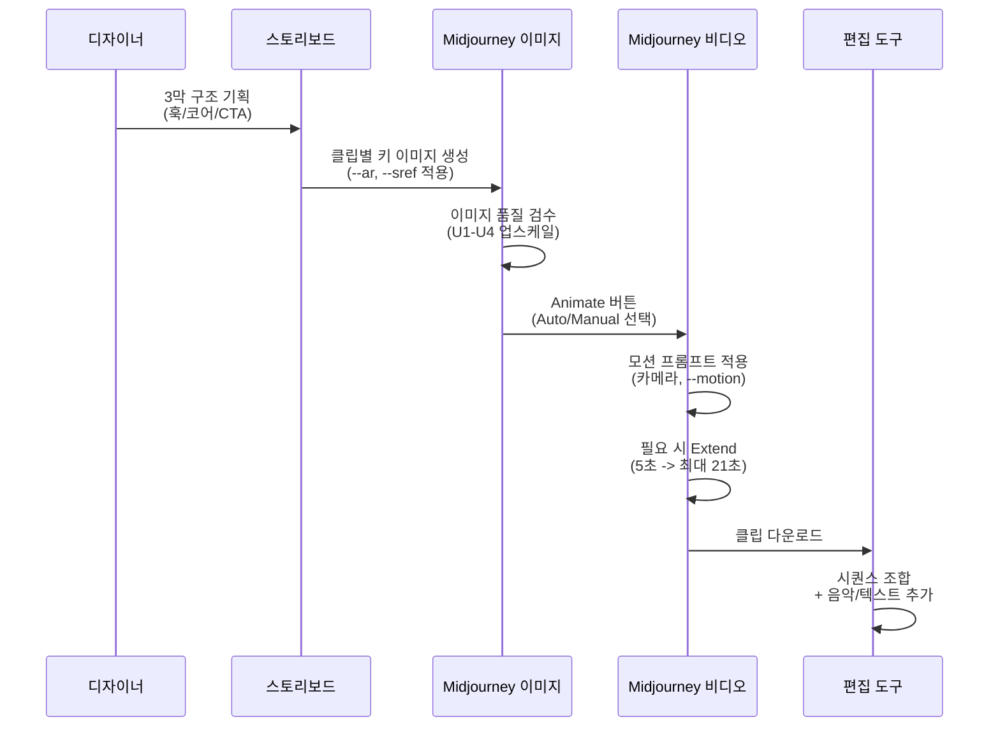
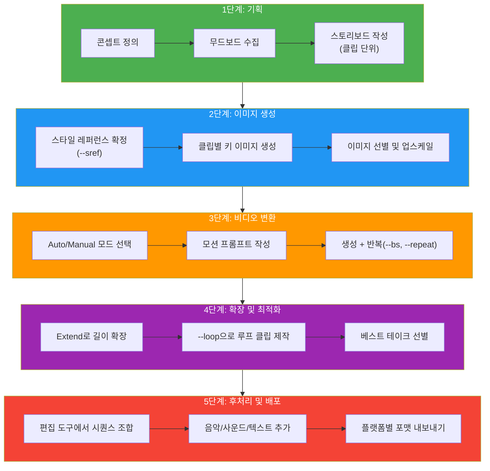
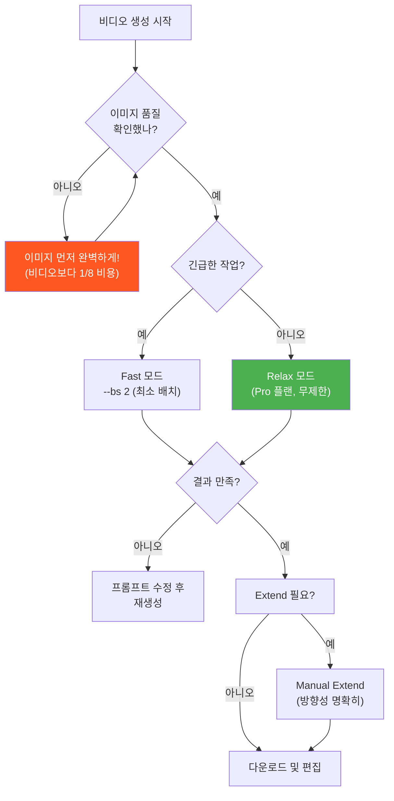

# 숏폼 영상 콘텐츠 제작 프로젝트

> 스토리보드 기획부터 키 이미지 생성, 비디오 변환, 시퀀스 조합까지 — Midjourney로 완성하는 브랜드 숏폼 영상 제작 워크플로우

## 개요

이 섹션에서는 Ch10에서 배운 모든 기술을 종합하여 실전 숏폼 영상 콘텐츠를 기획하고 제작합니다. 영상 제작은 단순히 "멋진 클립 하나"를 만드는 것이 아니라, **기획 → 이미지 생성 → 비디오 변환 → 시퀀스 구성 → 플랫폼 최적화**까지 일관된 워크플로우로 완성하는 과정이거든요.

**선수 지식**: [Midjourney 비디오 모델 소개](10-ch10-midjourney-영상-생성/01-01-midjourney-비디오-모델-소개.md)의 V1 모델 기초, [Image-to-Video 실전](10-ch10-midjourney-영상-생성/02-02-image-to-video-정지-이미지에-생명-불어넣기.md)의 시작 프레임 선택과 모션 프롬프트, [모션과 카메라 제어](10-ch10-midjourney-영상-생성/03-03-모션과-카메라-제어.md)의 카메라 무브먼트, [영상 확장과 반복 생성](10-ch10-midjourney-영상-생성/04-04-영상-확장과-반복-생성.md)의 Extend 체인과 반복 생성 전략

**학습 목표**:
- 숏폼 영상 콘텐츠의 스토리보드를 기획할 수 있다
- Midjourney 이미지 → 비디오 → 시퀀스의 전체 파이프라인을 실행할 수 있다
- TikTok, Instagram Reels, YouTube Shorts 등 플랫폼별 최적화 전략을 적용할 수 있다
- 브랜드 소개 또는 제품 티저 영상을 완성할 수 있다

## 왜 알아야 할까?

2025년 기준, 숏폼 영상은 소셜 미디어에서 가장 높은 도달률과 참여율을 기록하는 콘텐츠 형식입니다. TikTok의 월간 활성 사용자가 15억 명을 넘었고, Instagram Reels와 YouTube Shorts도 각각 20억 사용자 규모의 플랫폼으로 성장했죠. 문제는 **영상 제작 비용**이었습니다. 전통적인 방식으로 15초 브랜드 티저를 만들려면 촬영, 편집, 후반 작업에 수백만 원이 들었거든요.

Midjourney V1 비디오 모델은 이 판도를 완전히 바꿨습니다. 이미지 한 장의 GPU 비용이 약 $0.01이라면, 5초 비디오 클립은 약 $0.10 — 전통 애니메이션의 **1/5000 수준** 비용입니다. 디자이너가 직접 스토리보드를 그리고, 키 이미지를 생성하고, 영상으로 변환하는 전 과정을 한 사람이 해낼 수 있게 된 거죠. 이번 섹션에서 그 전체 워크플로우를 직접 경험해봅시다.

## 핵심 개념

### 개념 1: 숏폼 영상의 구조 — 3막 미니 스토리

> 💡 **비유**: 숏폼 영상은 **엘리베이터 피치**와 같습니다. 1층에서 10층까지 올라가는 30초 동안, 당신의 아이디어를 상대방에게 완벽히 전달해야 하죠. 느긋하게 배경 설명할 시간은 없습니다 — 첫 3초에 시선을 잡고, 핵심을 전달하고, 행동을 유도해야 합니다.

숏폼 영상은 짧지만 반드시 **구조**가 있어야 효과적입니다. 영화의 3막 구조를 15~21초로 압축한다고 생각하세요.

| 구간 | 시간 | 역할 | Midjourney 전략 |
|------|------|------|----------------|
| **훅(Hook)** | 0~3초 | 스크롤을 멈추게 하는 첫 인상 | 강렬한 비주얼, High Motion |
| **코어(Core)** | 3~15초 | 핵심 메시지 또는 제품 소개 | 2~3개 클립 시퀀스, 다양한 앵글 |
| **CTA(Call to Action)** | 15~21초 | 행동 유도 (팔로우, 구매, 방문) | 로고/텍스트 이미지, Low Motion |

> 📊 **그림 1**: 숏폼 영상의 3막 구조와 감정 곡선

각 구간에서 사용하는 Midjourney 비디오 전략이 다릅니다. 훅에서는 **High Motion + 극적인 카메라 무브먼트**로 시선을 사로잡고, 코어에서는 **Auto 모드의 자연스러운 움직임**으로 정보를 전달하며, CTA에서는 **Low Motion**으로 안정감을 주면서 메시지에 집중시키는 거죠.

> 📊 **그림 1-1**: 3막 구조에서의 감정 강도 흐름

이 감정 곡선을 의식하면서 각 클립의 모션 강도와 카메라 워크를 설계하면, 짧은 영상에서도 시청자를 끝까지 붙잡아 둘 수 있습니다. 훅에서 강하게 시작하고, 코어 초반에서 잠시 숨을 고른 뒤, 클라이맥스에서 다시 끌어올리고, CTA에서 부드럽게 착지하는 거죠.

### 개념 2: 플랫폼별 최적화 전략 — 같은 소재, 다른 포맷

> 💡 **비유**: 같은 요리라도 **접시에 따라 플레이팅이 달라지는 것**과 같습니다. 스테이크를 고급 레스토랑의 넓은 접시에 담을 때와 도시락에 담을 때, 재료는 같지만 배치와 크기가 완전히 달라지죠. 숏폼 영상도 플랫폼이라는 "접시"에 맞게 조정해야 합니다.

2025~2026년 기준 주요 숏폼 플랫폼의 핵심 스펙은 다음과 같습니다:

| 플랫폼 | 종횡비 | 해상도 | 권장 길이 | 최대 길이 |
|--------|--------|--------|----------|----------|
| **TikTok** | 9:16 | 1080x1920 | 21~34초 | 10분(촬영)/60분(업로드) |
| **Instagram Reels** | 9:16 | 1080x1920 | 15~90초 | 20분 |
| **YouTube Shorts** | 9:16 | 1080x1920 | 30~60초 | 3분 |
| **Instagram 피드** | 1:1 또는 4:5 | 1080x1080/1350 | 15~60초 | 60분 |

Midjourney V1 비디오는 현재 **480p와 720p**를 지원합니다. 720p(Standard 플랜 이상)가 숏폼에 충분한 품질을 제공하지만, 해상도 한계를 보완하는 전략이 필요합니다.

> 📊 **그림 2**: 플랫폼별 영상 포맷과 Midjourney 이미지 생성 전략

**핵심 전략**: 키 이미지를 생성할 때부터 타깃 플랫폼의 종횡비를 적용하세요. `--ar 9:16`으로 생성한 이미지를 Image-to-Video로 변환하면, 별도의 크롭 없이 바로 숏폼 플랫폼에 최적화된 영상이 나옵니다.

> 🔥 **실무 팁**: Midjourney의 480p 해상도 한계를 숨기는 가장 효과적인 방법은 **매크로 샷, 실루엣, 안개/입자 효과** 같은 분위기 있는 연출입니다. 디테일이 뭉개지는 게 아니라 "의도된 분위기"로 보이거든요. 반대로, 텍스트가 많거나 디테일이 중요한 인포그래픽 스타일은 현재 해상도에서 추천하지 않습니다.

### 개념 3: 스토리보드 설계 — 클립 단위 기획법

> 💡 **비유**: 스토리보드는 영상의 **설계도면**입니다. 건축가가 집을 짓기 전에 도면을 그리듯, 영상을 만들기 전에 각 장면을 미리 시각화하는 거죠. Midjourney 영상 제작에서 스토리보드는 더욱 중요한데, 클립 하나하나가 GPU 비용이기 때문입니다. 계획 없이 랜덤으로 생성하면 비용만 올라가고 일관성은 떨어집니다.

Midjourney V1 비디오에서 스토리보드는 전통적인 영상 스토리보드와 다르게, **클립 단위**로 설계합니다. 각 클립은 5초짜리 비디오 한 단위이고, Extend로 연결하거나 편집 소프트웨어에서 이어 붙입니다.

**클립 단위 스토리보드 템플릿**:

| 클립 # | 장면 설명 | 모션 유형 | 카메라 | 프롬프트 키워드 | 시간 |
|--------|----------|----------|--------|---------------|------|
| 1 | 제품 클로즈업 | High Motion | 줌 아웃 | "zoom out revealing..." | 5초 |
| 2 | 사용 장면 | Auto | 트래킹 | "tracking shot..." | 5초 |
| 3 | 브랜드 로고 | Low Motion | 정적 | "subtle light animation..." | 5초 |

> 📊 **그림 3**: 클립 단위 스토리보드에서 완성 영상까지의 워크플로우

스토리보드를 설계할 때 가장 중요한 원칙은 **일관성**입니다. [브랜드 스타일 가이드 구축](08-ch8-캐릭터브랜드-스타일-일관성-유지/03-03-브랜드-스타일-가이드-구축.md)에서 배운 것처럼, 모든 클립에 동일한 `--sref` 코드를 적용하면 시각적 일관성을 유지할 수 있습니다.

### 개념 4: 실전 워크플로우 — 5단계 제작 파이프라인

> 💡 **비유**: 이 워크플로우는 **요리의 미장플라스(Mise en Place)** — "모든 것을 제자리에" 원칙과 같습니다. 프렌치 셰프는 요리를 시작하기 전에 모든 재료를 손질하고 정리해둡니다. 영상 제작도 마찬가지로, 각 단계를 순서대로 완료해야 최종 결과물이 매끄럽게 나옵니다.

전체 제작 파이프라인은 5단계로 구성됩니다:

> 📊 **그림 4**: 숏폼 영상 5단계 제작 파이프라인

**1단계: 기획** (GPU 비용 $0)
- 콘셉트 정의: 브랜드/제품의 핵심 메시지 한 문장으로 정리
- [프로젝트 기획: 브리프에서 무드보드까지](12-ch12-실전-포트폴리오-프로젝트/01-01-프로젝트-기획-브리프에서-무드보드까지.md)의 방법론을 활용하여 무드보드 수집
- 클립 단위 스토리보드 작성 (위 템플릿 참고)

**2단계: 이미지 생성** (클립당 약 $0.01~0.05)
- `--sref` 코드를 하나 선정하여 전체 클립에 일관된 스타일 적용
- 타깃 플랫폼에 맞는 `--ar` 설정 (숏폼은 보통 `--ar 9:16`)
- [스타일라이즈와 미학 제어](05-ch5-midjourney-기본과-파라미터-튜닝/03-03-스타일라이즈--stylize와-미학-제어.md)에서 배운 `--stylize` 값 활용
- 이미지 선별 후 U1~U4 업스케일 — 업스케일된 이미지는 비디오 변환 시 더 선명한 텍스처 제공

**3단계: 비디오 변환** (클립당 약 $0.08~0.10)
- 훅 클립: Manual 모드 + High Motion + 극적 카메라 동사
- 코어 클립: Auto 모드 또는 Manual + 중간 모션
- CTA 클립: Auto + Low Motion 또는 Manual + "subtle" 키워드
- `--bs 4`로 4개 후보를 동시 생성하여 베스트 테이크 선별

**4단계: 확장 및 최적화** (Extend당 약 $0.08)
- 코어 클립을 Extend Manual로 10~15초까지 확장
- 반복 재생이 필요한 배경 클립은 `--loop` 적용
- [영상 확장과 반복 생성](10-ch10-midjourney-영상-생성/04-04-영상-확장과-반복-생성.md)의 내러티브 시퀀스 3원칙 적용

**5단계: 후처리 및 배포** (외부 도구)
- CapCut, DaVinci Resolve, Premiere Pro 등에서 클립 시퀀스 조합
- 음악, 사운드 이펙트, 텍스트 오버레이 추가
- 플랫폼별 포맷으로 내보내기

### 개념 5: GPU 비용 최적화 전략

> 💡 **비유**: GPU 비용 관리는 **여행 예산 관리**와 같습니다. 계획 없이 여행하면 택시비, 식비, 입장료가 눈덩이처럼 불어나죠. 하지만 미리 동선을 짜고, 패스를 구매하면 같은 경험을 절반 비용으로 할 수 있습니다. Midjourney 비디오도 똑같습니다.

하나의 5초 비디오 클립은 이미지 생성의 **약 8배** GPU 시간을 소모합니다. 15초짜리 3클립 시퀀스를 만든다고 가정하면:

| 작업 | GPU 비용 (대략) | 수량 | 소계 |
|------|----------------|------|------|
| 키 이미지 생성 (4장 그리드) | 이미지 1회분 | 클립당 2~3회 | 6~9회분 |
| 비디오 변환 (5초) | 이미지 8회분 | 3클립 x `--bs 4` | 96회분 |
| Extend (5초 추가) | 이미지 6회분 | 필요한 클립만 | 12~18회분 |
| **합계** | | | **약 115~123회분** |

Standard 플랜($30/월)의 15시간 Fast GPU로는 약 **10~15개의 완성 숏폼 프로젝트**를 만들 수 있습니다.

#### 21초 숏폼 영상 1편 — 구체적 비용 시뮬레이션

"정확히 얼마나 드는지"가 궁금하실 텐데요. 앞서 실습에서 다룬 향수 티저 "Midnight Garden" 프로젝트(21초, 4클립)를 예로 들어, 단계별 GPU 비용을 구체적으로 시뮬레이션해봅시다.

| 단계 | 작업 내역 | Fast GPU 시간 (분) | 달러 환산 | 비고 |
|------|----------|-------------------|----------|------|
| **이미지 탐색** | 4클립 x 3회 생성(4장 그리드) = 12회 | 약 1.2분 | ~$0.12 | 스타일 탐색 포함 |
| **업스케일** | 4장 U1~U4 업스케일 | 약 0.4분 | ~$0.04 | 선택된 이미지만 |
| **비디오 생성** | 4클립 x `--bs 4` = 16개 비디오 | 약 12.8분 | ~$1.28 | 클립당 0.8분 x 16 |
| **Extend** | 2클립 x 2회 Extend = 4회 | 약 3.2분 | ~$0.32 | 코어 클립만 확장 |
| **리테이크** | 불만족 클립 재생성 2회 | 약 1.6분 | ~$0.16 | 현실적 여유분 |
| **합계** | | **약 19.2분** | **약 $1.92** | |

> Standard 플랜 기준: 15시간(900분) Fast GPU = 약 **46편**의 21초 숏폼 제작 가능

위 시뮬레이션은 "효율적으로 작업한 경우"입니다. 실제로는 스타일 탐색에서 시행착오가 더 발생하므로, **현실적으로 1편당 30~40분**(약 $3~4)을 예산으로 잡는 것이 안전합니다. 이 경우에도 Standard 플랜으로 월 **22~30편**을 제작할 수 있어요.

**플랜별 월간 제작 가능 편수** (21초 숏폼 기준):

| 플랜 | 월 비용 | Fast GPU | 효율적 작업 시 | 현실적 예산 시 |
|------|--------|----------|-------------|-------------|
| **Basic** ($10/월) | $10 | 3.3시간 | 약 10편 | 5~6편 |
| **Standard** ($30/월) | $30 | 15시간 | 약 46편 | 22~30편 |
| **Pro** ($60/월) | $60 | 30시간 + Relax 무제한 | 92편 + Relax | 45~60편 + Relax |
| **Mega** ($120/월) | $120 | 60시간 + Relax 무제한 | 187편 + Relax | 90~120편 + Relax |

> ⚠️ **흔한 오해**: "Pro 플랜의 Relax 모드를 쓰면 비용이 0이다" — Relax 모드는 추가 GPU 비용이 들지 않지만, **대기 시간이 상당합니다**. Fast 모드에서 1분 걸리는 비디오 생성이 Relax에서는 5~15분까지 늘어날 수 있어요. 따라서 Relax는 "자기 전에 대량 생성 걸어두기"에 적합하고, 즉각적인 반복 작업에는 Fast가 효율적입니다.

> 📊 **그림 5**: GPU 비용 최적화를 위한 의사 결정 트리

**비용 절감 핵심 원칙**:
1. **이미지 단계에서 완벽하게** — 비디오 변환 비용이 8배이므로, 이미지가 마음에 들 때만 Animate
2. **`--bs` 최소화** — 처음에는 `--bs 2`로 시작, 만족스러운 방향이 잡히면 `--bs 4`
3. **Relax 모드 활용** — Pro 플랜($60/월) 사용자라면 밤사이 Relax 모드로 대량 생성
4. **Extend는 선택적으로** — 모든 클립을 Extend할 필요 없음. 핵심 코어 클립만 확장

## 실습: 적용해보기

### 프로젝트 A: 카페 브랜드 소개 숏폼 (15초)

가상의 스페셜티 카페 "Morning Bloom"의 브랜드 소개 영상을 기획해봅시다.

**Step 1: 콘셉트 정의**
- 핵심 메시지: "매일 아침, 꽃처럼 피어나는 한 잔의 특별함"
- 타깃: 20~30대, 감성적인 카페 경험을 중시하는 소비자
- 플랫폼: Instagram Reels (9:16, 15초)

**Step 2: 스토리보드 작성**

| 클립 | 장면 | 이미지 프롬프트 | 모션 프롬프트 | 모드 |
|------|------|---------------|-------------|------|
| #1 훅 | 커피 원두가 꽃처럼 피어오르는 매크로 | "macro shot of coffee beans blooming like flowers, warm golden light, morning atmosphere --ar 9:16 --sref [코드] --stylize 200" | "petals unfold slowly, soft zoom out revealing steam" | Manual, High |
| #2 코어 | 바리스타의 라떼아트 과정 | "barista pouring latte art, overhead angle, minimalist cafe interior --ar 9:16 --sref [코드]" | (Auto 모드) | Auto, Low |
| #3 CTA | 로고와 컵이 있는 테이블 | "Morning Bloom coffee cup on marble table, soft morning light, brand logo visible --ar 9:16 --sref [코드]" | "gentle light rays moving across the cup surface" | Manual, Low |

**Step 3: 실행 체크리스트**
- [ ] `--sref` 코드를 하나 선정하여 3개 클립에 동일 적용
- [ ] 각 클립의 키 이미지를 최소 2~3번 생성하여 베스트 선택
- [ ] 선택한 이미지를 업스케일(U1~U4) 후 Animate
- [ ] 클립 #2를 Extend Manual로 10초까지 확장
- [ ] 3개 클립을 편집 도구에서 이어 붙이고 배경 음악 추가

**Step 4: 예산 시뮬레이션 (프로젝트 A)**

| 단계 | 작업 | Fast GPU 시간 | 비용 |
|------|------|-------------|------|
| 이미지 탐색 | 3클립 x 3회 = 9회 | 약 0.9분 | ~$0.09 |
| 업스케일 | 3장 | 약 0.3분 | ~$0.03 |
| 비디오 생성 | 3클립 x `--bs 2` = 6개 | 약 4.8분 | ~$0.48 |
| Extend | 1클립 x 1회 | 약 0.8분 | ~$0.08 |
| **합계** | | **약 6.8분** | **약 $0.68** |

15초 브랜드 영상을 **$1 미만**으로 제작할 수 있다니, 전통 영상 제작의 수백만 원과 비교하면 혁명적인 비용 구조입니다.

### 프로젝트 B: 향수 제품 티저 (21초)

**콘셉트**: 신제품 향수 "Midnight Garden"의 미스터리한 분위기 티저

| 클립 | 장면 | 카메라 | 시간 |
|------|------|--------|------|
| #1 훅 | 달빛 아래 정원, 안개 사이로 향수병 실루엣 | 슬로우 줌 인 | 5초 |
| #2 전개 | 향수병 클로즈업, 액체가 빛나는 효과 | 오빗(회전) | 5초 + Extend 5초 |
| #3 클라이맥스 | 꽃잎이 병 주위로 날리는 장면 | 돌리 줌 | 5초 |
| #4 CTA | 브랜드 로고, "Coming Soon" | 정적, 미세한 빛 애니메이션 | 5초 (--loop) |

**예산 시뮬레이션 (프로젝트 B)**

| 단계 | 작업 | Fast GPU 시간 | 비용 |
|------|------|-------------|------|
| 이미지 탐색 | 4클립 x 3회 = 12회 | 약 1.2분 | ~$0.12 |
| 업스케일 | 4장 | 약 0.4분 | ~$0.04 |
| 비디오 생성 | 4클립 x `--bs 4` = 16개 | 약 12.8분 | ~$1.28 |
| Extend | 2회 (클립 #2) | 약 1.6분 | ~$0.16 |
| 리테이크 여유분 | 2회 | 약 1.6분 | ~$0.16 |
| **합계** | | **약 17.6분** | **약 $1.76** |

4클립에 `--bs 4`를 모두 적용한 "풀 옵션" 시나리오에서도 $2 미만입니다. 만약 예산을 더 절약하고 싶다면, CTA 클립(#4)은 `--bs 2`로 줄이고, 훅 클립(#1)에 `--bs 4` 예산을 집중하는 전략이 효과적입니다.

**토론 질문**:
1. 프로젝트 A와 B에서 `--sref` 코드를 다르게 설정해야 하는 이유는 무엇일까요?
2. 훅 클립에 Low Motion 대신 High Motion을 사용하는 전략적 이유를 설명해보세요.
3. 클립 #4에 `--loop`를 적용하면 어떤 장점이 있을까요? 루프가 어울리는 장면과 어울리지 않는 장면의 차이를 분석해보세요.
4. 예산이 제한적이라면(Standard 플랜), 어떤 클립에 `--bs 4`를 쓰고 어떤 클립에 `--bs 2`를 쓸지 우선순위를 정해보세요.

### 워크시트: 나만의 숏폼 프로젝트 기획서

아래 템플릿을 채워 나만의 프로젝트를 기획해보세요:

| 항목 | 내 프로젝트 |
|------|-----------|
| 브랜드/제품명 | |
| 핵심 메시지 (1문장) | |
| 타깃 오디언스 | |
| 플랫폼 (종횡비) | |
| 총 길이 | |
| 클립 수 | |
| 스타일 키워드 3개 | |
| 사용 플랜 | |
| 예상 GPU 시간 (분) | |
| 예상 비용 ($) | |

> 🔥 **실무 팁**: 예산 시뮬레이션을 작성할 때, 실제 작업 시간의 **1.5~2배**를 여유분으로 잡으세요. 스타일 탐색, 프롬프트 수정, 예상치 못한 리테이크가 반드시 발생합니다. "이미지 단계에서 시행착오 → 비디오는 확신 있을 때만"이 비용 관리의 황금률입니다.

## 더 깊이 알아보기

### 스토리보드의 탄생 — 월트 디즈니의 혁신

스토리보드는 사실 **월트 디즈니 스튜디오**에서 1930년대에 처음 체계화된 기법입니다. 애니메이터 Webb Smith가 각 장면을 개별 종이에 그려서 벽에 순서대로 붙인 것이 시초였죠. 이전까지 애니메이션은 머릿속 구상만으로 제작되었는데, 이 방식은 수많은 재작업과 비용 낭비를 초래했습니다.

디즈니는 스토리보드 도입 후 제작 효율이 극적으로 향상된 것을 경험하고, 이를 공식 제작 프로세스로 확립했습니다. 놀랍게도, 약 90년이 지난 지금 우리는 AI 이미지 생성 도구로 스토리보드를 "실사에 가까운 비주얼"로 직접 만들 수 있게 되었습니다. Webb Smith가 벽에 붙였던 종이 스케치가, Midjourney의 이미지 그리드로 바뀐 셈이죠.

### 숏폼의 부상 — 6초가 바꾼 콘텐츠 산업

2013년 트위터가 인수한 **Vine**은 6초짜리 루프 영상 플랫폼이었습니다. "고작 6초로 뭘 할 수 있겠어?"라는 회의적인 반응과 달리, Vine은 폭발적으로 성장하며 숏폼 콘텐츠의 가능성을 증명했습니다. Vine은 2017년에 서비스를 종료했지만, 그 DNA는 TikTok으로 이어졌고, 숏폼은 이제 전 세계 콘텐츠 소비의 주류가 되었습니다. Midjourney의 5초 비디오 클립이 "짧다"고 느껴질 수 있지만, Vine이 증명했듯 6초면 사람의 감정을 움직이기에 충분합니다.

## 흔한 오해와 팁

> ⚠️ **흔한 오해**: "클립을 많이 만들수록 좋은 영상이 된다" — 사실은 정반대입니다. 숏폼에서 클립 수가 많아지면 편집 템포가 너무 빨라져 시청자가 정보를 처리할 수 없게 됩니다. 15초 영상이라면 **3~4개 클립이 최적**입니다. 클립당 4~5초가 시청자가 장면을 인식하고 감정적으로 반응하는 데 필요한 최소 시간이거든요.

> 💡 **알고 계셨나요?**: TikTok의 알고리즘은 **완시율(Watch-through Rate)**을 핵심 지표로 사용합니다. 21~34초 사이의 영상이 가장 높은 완시율을 기록하는데, 이는 Midjourney V1의 최대 길이인 21초와 절묘하게 맞아떨어집니다. 하나의 Extend 체인으로 만든 21초 영상이 TikTok에서 알고리즘적으로 유리한 길이인 셈이죠.

> 🔥 **실무 팁**: 프로 플랜 사용자라면 **Relax 모드를 전략적으로 활용**하세요. 낮에는 Fast 모드로 키 이미지를 생성하고 방향성을 잡은 뒤, 밤에 Relax 모드로 `--repeat 4`를 걸어두면 아침에 다양한 후보 비디오를 확인할 수 있습니다. 100개 비디오를 Relax로 생성하는 GPU 시간은 Fast 모드 12개 생성분과 동일합니다.

> 🔥 **실무 팁**: 후처리 도구 선택이 고민이라면, **무료 도구 기준으로 CapCut**을 추천합니다. 숏폼에 특화된 템플릿, 자동 캡션, 트렌디한 트랜지션을 제공하고, TikTok과 직접 연동됩니다. 더 세밀한 편집이 필요하다면 DaVinci Resolve(무료 버전)가 컬러 그레이딩과 오디오 믹싱에서 강력합니다.

## 핵심 정리

| 개념 | 설명 |
|------|------|
| **3막 미니 스토리** | 훅(0~3초) → 코어(3~15초) → CTA(15~21초)로 숏폼 영상 구조화 |
| **플랫폼별 최적화** | TikTok/Reels/Shorts 모두 9:16, 권장 길이 21~34초 (TikTok 기준) |
| **클립 단위 스토리보드** | 각 5초 클립을 독립 단위로 기획 — 장면, 모션, 카메라, 프롬프트 사전 정의 |
| **5단계 파이프라인** | 기획 → 이미지 생성 → 비디오 변환 → 확장/최적화 → 후처리/배포 |
| **GPU 비용 관리** | 비디오 1클립 = 이미지 8배 비용. 21초 영상 1편 = Fast 약 20~40분 ($2~4) |
| **스타일 일관성** | 모든 클립에 동일 `--sref` 코드 적용으로 브랜드 통일감 유지 |
| **해상도 보완** | 매크로 샷, 실루엣, 안개/입자 효과로 480p/720p 한계 극복 |

## 다음 섹션 미리보기

Ch10의 Midjourney 영상 생성 여정이 여기서 마무리됩니다. 다음 챕터 [시각적 스토리텔링의 원리](11-ch11-시각적-스토리텔링과-감정-전달/01-01-시각적-스토리텔링의-원리.md)에서는 이미지와 영상에 **감정과 메시지를 담는 원리**를 본격적으로 탐구합니다. 색채 심리학, 구도를 통한 시선 유도, 타깃 오디언스 분석까지 — 기술적 스킬 위에 **스토리텔링 역량**을 쌓아, 단순히 "예쁜 이미지"가 아닌 "의미 있는 비주얼"을 만드는 단계로 나아갑니다.

## 참고 자료

- [Midjourney Official Video Documentation](https://docs.midjourney.com/hc/en-us/articles/37460773864589-Video) - V1 비디오 모델의 공식 파라미터, 해상도, 비용 정보를 확인할 수 있는 가장 신뢰할 수 있는 레퍼런스
- [Midjourney 2026: V7 Timeline and Video Features](https://www.godofprompt.ai/blog/midjourney-2025-v7-timeline-and-video-features) - V7과 비디오 기능의 로드맵, 향후 발전 방향을 정리한 가이드
- [Midjourney Motion Complete Guide 2025 — 60+ Video Prompts & Techniques](https://superduperai.co/en/blog/midjourney-v1-video) - 60개 이상의 비디오 프롬프트 예제와 카메라 무브먼트, Extend 체인, GPU 최적화 전략을 포괄하는 실전 가이드
- [Social Media Video Aspect Ratios and Sizes — The 2026 Guide](https://www.kapwing.com/resources/social-media-video-aspect-ratios-and-sizes-the-2025-guide/) - TikTok, Instagram Reels, YouTube Shorts 등 플랫폼별 최신 영상 스펙 정리
- [How to Make a 3-Minute AI Short Film (Full-Stack Workflow)](https://www.soundverse.ai/blog/article/how-to-create-a-3-minute-ai-short-film-using-midjourney-veo-3-soundverse-and-topaz-video-ai-no-code-no-budget) - Midjourney + 외부 도구를 조합한 AI 단편 영상 제작 전체 워크플로우

---
### 🔗 Related Sessions
- [v1 비디오 모델](10-ch10-midjourney-영상-생성/01-01-midjourney-비디오-모델-소개.md) (prerequisite)
- [image-to-video 워크플로우](10-ch10-midjourney-영상-생성/01-01-midjourney-비디오-모델-소개.md) (prerequisite)
- [카메라 무브먼트 신뢰도 체계](10-ch10-midjourney-영상-생성/03-03-모션과-카메라-제어.md) (prerequisite)
- [--loop 파라미터](10-ch10-midjourney-영상-생성/04-04-영상-확장과-반복-생성.md) (prerequisite)
- [--bs (batch size)](10-ch10-midjourney-영상-생성/04-04-영상-확장과-반복-생성.md) (prerequisite)
- [--repeat 파라미터](10-ch10-midjourney-영상-생성/04-04-영상-확장과-반복-생성.md) (prerequisite)
- [--sref (style reference)](07-ch7-controlnet과-참조-이미지-활용/04-04-midjourney---sref-스타일-레퍼런스.md) (prerequisite)
