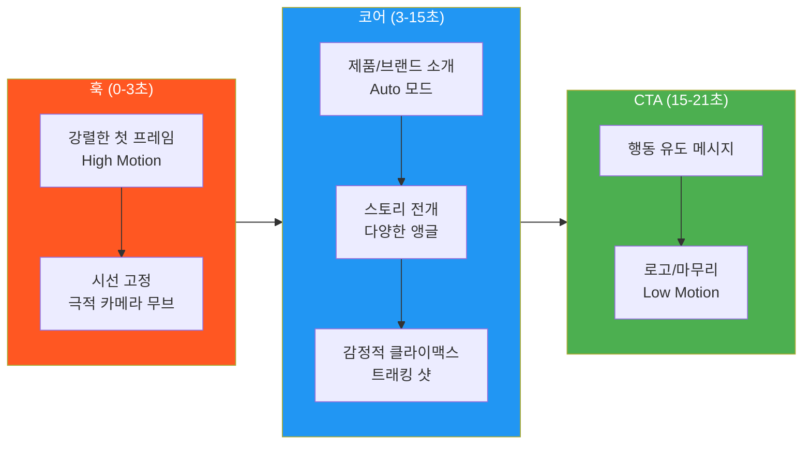
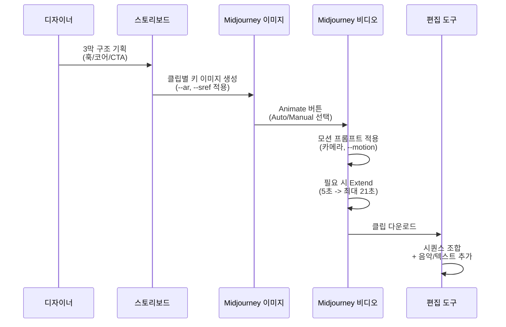
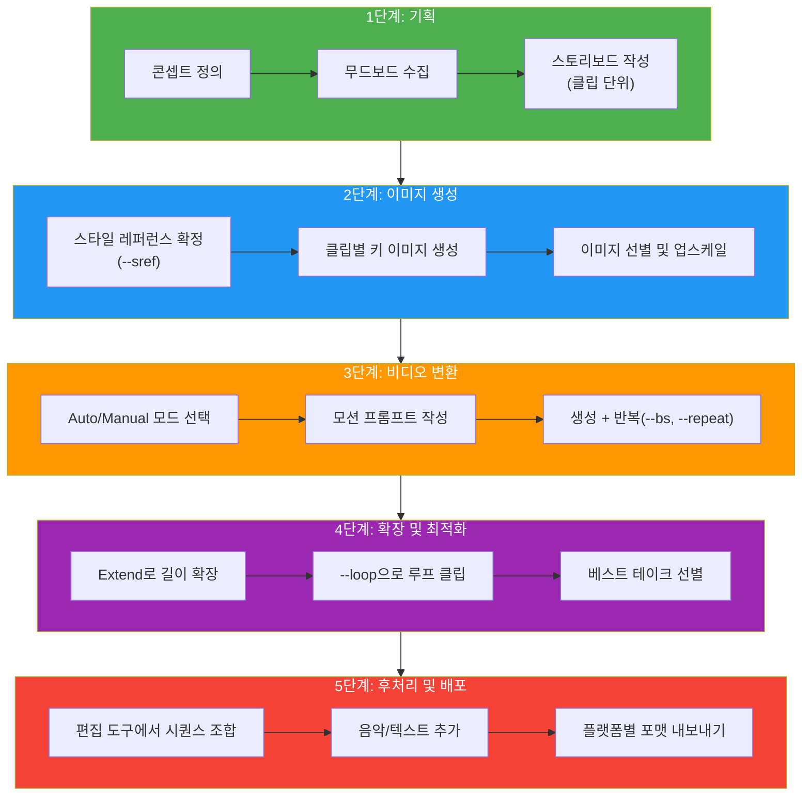

# 숏폼 영상 콘텐츠 제작 프로젝트

> 스토리보드 기획부터 키 이미지 생성, 비디오 변환, 시퀀스 조합까지 — Midjourney로 완성하는 브랜드 숏폼 영상 워크플로우

## 개요

이 섹션에서는 Ch10에서 배운 모든 기술을 종합하여 실전 숏폼 영상 콘텐츠를 기획하고 제작합니다. 단순히 클립 하나를 만드는 것이 아니라, **기획 → 이미지 생성 → 비디오 변환 → 시퀀스 구성 → 플랫폼 최적화**까지 일관된 워크플로우로 완성하는 전체 과정을 다룹니다.

## 숏폼 영상의 3막 구조

숏폼 영상은 짧지만 반드시 **구조**가 있어야 효과적입니다. 영화의 3막 구조를 15~21초로 압축한다고 생각하세요.

| 구간 | 시간 | 역할 | Midjourney 전략 |
|------|------|------|----------------|
| **훅(Hook)** | 0~3초 | 스크롤을 멈추게 하는 첫 인상 | 강렬한 비주얼, High Motion |
| **코어(Core)** | 3~15초 | 핵심 메시지 또는 제품 소개 | 2~3개 클립 시퀀스, 다양한 앵글 |
| **CTA(Call to Action)** | 15~21초 | 행동 유도 (팔로우, 구매, 방문) | 로고/텍스트 이미지, Low Motion |



훅에서는 **High Motion + 극적인 카메라 무브먼트**로 시선을 사로잡고, 코어에서는 **Auto 모드의 자연스러운 움직임**으로 정보를 전달하며, CTA에서는 **Low Motion**으로 안정감을 주면서 메시지에 집중시킵니다.

## 플랫폼별 최적화 전략

주요 숏폼 플랫폼의 핵심 스펙입니다:

| 플랫폼 | 종횡비 | 해상도 | 권장 길이 |
|--------|--------|--------|----------|
| **TikTok** | 9:16 | 1080x1920 | 21~34초 |
| **Instagram Reels** | 9:16 | 1080x1920 | 15~90초 |
| **YouTube Shorts** | 9:16 | 1080x1920 | 30~60초 |
| **Instagram 피드** | 1:1 또는 4:5 | 1080x1080/1350 | 15~60초 |

키 이미지를 생성할 때부터 타깃 플랫폼의 종횡비를 적용하세요. `--ar 9:16`으로 생성한 이미지를 Image-to-Video로 변환하면, 별도 크롭 없이 바로 숏폼에 최적화된 영상이 나옵니다.

```
a stylish woman walking through neon-lit tokyo streets at night,
cinematic lighting, shallow depth of field --ar 9:16 --v 7 --stylize 300
```


## 클립 단위 스토리보드 설계

Midjourney V1 비디오에서 스토리보드는 **클립 단위**로 설계합니다. 각 클립은 5초짜리 비디오 한 단위이고, Extend로 연결하거나 편집 소프트웨어에서 이어 붙입니다.

**클립 단위 스토리보드 템플릿**:

| 클립 # | 장면 설명 | 모션 유형 | 카메라 | 프롬프트 키워드 | 시간 |
|--------|----------|----------|--------|---------------|------|
| 1 | 제품 클로즈업 | High Motion | 줌 아웃 | "zoom out revealing..." | 5초 |
| 2 | 사용 장면 | Auto | 트래킹 | "tracking shot..." | 5초 |
| 3 | 브랜드 로고 | Low Motion | 정적 | "subtle light animation..." | 5초 |



모든 클립에 동일한 `--sref` 코드를 적용하면 시각적 일관성을 유지할 수 있습니다.

## 5단계 제작 파이프라인



각 단계의 핵심 포인트입니다:

- **1단계: 기획** — 콘셉트를 한 문장으로 정의하고, 클립 단위 스토리보드를 작성합니다.
- **2단계: 이미지 생성** — `--sref` 코드를 하나 선정하여 전체 클립에 일관된 스타일을 적용합니다.
- **3단계: 비디오 변환** — 훅은 Manual+High Motion, 코어는 Auto, CTA는 Manual+Low Motion으로 클립별 전략을 다르게 적용합니다.
- **4단계: 확장 및 최적화** — 코어 클립을 Extend Manual로 확장하고, 배경 클립은 `--loop`를 적용합니다.
- **5단계: 후처리 및 배포** — CapCut, DaVinci Resolve 등에서 클립 조합 후 플랫폼별 포맷으로 내보냅니다.

## GPU 비용 최적화

하나의 5초 비디오 클립은 이미지 생성의 **약 8배** GPU 시간을 소모합니다. 21초 향수 티저(4클립) 기준 구체적 비용입니다:

| 단계 | 작업 내역 | Fast GPU 시간 | 달러 환산 |
|------|----------|-------------|----------|
| 이미지 탐색 | 4클립 x 3회 = 12회 | 약 1.2분 | ~$0.12 |
| 업스케일 | 4장 | 약 0.4분 | ~$0.04 |
| 비디오 생성 | 4클립 x `--bs 4` = 16개 | 약 12.8분 | ~$1.28 |
| Extend | 2클립 x 2회 | 약 3.2분 | ~$0.32 |
| 리테이크 여유분 | 2회 | 약 1.6분 | ~$0.16 |
| **합계** | | **약 19.2분** | **약 $1.92** |

**플랜별 월간 제작 가능 편수** (21초 숏폼 기준):

| 플랜 | 월 비용 | Fast GPU | 현실적 예산 시 |
|------|--------|----------|-------------|
| **Basic** | $10 | 3.3시간 | 5~6편 |
| **Standard** | $30 | 15시간 | 22~30편 |
| **Pro** | $60 | 30시간 + Relax | 45~60편 + Relax |

**비용 절감 핵심 원칙**:
1. **이미지 단계에서 완벽하게** — 비디오 변환 비용이 8배이므로, 이미지가 마음에 들 때만 Animate
2. **`--bs` 최소화** — 처음에는 `--bs 2`로 시작, 방향이 잡히면 `--bs 4`
3. **Relax 모드 활용** — Pro 플랜 사용자라면 밤사이 Relax 모드로 대량 생성

## 실습: 카페 브랜드 소개 숏폼 (15초)

가상의 스페셜티 카페 "Morning Bloom"의 브랜드 소개 영상을 기획합니다.

- **핵심 메시지**: "매일 아침, 꽃처럼 피어나는 한 잔의 특별함"
- **플랫폼**: Instagram Reels (9:16, 15초)

**클립 #1 — 훅 (Manual, High Motion)**

```
macro shot of coffee beans blooming like flowers,
warm golden light, morning atmosphere
--ar 9:16 --sref 987654 --stylize 200
```

모션 프롬프트:
```
petals unfold slowly, soft zoom out revealing steam rising,
dramatic golden light shift
```


**클립 #2 — 코어 (Auto, Low Motion)**

```
barista pouring latte art, overhead angle,
minimalist cafe interior, warm tones
--ar 9:16 --sref 987654
```


이 클립은 Extend Manual로 10초까지 확장합니다:
```
camera slowly pulls back revealing the full cafe counter,
warm ambient lighting
```

**클립 #3 — CTA (Manual, Low Motion)**

```
Morning Bloom coffee cup on marble table,
soft morning light, brand logo visible, elegant composition
--ar 9:16 --sref 987654
```

모션 프롬프트:
```
gentle light rays moving across the cup surface,
subtle steam wisps
```


**보너스: 향수 티저 훅 클립 프롬프트 예시**

```
perfume bottle silhouette in moonlit garden, mist and flower petals,
dark mysterious atmosphere, dramatic lighting --ar 9:16 --sref 987654 --stylize 350
```

```
close up of luminous liquid inside crystal perfume bottle,
ethereal glow, particles floating --ar 9:16 --sref 987654
```

**예산 시뮬레이션**:

| 단계 | 작업 | Fast GPU 시간 | 비용 |
|------|------|-------------|------|
| 이미지 탐색 | 3클립 x 3회 = 9회 | 약 0.9분 | ~$0.09 |
| 업스케일 | 3장 | 약 0.3분 | ~$0.03 |
| 비디오 생성 | 3클립 x `--bs 2` = 6개 | 약 4.8분 | ~$0.48 |
| Extend | 1클립 x 1회 | 약 0.8분 | ~$0.08 |
| **합계** | | **약 6.8분** | **약 $0.68** |

### 워크시트: 나만의 숏폼 프로젝트 기획서

| 항목 | 내 프로젝트 |
|------|-----------|
| 브랜드/제품명 | |
| 핵심 메시지 (1문장) | |
| 타깃 오디언스 | |
| 플랫폼 (종횡비) | |
| 총 길이 | |
| 클립 수 | |
| 스타일 키워드 3개 | |
| 예상 GPU 시간 (분) | |

## 팁과 주의사항

- **해상도 한계 보완**: Midjourney 480p/720p의 한계를 숨기려면 **매크로 샷, 실루엣, 안개/입자 효과** 같은 분위기 연출을 활용하세요. 디테일이 뭉개지는 게 아니라 "의도된 분위기"로 보입니다.
- **클립 수 제한**: 15초 영상이라면 **3~4개 클립이 최적**입니다. 클립당 4~5초가 시청자가 장면을 인식하고 반응하는 데 필요한 최소 시간입니다.
- **TikTok 완시율**: 21~34초 영상이 가장 높은 완시율을 기록합니다. Midjourney V1의 최대 Extend 체인 길이(21초)가 이 범위에 들어갑니다.
- **Relax 모드 전략**: 낮에는 Fast로 키 이미지와 방향성을 잡고, 밤에 Relax + `--repeat 4`로 대량 후보 생성을 걸어두세요.
- **후처리 도구**: 무료 기준 **CapCut**(숏폼 특화, TikTok 연동), 세밀한 편집은 **DaVinci Resolve**(컬러 그레이딩, 오디오 믹싱)를 추천합니다.
- **예산 여유분**: 예산 시뮬레이션의 **1.5~2배**를 실제 작업 비용으로 잡으세요. 스타일 탐색과 리테이크가 반드시 발생합니다.

## 핵심 정리

| 개념 | 설명 |
|------|------|
| **3막 미니 스토리** | 훅(0~3초) → 코어(3~15초) → CTA(15~21초)로 숏폼 영상 구조화 |
| **플랫폼별 최적화** | TikTok/Reels/Shorts 모두 9:16, 권장 길이 21~34초 |
| **클립 단위 스토리보드** | 각 5초 클립을 독립 단위로 기획 — 장면, 모션, 카메라, 프롬프트 사전 정의 |
| **5단계 파이프라인** | 기획 → 이미지 생성 → 비디오 변환 → 확장/최적화 → 후처리/배포 |
| **GPU 비용 관리** | 비디오 1클립 = 이미지 8배 비용. 21초 영상 1편 = Fast 약 20~40분 |
| **스타일 일관성** | 모든 클립에 동일 `--sref` 코드 적용으로 브랜드 통일감 유지 |

## 다음 섹션 미리보기

다음 챕터 [시각적 스토리텔링의 원리](11-ch11-시각적-스토리텔링과-감정-전달/01-01-시각적-스토리텔링의-원리.md)에서는 이미지와 영상에 **감정과 메시지를 담는 원리**를 탐구합니다. 색채 심리학, 구도를 통한 시선 유도, 타깃 오디언스 분석까지 — 기술적 스킬 위에 스토리텔링 역량을 쌓는 단계로 나아갑니다.
