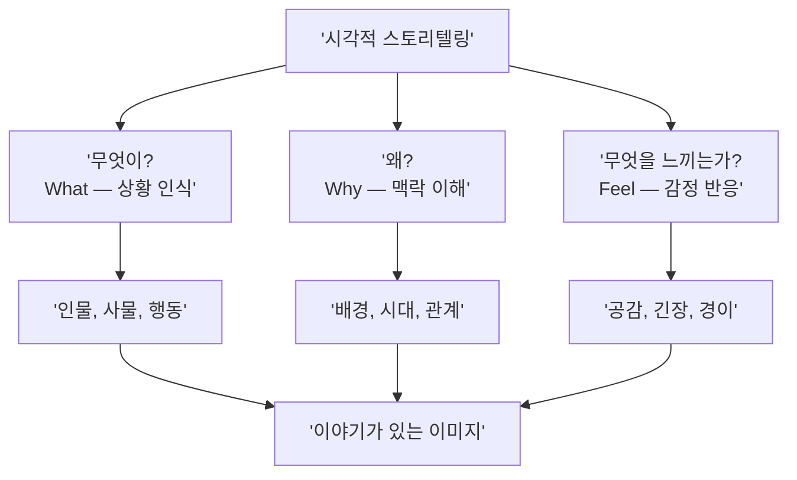

# 시각적 스토리텔링의 원리

> 한 장의 이미지로 이야기를 전달하는 비주얼 내러티브의 핵심 원리를 배웁니다.

## 개요

시각적 스토리텔링은 이미지, 색상, 구도, 빛 같은 시각 요소를 활용해 감정적 반응을 이끌어내고 의미를 전달하는 기술입니다. AI 이미지 생성에서 이 원리가 특히 중요한 이유는, AI가 "아름다운 풍경"을 만드는 데는 탁월하지만 **이야기가 담긴 장면**을 만들려면 인간 크리에이터의 명확한 내러티브 의도가 필요하기 때문입니다. 이 섹션에서는 시각적 내러티브의 핵심 구조와 이를 프롬프트에 반영하는 실전 전략을 다룹니다.

## 시각적 스토리텔링의 3가지 질문

좋은 시각적 스토리는 보는 사람이 **"이 이미지 안에서 무슨 일이 벌어지고 있는 거지?"**라고 궁금해하게 만듭니다. 핵심은 세 가지 질문에 답하는 것입니다:

1. **무엇이** 일어나고 있는가? (상황)
2. **왜** 일어나고 있는가? (맥락)
3. 보는 사람은 **무엇을 느끼는가?** (감정)



프롬프트에 "a beautiful sunset"이라고 쓰면 예쁜 노을을 그려주지만, 내러티브 의도를 담으면 결과가 완전히 달라집니다.

```
A child releasing a paper boat into the ocean at sunset,
watching it disappear into the golden horizon,
bittersweet expression of letting go
```


## 내러티브의 4가지 시각적 요소

시각적 내러티브를 구성하는 핵심 요소는 네 가지입니다:

**1. 인물(Character)** — 관객이 감정을 이입할 대상. 반드시 사람일 필요 없이, 외로이 서 있는 나무나 벤치 위의 편지도 인물 역할을 합니다.

**2. 환경(Setting)** — 이야기의 맥락. 같은 인물이라도 화창한 공원에 있으면 평화, 폐허 속이면 생존 이야기가 됩니다.

**3. 갈등(Conflict)** — 빛과 그림자, 크고 작은 것, 따뜻한 색과 차가운 색 등 대조적 요소가 충돌할 때 시각적 긴장감이 생깁니다.

**4. 감정(Emotion)** — 색온도, 조명, 인물의 자세와 표정, 여백이 합쳐져 하나의 감정을 형성합니다.


단순히 "고양이 그려줘"가 아니라, **누가(인물) 어디서(환경) 어떤 상황에(갈등) 어떤 분위기로(감정)** 존재하는지를 서술하는 것이 핵심입니다.

| 약한 프롬프트 | 스토리가 담긴 프롬프트 |
|-------------|---------------------|
| A cat sitting on a windowsill | A stray cat sitting on a rain-streaked windowsill at night, gazing longingly at a warm family dinner inside, soft warm light casting long shadows |
| A warrior in armor | A lone warrior standing at the edge of a crumbling bridge, her sword lowered, looking back at the burning city she failed to save, dawn breaking through smoke |

4요소를 활용한 프롬프트 예시:

```
A stray cat sitting on a rain-streaked windowsill at night,
gazing longingly at a warm family dinner inside,
soft warm light casting long shadows, cinematic composition
```


## 결정적 순간 — 한 장에 이야기 담기

한 장의 이미지에 내러티브를 담는 세 가지 전략이 있습니다:

**전략 1: "직전" 또는 "직후" 포착하기** — 사건의 한가운데가 아니라 직전/직후의 순간이 더 강력합니다.

```
A child staring at a birthday cake that just fell on the floor,
frosting splattered, candles still flickering,
tears forming but not yet falling, soft kitchen light
```


**전략 2: 시각적 단서(Visual Cue) 남기기** — 관객의 상상력을 자극하는 디테일을 배치합니다.

```
Two coffee cups on a small cafe table, one empty and cold,
one still steaming, a folded letter beside the empty cup,
morning light through rain-streaked window, intimate atmosphere
```


**전략 3: 대비를 통한 긴장감 만들기** — 대조적 요소의 충돌이 "왜?"라는 질문을 유발합니다.

```
An astronaut planting a single small flower on barren Mars surface,
Earth visible as a tiny blue dot in the dark sky,
vast red desert contrasting with delicate green sprout,
hopeful yet lonely atmosphere
```


## AI 시대의 비주얼 내러티브

AI 워크플로우에서는 제작 시간이 줄어든 만큼, **"컨셉 구상 + 내러티브 설계"** 단계의 비중이 커졌습니다. 프롬프트 스타일에 따라 결과가 크게 달라집니다:

| 접근 방식 | 특징 | AI 프롬프트 예시 |
|----------|------|----------------|
| 서술적(Descriptive) | 보이는 대로 묘사 | "A woman standing in a field of flowers" |
| 감정적(Emotional) | 감정과 분위기 중심 | "A woman finding solace in a wildflower meadow, soft golden hour, sense of peaceful escape" |
| 은유적(Metaphorical) | 추상적 의미 전달 | "Freedom personified — a woman dissolving into a field of wildflowers, petals becoming her hair" |

서술적 프롬프트와 감정적 프롬프트의 차이를 직접 비교해보세요:

```
A woman standing in a field of flowers,
daytime, realistic style
```

```
A woman finding solace in a wildflower meadow,
soft golden hour light wrapping around her like a blanket,
eyes closed, gentle breeze lifting her hair,
sense of peaceful escape from the world
```


은유적 표현을 활용한 고급 프롬프트:

```
Freedom personified — a woman dissolving into a field of wildflowers,
petals becoming her hair, roots becoming her feet,
watercolor style, ethereal atmosphere,
the boundary between human and nature blurring
```

```
The weight of goodbye hanging in the air,
a single chair at an empty table by a window
where rain traces paths like tears,
warm interior light contrasting cold blue outside
```


## 실습: 적용해보기

### 활동 1: 약한 프롬프트를 스토리 프롬프트로 변환

다음 프롬프트에 4가지 내러티브 요소(인물, 환경, 갈등, 감정)를 추가해 업그레이드해보세요:

**원본 1**: "A castle on a mountain"

```
A lone knight returning to a crumbling castle on a mountain peak,
banner torn and dragging behind, sunset casting long shadows,
the weight of a lost battle in every step,
dramatic cinematic composition
```

**원본 2**: "A robot in a city"

```
An obsolete robot sitting on a bench in a neon-lit cyberpunk city at 3am,
newer models walking past without noticing,
rain reflecting colorful lights on its rusted surface,
melancholic atmosphere of being left behind
```

**원본 3**: "A cup of coffee on a table"

```
A half-finished cup of cold coffee on a cluttered desk,
laptop screen glowing with unread messages at 2am,
crumpled papers scattered around,
a family photo frame turned face-down beside the cup,
harsh desk lamp creating dramatic shadows
```


### 활동 2: 이미지 내러티브 분석

아래 장면 설명을 읽고 **인물, 환경, 갈등, 감정**을 식별해보세요:

**장면 A**: "한 노인이 비 오는 버스 정류장에서 투명 우산을 쓴 채, 맞은편 놀이터에서 뛰어노는 아이들을 바라보고 있다."

**장면 B**: "깨진 거울 조각들이 바닥에 흩어져 있고, 각 조각에 같은 사람의 다른 표정이 비치고 있다."

각 장면을 실제 프롬프트로 작성해보세요:

```
An elderly man at a rainy bus stop holding a transparent umbrella,
watching children playing in the playground across the street,
nostalgic smile, raindrops creating a soft veil between past and present,
muted colors with warm highlights on the children
```

## 팁과 주의사항

- **사물도 인물이 된다**: 텅 빈 의자, 녹슨 자물쇠, 바람에 흔들리는 커튼도 "부재"를 암시하며 강렬한 이야기를 만듭니다. "An empty swing still swaying in an abandoned playground at dusk"처럼 사람 없이도 내러티브가 탄생합니다.
- **나열하지 말고 관계를 서술하라**: "A warrior, a castle, a dragon, fire, dramatic lighting"처럼 요소를 나열하면 AI는 그저 배치할 뿐입니다. "A weary warrior kneeling before a burning castle, reaching toward a dragon that seems to recognize her"처럼 요소 사이의 관계를 서술하세요.
- **의도적 불완전함**: 빛 번짐, 필름 그레인, 약간 비뚤어진 앵글 같은 요소가 오히려 이야기에 진정성을 더해줍니다.
- **지브리 스타일 참고**: 스튜디오 지브리 애니메이션은 "한 장면에 이야기를 담는" 시각적 스토리텔링의 교과서입니다. 부드러운 수채화 질감과 감정이 풍부한 캐릭터 묘사를 참고해보세요.

## 핵심 정리

| 개념 | 설명 |
|------|------|
| 시각적 스토리텔링 | 시각 요소를 통해 감정적 반응을 이끌어내고 의미를 전달하는 기술 |
| 내러티브 4요소 | 인물(Character), 환경(Setting), 갈등(Conflict), 감정(Emotion) |
| 결정적 순간 | 사건의 본질이 한 프레임에 응축되는 찰나 — 직전/직후가 가장 강력 |
| 시각적 단서 | 관객의 상상력을 자극하는 디테일 (반쯤 열린 문, 빈 의자 등) |
| 대비/긴장 | 대조적 요소의 충돌이 "왜?"라는 질문을 유발 — 이야기의 시작 |
| 감정적 프롬프트 | 요소 나열 대신 관계와 감정을 서술하는 프롬프트 전략 |
| 은유적 프롬프트 | 추상적 의미를 시각적 메타포로 전달하는 고급 기법 |

## 다음 섹션 미리보기

다음 섹션 [색채 심리학과 감정 팔레트](11-ch11-시각적-스토리텔링과-감정-전달/02-02-색채-심리학과-감정-팔레트.md)에서는 이야기에 **감정의 색을 입히는 방법**을 다룹니다. 빨간색이 왜 긴박함을 만들고, 파란색이 왜 신뢰를 주는지 — 색채 심리학의 원리를 AI 프롬프트에 적용하는 전략을 배워보겠습니다.
