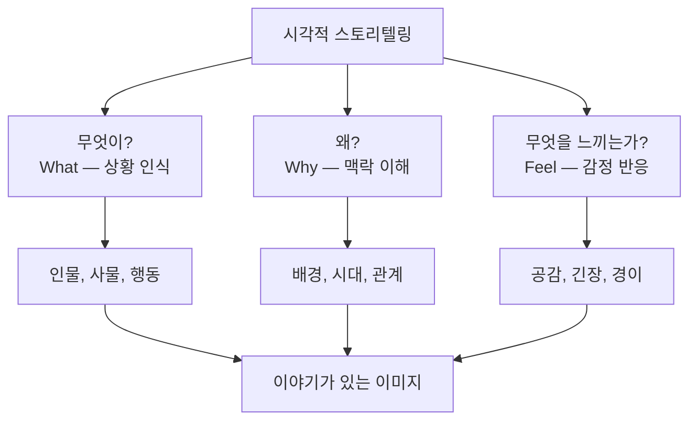
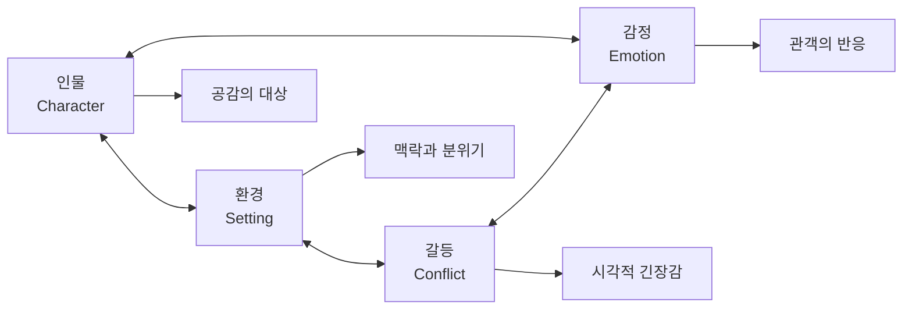
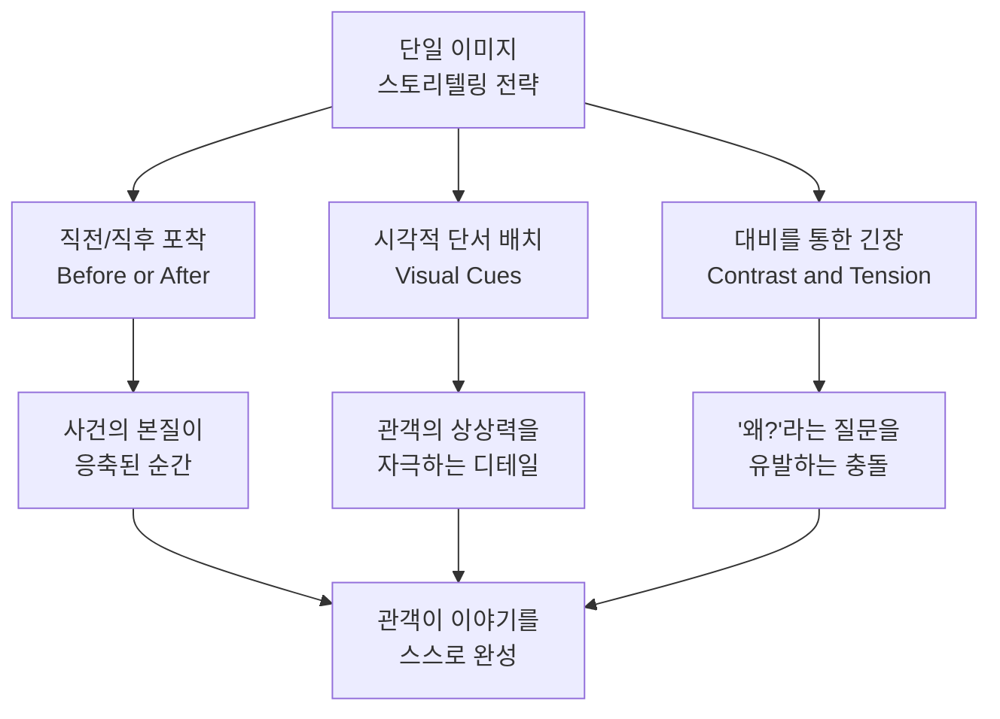
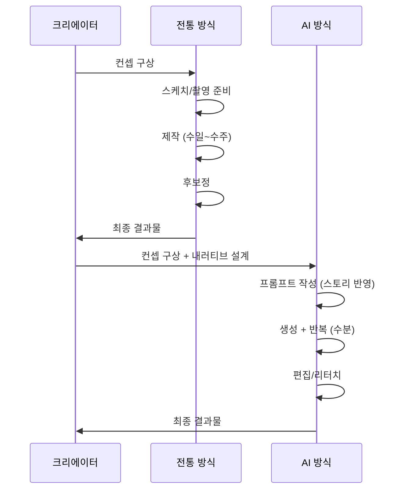

# 시각적 스토리텔링의 원리

> 한 장의 이미지로 이야기를 전달하는 비주얼 내러티브의 핵심 원리를 배웁니다.

## 개요

이 섹션에서는 시각적 스토리텔링의 근본 원리를 탐구합니다. 지금까지 우리는 프롬프트 작성법, 다양한 AI 도구 활용법, 이미지 편집 기법을 익혀 왔는데요. 이제 한 단계 더 나아가, **왜 어떤 이미지는 보는 순간 마음을 울리고, 어떤 이미지는 스쳐 지나가는지** 그 비밀을 풀어보겠습니다.

**선수 지식**: [프롬프트 해부학 — 6요소 프레임워크](02-ch2-프롬프트-구조-마스터/01-01-프롬프트-해부학-6요소-프레임워크.md)에서 배운 프롬프트 구성 원리, [분위기와 감정 키워드 전략](02-ch2-프롬프트-구조-마스터/05-05-분위기와-감정-키워드-전략.md)에서 다룬 감정 표현 기법

**학습 목표**:
- 시각적 스토리텔링의 4가지 핵심 요소(인물, 환경, 갈등, 감정)를 이해한다
- 한 장의 이미지에 내러티브를 담는 구조적 원리를 파악한다
- AI 이미지 생성에 스토리텔링 원리를 적용하는 방법을 익힌다
- 단순한 "예쁜 이미지"와 "이야기가 있는 이미지"의 차이를 구별할 수 있다

## 왜 알아야 할까?

인스타그램에 하루 1억 장 이상의 이미지가 올라오는 시대입니다. AI 도구 덕분에 누구나 멋진 이미지를 만들 수 있게 되었죠. 그런데 아이러니하게도, 이미지가 넘쳐날수록 **보는 사람의 발걸음을 멈추게 하는 이미지**는 더 귀해졌습니다.

기술적으로 완벽한 이미지와 사람의 마음을 움직이는 이미지 사이에는 결정적인 차이가 있습니다. 바로 **이야기(narrative)**입니다. 우리가 [구도와 앵글](02-ch2-프롬프트-구조-마스터/03-03-구도와-앵글-시선을-이끄는-프레이밍.md)이나 [조명과 매체](02-ch2-프롬프트-구조-마스터/04-04-조명과-매체-빛과-질감으로-깊이-더하기.md)에서 배운 기법들은 모두 이 "이야기"를 효과적으로 전달하기 위한 도구인 셈이죠.

브랜드 캠페인, 소셜 미디어 콘텐츠, 포트폴리오 — 어디에 사용하든 스토리가 담긴 비주얼은 조회수, 공감, 전환율에서 압도적인 차이를 만들어냅니다. 이 챕터를 마치면 여러분은 단순히 "이미지를 만드는 사람"이 아니라 **"비주얼로 이야기하는 사람"**이 될 수 있습니다.

## 핵심 개념

### 개념 1: 시각적 스토리텔링이란 무엇인가

> 💡 **비유**: 여러분이 친구에게 여행 이야기를 들려준다고 상상해보세요. 말로 할 수도 있지만, 한 장의 사진을 보여주면 천 마디 말보다 강렬하게 전달되는 순간이 있죠. "파리 에펠탑 앞에서 비를 맞으며 웃고 있는 사진" 한 장이 30분짜리 여행 이야기보다 그 순간의 감정을 더 생생하게 전달합니다. 이것이 시각적 스토리텔링의 힘입니다.

시각적 스토리텔링(Visual Storytelling)은 **이미지, 색상, 구도, 빛 같은 시각 요소를 활용해 감정적 반응을 이끌어내고 의미를 전달하는 기술**입니다. 텍스트보다 빠르고, 언어 장벽을 넘어 보편적으로 소통할 수 있다는 것이 가장 큰 강점이죠.

핵심은 단순히 "보기 좋은" 이미지가 아니라, 보는 사람이 **"이 이미지 안에서 무슨 일이 벌어지고 있는 거지?"**라고 궁금해하게 만드는 것입니다. 좋은 시각적 스토리는 세 가지 질문에 답합니다:

1. **무엇이** 일어나고 있는가? (상황)
2. **왜** 일어나고 있는가? (맥락)
3. 보는 사람은 **무엇을 느끼는가?** (감정)

> 📊 **그림 1**: 시각적 스토리텔링의 3가지 핵심 질문

AI 이미지 생성에서 이 원리가 특히 중요한 이유가 있습니다. AI는 "아름다운 풍경"을 만드는 데는 탁월하지만, **이야기가 담긴 장면**을 만들려면 인간 크리에이터가 명확한 내러티브 의도를 프롬프트에 담아야 하거든요. 프롬프트에 "a beautiful sunset"이라고 쓰면 예쁜 노을을 그려주지만, "a child releasing a paper boat into the ocean at sunset, watching it disappear into the golden horizon"이라고 쓰면 이별과 희망이 교차하는 이야기가 됩니다.

### 개념 2: 내러티브의 4가지 시각적 요소

> 💡 **비유**: 영화를 생각해보세요. 어떤 영화든 주인공(인물), 세상(환경), 위기(갈등), 그리고 관객이 느끼는 감정이 있죠. 한 장의 이미지도 마찬가지입니다. 이 네 가지를 한 프레임 안에 압축하면 이미지가 "영화의 한 장면"처럼 이야기를 품게 됩니다.

시각적 내러티브를 구성하는 4가지 핵심 요소가 있습니다:

**1. 인물(Character)** — 이야기의 주체
이미지 안에서 관객이 감정을 이입할 대상입니다. 반드시 사람일 필요는 없어요. 외로이 서 있는 나무, 비에 젖은 강아지, 벤치 위에 놓인 편지 — 이 모두가 "인물" 역할을 할 수 있습니다. 중요한 것은 **관객이 공감할 수 있는 존재**가 이미지 안에 있느냐는 것입니다.

**2. 환경(Setting)** — 이야기의 맥락
인물이 어디에, 언제 있는지가 이야기의 톤을 결정합니다. 같은 인물이라도 화창한 공원에 있으면 평화로운 이야기가 되고, 폐허 속에 있으면 생존 이야기가 됩니다. 환경은 단순 배경이 아니라 **감정의 무대**입니다.

**3. 갈등(Conflict/Tension)** — 이야기의 엔진
가장 간과하기 쉽지만, 가장 강력한 요소입니다. "대비(contrast)"라고도 부르는데요, 빛과 그림자, 크고 작은 것, 따뜻한 색과 차가운 색, 움직임과 정지 — 서로 대조되는 요소가 충돌할 때 시각적 긴장감이 생깁니다. 이 긴장감이 보는 사람의 시선을 붙잡습니다.

**4. 감정(Emotion)** — 이야기의 목적
모든 시각적 스토리텔링의 궁극적 목표는 보는 사람의 감정을 움직이는 것입니다. 색온도, 조명 방향, 인물의 자세와 표정, 여백의 크기 — 이 모든 요소가 합쳐져 하나의 감정을 형성합니다.

> 📊 **그림 2**: 시각적 내러티브의 4요소와 상호작용

이 네 가지를 AI 프롬프트에 반영하는 것이 핵심입니다. 단순히 "고양이 그려줘"가 아니라, **누가(인물) 어디서(환경) 어떤 상황에(갈등) 어떤 분위기로(감정)** 존재하는지를 서술하는 것이죠.

| 약한 프롬프트 | 스토리가 담긴 프롬프트 |
|-------------|---------------------|
| A cat sitting on a windowsill | A stray cat sitting on a rain-streaked windowsill at night, gazing longingly at a warm family dinner inside, soft warm light casting long shadows |
| A warrior in armor | A lone warrior standing at the edge of a crumbling bridge, her sword lowered, looking back at the burning city she failed to save, dawn breaking through smoke |

### 개념 3: 한 장의 이미지에 이야기 담기 — "결정적 순간"

> 💡 **비유**: 소설은 300페이지에 걸쳐 이야기를 풀어놓지만, 한 장의 이미지는 마치 엘리베이터 피치처럼 **단 한 순간에 핵심을 전달**해야 합니다. 그래서 중요한 것이 "어떤 순간을 포착할 것인가"입니다. 폭풍이 오기 직전의 고요한 하늘, 달리기 결승선 직전의 표정, 선물 상자를 여는 순간의 손 — 이런 "바로 그 순간"이 이야기를 만듭니다.

사진 저널리스트 앙리 카르티에 브레송(Henri Cartier-Bresson)은 이것을 **"결정적 순간(The Decisive Moment)"**이라고 불렀습니다. 어떤 사건의 본질이 한 프레임에 응축되는 그 찰나를 포착하는 것이죠. AI 이미지에서도 같은 원리가 적용됩니다.

한 장의 이미지에 내러티브를 담는 세 가지 전략이 있습니다:

**전략 1: "직전" 또는 "직후" 포착하기**
사건의 한가운데가 아니라, 바로 직전이나 직후의 순간이 더 강력한 이야기를 만듭니다. 케이크가 바닥에 떨어지는 순간보다, 떨어진 케이크를 바라보는 아이의 표정이 더 많은 이야기를 담고 있죠.

**전략 2: 시각적 단서(Visual Cue) 남기기**
이미지 안에 관객이 "읽을 수 있는" 단서를 배치합니다. 반쯤 열린 문, 테이블 위에 놓인 두 개의 커피잔 중 하나만 비어 있는 것, 벽에 걸린 오래된 사진 — 이런 디테일이 보는 사람의 상상력을 자극하고, 이미지 바깥의 이야기까지 추론하게 만듭니다.

**전략 3: 대비를 통한 긴장감 만들기**
밝음/어둠, 크기 대비, 색상 대비, 시간 대비(오래된 것과 새 것) 등 대조적 요소를 한 프레임에 배치하면 보는 사람의 뇌가 자동으로 "왜 이 두 가지가 함께 있지?"라는 질문을 던지게 됩니다. 이 질문 자체가 곧 이야기의 시작입니다.

> 📊 **그림 3**: 한 장의 이미지에 내러티브를 담는 3가지 전략

### 개념 4: AI 시대의 비주얼 내러티브

> 💡 **비유**: 전통적인 비주얼 스토리텔링이 장인이 한 땀 한 땀 수놓는 자수라면, AI 비주얼 스토리텔링은 직조기를 다루는 것과 비슷합니다. 기계가 실을 짜주지만, 어떤 무늬를 만들지 결정하는 것은 여전히 사람의 몫이죠. 도구가 바뀌었을 뿐, **이야기를 구상하는 능력**의 가치는 오히려 더 높아졌습니다.

2025-2026년 AI 이미지 생성의 가장 큰 트렌드 변화는 **"기술적 완성도"에서 "감정적 진정성"으로의 이동**입니다. 초기에는 "얼마나 사실적인가"가 중요했다면, 이제는 "얼마나 진짜 감정을 전달하는가"가 핵심이 되었죠. 의도적인 불완전함 — 빛 번짐, 필름 그레인, 약간 비뚤어진 앵글 — 이런 요소들이 오히려 이야기에 진정성을 더해주고 있습니다.

AI 프롬프트에 스토리텔링 원리를 적용할 때는 **감정적이고 은유적인 언어(emotional and metaphorical language)**를 사용하는 것이 효과적입니다. "sad scene"이라고 쓰는 대신 "the weight of goodbye hanging in the air, a single chair at an empty table by a window where rain traces paths like tears"라고 쓰면, AI는 구체적인 감정을 담은 장면을 만들어냅니다.

> 📊 **그림 4**: 전통적 vs AI 시대 비주얼 스토리텔링 워크플로우

여기서 주목할 점은, AI 워크플로우에서 **"컨셉 구상 + 내러티브 설계"** 단계의 비중이 더 커졌다는 것입니다. 제작 시간이 줄어든 만큼, 무엇을 만들 것인가에 대한 기획 — 즉 스토리텔링 — 이 크리에이터의 핵심 역량이 된 셈이죠.

| 접근 방식 | 특징 | AI 프롬프트 예시 |
|----------|------|----------------|
| 서술적(Descriptive) | 보이는 대로 묘사 | "A woman standing in a field of flowers" |
| 감정적(Emotional) | 감정과 분위기 중심 | "A woman finding solace in a wildflower meadow, soft golden hour, sense of peaceful escape" |
| 은유적(Metaphorical) | 추상적 의미 전달 | "Freedom personified — a woman dissolving into a field of wildflowers, petals becoming her hair, roots becoming her feet" |

## 실습: 적용해보기

### 활동 1: 이미지 내러티브 분석

아래 세 가지 장면 설명을 읽고, 각각에서 **인물, 환경, 갈등, 감정**을 식별해보세요:

**장면 A**: "한 노인이 비 오는 버스 정류장에서 투명 우산을 쓴 채, 맞은편 놀이터에서 뛰어노는 아이들을 바라보고 있다."
- 인물: ?
- 환경: ?
- 갈등/대비: ?
- 전달되는 감정: ?

**장면 B**: "한 우주비행사가 황폐한 화성 표면에 작은 꽃 한 송이를 심고 있다. 배경에 지구가 작게 보인다."
- 인물: ?
- 환경: ?
- 갈등/대비: ?
- 전달되는 감정: ?

**장면 C**: "깨진 거울 조각들이 바닥에 흩어져 있고, 각 조각에 같은 사람의 다른 표정이 비치고 있다."
- 인물: ?
- 환경: ?
- 갈등/대비: ?
- 전달되는 감정: ?

### 활동 2: 약한 프롬프트를 스토리 프롬프트로 변환

다음 "약한 프롬프트"에 4가지 내러티브 요소를 추가해 "스토리가 있는 프롬프트"로 업그레이드해보세요:

1. "A castle on a mountain" → 인물 + 갈등 + 감정을 추가하면?
2. "A robot in a city" → 환경의 시간대 + 갈등 + 감정을 추가하면?
3. "A cup of coffee on a table" → 시각적 단서 + 대비를 추가하면?

### 토론 질문

- 여러분이 최근 SNS에서 "멈춰서 오래 바라본" 이미지가 있었나요? 그 이미지에는 어떤 스토리 요소가 있었나요?
- 같은 주제(예: "외로움")를 서술적, 감정적, 은유적 방식으로 각각 표현한다면 어떤 차이가 생길까요?

## 더 깊이 알아보기

### 5만 년 전 동굴 벽화 — 인류 최초의 비주얼 스토리텔링

시각적 스토리텔링의 역사는 놀랍도록 오래되었습니다. 2024년, 인도네시아 술라웨시 섬의 레앙 카람푸앙(Leang Karampuang) 동굴에서 발견된 벽화는 **최소 5만 1,200년 전**에 그려진 것으로, 세계에서 가장 오래된 내러티브 아트로 확인되었습니다. 이 벽화에는 세 명의 인간형 존재가 야생 멧돼지와 상호작용하는 장면이 묘사되어 있는데요, 놀라운 것은 이미 이 시대에 "누가, 무엇을, 어떻게" 하는지를 시각적으로 전달하려는 시도가 있었다는 점입니다.

이후 이집트의 상형문자, 중세의 필사본 삽화, 르네상스의 원근법 발명, 사진의 등장, 영화, 그리고 오늘날의 AI 이미지 생성까지 — 도구와 매체는 변했지만 **"시각으로 이야기한다"**는 인간의 근본적 욕구는 5만 년 동안 단 한 번도 변하지 않았습니다.

### 앙리 카르티에 브레송과 "결정적 순간"

프랑스 사진작가 앙리 카르티에 브레송(1908-2004)은 1952년 저서 *Images à la Sauvette*에서 "결정적 순간"이라는 개념을 대중화했습니다. 그가 물웅덩이 위를 뛰어넘는 남자를 포착한 유명한 사진 *Behind the Gare Saint-Lazare*는 — 발이 물에 닿기 직전의 찰나를 담은 것인데요 — 바로 이 "0.1초의 선택"이 평범한 장면을 영원한 이야기로 바꿀 수 있다는 것을 증명했습니다.

> 💡 **알고 계셨나요?**: 카르티에 브레송의 "결정적 순간"은 사실 17세기 프랑스 추기경 드 레츠(Cardinal de Retz)의 "세상의 모든 것에는 결정적 순간이 있다"는 격언에서 영감을 받은 것입니다. 사진뿐 아니라 AI 이미지 생성에서도 "어떤 순간의 장면을 그릴 것인가"가 결과물의 감정적 임팩트를 결정합니다.

## 흔한 오해와 팁

> ⚠️ **흔한 오해**: "시각적 스토리텔링은 인물이 꼭 있어야 한다" — 아닙니다! 텅 빈 의자, 녹슨 자물쇠, 바람에 흔들리는 커튼 같은 사물도 인물 역할을 할 수 있습니다. 사물이 "부재"를 암시할 때, 오히려 더 강렬한 이야기가 만들어지기도 합니다. 프롬프트에 "an empty swing still swaying in an abandoned playground at dusk"라고 쓰면, 사람 없이도 강한 내러티브가 탄생합니다.

> 💡 **알고 계셨나요?**: 2025-2026년 AI 이미지 트렌드에서 가장 주목받는 것 중 하나가 **지브리 스타일 스토리텔링**입니다. 스튜디오 지브리 애니메이션의 부드러운 수채화 질감, 몽환적 건축물, 감정이 풍부한 캐릭터를 AI로 재현하는 것인데요, 이것이 인기를 끄는 이유는 지브리 자체가 "한 장면에 이야기를 담는" 시각적 스토리텔링의 교과서이기 때문입니다.

> 🔥 **실무 팁**: AI 프롬프트에서 가장 흔한 실수는 **상황을 나열하는 것**입니다. "A warrior, a castle, a dragon, fire, smoke, dramatic lighting" 이런 식으로 요소를 쭉 나열하면 AI는 그저 요소들을 화면에 배치할 뿐입니다. 대신 **관계와 감정을 서술**하세요: "A weary warrior kneeling before a burning castle, reaching toward a dragon that seems to recognize her." 요소 사이의 관계가 곧 이야기입니다.

## 핵심 정리

| 개념 | 설명 |
|------|------|
| 시각적 스토리텔링 | 시각 요소를 통해 감정적 반응을 이끌어내고 의미를 전달하는 기술 |
| 내러티브 4요소 | 인물(Character), 환경(Setting), 갈등(Conflict), 감정(Emotion) |
| 결정적 순간 | 사건의 본질이 한 프레임에 응축되는 찰나 — 직전/직후가 가장 강력 |
| 시각적 단서 | 관객의 상상력을 자극하는 디테일 (반쯤 열린 문, 빈 의자 등) |
| 대비/긴장 | 대조적 요소의 충돌이 "왜?"라는 질문을 유발 — 이것이 이야기의 시작 |
| 감정적 프롬프트 | 요소 나열 대신 관계와 감정을 서술하는 AI 프롬프트 전략 |
| 은유적 프롬프트 | 추상적 의미를 시각적 메타포로 전달하는 고급 프롬프트 기법 |

## 다음 섹션 미리보기

이번 섹션에서 시각적 스토리텔링의 "구조"를 배웠다면, 다음 섹션 [색채 심리학과 감정 팔레트](11-ch11-시각적-스토리텔링과-감정-전달/02-02-색채-심리학과-감정-팔레트.md)에서는 이야기에 **감정의 색을 입히는 방법**을 다룹니다. 빨간색이 왜 긴박함을 만들고, 파란색이 왜 신뢰를 주는지 — 색채 심리학의 원리를 AI 프롬프트에 적용하는 구체적인 전략을 배워보겠습니다.

## 참고 자료

- [Visual Storytelling Techniques That Engage Audiences — Sessions College](https://www.sessions.edu/notes-on-design/visual-storytelling-techniques-that-engage-audiences/) - 시각적 스토리텔링의 핵심 기법과 관객 참여 전략을 잘 정리한 가이드
- [8 Visual Storytelling Techniques to Master in 2025](https://www.aiphotogenerator.net/blog/2025/07/visual-storytelling-techniques) - AI 시대에 맞는 비주얼 스토리텔링 실전 테크닉
- [Indonesian Cave Painting Is Oldest-Known Visual Storytelling — Smithsonian Magazine](https://www.smithsonianmag.com/smart-news/indonesian-cave-painting-is-oldest-known-visual-storytelling-180984660/) - 5만 1,200년 전 인류 최초의 시각적 스토리텔링 발견 이야기
- [Storytelling in a Single Image — Dan Horton-Szar Photography](https://horton-szar.com/learning/storytelling-in-a-single-image) - 한 장의 이미지에 내러티브를 담는 사진 기법
- [How AI Prompts Shape the Future of Storytelling — Medium](https://medium.com/write-a-catalyst/how-ai-prompts-shape-the-future-of-storytelling-0b513f073d02) - AI 프롬프트가 스토리텔링의 미래를 어떻게 바꾸고 있는지에 대한 분석
- [The Best 25 Midjourney Prompts for Emotion — OpenArt](https://openart.ai/blog/post/midjourney-prompts-for-emotion) - 감정을 전달하는 Midjourney 프롬프트 실전 예시

---
### 🔗 Related Sessions
- [프롬프트](01-ch1-ai-이미지-생성-개론/01-01-생성형-ai가-바꾸는-디자인-워크플로우.md) (prerequisite)
