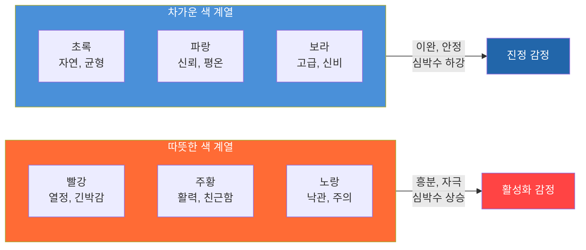
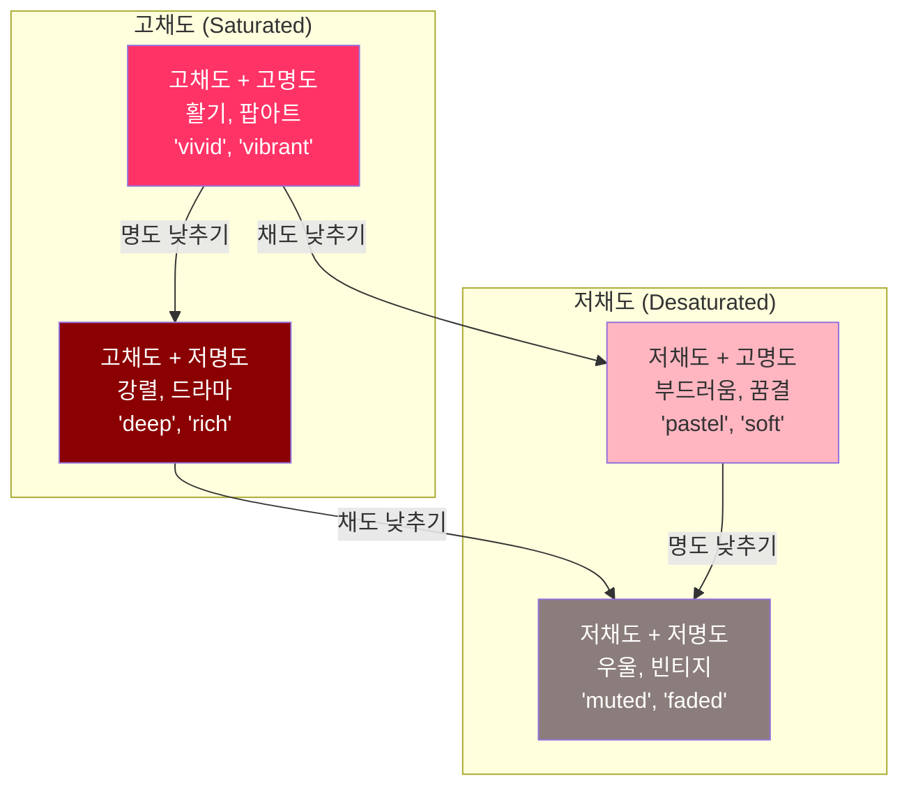
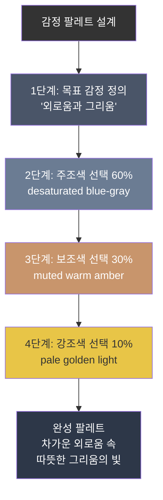
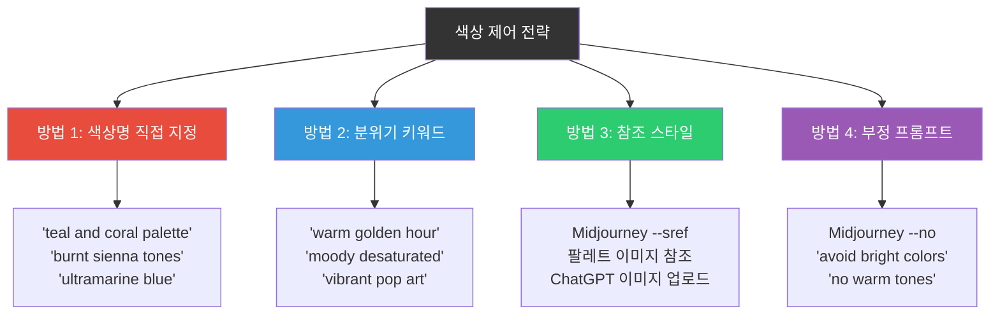
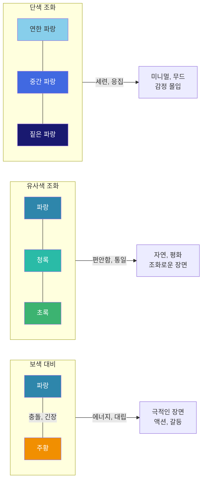

# 색채 심리학과 감정 팔레트

> 색상은 말보다 먼저 감정을 전달한다 — AI 이미지에 의도한 감정을 입히는 색채 전략을 배운다

## 개요

이 섹션에서는 색상이 인간의 감정과 심리에 미치는 영향을 체계적으로 이해하고, 이를 AI 이미지 생성 프롬프트에 전략적으로 적용하는 방법을 학습합니다. [이전 섹션](11-ch11-시각적-스토리텔링과-감정-전달/01-01-시각적-스토리텔링의-원리.md)에서 배운 시각적 스토리텔링의 4요소(인물, 환경, 갈등, 감정) 중 **감정**을 색채라는 강력한 도구로 구현하는 방법에 집중합니다.

**선수 지식**: 시각적 스토리텔링의 원리와 감정적 프롬프트 작성법 (세션 11.1)
**학습 목표**:
- 따뜻한 색과 차가운 색이 감정에 미치는 심리적 영향을 설명할 수 있다
- 채도와 명도 조절이 이미지의 무드를 어떻게 변화시키는지 이해한다
- 특정 감정을 전달하기 위한 색채 팔레트를 직접 설계할 수 있다
- AI 프롬프트에서 색상을 효과적으로 제어하는 키워드를 활용할 수 있다

## 왜 알아야 할까?

여러분이 카페에 들어갔을 때를 떠올려보세요. 벽이 따뜻한 오렌지색인 카페와 차가운 파란색인 카페에서 느끼는 감정이 같을까요? 연구에 따르면, 사람들의 **첫인상 중 90%가 색상에 의해 결정**됩니다. 색상은 언어보다 빠르게, 의식보다 먼저 감정을 전달하거든요.

AI 이미지 생성에서도 마찬가지입니다. 아무리 정교한 구도와 스타일을 지정해도, 색상 전략이 없으면 이미지가 전달하는 감정은 AI의 임의 판단에 맡겨집니다. "슬픈 장면인데 왜 이렇게 화사하지?"라는 경험, 해보신 적 있으시죠? 그건 색채 제어를 하지 않았기 때문입니다.

[프롬프트 해부학 6요소](02-ch2-프롬프트-구조-마스터/01-01-프롬프트-해부학-6요소-프레임워크.md)에서 분위기(Mood)를 다뤘고, [분위기와 감정 키워드 전략](02-ch2-프롬프트-구조-마스터/05-05-분위기와-감정-키워드-전략.md)에서 키워드 활용법을 배웠습니다. 이번 세션에서는 그 기초 위에 **색채 심리학이라는 과학적 프레임워크**를 올려, 감정을 정밀하게 설계하는 단계로 나아갑니다.

## 핵심 개념

### 개념 1: 색상의 온도 — 따뜻한 색과 차가운 색

> 💡 **비유**: 색상의 온도는 음식의 온도와 비슷합니다. 뜨거운 국물이 몸을 데우고 활기를 주듯 따뜻한 색(빨강, 주황, 노랑)은 마음을 자극하고 에너지를 줍니다. 반대로 시원한 아이스크림이 열을 식히듯, 차가운 색(파랑, 초록, 보라)은 마음을 가라앉히고 평온함을 줍니다.

색채 심리학에서 가장 기본이 되는 구분은 **색상 온도(Color Temperature)**입니다. 색상환을 반으로 나누면, 한쪽에는 따뜻한 색군, 반대쪽에는 차가운 색군이 자리잡고 있죠.

**따뜻한 색 (Warm Colors)**: 빨강, 주황, 노랑 계열
- 생리적으로 심박수와 혈압을 높이고, 뇌 활동을 활성화합니다
- 열정, 에너지, 긴박감, 따뜻함, 친근함을 전달
- AI 프롬프트에서 활용 시: 식품 광고, 세일 배너, 역동적인 장면에 효과적

**차가운 색 (Cool Colors)**: 파랑, 초록, 보라 계열
- 심박수를 낮추고 이완 반응을 유도합니다
- 신뢰, 평온, 전문성, 자연, 신비감을 전달
- AI 프롬프트에서 활용 시: 기업 브랜딩, 명상 앱, 자연 풍경에 효과적

> 📊 **그림 1**: 색상 온도와 감정 반응의 관계

그런데 여기서 중요한 점이 있어요. 같은 빨강이라도 **어떤 빨강이냐**에 따라 감정이 완전히 달라집니다. 선명한 빨강은 열정과 위험을 전달하지만, 탁한 와인색은 고급스러움과 성숙함을 전달하거든요. 이것이 바로 다음에 배울 채도와 명도의 역할입니다.

**AI 프롬프트 적용 사례:**

| 의도한 감정 | 따뜻한 색 프롬프트 | 차가운 색 프롬프트 |
|-------------|-------------------|-------------------|
| 희망 | "golden sunrise, warm amber light" | "soft mint morning, gentle teal glow" |
| 긴장 | "deep crimson shadows, fiery orange" | "cold steel blue, icy violet darkness" |
| 평화 | "warm honey sunset, soft peach sky" | "calm ocean blue, misty sage green" |

> ⚠️ **흔한 오해**: "따뜻한 색 = 긍정, 차가운 색 = 부정"이라고 단순화하는 분이 많습니다. 하지만 빨강은 사랑도 분노도 될 수 있고, 파랑은 평온도 우울도 될 수 있어요. 색상 자체가 아니라 **맥락과 조합**이 감정을 결정합니다.

---

### 개념 2: 채도와 명도 — 감정의 볼륨 조절기

> 💡 **비유**: 색상이 악기의 종류(피아노, 바이올린, 드럼)라면, 채도와 명도는 그 악기의 **볼륨과 음역대**입니다. 같은 피아노라도 포르테시모로 치면 강렬하고, 피아니시모로 치면 섬세하죠. 색상도 마찬가지입니다.

**채도(Saturation)**란 색상의 선명함, 즉 얼마나 순수하고 강렬한가를 나타냅니다. **명도(Brightness/Value)**는 색상이 얼마나 밝거나 어두운가를 의미합니다. 이 두 가지가 조합되면 같은 "파란색"이라도 완전히 다른 감정을 만들어냅니다.

> 📊 **그림 2**: 채도와 명도에 따른 무드 변화 매트릭스

**채도-명도 조합별 감정 효과:**

| 조합 | 분위기 | AI 키워드 | 활용 장면 |
|------|--------|-----------|-----------|
| 고채도 + 고명도 | 활기, 경쾌, 팝 | "vivid colors", "vibrant", "saturated" | 어린이 콘텐츠, 축제, 팝아트 |
| 고채도 + 저명도 | 강렬, 극적, 무게감 | "deep rich colors", "jewel tones" | 럭셔리 브랜드, 영화 포스터 |
| 저채도 + 고명도 | 부드러움, 몽환, 낭만 | "pastel", "soft muted tones" | 웨딩, 뷰티, 동화 |
| 저채도 + 저명도 | 우울, 회상, 빈티지 | "muted", "faded", "desaturated" | 회고록, 호러, 다큐멘터리 |

실제로 영화 색보정(Color Grading)에서도 이 원리를 활발히 사용합니다. 크리스토퍼 놀란의 영화들이 왜 그렇게 묵직하게 느껴지는지 아시나요? 저채도와 중저명도를 일관되게 유지하기 때문입니다. 반면 웨스 앤더슨 영화는 고채도 파스텔톤으로 동화 같은 세계를 만들어내죠.

> 🔥 **실무 팁**: AI 프롬프트에서 채도와 명도를 제어할 때, 추상적인 감정 단어보다 **구체적인 시각 키워드**가 훨씬 효과적입니다. "슬픈 느낌"보다는 "muted, desaturated blue-gray tones, low-key lighting"이 AI에게 명확한 지시가 됩니다.

---

### 개념 3: 감정별 색채 팔레트 설계

> 💡 **비유**: 요리사가 맛의 조합을 설계하듯(짠맛 + 단맛 = 깊은 풍미), 색채 팔레트는 여러 색상을 조합하여 하나의 **감정 레시피**를 만드는 과정입니다. 단일 재료(색상)로는 복합적인 맛(감정)을 낼 수 없어요.

단일 색상이 아니라 **색상 조합(팔레트)**이 실제로 감정을 전달하는 단위입니다. 효과적인 감정 팔레트를 설계하려면 세 가지 원칙을 기억하세요.

**팔레트 설계 3원칙:**

1. **주조색(Dominant Color)**: 전체 면적의 60%를 차지하며 기본 감정을 결정
2. **보조색(Secondary Color)**: 30%를 차지하며 감정의 뉘앙스를 추가
3. **강조색(Accent Color)**: 10%를 차지하며 시선을 끌고 긴장감 부여

> 📊 **그림 3**: 감정 팔레트 설계의 60-30-10 법칙

**대표 감정별 팔레트 레시피:**

**기쁨과 활력의 팔레트**
- 주조색: 밝은 노랑 또는 산호색 (warm, sunlit)
- 보조색: 밝은 주황 또는 연한 분홍 (peachy, coral accents)
- 강조색: 흰색 또는 하늘색 (crisp white highlights)
- 프롬프트 예시: "warm golden sunlight, cheerful coral and peach tones, bright airy atmosphere, soft white highlights"

**고독과 우울의 팔레트**
- 주조색: 탁한 청회색 (desaturated blue-gray)
- 보조색: 어두운 남색 (deep navy, muted indigo)
- 강조색: 희미한 따뜻한 빛 (faint amber glow)
- 프롬프트 예시: "muted blue-gray atmosphere, deep navy shadows, faint warm amber light in distance, desaturated melancholic tones"

**긴장과 공포의 팔레트**
- 주조색: 짙은 검정 또는 매우 어두운 남색 (near-black, dark void)
- 보조색: 탁한 빨강 또는 어두운 자주 (deep crimson, dark maroon)
- 강조색: 날카로운 흰색 또는 네온 (sharp white flash, sickly green accent)
- 프롬프트 예시: "dark oppressive shadows, deep crimson undertones, harsh white light cutting through darkness, unsettling atmosphere"

**평화와 치유의 팔레트**
- 주조색: 부드러운 세이지 그린 (soft sage green)
- 보조색: 연한 라벤더 또는 하늘색 (pale lavender, light sky blue)
- 강조색: 크림 화이트 (warm cream, soft ivory)
- 프롬프트 예시: "soft sage green landscape, gentle lavender sky, warm cream light, serene peaceful atmosphere, pastel tones"

---

### 개념 4: AI 프롬프트에서 색상 제어 키워드 마스터

> 💡 **비유**: AI에게 색상을 지시하는 것은 인테리어 디자이너에게 전화로 색상을 설명하는 것과 같습니다. "파란색으로 해주세요"라고 하면 디자이너 마음대로 될 수 있지만, "차분한 뮤트 블루, 약간 회색기가 도는, 파스텔보다는 조금 더 깊은"이라고 하면 원하는 결과에 가까워지죠.

AI 이미지 생성 도구마다 색상 제어 방식이 조금씩 다르지만, 공통적으로 통하는 키워드 전략이 있습니다.

> 📊 **그림 4**: 플랫폼별 색상 제어 방법 비교

**방법 1: 색상명 직접 지정**

가장 기본적이지만 강력한 방법입니다. AI는 구체적인 색상 이름을 잘 인식합니다.

| 수준 | 예시 | 정밀도 |
|------|------|--------|
| 기본 색상명 | "red", "blue", "green" | 낮음 — AI 재량 큼 |
| 구체적 색상명 | "teal", "coral", "sage", "burgundy" | 중간 |
| 수식어 + 색상명 | "muted teal", "desaturated sage", "warm burnt sienna" | 높음 |
| 팔레트 지정 | "teal-orange color palette", "monochromatic blue scheme" | 매우 높음 |

**방법 2: 분위기 키워드로 간접 제어**

특정 분위기 키워드는 자동으로 특정 색상 경향을 유발합니다.

- "golden hour" → 따뜻한 주황-금색 계열이 지배적
- "moonlit" → 차가운 청백색, 은색 계열
- "neon-lit cyberpunk" → 고채도 핑크, 청록, 보라
- "vintage Polaroid" → 저채도, 약간 노란 빛 바랜 톤
- "cinematic color grading" → 대비가 강한 영화적 색감

**방법 3: 플랫폼별 고급 기법**

**ChatGPT (GPT-4o)**: 자연어 대화로 색상을 점진적으로 조정할 수 있습니다. "좀 더 따뜻하게", "채도를 낮춰서 우울한 느낌으로" 같은 후속 지시가 가능한 것이 큰 장점이죠.

**Midjourney**: `--sref` 파라미터로 팔레트 이미지를 참조할 수 있습니다. Coolors나 Figma에서 원하는 팔레트 스와치 이미지를 만들어 참조하면 정밀한 색상 제어가 가능합니다. `--stylize` 값을 낮추면(예: `--s 50`) 프롬프트의 색상 지시에 더 충실해집니다.

**Gemini**: 구체적인 색상 설명과 함께 "이 색상 팔레트를 유지하면서"라는 제약 조건을 추가하면 효과적입니다.

**방법 4: 부정(네거티브) 프롬프트 활용**

원하지 않는 색상을 제거하는 것도 중요한 전략입니다. Midjourney에서는 `--no warm colors, orange, yellow`처럼 사용합니다. "avoid bright saturated colors"라는 지시도 효과적이에요.

> 💡 **알고 계셨나요?**: Midjourney V7은 색상 관련 프롬프트 해석 능력이 크게 개선되었습니다. "muted teal"이나 "desaturated sage" 같은 수식어+색상명 조합의 반영 정확도가 이전 버전 대비 눈에 띄게 향상되었어요. 다만 Hex 코드(#FF5733)는 공식 지원은 아니지만, 서술적 단서로서 참고 정도의 영향을 줄 수 있습니다.

---

### 개념 5: 색상 대비와 조화 — 감정의 밀고 당기기

> 💡 **비유**: 영화에서 조용한 장면 뒤에 갑자기 큰 소리가 나면 더 놀라잖아요? 색상도 마찬가지입니다. 차가운 색상 속 갑작스러운 따뜻한 색상은 시선을 잡아끌고, 감정적 충돌을 만들어냅니다.

색채 팔레트에서 색상 간의 **관계**가 감정적 효과를 극대화합니다.

**보색 대비 (Complementary Contrast)**: 색상환에서 반대편에 위치한 색 조합 (예: 파랑-주황, 빨강-초록). 강렬한 긴장감과 에너지를 만듭니다. 영화 포스터에서 자주 볼 수 있는 "teal and orange" 조합이 대표적이죠.

**유사색 조화 (Analogous Harmony)**: 색상환에서 이웃한 색 조합 (예: 파랑-청록-초록). 자연스럽고 편안한 통일감을 줍니다. 자연 풍경이나 평화로운 장면에 적합합니다.

**단색 조화 (Monochromatic)**: 하나의 색상을 채도와 명도만 바꿔 사용. 세련되고 응집력 있는 느낌. 미니멀한 브랜딩이나 무드 중심의 이미지에 효과적입니다.

> 📊 **그림 5**: 색상 조합 유형별 감정 효과

**AI 프롬프트에서 대비와 조화 활용법:**

- 보색 대비: "dramatic teal and orange color contrast, complementary color scheme"
- 유사색 조화: "harmonious blue-green palette, analogous cool tones"
- 단색 조화: "monochromatic blue scheme, varying shades of navy to sky blue"
- 대비 강조: "a single red umbrella in a desaturated gray cityscape" — 탁한 배경 속 한 점의 선명한 색은 강력한 감정적 초점을 만듭니다

## 실습: 적용해보기

### 실습 1: 감정-색채 매핑 워크시트

아래 표를 채워보세요. 각 감정에 어울리는 색상 팔레트를 설계하고, 실제 프롬프트로 변환합니다.

| 목표 감정 | 주조색 (60%) | 보조색 (30%) | 강조색 (10%) | 채도/명도 키워드 | 완성 프롬프트 (색상 부분) |
|-----------|-------------|-------------|-------------|----------------|--------------------------|
| 그리움 | ? | ? | ? | ? | ? |
| 설렘 | ? | ? | ? | ? | ? |
| 공포 | ? | ? | ? | ? | ? |
| 경이로움 | ? | ? | ? | ? | ? |

**작성 예시 (희망):**
- 주조색: 따뜻한 앰버 골드 → 보조색: 부드러운 피치 → 강조색: 크림 화이트
- 채도/명도: 중~고채도, 고명도
- 프롬프트: "warm amber golden tones, soft peach accents, cream white highlights, bright optimistic atmosphere"

### 실습 2: 같은 장면, 다른 팔레트 비교 분석

**장면**: "비 오는 날 창가에 앉아 밖을 바라보는 인물"

이 동일한 장면을 세 가지 감정으로 변주해보세요:

**버전 A — 평화로운 비**
- 팔레트: 부드러운 세이지 그린 + 라벤더 + 크림
- 프롬프트: "person sitting by window on rainy day, soft sage green and lavender tones, warm cream light inside, peaceful serene atmosphere, pastel muted colors"

**버전 B — 우울한 비**
- 팔레트: 탁한 청회색 + 어두운 남색 + 희미한 노랑
- 프롬프트: "person sitting by window on rainy day, desaturated blue-gray palette, deep navy shadows, faint yellowish light from distant streetlamp, melancholic lonely atmosphere, muted faded tones"

**버전 C — 긴장감 있는 비**
- 팔레트: 거의 검정 + 날카로운 흰색 + 짙은 붉은 기
- 프롬프트: "person sitting by window on rainy day, near-black darkness, harsh white lightning flash, deep crimson undertones in shadows, suspenseful ominous atmosphere, high contrast"

**토론 질문**: 세 버전의 프롬프트에서 색채 키워드를 제거하면 이미지 감정이 어떻게 달라질까요? 색상 지시 없이도 AI가 의도한 감정을 정확히 전달할 수 있을까요?

### 실습 3: 영화 장면 색채 분석

좋아하는 영화나 드라마에서 인상 깊은 장면 하나를 골라보세요. 그 장면의 색채를 분석합니다:

1. 주조색은 무엇인가? (화면의 대부분을 차지하는 색)
2. 보조색은? 강조색은?
3. 채도는 높은가 낮은가? 명도는?
4. 이 색채 조합이 전달하는 감정은?
5. 이 색감을 AI 프롬프트로 재현한다면 어떤 키워드를 쓸 것인가?

## 더 깊이 알아보기

### 요하네스 이텐과 색채의 감정 — 바우하우스에서 시작된 이야기

현대 색채 이론의 아버지라 불리는 **요하네스 이텐(Johannes Itten, 1888-1967)**은 독일 바우하우스에서 혁명적인 색채 교육을 시작한 인물입니다. 1919년부터 바우하우스의 기초 과정(Vorkurs)을 가르치며, 학생들에게 단순히 색을 보는 것이 아니라 **색을 느끼도록** 훈련시켰죠.

이텐은 7가지 색상 대비 이론을 정립했는데, 그중 **온도 대비(Warm-Cool Contrast)**에 대한 그의 연구가 오늘날 우리가 "따뜻한 색/차가운 색"이라고 부르는 개념의 직접적 기원입니다. 흥미로운 점은, 이텐이 학생들의 색상 선호도를 관찰하면서 **사람의 성격 유형과 색상 취향 사이의 상관관계**를 발견했다는 것입니다. 이 관찰은 훗날 "퍼스널 컬러 진단"의 사계절(봄/여름/가을/겨울) 이론으로 발전하게 됩니다.

100년 전 바우하우스 교실에서 시작된 색채-감정 이론이, 지금 우리가 AI에게 "muted warm amber"라고 프롬프트를 쓸 때 활용하는 그 원리라는 점이 놀랍지 않나요?

### 색채와 문화 — 보편성과 차이

색채 심리학에서 주의할 점은 **문화적 맥락**입니다. 빨강은 서양에서 위험과 열정을 의미하지만, 동아시아에서는 행운과 축복을 상징합니다. 흰색은 서양에서 순결과 결혼이지만, 한국과 일본에서는 전통적으로 상(喪)의 색이었죠. AI 이미지를 제작할 때 타깃 오디언스의 문화적 배경을 고려하는 것이 중요합니다. 이 주제는 [타깃 오디언스 분석과 비주얼 공감 설계](11-ch11-시각적-스토리텔링과-감정-전달/04-04-타깃-오디언스-분석과-비주얼-공감-설계.md)에서 더 자세히 다룹니다.

## 흔한 오해와 팁

> ⚠️ **흔한 오해**: "색상 이름만 넣으면 AI가 알아서 예쁘게 조합해줄 것이다." 사실 AI는 학습 데이터의 평균적인 색상 분포를 따르는 경향이 있어요. 의도적인 색상 제어 없이는 "무난하지만 특색 없는" 색감이 나오기 쉽습니다. 채도, 명도, 팔레트 구성까지 구체적으로 지시해야 원하는 감정을 정밀하게 전달할 수 있습니다.

> 💡 **알고 계셨나요?**: 2025년 팬톤이 선정한 올해의 색 "Mocha Mousse"는 따뜻한 갈색 계열로, 안정감과 편안함을 상징합니다. 이런 트렌드 컬러를 AI 프롬프트에 직접 활용할 수 있어요. "Pantone Mocha Mousse warm brown tones"처럼 트렌드 색상명을 넣으면 AI가 해당 색감 범위를 참조합니다.

> 🔥 **실무 팁**: 색채 팔레트를 설계할 때 Coolors(coolors.co)나 Adobe Color 같은 도구로 먼저 팔레트를 시각화하세요. 그리고 그 팔레트의 색상명과 특성을 프롬프트에 그대로 옮기면 됩니다. Midjourney에서는 팔레트 스와치 이미지를 `--sref`로 참조하면 더 정밀한 결과를 얻을 수 있습니다.

## 핵심 정리

| 개념 | 설명 |
|------|------|
| 색상 온도 | 따뜻한 색(빨강, 주황, 노랑)은 활성화, 차가운 색(파랑, 초록, 보라)은 진정 효과 |
| 채도 (Saturation) | 색의 선명도. 고채도 = 강렬/활기, 저채도 = 부드러움/우울 |
| 명도 (Brightness) | 색의 밝기. 고명도 = 경쾌/개방, 저명도 = 무거움/긴장 |
| 60-30-10 법칙 | 주조색 60%, 보조색 30%, 강조색 10%로 팔레트 구성 |
| 색상명 구체화 | "blue"보다 "muted teal", "desaturated sage" 등 수식어+색상명이 효과적 |
| 분위기 키워드 | "golden hour", "moonlit", "neon cyberpunk" 등이 색상을 간접 제어 |
| 색상 대비 | 보색 대비 = 긴장/에너지, 유사색 = 조화/평온, 단색 = 세련/몰입 |
| 문화적 맥락 | 같은 색이라도 문화권에 따라 감정 연상이 다를 수 있음 |

## 다음 섹션 미리보기

색채로 감정의 톤을 설정했다면, 이제 그 감정을 **어디로 향하게 할 것인가**를 결정할 차례입니다. [다음 섹션](11-ch11-시각적-스토리텔링과-감정-전달/03-03-구도와-시선-유도로-메시지-강화.md)에서는 구도와 시선 유도 기법을 통해, 색채가 만든 감정을 보는 이의 시선과 연결하여 메시지를 강화하는 방법을 배웁니다. 색채(무엇을 느끼게 할 것인가)와 구도(어디를 보게 할 것인가)가 결합되면, 비로소 완성된 시각적 커뮤니케이션이 탄생합니다.

## 참고 자료

- [Color and Psychological Functioning: A Review (PMC)](https://pmc.ncbi.nlm.nih.gov/articles/PMC4383146/) - 색상이 인간 심리에 미치는 영향에 대한 학술적 리뷰. 색상-감정 연결의 과학적 근거를 이해하는 데 필수
- [How to Write AI Image Prompts Like a Pro (Let's Enhance)](https://letsenhance.io/blog/article/ai-text-prompt-guide/) - AI 이미지 프롬프트에서 색상을 명시적으로 지정하는 실전 가이드
- [Color Theory in AI: Master Color Palettes with Prompts (ArtSmart)](https://artsmart.ai/blog/color-theory-in-ai/) - AI 이미지 생성에서 색채 이론을 적용하는 종합 가이드
- [How to Get Specific Colors in Midjourney V7 (CometAPI)](https://www.cometapi.com/how-to-get-specific-colors-in-midjourney-v7/) - Midjourney V7에서 정밀한 색상 제어를 위한 실전 기법
- [Warm and Cool Colors: Psychology (ColorPsychology.org)](https://www.colorpsychology.org/warm-cool-colors/) - 따뜻한 색과 차가운 색의 심리적 효과에 대한 체계적 정리
- [AI-Powered Visual Storytelling (AI Journ)](https://aijourn.com/ai-powered-visual-storytelling-transforming-content-creation-in-2025/) - 2025년 AI 기반 시각적 스토리텔링 트렌드와 색채 활용 전략

---
### 🔗 Related Sessions
- [시각적_스토리텔링](11-ch11-시각적-스토리텔링과-감정-전달/01-01-시각적-스토리텔링의-원리.md) (prerequisite)
- [감정적_프롬프트](11-ch11-시각적-스토리텔링과-감정-전달/01-01-시각적-스토리텔링의-원리.md) (prerequisite)
