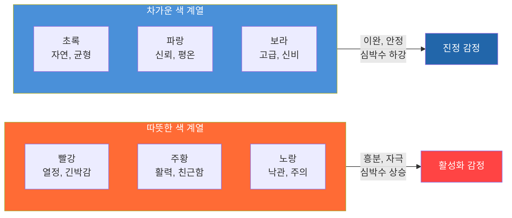
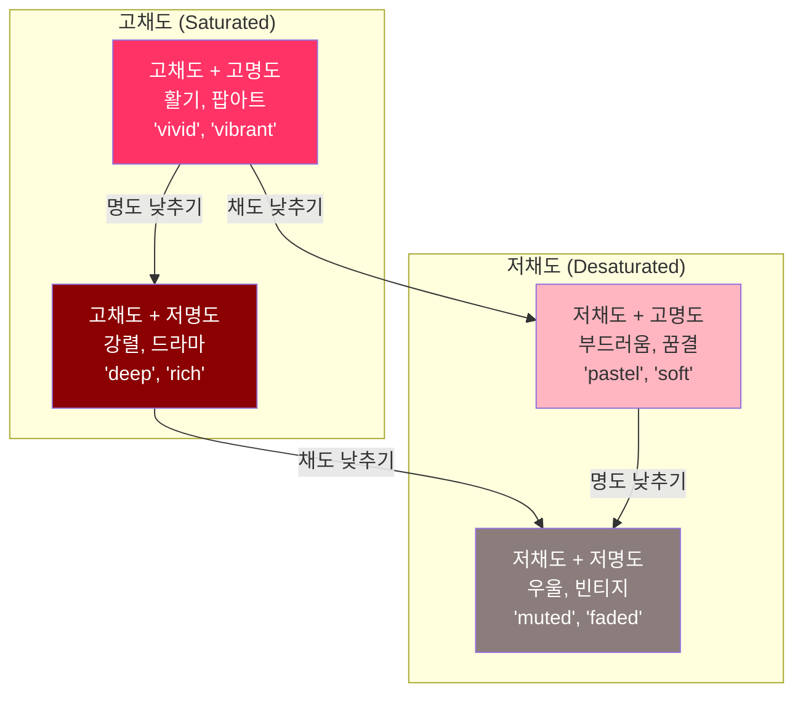
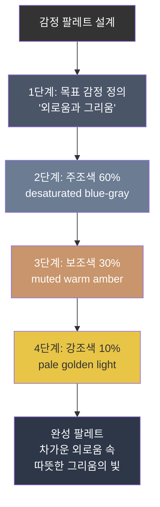

# 색채 심리학과 감정 팔레트

> 색상은 말보다 먼저 감정을 전달한다 — AI 이미지에 의도한 감정을 입히는 색채 전략을 배운다

## 개요

색상은 구도나 스타일보다 먼저 감정을 결정합니다. 이 세션에서는 색상 온도, 채도, 명도가 감정에 미치는 영향을 이해하고, AI 이미지 생성 프롬프트에서 색채를 전략적으로 제어하는 방법을 실습합니다. "슬픈 장면인데 왜 화사하지?"라는 문제를 색채 팔레트 설계로 해결합니다.

## 색상의 온도 — 따뜻한 색과 차가운 색

색채 심리학의 가장 기본 구분은 **색상 온도(Color Temperature)**입니다. 색상환을 반으로 나누면 따뜻한 색군과 차가운 색군이 나뉩니다.

> 색상 온도는 음식의 온도와 비슷합니다. 뜨거운 국물이 몸을 데우듯 따뜻한 색은 마음을 자극하고, 시원한 아이스크림이 열을 식히듯 차가운 색은 마음을 가라앉힙니다.

**따뜻한 색 (Warm Colors)**: 빨강, 주황, 노랑 — 열정, 에너지, 긴박감, 친근함

**차가운 색 (Cool Colors)**: 파랑, 초록, 보라 — 신뢰, 평온, 전문성, 신비감



같은 "희망"도 색상 온도에 따라 완전히 다르게 표현됩니다:

```
warm golden sunrise, soft amber light, hopeful atmosphere
```

```
soft mint morning glow, gentle teal sky, hopeful atmosphere
```


중요한 점: "따뜻한 색 = 긍정, 차가운 색 = 부정"이 아닙니다. 빨강은 사랑도 분노도 되고, 파랑은 평온도 우울도 됩니다. **맥락과 조합**이 감정을 결정합니다.

## 채도와 명도 — 감정의 볼륨 조절기

같은 "파란색"이라도 **채도(Saturation)**와 **명도(Brightness)**에 따라 완전히 다른 감정이 됩니다.



| 조합 | 분위기 | AI 키워드 | 활용 장면 |
|------|--------|-----------|-----------|
| 고채도 + 고명도 | 활기, 경쾌 | "vivid colors", "vibrant", "saturated" | 어린이 콘텐츠, 축제 |
| 고채도 + 저명도 | 강렬, 극적 | "deep rich colors", "jewel tones" | 럭셔리 브랜드, 영화 포스터 |
| 저채도 + 고명도 | 부드러움, 몽환 | "pastel", "soft muted tones" | 웨딩, 뷰티, 동화 |
| 저채도 + 저명도 | 우울, 빈티지 | "muted", "faded", "desaturated" | 회고록, 호러 |

채도-명도 조합을 프롬프트에 적용해봅시다:

```
a cheerful street market, vivid saturated colors, bright warm sunlight, vibrant atmosphere
```

```
a lonely street market closing at dusk, muted faded colors, desaturated tones, melancholic atmosphere
```


## 감정별 색채 팔레트 설계

단일 색상이 아니라 **색상 조합(팔레트)**이 감정을 전달합니다. 60-30-10 법칙을 기억하세요:

1. **주조색(60%)**: 기본 감정 결정
2. **보조색(30%)**: 감정의 뉘앙스 추가
3. **강조색(10%)**: 시선 집중, 긴장감 부여



**기쁨과 활력** — 주조: 밝은 노랑/산호색, 보조: 밝은 주황/연분홍, 강조: 흰색

```
warm golden sunlight, cheerful coral and peach tones, bright airy atmosphere, soft white highlights, joyful scene
```


**고독과 우울** — 주조: 탁한 청회색, 보조: 어두운 남색, 강조: 희미한 따뜻한 빛

```
muted blue-gray atmosphere, deep navy shadows, faint warm amber light in distance, desaturated melancholic tones, lonely figure
```

**긴장과 공포** — 주조: 짙은 검정, 보조: 탁한 빨강/자주, 강조: 날카로운 흰색

```
dark oppressive shadows, deep crimson undertones, harsh white light cutting through darkness, unsettling ominous atmosphere
```

**평화와 치유** — 주조: 세이지 그린, 보조: 라벤더, 강조: 크림 화이트

```
soft sage green landscape, gentle lavender sky, warm cream light, serene peaceful atmosphere, pastel tones
```


## 색상 대비와 조화

색상 간의 **관계**가 감정 효과를 극대화합니다.

| 조합 유형 | 원리 | 감정 효과 | 프롬프트 키워드 |
|-----------|------|-----------|----------------|
| 보색 대비 | 색상환 반대편 (파랑-주황) | 긴장, 에너지 | "teal and orange contrast, complementary colors" |
| 유사색 조화 | 색상환 이웃 (파랑-청록-초록) | 편안함, 통일감 | "harmonious blue-green palette, analogous tones" |
| 단색 조화 | 하나의 색, 채도/명도 변화 | 세련, 몰입 | "monochromatic blue scheme, navy to sky blue" |

보색 대비의 대표적 활용:

```
cinematic portrait, dramatic teal and orange color grading, complementary color scheme, movie poster style
```


탁한 배경 속 한 점의 선명한 색으로 감정적 초점을 만드는 기법도 강력합니다:

```
a single red umbrella in a desaturated gray rainy cityscape, color isolation, dramatic contrast
```


## AI 프롬프트 색상 제어 키워드

**방법 1 — 구체적 색상명 지정** (가장 효과적):

```
portrait with muted teal background, desaturated sage green clothing, warm burnt sienna accents
```

**방법 2 — 분위기 키워드로 간접 제어**: "golden hour", "moonlit", "neon cyberpunk", "vintage Polaroid" 등이 특정 색상 경향을 유발합니다

**방법 3 — 스타일 참조**: Midjourney `--sref`로 팔레트 이미지 참조, ChatGPT에서 "이 색상 팔레트를 유지하면서" 후속 지시

**방법 4 — 부정 프롬프트**: Midjourney `--no warm colors, orange, yellow` 또는 "avoid bright saturated colors"

## 실습

### 실습 1: 같은 장면, 세 가지 감정 변주

**장면**: "비 오는 날 창가에 앉아 밖을 바라보는 인물"

**평화로운 비:**

```
person sitting by window on rainy day, soft sage green and lavender tones, warm cream light inside, peaceful serene atmosphere, pastel muted colors
```

**우울한 비:**

```
person sitting by window on rainy day, desaturated blue-gray palette, deep navy shadows, faint yellowish light from distant streetlamp, melancholic lonely atmosphere, muted faded tones
```

**긴장감 있는 비:**

```
person sitting by window on rainy day, near-black darkness, harsh white lightning flash, deep crimson undertones, suspenseful ominous atmosphere, high contrast
```


### 실습 2: 감정-색채 매핑 설계

아래 감정에 대해 60-30-10 팔레트를 설계하고 프롬프트를 작성해보세요:

| 목표 감정 | 주조색 (60%) | 보조색 (30%) | 강조색 (10%) | 프롬프트 |
|-----------|-------------|-------------|-------------|----------|
| 그리움 | ? | ? | ? | ? |
| 설렘 | ? | ? | ? | ? |
| 경이로움 | ? | ? | ? | ? |

## 팁과 주의사항

- 추상적 감정 단어보다 **구체적 시각 키워드**가 효과적입니다. "슬픈 느낌"보다 "muted, desaturated blue-gray tones, low-key lighting"이 AI에게 명확한 지시가 됩니다
- AI는 학습 데이터의 평균 색상 분포를 따르는 경향이 있습니다. 의도적 색상 제어 없이는 "무난하지만 특색 없는" 색감이 나오기 쉬우므로, 채도/명도/팔레트까지 구체적으로 지시하세요
- Coolors(coolors.co)나 Adobe Color로 팔레트를 먼저 시각화한 뒤, 색상명과 특성을 프롬프트에 옮기면 효율적입니다
- 색상의 문화적 맥락을 고려하세요. 빨강은 서양에서 위험/열정이지만, 동아시아에서는 행운/축복을 상징합니다
- Midjourney V7은 "muted teal", "desaturated sage" 같은 수식어+색상명 조합의 반영 정확도가 크게 개선되었습니다. `--stylize` 값을 낮추면(예: `--s 50`) 색상 지시에 더 충실해집니다

## 핵심 정리

| 개념 | 설명 |
|------|------|
| 색상 온도 | 따뜻한 색(빨강, 주황, 노랑)은 활성화, 차가운 색(파랑, 초록, 보라)은 진정 효과 |
| 채도 (Saturation) | 색의 선명도. 고채도 = 강렬/활기, 저채도 = 부드러움/우울 |
| 명도 (Brightness) | 색의 밝기. 고명도 = 경쾌/개방, 저명도 = 무거움/긴장 |
| 60-30-10 법칙 | 주조색 60%, 보조색 30%, 강조색 10%로 팔레트 구성 |
| 색상명 구체화 | "blue"보다 "muted teal", "desaturated sage" 등 수식어+색상명이 효과적 |
| 색상 대비 | 보색 = 긴장/에너지, 유사색 = 조화/평온, 단색 = 세련/몰입 |

## 다음 섹션 미리보기

색채로 감정의 톤을 설정했다면, 이제 그 감정을 **어디로 향하게 할 것인가**를 결정할 차례입니다. [다음 섹션](11-ch11-시각적-스토리텔링과-감정-전달/03-03-구도와-시선-유도로-메시지-강화.md)에서는 구도와 시선 유도 기법을 통해 색채가 만든 감정을 보는 이의 시선과 연결하는 방법을 배웁니다.
