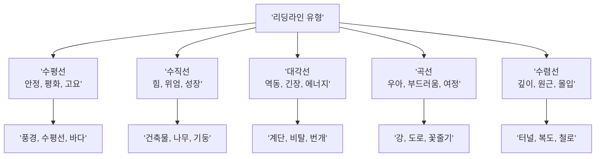
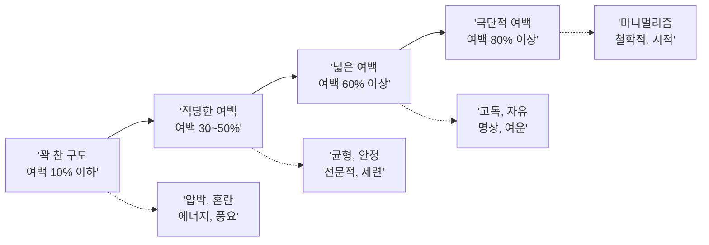

# 구도와 시선 유도로 메시지 강화

> 같은 장면도 구도 하나로 전혀 다른 이야기가 된다 — 시선을 설계하는 비주얼 디렉터가 되는 법

## 개요

이미지 구도(Composition)는 보는 이의 시선을 유도하고, 메시지를 강화하며, 감정까지 전달하는 핵심 도구입니다. 색으로 감정의 '톤'을 만들었다면, 이제 구도로 감정의 '방향'을 설계합니다. 구도 지시 없이는 AI가 평범한 정중앙 배치를 기본값으로 선택하기 때문에, 전략적 구도 키워드가 필수입니다.

## 삼등분 법칙과 황금비 — 시선이 머무는 자리

> 삼등분 법칙은 '무대 위의 스포트라이트'와 같습니다. 무대 1/3 지점에 배우가 서면 관객의 시선이 자연스럽게 끌리면서도, 무대 전체의 이야기가 살아납니다.

**삼등분 법칙(Rule of Thirds)**은 화면을 가로세로 3등분하여 9칸으로 나누고, 교차점에 핵심 요소를 배치하는 기법입니다. **황금비(1:1.618)**는 약 38:62 비율로 나누어 더 자연스러운 미적 균형을 만듭니다.

```mermaid
flowchart LR
    subgraph 중앙배치['중앙 배치']
        direction TB
        A1['시선 도착'] --> A2['피사체(중앙)']
        A2 --> A3['시선 정체<br/>더 볼 곳 없음']
    end

    subgraph 삼등분['삼등분 법칙']
        direction TB
        B1['시선 도착'] --> B2['교차점의 피사체']
        B2 --> B3['주변 환경 탐색']
        B3 --> B4['이야기 발견']
        B4 --> B2
    end

    중앙배치 -.-> |'구도 변경'| 삼등분
```

| 원하는 구도 | 프롬프트 키워드 |
|------------|----------------|
| 삼등분 법칙 | `rule of thirds composition`, `subject placed at the left third` |
| 황금비 | `golden ratio composition`, `fibonacci spiral composition` |
| 정중앙 대칭 | `centered composition`, `symmetrical framing` |
| 의도적 비대칭 | `asymmetrical composition`, `off-center subject` |

```
A young woman standing at the left third of the frame, golden hour park scene, rule of thirds composition, shallow depth of field
```


```
Ancient temple entrance, golden ratio composition, fibonacci spiral leading to the central statue, dramatic volumetric lighting
```

## 리딩라인 — 시선의 고속도로

리딩라인(Leading Lines)은 이미지 안의 도로, 울타리, 강, 건축물의 선, 인물의 시선 방향 등이 핵심 주체를 향해 수렴하도록 배치하는 기법입니다.



핵심은 리딩라인의 **방향**과 **감정**을 일치시키는 것입니다.

```
A lone figure at the end of a long corridor, converging lines of pillars leading to the subject, dramatic perspective, cinematic lighting
```


```
Winding river through a misty valley, the curve leading the eye from foreground to a distant mountain village, aerial perspective, soft morning light
```

```
Diagonal rain streaks across a dark cityscape, neon lights cutting through the storm at sharp angles, cyberpunk atmosphere
```

## 프레이밍 — 이미지 속 액자 만들기

프레이밍(Framing within Frame)은 문틀, 나뭇가지, 아치 같은 요소로 주체를 둘러싸는 시각적 테두리를 만들어 **시선 집중**과 **깊이감 증가**를 동시에 달성합니다.

| 프레임 유형 | 프롬프트 키워드 | 감정 효과 |
|------------|----------------|-----------|
| 건축적 프레임 | `viewed through an archway`, `framed by doorway` | 발견, 신비 |
| 자연 프레임 | `framed by overhanging branches`, `viewed through cave opening` | 유기적, 모험 |
| 인물 프레임 | `shot over the shoulder of`, `silhouette framing` | 관찰자 시점, 긴장 |
| 기하학적 프레임 | `framed within a circular window`, `seen through a keyhole` | 호기심, 비밀 |

```
A magical forest clearing viewed through an ancient stone archway covered in ivy, warm sunlight streaming through, framed composition
```


```
Old bookshop interior seen through a rain-covered window, droplets on glass creating natural frame, cozy warm light inside, shallow depth of field
```

## 여백(네거티브 스페이스) — 비움으로 채우기

여백(Negative Space)은 단순히 빈 공간이 아니라 의도적으로 설계된 감정 전달 도구입니다.

- **넓은 여백 + 작은 주체**: 고독, 자유, 광활함
- **좁은 여백 + 꽉 찬 구도**: 압박, 에너지, 긴장감
- **한쪽으로 치우친 여백**: 불안, 기대, 방향성



```
A single red umbrella on a vast white snow field, minimalist composition, extreme negative space, isolated subject, aerial view
```


```
Subject facing right with empty space ahead, hopeful expression, soft gradient background, negative space suggesting future possibilities
```

여백의 **방향**이 메시지를 바꿉니다. 인물이 바라보는 방향에 여백을 두면 '희망/미래'를, 인물 뒤에 여백을 두면 '단절/과거'를 암시합니다.

## 카메라 앵글 — 힘 관계를 한 컷으로 뒤집다

카메라 앵글은 동일한 피사체를 완전히 다른 인상으로 바꾸는 가장 직접적인 도구입니다.

| 앵글 | 프롬프트 키워드 | 적합한 장면 |
|------|----------------|------------|
| 로우 앵글 | `low angle shot`, `looking up at`, `shot from below` | 영웅, 건축물, 권위 |
| 하이 앵글 | `high angle shot`, `looking down at`, `shot from above` | 취약함, 전체 맥락 |
| 아이 레벨 | `eye level shot`, `straight-on view` | 일상, 친밀감 |
| 버드 아이 뷰 | `bird's eye view`, `top-down view`, `aerial perspective` | 패턴, 도시, 군중 |
| 더치 앵글 | `Dutch angle`, `tilted camera`, `canted angle` | 불안, 긴장, 혼란 |
| 클로즈업 | `extreme close-up`, `macro shot` | 감정 포착, 디테일 |

```
A warrior standing on a cliff edge, low angle shot looking up, dramatic storm clouds behind, heroic pose, cinematic wide lens
```


```
Tiny child sitting alone in a massive cathedral, high angle shot from the dome, dramatic scale contrast, soft diffused light from stained glass
```

## 실습: 같은 장면, 다른 구도

**시나리오**: "도시의 오래된 서점 앞에 서 있는 젊은 여성" — 구도만 바꿔 메시지를 변화시켜 보세요.

```
A young woman standing in front of a tiny old bookstore, high angle shot, vast urban landscape surrounding her, minimalist composition, lots of negative space
```

전달 메시지: 도시 속 작은 존재, 고독과 독립

```
A young woman at an old bookstore entrance, cobblestone path leading to her, eye level shot, warm golden hour light, rule of thirds composition
```

전달 메시지: 독자를 초대하는 따뜻한 서사

```
A young woman framed by the old bookstore doorway, low angle shot looking up, dramatic lighting, ornate wooden frame surrounding her
```

전달 메시지: 지식의 수호자, 위엄


각 프롬프트를 AI 이미지 생성 도구에서 실행하고, 구도가 메시지를 어떻게 바꾸는지 비교해보세요.

## 팁과 주의사항

- **구도 키워드는 경향성이다**: `rule of thirds`라고 입력해도 완벽한 삼등분 배치가 나오지 않을 수 있습니다. `subject positioned at the left third of the frame`처럼 구체적 위치를 지시하세요.
- **정중앙이 더 강력한 경우도 있다**: 위엄, 신성함, 완벽한 균형을 표현할 때는 `symmetrical composition`이 효과적입니다. 규칙을 아는 것은 '언제 깨야 하는지' 알기 위함입니다.
- **Z자 시선 흐름 활용**: 인간의 눈은 왼쪽 위에서 시작하여 Z자로 스캔합니다. 왼쪽 상단에 시작점, 오른쪽 하단에 결론을 배치하면 자연스러운 시각적 서사가 만들어집니다.
- **종횡비도 구도의 일부**: `--ar 16:9`와 `leading lines, vanishing point`를 조합하면 영화적 깊이감이, `--ar 9:16`과 `vertical lines, low angle`을 조합하면 모바일 최적화 구도가 완성됩니다.
- **구도 요소를 조합하라**: 리딩라인 + 프레이밍 + 여백을 함께 사용하면 메시지 전달력이 배가됩니다. 단, 감정 방향이 충돌하지 않도록 주의하세요.

## 핵심 정리

| 개념 | 설명 |
|------|------|
| 삼등분 법칙 | 화면을 9칸으로 나눠 교차점에 주체를 배치하여 자연스러운 시선 유도 |
| 황금비(1:1.618) | 삼등분의 고급 버전, 자연에서 발견되는 미적 비율 |
| 리딩라인 | 이미지 안의 선(도로, 건물, 시선)으로 시선을 유도하는 기법 |
| 프레이밍 | 이미지 안의 자연적 요소로 액자를 만들어 주체에 시선 집중 |
| 여백 | 비어 있는 공간으로 감정 전달 — 넓으면 고독/자유, 좁으면 긴장/에너지 |
| 카메라 앵글 | 로우 앵글(위엄), 하이 앵글(취약), 아이 레벨(친밀) 등 심리 효과 |
| 여백의 방향성 | 인물 시선 방향의 여백 = 희망/미래, 반대쪽 여백 = 단절/고독 |

## 다음 섹션 미리보기

다음 섹션 [타깃 오디언스 분석과 비주얼 공감 설계](11-ch11-시각적-스토리텔링과-감정-전달/04-04-타깃-오디언스-분석과-비주얼-공감-설계.md)에서는 **누구를 위한 이미지인가**라는 질문에 답합니다. 같은 메시지도 타깃에 따라 색채, 구도, 앵글 전략을 어떻게 다르게 조합할지 배웁니다.
