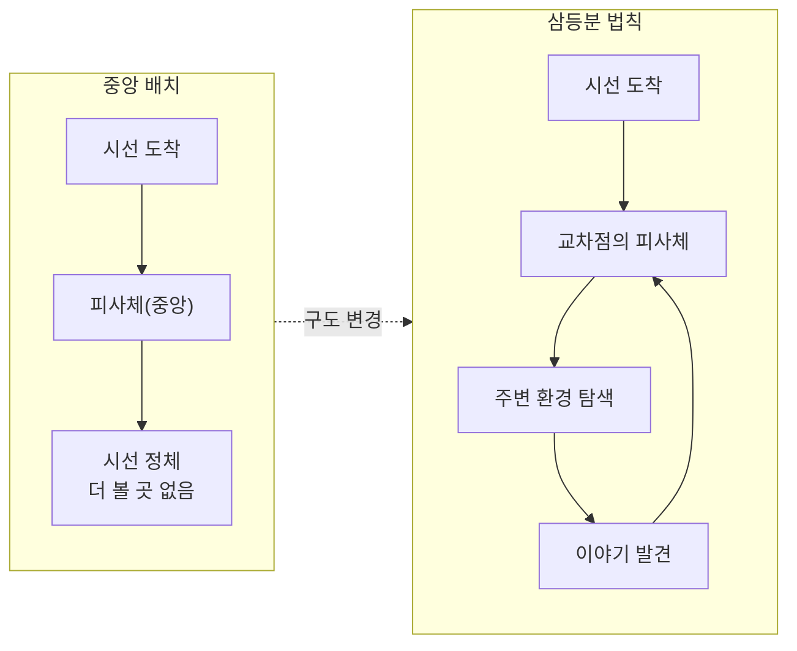
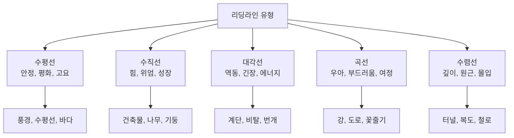
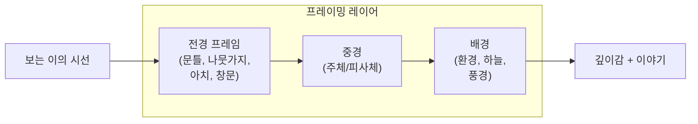
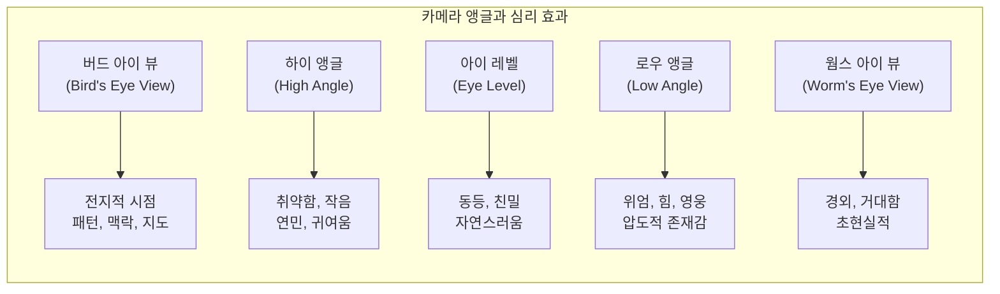

# 구도와 시선 유도로 메시지 강화

> 같은 장면도 구도 하나로 전혀 다른 이야기가 된다 — 시선을 설계하는 비주얼 디렉터가 되는 법

## 개요

이 섹션에서는 이미지 구도(Composition)가 어떻게 보는 이의 시선을 유도하고, 메시지를 강화하며, 감정까지 전달하는지 배웁니다. [색채 심리학과 감정 팔레트](11-ch11-시각적-스토리텔링과-감정-전달/02-02-색채-심리학과-감정-팔레트.md)에서 색으로 감정의 '톤'을 만들었다면, 이제 구도로 감정의 '방향'을 설계합니다.

**선수 지식**:
- [시각적 스토리텔링의 원리](11-ch11-시각적-스토리텔링과-감정-전달/01-01-시각적-스토리텔링의-원리.md)에서 배운 내러티브 4요소와 결정적 순간
- [색채 심리학과 감정 팔레트](11-ch11-시각적-스토리텔링과-감정-전달/02-02-색채-심리학과-감정-팔레트.md)에서 배운 색상 제어 키워드
- [구도와 앵글 — 시선을 이끄는 프레이밍](02-ch2-프롬프트-구조-마스터/03-03-구도와-앵글-시선을-이끄는-프레이밍.md)에서 배운 기본 구도 개념

**학습 목표**:
- 삼등분 법칙, 황금비, 리딩라인 등 핵심 구도 원리를 이해하고 프롬프트에 적용할 수 있다
- 긴장감 구도와 안정감 구도를 상황에 맞게 선택할 수 있다
- 여백(네거티브 스페이스)을 활용해 감정과 메시지를 강화할 수 있다
- 카메라 앵글로 주체의 힘 관계와 감정을 조절할 수 있다

## 왜 알아야 할까?

여러분이 SNS에서 스크롤을 멈추는 이미지를 떠올려보세요. 대부분 "뭔가 눈이 끌리는" 느낌이 있죠? 그 '끌림'의 정체가 바로 구도입니다.

AI 이미지 생성에서 프롬프트에 아무리 멋진 주제와 스타일을 넣어도, 구도 지시가 없으면 AI는 평범한 정중앙 배치를 기본값으로 선택하거든요. 마치 사진을 찍을 때 항상 피사체를 한가운데 놓는 것과 같습니다. 기술적으로 틀린 건 아니지만, 이야기를 전달하기엔 부족하죠.

구도를 이해하면 단순히 "예쁜 이미지"를 넘어 **"보는 사람의 시선을 원하는 곳으로 이끌고, 의도한 감정을 느끼게 하는 이미지"**를 만들 수 있습니다. 이건 디자이너에게 가장 강력한 무기입니다.

## 핵심 개념

### 개념 1: 삼등분 법칙과 황금비 — 시선이 머무는 자리

> 💡 **비유**: 삼등분 법칙은 '무대 위의 스포트라이트'와 같습니다. 무대 한가운데에 배우가 서면 안정적이지만 밋밋하죠. 무대의 1/3 지점에 서면? 관객의 시선이 자연스럽게 배우에게 끌리면서도, 무대 전체의 이야기가 살아납니다.

**삼등분 법칙(Rule of Thirds)**은 화면을 가로 3등분, 세로 3등분하여 9개의 칸으로 나누고, 그 교차점에 핵심 요소를 배치하는 기법입니다. 인간의 눈은 화면 정중앙이 아닌, 이 교차점에 자연스럽게 시선이 머물거든요.

> 📊 **그림 1**: 삼등분 법칙 vs 중앙 배치의 시선 흐름 차이

**황금비(Golden Ratio, 1:1.618)**는 삼등분 법칙의 '고급 버전'이라 할 수 있습니다. 삼등분 법칙이 화면을 균등하게 3등분하는 반면, 황금비는 약 38:62의 비율로 나눕니다. 미세한 차이지만, 이 비율이 인간의 눈에 더 자연스럽고 아름답게 느껴진다는 연구가 있어요.

**AI 프롬프트에서 구도 지시하기**:

| 원하는 구도 | 프롬프트 키워드 |
|------------|----------------|
| 삼등분 법칙 | `rule of thirds composition`, `subject placed at the left third` |
| 황금비 | `golden ratio composition`, `fibonacci spiral composition` |
| 정중앙 대칭 | `centered composition`, `symmetrical framing` |
| 의도적 비대칭 | `asymmetrical composition`, `off-center subject` |

> ⚠️ **흔한 오해**: "삼등분 법칙이 항상 옳다"는 건 오해입니다. 정중앙 배치가 더 강력한 경우도 많아요. 위엄, 신성함, 완벽한 균형을 표현하고 싶을 때는 오히려 정중앙 대칭(symmetrical composition)이 훨씬 효과적입니다. 규칙을 아는 것은 '언제 깨야 하는지'를 알기 위함이에요.

### 개념 2: 리딩라인 — 시선의 고속도로 설계하기

> 💡 **비유**: 리딩라인은 이미지 속에 깔아놓은 '보이지 않는 안내 화살표'입니다. 놀이공원에서 바닥에 그려진 색깔 선을 따라가면 목적지에 도착하듯, 이미지 안의 선(도로, 강, 건물 모서리, 시선 방향)이 보는 이의 눈을 자연스럽게 핵심 피사체로 이끕니다.

리딩라인(Leading Lines)은 이미지 안의 시각적 요소들 — 도로, 울타리, 강, 건축물의 선, 심지어 인물의 시선 방향 — 이 자연스럽게 핵심 주체를 향해 수렴하도록 배치하는 기법입니다.

> 📊 **그림 2**: 리딩라인의 유형별 감정 효과

**리딩라인 프롬프트 예시**:

- **수렴선으로 몰입감**: `"a lone figure at the end of a long corridor, converging lines of pillars leading to the subject, dramatic perspective"`
- **곡선으로 여정 표현**: `"winding river through a valley, the curve leading the eye from foreground to a distant mountain village"`
- **대각선으로 긴장감**: `"diagonal rain streaks across a dark cityscape, neon lights cutting through the storm at sharp angles"`

핵심은 리딩라인의 **방향**과 **감정**을 일치시키는 것입니다. 평화로운 풍경에 격렬한 대각선을 넣으면 메시지가 충돌하거든요.

### 개념 3: 프레이밍 — 이미지 속 액자 만들기

> 💡 **비유**: 프레이밍은 '액자 속 액자'입니다. 미술관에서 그림을 볼 때 액자가 시선을 그림 안으로 집중시키듯, 이미지 안에서도 문틀, 나뭇가지, 아치 같은 요소가 자연스러운 액자 역할을 하며 주체에 시선을 가둡니다.

프레이밍(Framing within Frame)은 이미지 안의 자연적·인공적 요소를 활용해 주체를 둘러싸는 시각적 테두리를 만드는 기법입니다. 이렇게 하면 두 가지 효과가 동시에 발생해요:

1. **시선 집중**: 프레임이 시선을 가두어 주체로 향하게 합니다
2. **깊이감 증가**: 전경(프레임)과 중경(주체) 사이에 공간이 생겨 입체감이 만들어집니다

> 📊 **그림 3**: 프레이밍의 레이어 구조

**프레이밍 프롬프트 키워드**:

| 프레임 유형 | 프롬프트 키워드 | 감정 효과 |
|------------|----------------|-----------|
| 건축적 프레임 | `viewed through an archway`, `framed by doorway` | 발견, 신비 |
| 자연 프레임 | `framed by overhanging branches`, `viewed through cave opening` | 유기적, 모험 |
| 인물 프레임 | `shot over the shoulder of`, `silhouette framing` | 관찰자 시점, 긴장 |
| 기하학적 프레임 | `framed within a circular window`, `seen through a keyhole` | 호기심, 비밀 |

### 개념 4: 여백(네거티브 스페이스) — 비움으로 채우기

> 💡 **비유**: 여백은 음악의 '쉼표'입니다. 음악에서 음표 사이의 정적이 리듬과 감정을 만들듯, 이미지에서 비어 있는 공간이 오히려 주체를 돋보이게 하고 감정을 전달합니다. 빽빽한 화면은 시끄러운 소음이고, 적절한 여백은 여운이 있는 멜로디예요.

여백(Negative Space)은 이미지에서 주체가 아닌 '비어 있는' 영역을 말합니다. 단순히 빈 공간이 아니라, 의도적으로 설계된 공간이죠.

여백이 감정에 미치는 영향은 극적입니다:

- **넓은 여백 + 작은 주체**: 고독, 자유, 광활함, 명상적 분위기
- **좁은 여백 + 꽉 찬 구도**: 압박, 에너지, 긴장감, 활력
- **한쪽으로 치우친 여백**: 불안, 기대, 방향성

> 📊 **그림 4**: 여백의 양에 따른 감정 스펙트럼

**여백 프롬프트 키워드**:

- **넓은 여백**: `minimalist composition`, `vast negative space`, `isolated subject in empty landscape`, `lots of breathing room`
- **좁은 여백**: `tightly framed`, `claustrophobic composition`, `filling the entire frame`
- **방향적 여백**: `subject looking into open space on the right`, `negative space above the subject suggesting aspiration`

> 🔥 **실무 팁**: 여백의 **방향**이 메시지를 바꿉니다. 인물이 바라보는 방향에 여백을 두면 '희망'이나 '미래'를 암시하고, 인물 뒤에 여백을 두면 '외면'이나 '과거와의 단절'을 표현해요. AI에게 `"subject facing right with empty space ahead"` 같은 방향 지시를 함께 주면 의도한 감정을 훨씬 정확하게 전달할 수 있습니다.

### 개념 5: 카메라 앵글 — 한 컷으로 힘 관계를 뒤집다

> 💡 **비유**: 카메라 앵글은 '키 차이'와 같습니다. 누군가를 올려다볼 때 느끼는 위압감, 내려다볼 때 느끼는 우월감 — 카메라 앵글이 바로 이 심리를 이미지에 심어줍니다.

카메라 앵글은 동일한 피사체를 완전히 다른 인상으로 바꾸는 가장 직접적인 도구입니다.

> 📊 **그림 5**: 카메라 앵글별 심리적 효과

**앵글 프롬프트 키워드 정리**:

| 앵글 | 프롬프트 키워드 | 적합한 장면 |
|------|----------------|------------|
| 로우 앵글 | `low angle shot`, `looking up at`, `shot from below` | 영웅, 건축물, 권위 표현 |
| 하이 앵글 | `high angle shot`, `looking down at`, `shot from above` | 취약함, 전체 맥락, 귀여움 |
| 아이 레벨 | `eye level shot`, `straight-on view` | 일상, 친밀감, 다큐멘터리 |
| 버드 아이 뷰 | `bird's eye view`, `top-down view`, `aerial perspective` | 패턴, 도시, 군중, 지형 |
| 더치 앵글 | `Dutch angle`, `tilted camera`, `canted angle` | 불안, 긴장, 혼란 |
| 클로즈업 | `extreme close-up`, `macro shot` | 감정 포착, 디테일, 질감 |

앵글 선택은 반드시 전달하려는 **감정**과 일치해야 합니다. [구도와 앵글 — 시선을 이끄는 프레이밍](02-ch2-프롬프트-구조-마스터/03-03-구도와-앵글-시선을-이끄는-프레이밍.md)에서 기본 개념을 배웠다면, 여기서는 **감정과 메시지 전달**이라는 목적에 맞게 앵글을 '선택'하는 전략적 사고를 추가하는 것이 핵심이에요.

## 실습: 적용해보기

### 활동 1: "같은 장면, 다른 구도" 비교 실험

아래 시나리오를 서로 다른 구도로 프롬프트를 작성해보세요. 같은 장면인데 구도만 바꾸면 메시지가 어떻게 달라지는지 직접 확인합니다.

**시나리오**: "도시의 오래된 서점 앞에 서 있는 젊은 여성"

| 구도 전략 | 프롬프트 예시 | 전달되는 메시지 |
|-----------|-------------|----------------|
| 넓은 여백 + 하이 앵글 | `"a young woman standing in front of a tiny old bookstore, high angle shot, vast urban landscape surrounding her, minimalist composition, lots of negative space"` | 도시 속 작은 존재, 고독과 독립 |
| 리딩라인 + 아이 레벨 | `"a young woman at an old bookstore entrance, cobblestone path leading to her, eye level shot, warm golden hour light, rule of thirds"` | 독자를 초대하는 따뜻한 서사 |
| 프레이밍 + 로우 앵글 | `"a young woman framed by the old bookstore doorway, low angle shot looking up, dramatic lighting, ornate wooden frame surrounding her"` | 지식의 수호자, 위엄 |
| 클로즈업 + 대칭 | `"extreme close-up of a young woman's eyes reflected in a bookstore window, symmetrical composition, shallow depth of field"` | 내면의 세계, 호기심 |

각 프롬프트를 ChatGPT, Gemini, 또는 Midjourney에서 실행하고 결과를 비교해보세요.

### 활동 2: 구도 분석 워크시트

좋아하는 영화 포스터, 광고 이미지, 또는 AI 생성 이미지 3개를 선택하고 아래 항목을 분석해보세요:

1. **주체의 위치**: 정중앙? 삼등분 교차점? 가장자리?
2. **리딩라인**: 시선을 어디로 이끄는 선이 있는가?
3. **프레이밍**: 주체를 둘러싸는 자연 프레임이 있는가?
4. **여백**: 여백이 많은가? 여백이 어떤 감정을 만드는가?
5. **앵글**: 어떤 높이에서 촬영한 느낌인가? 앵글이 주는 심리적 효과는?
6. **결론**: 이 구도가 전달하는 핵심 메시지는 무엇인가?

### 활동 3: 토론 질문

다음 상황에서 어떤 구도 조합을 사용하겠습니까? 이유와 함께 설명해보세요:

1. 환경 보호 캠페인 포스터 — 바다에 홀로 떠 있는 빙하 위의 북극곰
2. 테크 스타트업 앱 소개 — 혁신적이고 미래 지향적인 느낌
3. 어린이 동화책 표지 — 따뜻하고 호기심을 자극하는 분위기

## 더 깊이 알아보기

### 황금비의 기원 — 수학자와 화가의 우정이 만든 예술 원리

1509년, 이탈리아 수학자 루카 파치올리(Luca Pacioli)가 《신성한 비율(Divina Proportione)》이라는 책을 출판합니다. 놀랍게도 이 수학책의 삽화를 그린 사람이 바로 레오나르도 다빈치였어요. 두 사람은 밀라노에서 절친한 동료였고, 다빈치는 파치올리에게서 기하학을 배우고, 파치올리는 다빈치의 예술적 시선에서 영감을 받았습니다.

이 협업의 결과물인 1:1.618 비율 — 후에 '황금비'로 불리게 되는 — 은 자연의 소라 껍데기, 해바라기 씨앗 배열, 심지어 은하계의 나선까지 존재하는 보편적 비율이었습니다. 다빈치는 이 비율을 <모나리자>와 <최후의 만찬>에 적용했다고 분석됩니다.

재미있는 건, 현대의 UI/UX 디자인에서도 이 비율이 살아 있다는 점이에요. 트위터(현 X)의 옛 로고, Apple의 아이클라우드 아이콘 등이 황금비를 기반으로 설계되었죠. 500년 전 수학자와 화가의 우정에서 시작된 비율이 지금 우리가 쓰는 AI 이미지 생성의 구도 원리로 이어지고 있는 셈입니다.

### 히치콕의 발명 — 달리 줌

알프레드 히치콕 감독은 1958년 영화 <현기증(Vertigo)>에서 카메라를 뒤로 빼면서 동시에 줌인하는 '달리 줌(Dolly Zoom)' 기법을 처음 사용했습니다. 이 기법은 배경은 왜곡되면서 피사체는 그대로 유지되어 극심한 불안감과 현기증을 시각적으로 표현합니다. AI 이미지 생성에서도 `"dolly zoom effect"` 키워드로 이 독특한 시각적 불안감을 재현할 수 있어요.

## 흔한 오해와 팁

> ⚠️ **흔한 오해**: "구도 키워드를 넣으면 AI가 정확하게 그 구도로 생성한다"고 기대하는 분이 많아요. 실제로 AI는 구도 키워드를 '경향성'으로 해석합니다. `rule of thirds`라고 입력해도 완벽한 삼등분 배치가 아닌, 약간 비대칭적인 배치 정도를 생성하는 경우가 많습니다. 더 정밀한 제어가 필요하면 `"subject positioned at the left third of the frame"` 처럼 구체적인 위치를 지시하세요.

> 💡 **알고 계셨나요?**: 인간의 눈은 이미지를 볼 때 왼쪽 위에서 시작하여 Z자 형태로 스캔한다는 연구가 있습니다(구텐베르크 다이어그램). 서양권에서 왼쪽→오른쪽으로 읽는 습관이 시각 인지에도 영향을 미치는 거죠. 이 때문에 이미지의 왼쪽 상단에 '시작점'을, 오른쪽 하단에 '결론'을 배치하면 자연스러운 시각적 서사가 만들어집니다.

> 🔥 **실무 팁**: Midjourney에서 구도를 더 정밀하게 제어하려면 `--ar` 파라미터와 구도 키워드를 함께 사용하세요. 예를 들어 `--ar 16:9`와 `leading lines, vanishing point`를 조합하면 영화적 깊이감이 극대화됩니다. `--ar 9:16`과 `vertical lines, low angle`을 조합하면 모바일에 최적화된 위엄있는 구도가 나옵니다. 종횡비 자체가 구도의 일부라는 점을 기억하세요! [종횡비 --ar와 구도 제어](05-ch5-midjourney-기본과-파라미터-튜닝/02-02-종횡비--ar와-구도-제어.md)에서 배운 내용과 연결해서 활용해보세요.

## 핵심 정리

| 개념 | 설명 |
|------|------|
| 삼등분 법칙 | 화면을 9칸으로 나눠 교차점에 주체를 배치 → 자연스러운 시선 유도 |
| 황금비(1:1.618) | 삼등분의 고급 버전, 자연에서 발견되는 미적 비율 |
| 리딩라인 | 이미지 안의 선(도로, 건물, 시선)으로 시선을 유도하는 기법 |
| 프레이밍 | 이미지 안의 자연적 요소로 액자를 만들어 주체에 시선 집중 |
| 여백(네거티브 스페이스) | 비어 있는 공간으로 감정 전달 — 넓으면 고독/자유, 좁으면 긴장/에너지 |
| 카메라 앵글 | 로우 앵글(위엄), 하이 앵글(취약), 아이 레벨(친밀) 등 심리 효과 |
| 구도 키워드 | `rule of thirds`, `leading lines`, `negative space`, `low angle shot` 등 |
| 여백의 방향성 | 인물 시선 방향의 여백 = 희망/미래, 반대쪽 여백 = 단절/고독 |

## 다음 섹션 미리보기

지금까지 우리는 시각적 스토리텔링의 원리(Ch11.1), 색채로 감정의 톤을 만드는 법(Ch11.2), 그리고 구도로 시선의 방향을 설계하는 법(이번 섹션)을 배웠습니다. 다음 섹션 [타깃 오디언스 분석과 비주얼 공감 설계](11-ch11-시각적-스토리텔링과-감정-전달/04-04-타깃-오디언스-분석과-비주얼-공감-설계.md)에서는 **누구를 위한 이미지인가**라는 질문에 답합니다. 같은 메시지도 10대와 50대에게 다르게 전달해야 하듯, 타깃 오디언스에 따라 색채, 구도, 앵글 전략을 어떻게 조합할지 배웁니다.

## 참고 자료

- [How to Write AI Image Prompts Like a Pro (Let's Enhance)](https://letsenhance.io/blog/article/ai-text-prompt-guide/) - AI 이미지 프롬프트에서 구도와 프레이밍 키워드를 활용하는 방법을 상세히 다루는 가이드
- [How Will AI Dramatically Shape Visual Storytelling (Technology.org)](https://www.technology.org/2025/04/01/how-will-ai-dramatically-shape-visual-storytelling/) - AI가 시각적 스토리텔링을 어떻게 변화시키고 있는지 다루는 기사
- [Mastering Midjourney Camera Angles — The Ultimate Guide (LensViewing)](https://lensviewing.com/midjourney-prompts-for-camera-angles/) - Midjourney에서 카메라 앵글을 활용한 구도 제어 실전 가이드
- [How to Prompt Gemini for Best Image Results (Google Developers Blog)](https://developers.googleblog.com/en/how-to-prompt-gemini-2-5-flash-image-generation-for-the-best-results/) - Gemini에서 구도와 앵글을 포함한 이미지 프롬프트 작성 공식 가이드
- [What Is the Golden Ratio and How Does It Apply to Art? (The Collector)](https://www.thecollector.com/what-is-the-golden-ratio-and-how-does-it-apply-to-art/) - 황금비의 역사와 예술적 적용을 다루는 아카데믹 자료
- [Negative Space — Design, Psychology & the Power of Emptiness (Skillshare)](https://www.skillshare.com/en/blog/what-is-negative-space-design-psychology/) - 여백(네거티브 스페이스)의 심리적 효과와 디자인 활용법

---
### 🔗 Related Sessions
- [시각적_스토리텔링](11-ch11-시각적-스토리텔링과-감정-전달/01-01-시각적-스토리텔링의-원리.md) (prerequisite)
- [내러티브_4요소](11-ch11-시각적-스토리텔링과-감정-전달/01-01-시각적-스토리텔링의-원리.md) (prerequisite)
- [결정적_순간](11-ch11-시각적-스토리텔링과-감정-전달/01-01-시각적-스토리텔링의-원리.md) (prerequisite)
- [색상_제어_키워드](11-ch11-시각적-스토리텔링과-감정-전달/02-02-색채-심리학과-감정-팔레트.md) (prerequisite)
- [감정_팔레트](11-ch11-시각적-스토리텔링과-감정-전달/02-02-색채-심리학과-감정-팔레트.md) (prerequisite)
