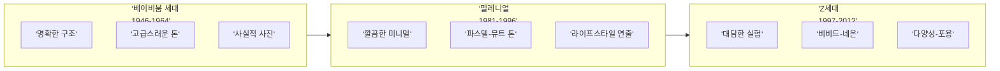

# 타깃 오디언스 분석과 비주얼 공감 설계

> 같은 메시지도 누구에게 보여주느냐에 따라 완전히 다른 이미지가 필요하다

## 개요

AI 이미지를 "잘 만드는 것"을 넘어 **"누구를 위해 만드는가"**를 설계하는 방법을 다룹니다. 색채 심리학, 구도, 시선 유도 기법을 타깃 오디언스에 맞게 조합하는 페르소나 기반 비주얼 전략을 익힙니다. 세대별 시각 언어와 문화적 코드 차이까지 프롬프트에 반영하는 실전 기법을 배웁니다.

## 비주얼 페르소나 — 보는 사람을 먼저 그려라

**비주얼 페르소나**란 타깃 오디언스의 시각적 취향과 감정적 반응 패턴을 정리한 프로필입니다. 일반적 마케팅 페르소나가 인구통계에 집중한다면, 비주얼 페르소나는 **시각적 선호도**를 더합니다.

| 요소 | 질문 | 예시 |
|------|------|------|
| **시각적 취향** | 어떤 스타일에 끌리는가? | 미니멀 vs 맥시멀, 사진 vs 일러스트 |
| **색채 선호** | 어떤 색감이 편안한가? | 뮤트 톤 vs 비비드, 따뜻한 vs 차가운 |
| **감정적 트리거** | 무엇에 공감하는가? | 성취감, 향수, 자유, 안정감 |
| **문화적 코드** | 어떤 상징이 익숙한가? | 지역, 세대, 직업군별 공유 기호 |
| **미디어 습관** | 어디서 이미지를 소비하는가? | 인스타그램, 링크드인, 포스터, 패키지 |


비주얼 페르소나의 핵심 질문은 **"이 사람이 스크롤을 멈추게 하려면?"**입니다. 같은 30대라도 미니멀리스트와 맥시멀리스트의 시각적 반응은 정반대이기 때문에, 인구통계보다 심리 분석이 더 중요합니다.

페르소나를 정의했다면 바로 프롬프트에 반영합니다. 25세 비건 대학원생 페르소나를 예로 들면:

```
A bright minimalist kitchen, young woman preparing an acai bowl,
muted pink and sage green palette, soft morning light through
sheer curtains, Instagram flat-lay angle, clean and fresh aesthetic
```


## 세대별 시각 언어 — 같은 세상, 다른 눈

세대별 시각 선호도는 성장기에 경험한 **미디어 환경**에 의해 형성됩니다. 각 세대의 비주얼 DNA를 이해하면 프롬프트 전략이 완전히 달라집니다.



**베이비붐 세대** — 네이비, 버건디, 골드 등 격식 있는 톤. 안정적 수평/대칭 구도, 사실적 사진 스타일.

```
Elegant business lounge, navy leather armchairs, golden hour
lighting, symmetrical composition, professional photography,
warm sophisticated atmosphere
```


**밀레니얼** — 뮤트 톤, 파스텔, 미니멀한 네거티브 스페이스, 라이프스타일 연출.

```
Minimalist cafe interior, muted pink and sage green palette,
single latte art on marble table, soft natural light, Instagram
aesthetic, clean composition
```


**Z세대** — 비비드, 네온, 그래디언트. 비대칭, 다이내믹한 앵글. Y2K 레트로, 콜라주, 3D 렌더.

```
Vibrant street art mural, neon pink and electric blue gradient,
diverse group of friends, dynamic diagonal composition, TikTok
aesthetic, bold and energetic
```


Z세대의 핵심은 화려함이 아니라 **진정성(Authenticity)**입니다. 과도한 연출보다 날것의 자연스러움이 더 공감을 얻습니다:

```
Candid moment at a rooftop gathering, unposed laughter between
friends, golden hour backlighting, slightly grainy film texture,
raw authentic atmosphere, shot on 35mm aesthetic
```

## 문화적 코드 — 색 하나가 국경을 넘으면 의미가 바뀐다

문화적 코드는 특정 집단이 공유하는 **시각적 상징 체계**입니다. 이를 무시하면 의도와 정반대의 감정을 유발할 수 있습니다.

| 시각 요소 | 문화적 차이 예시 | 프롬프트 주의사항 |
|-----------|-----------------|------------------|
| **색채** | 빨강: 중국 = 행운 / 서양 = 위험 | 타깃 문화권의 색채 의미 확인 |
| **손 제스처** | OK 사인: 미국 = 긍정 / 브라질 = 모욕 | 인물 포즈 지정 시 문화 확인 |
| **공간 배치** | 동아시아: 조화/균형 / 서양: 개인 강조 | 구도 설계 시 집단-개인 비율 조정 |
| **숫자/패턴** | 4: 한중일 = 불길 / 서양 = 중립 | 반복 요소 개수 의식적 선택 |
| **동물 상징** | 올빼미: 서양 = 지혜 / 한국 = 불길 | 마스코트/캐릭터 설계 시 주의 |

같은 "럭셔리 뷰티" 이미지도 문화권별로 전략이 달라집니다:

```
Korean beauty aesthetic, glass skin, soft dewy makeup, cherry
blossom pink accents, clean white background, K-beauty minimalism
```

```
Luxurious Middle Eastern beauty campaign, rich gold and deep
emerald green palette, ornate geometric patterns, warm amber
lighting, sophisticated and opulent atmosphere
```

```
Scandinavian clean beauty, natural organic feel, muted earth
tones, birch wood elements, crisp winter light, lagom minimalist
composition
```


## 공감 트리거 설계 — 마음을 움직이는 시각적 장치

공감 트리거란 이미지를 보는 순간 "이건 나의 이야기다"라는 감정적 연결을 만드는 장치입니다. 세 가지 축으로 구성됩니다.

**1. 표정과 시선** — 거울 뉴런 시스템에 의해 타인의 표정을 보면 무의식적으로 같은 감정을 느낍니다. 눈 맞춤은 연결감을, 시선 방향은 시선 유도를, 미세한 비대칭 표정은 진정성을 전달합니다.

```
Portrait of a woman with genuine warm smile, slight asymmetry
in expression, eyes directly looking at viewer, natural laugh
lines, authentic unposed moment, soft window light
```

**2. 상황과 맥락** — 타깃이 일상에서 겪는 상황을 담으면 "이 브랜드가 나를 이해한다"는 느낌을 줍니다.

```
Young freelancer working at a cozy cafe, laptop with stickers,
warm afternoon light, focused expression, iced americano beside
the keyboard, candid and natural atmosphere
```


**3. 환경과 소품** — 사소한 소품이 소속감을 만듭니다. Z세대에게는 에어팟과 스티커 노트북, 밀레니얼에게는 플랜트 인테리어, 시니어에게는 가죽 다이어리와 만년필.

```
Retired professor reading in a warm study, leather journal and
fountain pen on oak desk, afternoon sunlight through wooden
blinds, cup of tea, serene and nostalgic atmosphere
```

## 페르소나 기반 프롬프트 전략 — 모든 것을 조합하기

6요소 프레임워크를 페르소나에 맞게 커스터마이징합니다:

| 6요소 | Z세대 예시 | 시니어 예시 |
|-------|-----------|-----------|
| **주제** | 축제에서 춤추는 친구들 | 호수가 내려다보이는 테라스 |
| **스타일** | Y2K, 글리치, 콜라주 | 클래식 유화, 사진 리얼리즘 |
| **구도** | 다이내믹 대각선, 클로즈업 | 안정적 수평선, 와이드샷 |
| **조명** | 네온, 컬러 젤 조명 | 골든아워, 부드러운 자연광 |
| **매체** | 세로 9:16 (숏폼) | 가로 16:9 (TV/태블릿) |
| **분위기** | energetic, raw, authentic | serene, warm, nostalgic |

## 실습: 페르소나 비교 프롬프트 설계

다음 시나리오에 대해 두 페르소나별 프롬프트를 각각 설계해보세요.

**시나리오**: "건강한 아침 식사" 캠페인 이미지

- **페르소나 A**: 25세 대학원생, 인스타그램 헤비유저, 비건 관심
- **페르소나 B**: 55세 은퇴 교사, TV 위주 미디어, 전통 한식 선호

각 페르소나에 대해 색채 팔레트(60-30-10 비율), 구도와 앵글, 공감 트리거(상황/소품/표정)를 결정하고 최종 프롬프트를 작성합니다.

페르소나 A 예시:

```
Bright overhead flat-lay of a colorful acai bowl, avocado toast
on ceramic plate, fresh berries and edible flowers, white marble
surface, soft pastel pink and mint accents, clean Instagram
aesthetic, natural morning light, vertical 9:16 composition
```


페르소나 B 예시:

```
Traditional Korean breakfast table, steaming rice and doenjang
jigae, neatly arranged banchan in ceramic bowls, warm wooden
table, soft golden morning light from hanok window, wide angle
horizontal composition, warm and homely atmosphere
```


## 팁과 주의사항

- 프롬프트에 타깃 오디언스를 직접 명시하면 결과가 달라집니다. `"coffee shop poster"`가 아니라 `"coffee shop poster targeting college students, youthful and trendy atmosphere"`처럼 타깃을 포함하세요.
- 넷플릭스는 같은 영화에 대해 사용자 프로필별로 다른 썸네일을 보여줍니다. 로맨스 시청자에게는 커플 장면을, 액션 시청자에게는 격투 장면을 — 이것이 페르소나 기반 비주얼 전략의 실전 사례입니다.
- "Z세대는 무조건 화려하다"는 편견에 주의하세요. 실제로는 진정성이 핵심이며, `"candid, unposed, raw authentic"` 키워드가 더 효과적인 경우가 많습니다.
- 타깃 분석은 마케팅팀만의 일이 아닙니다. AI 이미지 생성에서 프롬프트를 작성하는 사람이 곧 크리에이티브 디렉터이며, 6요소 프레임워크의 모든 결정이 오디언스에 의해 좌우됩니다.
- 문화적 코드를 무시한 글로벌 이미지는 역효과를 낳습니다. 항상 타깃 문화권의 색채/상징 의미를 사전에 확인하세요.

## 핵심 정리

| 개념 | 설명 |
|------|------|
| **비주얼 페르소나** | 타깃의 시각적 취향, 감정 트리거, 문화 코드를 통합한 프로필 |
| **세대별 시각 언어** | 각 세대가 성장기 미디어 환경에 의해 형성한 고유한 시각적 선호 체계 |
| **문화적 코드** | 특정 문화권이 공유하는 시각적 상징 체계. 같은 색/제스처도 문화마다 의미가 다름 |
| **공감 트리거** | 표정, 상황, 환경 소품을 통해 감정 연결을 만드는 장치 |
| **페르소나 기반 프롬프트** | 6요소 프레임워크를 타깃 페르소나에 맞게 커스터마이징하는 통합 전략 |

## 다음 섹션 미리보기

다음 섹션 [감정 전달 실전 — 동일 장면, 다른 감정](11-ch11-시각적-스토리텔링과-감정-전달/05-05-감정-전달-실전-동일-장면-다른-감정.md)에서는 이 모든 기법을 종합하여 **하나의 동일한 장면을 완전히 다른 감정으로 변환하는 실전 프로젝트**에 도전합니다.
