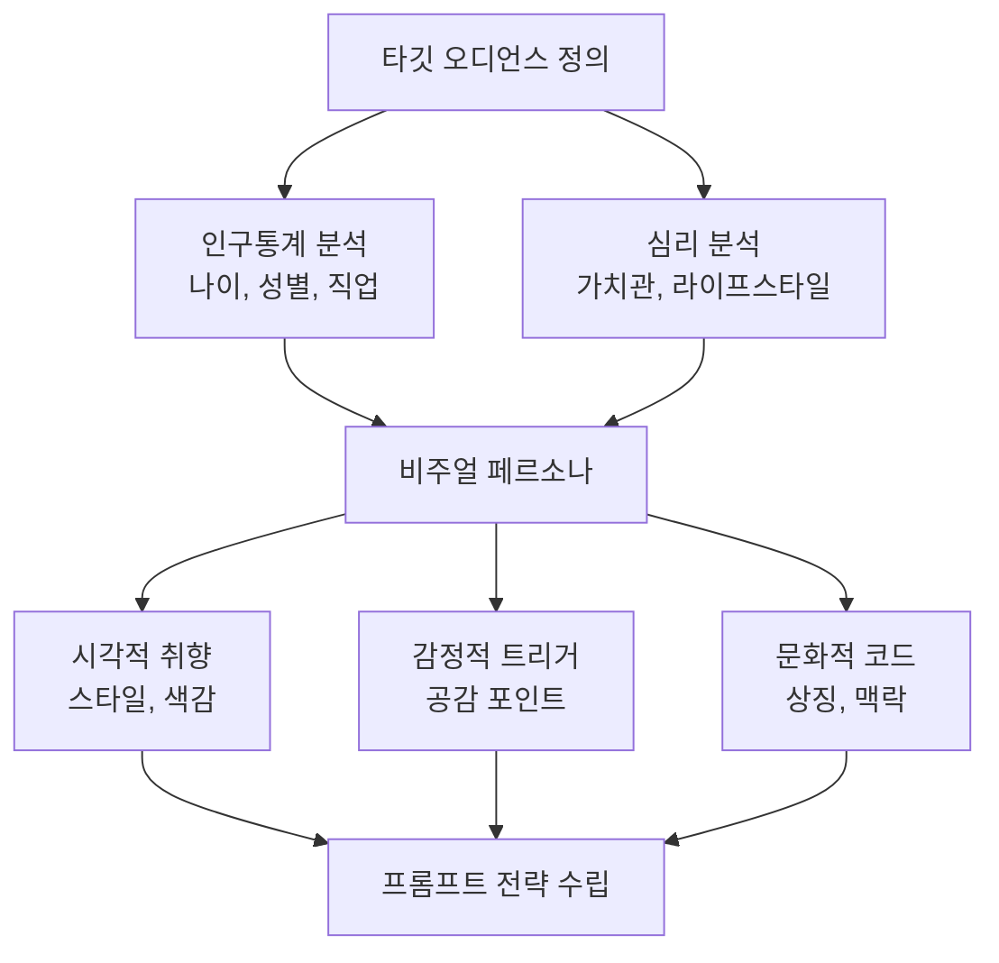
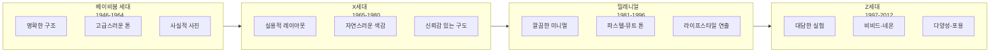
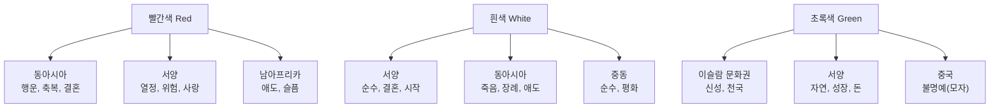
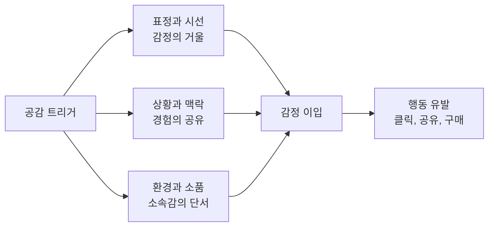
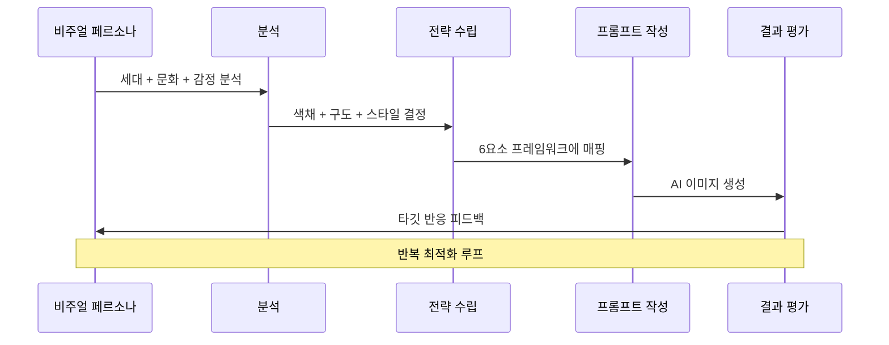

# 타깃 오디언스 분석과 비주얼 공감 설계

> 같은 메시지도 누구에게 보여주느냐에 따라 완전히 다른 이미지가 필요하다 — 페르소나 기반 비주얼 전략의 모든 것

## 개요

이 섹션에서는 AI 이미지를 "잘 만드는 것"을 넘어, **"누구를 위해 만드는가"**를 설계하는 방법을 배웁니다. 지금까지 배운 색채 심리학, 구도, 시선 유도 기법을 타깃 오디언스에 맞게 조합하는 전략을 익힙니다.

**선수 지식**: [색채 심리학과 감정 팔레트](11-ch11-시각적-스토리텔링과-감정-전달/02-02-색채-심리학과-감정-팔레트.md)에서 배운 감정별 색채 전략, [구도와 시선 유도로 메시지 강화](11-ch11-시각적-스토리텔링과-감정-전달/03-03-구도와-시선-유도로-메시지-강화.md)에서 익힌 구도 키워드

**학습 목표**:
- 타깃 오디언스의 심리·세대·문화적 특성을 분석하고 페르소나를 구축할 수 있다
- 페르소나별로 색채, 구도, 스타일을 차별화하는 비주얼 전략을 수립할 수 있다
- 문화적 코드와 세대별 시각 언어의 차이를 이해하고 프롬프트에 반영할 수 있다
- 공감을 이끌어내는 이미지 요소(표정, 상황, 환경)를 의도적으로 설계할 수 있다

## 왜 알아야 할까?

여러분이 카페 홍보 이미지를 만든다고 상상해보세요. 20대 대학생을 위한 이미지와 50대 비즈니스맨을 위한 이미지가 같을 수 있을까요? 절대 아닙니다. 20대에게는 트렌디한 라떼아트와 아늑한 인테리어가, 50대에게는 고급스러운 원두와 조용한 독서 공간이 더 마음을 끌겠죠.

AI 이미지 생성이 아무리 뛰어나도, **"누구를 위한 이미지인가"**를 모르면 아름답지만 아무도 반응하지 않는 이미지가 됩니다. 실제로 마케팅 업계에서는 타깃이 명확한 비주얼이 비타깃 비주얼 대비 2~3배 높은 참여율을 보인다고 알려져 있습니다.

[시각적 스토리텔링의 원리](11-ch11-시각적-스토리텔링과-감정-전달/01-01-시각적-스토리텔링의-원리.md)에서 배운 내러티브 4요소(인물, 환경, 갈등, 감정)를 **누구의 관점에서** 설계하느냐가 바로 이 섹션의 핵심입니다.

## 핵심 개념

### 개념 1: 비주얼 페르소나 — 보는 사람을 먼저 그려라

> 💡 **비유**: 선물을 고를 때를 떠올려보세요. 같은 "생일 선물"이라도 5살 조카에게는 장난감을, 70세 할머니에게는 건강식품을 고르죠. 포장지 색깔도, 리본 스타일도 달라집니다. AI 이미지 생성도 똑같습니다 — 받는 사람(오디언스)을 먼저 알아야 어떤 "포장"을 해야 하는지 결정할 수 있거든요.

**비주얼 페르소나**란 타깃 오디언스의 시각적 취향과 감정적 반응 패턴을 정리한 프로필입니다. 일반적인 마케팅 페르소나가 "30대 직장인 김민수"처럼 인구통계 정보에 집중한다면, 비주얼 페르소나는 여기에 **시각적 선호도**를 더합니다.

비주얼 페르소나를 구성하는 핵심 요소는 다음과 같습니다:

| 요소 | 질문 | 예시 |
|------|------|------|
| **시각적 취향** | 어떤 스타일에 끌리는가? | 미니멀 vs 맥시멀, 사진 vs 일러스트 |
| **색채 선호** | 어떤 색감이 편안한가? | 뮤트 톤 vs 비비드, 따뜻한 vs 차가운 |
| **감정적 트리거** | 무엇에 공감하는가? | 성취감, 향수, 자유, 안정감 |
| **문화적 코드** | 어떤 상징이 익숙한가? | 지역, 세대, 직업군별 공유 기호 |
| **미디어 습관** | 어디서 이미지를 소비하는가? | 인스타그램, 링크드인, 포스터, 패키지 |

> 📊 **그림 1**: 비주얼 페르소나 구축 프로세스

비주얼 페르소나를 만들 때 가장 중요한 건 **"이 사람이 스크롤을 멈추게 하려면?"**이라는 질문입니다. 인구통계보다 심리 분석(Psychographics)이 더 중요한 이유가 바로 여기에 있죠. 같은 30대라도 미니멀리스트와 맥시멀리스트의 시각적 반응은 정반대니까요.

#### 비주얼 페르소나 작성 실습

아래 템플릿을 채워 여러분만의 비주얼 페르소나를 만들어보세요:

| 항목 | 내용 |
|------|------|
| **이름** | (가상 이름) |
| **나이/직업** | |
| **좋아하는 브랜드 3개** | |
| **자주 보는 SNS** | |
| **선호 이미지 스타일** | (사진/일러스트/3D/콜라주 등) |
| **끌리는 색감** | (따뜻한/차가운/뮤트/비비드) |
| **공감 키워드 3개** | (예: 자유, 성장, 연결) |
| **거부감 키워드 3개** | (예: 강요, 복잡함, 진부함) |

### 개념 2: 세대별 시각 언어 — 같은 세상, 다른 눈

> 💡 **비유**: 같은 한국어를 쓰더라도 10대의 "ㅋㅋ"와 60대의 "ㅎㅎ"가 다르듯, 각 세대는 고유한 **시각 언어**를 갖고 있습니다. 이모지 하나도 세대마다 해석이 다르잖아요 — 👍을 진심으로 쓰는 세대와 비꼼으로 쓰는 세대가 있듯이요.

세대별 시각 선호도는 그 세대가 성장기에 경험한 **미디어 환경**에 의해 형성됩니다. 각 세대의 비주얼 DNA를 이해하면, 프롬프트 전략이 완전히 달라집니다.

> 📊 **그림 2**: 세대별 시각 선호도 스펙트럼

각 세대별로 AI 이미지 프롬프트 전략이 어떻게 달라지는지 구체적으로 살펴보겠습니다:

**베이비붐 세대 (1946~1964)**
- **색채**: 네이비, 버건디, 골드 등 격식 있는 톤. [색채 심리학과 감정 팔레트](11-ch11-시각적-스토리텔링과-감정-전달/02-02-색채-심리학과-감정-팔레트.md)에서 배운 60-30-10 법칙 중 주색을 클래식 컬러로
- **구도**: 안정적인 수평·대칭 구도, 넉넉한 여백
- **스타일**: 사실적 사진 스타일, 고화질의 선명한 이미지
- **프롬프트 예시**: `"elegant business lounge, navy leather armchairs, golden hour lighting, symmetrical composition, professional photography, warm sophisticated atmosphere"`

**밀레니얼 (1981~1996)**
- **색채**: 뮤트 톤, 파스텔, "인스타그래머블"한 따뜻한 색감
- **구도**: 미니멀한 네거티브 스페이스, 라이프스타일 연출
- **스타일**: 깔끔하고 세련된 플랫 디자인 느낌의 사진
- **프롬프트 예시**: `"minimalist café interior, muted pink and sage green palette, single latte art on marble table, soft natural light, Instagram aesthetic, clean composition"`

**Z세대 (1997~2012)**
- **색채**: 비비드, 네온, 그래디언트. 채도 높은 대비
- **구도**: 비대칭, 의도적인 불완전함, 다이내믹한 앵글
- **스타일**: Y2K 레트로, 콜라주, 3D 렌더, 글리치 아트
- **프롬프트 예시**: `"vibrant street art mural, neon pink and electric blue gradient, diverse group of friends, dynamic diagonal composition, TikTok aesthetic, bold and energetic"`

> ⚠️ **흔한 오해**: "Z세대는 무조건 화려한 걸 좋아한다"는 편견이 있는데, 실제로는 **진정성(Authenticity)**이 핵심입니다. 과도하게 연출된 "인스타감성"보다 날것의 자연스러움이 더 공감을 얻는 경우가 많아요. "Candid moment, unposed, raw authentic" 같은 키워드가 오히려 효과적입니다.

### 개념 3: 문화적 코드 읽기 — 색 하나가 국경을 넘으면 의미가 바뀐다

> 💡 **비유**: 고개를 끄덕이면 대부분의 나라에서 "예"라는 뜻이지만, 불가리아에서는 "아니오"를 의미합니다. 시각적 언어도 마찬가지예요. 빨간색 하나도 중국에서는 축복, 서양에서는 위험이나 열정, 남아공에서는 애도의 의미를 가지거든요.

문화적 코드는 특정 집단이 공유하는 **시각적 상징 체계**입니다. AI 이미지를 생성할 때 문화적 코드를 무시하면 의도와 정반대의 감정을 유발할 수 있습니다.

> 📊 **그림 3**: 문화권별 색채 의미 차이

문화적 코드는 색채에만 국한되지 않습니다. 주요 시각적 문화 코드를 정리하면:

| 시각 요소 | 문화적 차이 예시 | 프롬프트 주의사항 |
|-----------|-----------------|------------------|
| **색채** | 빨강: 중국 = 행운 / 서양 = 위험 | 타깃 문화권의 색채 의미 확인 |
| **손 제스처** | 👌: 미국 = OK / 브라질 = 모욕 | 인물 포즈 지정 시 문화 확인 |
| **공간 배치** | 동아시아: 조화·균형 / 서양: 개인 강조 | 구도 설계 시 집단-개인 비율 조정 |
| **숫자·패턴** | 4: 한중일 = 불길 / 서양 = 중립 | 반복 요소 개수 의식적 선택 |
| **동물 상징** | 올빼미: 서양 = 지혜 / 한국 = 불길 | 마스코트·캐릭터 설계 시 주의 |

#### 문화 코드 적용 사례

**같은 "럭셔리 뷰티" 이미지, 다른 문화 전략**:

- **한국 시장**: `"Korean beauty aesthetic, glass skin, soft dewy makeup, cherry blossom pink accents, clean white background, elegant Hangul typography space, K-beauty minimalism"`
- **중동 시장**: `"luxurious beauty campaign, rich gold and deep emerald green palette, ornate geometric patterns, warm amber lighting, sophisticated and opulent atmosphere"`
- **북유럽 시장**: `"Scandinavian clean beauty, natural and organic feel, muted earth tones, birch wood elements, crisp winter light, lagom minimalist composition"`

> 💡 **알고 계셨나요?**: 맥도날드는 전 세계 매장에서 동일한 빨간색과 노란색 로고를 쓰지만, 각 나라의 웹사이트와 광고 비주얼은 완전히 다릅니다. 스웨덴 사이트는 초록색과 흰색을 강조해 건강하고 친환경적인 이미지를, 인도 사이트는 노란색과 빨간색을 더 선명하게 써서 행복과 용기의 감정을 전달합니다. 글로벌 브랜드조차 문화적 코드에 맞춘 비주얼 전략을 구사하는 거죠.

### 개념 4: 공감 트리거 설계 — 마음을 움직이는 시각적 장치

> 💡 **비유**: 길을 걷다가 강아지 사진이 있는 유기동물 입양 포스터를 보면 발걸음이 멈추죠. 그런데 같은 메시지를 통계 숫자만 가득한 표로 전달하면? 그냥 지나치게 됩니다. 사람은 **감정**에 먼저 반응하고, 그 다음에 **논리**로 정당화하는 존재거든요.

공감 트리거(Empathy Trigger)란 이미지를 보는 순간 "이건 나의 이야기다"라는 감정적 연결을 만드는 시각적 장치입니다. 핵심은 세 가지입니다:

> 📊 **그림 4**: 공감 트리거의 3대 축

**1. 표정과 시선 — 감정의 거울**

인간은 타인의 표정을 보면 무의식적으로 같은 감정을 느끼는 **거울 뉴런(Mirror Neuron)** 시스템을 가지고 있습니다. AI 이미지에서 인물의 표정은 가장 강력한 공감 트리거죠.

- **눈 맞춤(Eye Contact)**: 인물이 카메라를 정면으로 바라보면 "나에게 말하고 있다"는 연결감
- **시선 방향**: 인물이 제품이나 텍스트 쪽을 바라보면 자연스러운 시선 유도
- **미세 표정**: 완벽한 미소보다 살짝 비대칭적인 자연스러운 표정이 진정성 전달

프롬프트 예시: `"genuine warm smile with slight asymmetry, eyes directly looking at viewer, natural laugh lines, authentic unposed expression"`

**2. 상황과 맥락 — 경험의 공유**

타깃 오디언스가 일상에서 겪는 상황을 이미지에 담으면 "이 브랜드가 나를 이해한다"는 느낌을 줍니다.

- **육아맘 타깃**: 아이와 함께하는 혼란스럽지만 행복한 아침 장면
- **프리랜서 타깃**: 카페에서 노트북으로 작업하는 집중의 순간
- **은퇴 시니어 타깃**: 손주와 함께 정원을 가꾸는 여유로운 오후

**3. 환경과 소품 — 소속감의 단서**

배경에 놓인 사소한 소품이 "이건 내 세계의 이미지"라는 소속감을 만듭니다.

- Z세대: 에어팟, 스마트폰, 스티커로 꾸민 노트북
- 밀레니얼: 플랜트 인테리어, 수제 커피, 미니멀 데스크
- 베이비붐: 가죽 다이어리, 만년필, 정돈된 서재

### 개념 5: 페르소나 기반 프롬프트 전략 — 모든 것을 조합하기

지금까지 배운 비주얼 페르소나, 세대별 시각 언어, 문화적 코드, 공감 트리거를 하나의 프롬프트로 통합하는 프레임워크입니다.

> 📊 **그림 5**: 페르소나 기반 프롬프트 조합 프레임워크

[프롬프트 해부학 — 6요소 프레임워크](02-ch2-프롬프트-구조-마스터/01-01-프롬프트-해부학-6요소-프레임워크.md)에서 배운 6요소(주제, 스타일, 구도, 조명, 매체, 분위기)를 페르소나에 맞게 커스터마이징하는 방법을 정리하면:

| 6요소 | 페르소나 반영 포인트 | Z세대 예시 | 시니어 예시 |
|-------|---------------------|-----------|-----------|
| **주제** | 타깃이 공감하는 상황 | 축제에서 춤추는 친구들 | 호수가 내려다보이는 테라스 |
| **스타일** | 세대별 미학 코드 | Y2K, 글리치, 콜라주 | 클래식 유화, 사진 리얼리즘 |
| **구도** | 시각적 긴장도 수준 | 다이내믹 대각선, 클로즈업 | 안정적 수평선, 와이드샷 |
| **조명** | 감정적 온도 | 네온, 컬러 젤 조명 | 골든아워, 부드러운 자연광 |
| **매체** | 소비 플랫폼 매칭 | 세로 9:16 (숏폼) | 가로 16:9 (TV/태블릿) |
| **분위기** | 공감 트리거 키워드 | energetic, raw, authentic | serene, warm, nostalgic |

## 실습: 적용해보기

### 활동 1: 페르소나 비교 프롬프트 설계

다음 가상 시나리오를 읽고, 두 개의 서로 다른 비주얼 페르소나에 맞는 이미지 프롬프트를 각각 설계해보세요.

**시나리오**: "건강한 아침 식사" 캠페인 이미지

**페르소나 A**: 25세 대학원생, 인스타그램 헤비유저, 비건 관심, K-pop 팬, 서울 거주
**페르소나 B**: 55세 은퇴 교사, 신문과 TV 위주 미디어, 전통 한식 선호, 제주도 거주

각 페르소나에 대해:
1. 어떤 **색채 팔레트**를 선택할 것인가? (60-30-10 비율 포함)
2. 어떤 **구도와 앵글**이 효과적일까?
3. 어떤 **공감 트리거**(상황, 소품, 표정)를 넣을 것인가?
4. 최종 프롬프트를 작성해보세요.

### 활동 2: 문화 코드 분석 워크시트

아래 글로벌 브랜드의 지역별 광고 비주얼 차이를 분석해보세요:

| 분석 항목 | 한국 버전 | 미국 버전 | 차이의 이유 |
|-----------|----------|----------|------------|
| **주요 색채** | | | |
| **인물 표정/포즈** | | | |
| **배경 환경** | | | |
| **여백 활용** | | | |
| **감정 톤** | | | |

실제 좋아하는 글로벌 브랜드(나이키, 애플, 삼성 등)의 웹사이트를 한국판과 미국판으로 열어 비교해보면 훨씬 실감나는 분석이 됩니다.

### 토론 질문

1. "AI가 문화적 뉘앙스를 이해할 수 있는가?" — AI 이미지 생성 도구가 문화적 코드를 잘 반영하는 경우와 실패하는 경우를 각각 생각해보세요.
2. 여러분의 작업에서 가장 자주 만나는 타깃 오디언스는 누구인가요? 그 오디언스만의 "시각적 킬러 요소"는 무엇일까요?

## 더 깊이 알아보기

### 시각적 공감의 과학 — 거울 뉴런의 발견

1990년대 이탈리아 파르마 대학교의 신경과학자 자코모 리졸라티(Giacomo Rizzolatti) 연구팀은 원숭이 뇌를 연구하던 중 놀라운 발견을 합니다. 원숭이가 직접 땅콩을 집을 때 활성화되는 뇌 영역이, 다른 원숭이가 땅콩을 집는 것을 **볼 때도** 동일하게 활성화된 것이죠. 이것이 바로 **거울 뉴런(Mirror Neuron)**의 발견이었습니다.

이 발견은 시각 커뮤니케이션에 혁명적 시사점을 제공했습니다. 우리가 광고 속 인물의 표정을 보고 감정을 느끼는 것, 영화 속 위험한 장면에서 심장이 빨라지는 것 — 이 모든 것이 거울 뉴런 시스템 덕분이었던 겁니다.

이 원리를 AI 이미지 생성에 적용하면, **인물의 표정과 신체 언어를 프롬프트에서 구체적으로 지시하는 것**이 단순한 미학적 선택이 아니라 **과학적 공감 설계**가 됩니다. "happy woman"보다 "woman with genuine crinkled-eye smile, relaxed shoulders, leaning slightly forward as if sharing a secret"이 훨씬 강력한 공감을 만드는 이유가 바로 여기에 있습니다.

### 디자인 교육의 변화 — AI 시대의 시각적 리터러시

2023년 Wiley 학술지에 실린 연구 *"Graphic Design Education in the Era of Text-to-Image Generation"*에서는 AI 이미지 생성 도구의 등장이 디자인 교육을 근본적으로 바꾸고 있다고 분석합니다. 기존에는 "어떻게 만들 것인가"(How)가 핵심이었다면, 이제는 **"왜, 누구를 위해 만들 것인가"(Why & For Whom)**가 더 중요한 역량이 되었다는 것이죠. 기술적 도구 활용 능력보다 **크리에이티브 디렉션과 오디언스 분석 능력**이 디자이너의 핵심 경쟁력이 된 시대입니다.

## 흔한 오해와 팁

> ⚠️ **흔한 오해**: "타깃 오디언스 분석은 마케팅팀의 일이지, 디자이너/크리에이터의 일이 아니다." 
> 사실은 정반대입니다. AI 이미지 생성에서 프롬프트를 작성하는 사람이 곧 크리에이티브 디렉터입니다. [프롬프트 해부학 — 6요소 프레임워크](02-ch2-프롬프트-구조-마스터/01-01-프롬프트-해부학-6요소-프레임워크.md)의 모든 요소가 오디언스에 의해 결정되기 때문에, 프롬프트 작성자가 타깃을 모르면 좋은 결과물이 나올 수 없습니다.

> 💡 **알고 계셨나요?**: 넷플릭스는 같은 영화에 대해 사용자 프로필별로 **다른 썸네일 이미지**를 보여줍니다. 로맨스 영화를 많이 본 사용자에게는 커플 장면을, 액션을 좋아하는 사용자에게는 격투 장면을 썸네일로 보여주는 거죠. 이것이 바로 페르소나 기반 비주얼 전략의 실전 사례입니다.

> 🔥 **실무 팁**: 프롬프트에 타깃 오디언스를 직접 명시하면 AI의 결과물이 달라집니다. 단순히 `"coffee shop poster"`가 아니라, `"coffee shop poster targeting college students, youthful and trendy atmosphere"`처럼 타깃을 포함하세요. 특히 ChatGPT에서 대화형으로 이미지를 생성할 때, "이 이미지의 타깃은 20대 여성 직장인입니다"라고 맥락을 먼저 설정하면 훨씬 적절한 결과를 얻을 수 있습니다.

## 핵심 정리

| 개념 | 설명 |
|------|------|
| **비주얼 페르소나** | 타깃의 시각적 취향, 감정 트리거, 문화 코드를 통합한 프로필 |
| **세대별 시각 언어** | 각 세대가 성장기 미디어 환경에 의해 형성한 고유한 시각적 선호 체계 |
| **문화적 코드** | 특정 문화권이 공유하는 시각적 상징 체계. 같은 색·제스처도 문화마다 의미가 다름 |
| **공감 트리거** | 표정, 상황, 환경 소품을 통해 "이건 나의 이야기"라는 감정 연결을 만드는 장치 |
| **페르소나 기반 프롬프트** | 6요소 프레임워크를 타깃 페르소나에 맞게 커스터마이징하는 통합 전략 |
| **심리 분석(Psychographics)** | 인구통계보다 중요한, 가치관·라이프스타일 기반 오디언스 분석법 |

## 다음 섹션 미리보기

지금까지 시각적 스토리텔링의 원리, 색채, 구도, 그리고 오디언스 분석까지 배웠습니다. 다음 섹션 [감정 전달 실전 — 동일 장면, 다른 감정](11-ch11-시각적-스토리텔링과-감정-전달/05-05-감정-전달-실전-동일-장면-다른-감정.md)에서는 이 모든 기법을 종합하여 **하나의 동일한 장면을 완전히 다른 감정으로 변환하는 실전 프로젝트**에 도전합니다. 같은 카페, 같은 인물이라도 프롬프트 전략에 따라 "따뜻한 위로"가 되기도 하고 "쓸쓸한 고독"이 되기도 하는 — AI 이미지 생성의 진정한 표현력을 체험하게 됩니다.

## 참고 자료

- [Graphic Design Education in the Era of Text-to-Image Generation (Wiley)](https://onlinelibrary.wiley.com/doi/full/10.1111/jade.12558) - AI 시대 디자인 교육의 변화와 크리에이티브 디렉션 역량의 중요성을 분석한 학술 논문
- [Generational Design Strategies to Engage Boomers, Gen X, Millennials, and Gen Z (Sprak Design)](https://www.sprakdesign.com/generational-design-strategies/) - 세대별 디자인 선호도와 참여 전략을 정리한 실무 가이드
- [Cultural Color Psychology & Meaning (ColorPsychology.org)](https://www.colorpsychology.org/cultural-color-psychology-meaning-and-symbolism/) - 문화권별 색채 심리학과 상징 의미를 종합 정리한 참고 자료
- [Personas – A Simple Introduction (Interaction Design Foundation)](https://ixdf.org/literature/article/personas-why-and-how-you-should-use-them) - 페르소나 설계의 기초 이론과 실전 활용법을 다룬 IxDF 아티클
- [How Color Is Perceived by Different Cultures (Eriksen Translations)](https://eriksen.com/marketing/color_culture/) - 글로벌 마케팅에서 색상의 문화적 해석 차이를 실제 브랜드 사례로 분석

---
### 🔗 Related Sessions
- [내러티브_4요소](11-ch11-시각적-스토리텔링과-감정-전달/01-01-시각적-스토리텔링의-원리.md) (prerequisite)
- [결정적_순간](11-ch11-시각적-스토리텔링과-감정-전달/01-01-시각적-스토리텔링의-원리.md) (prerequisite)
- [감정_팔레트](11-ch11-시각적-스토리텔링과-감정-전달/02-02-색채-심리학과-감정-팔레트.md) (prerequisite)
- [색상_온도](11-ch11-시각적-스토리텔링과-감정-전달/02-02-색채-심리학과-감정-팔레트.md) (prerequisite)
- [채도](11-ch11-시각적-스토리텔링과-감정-전달/02-02-색채-심리학과-감정-팔레트.md) (prerequisite)
- [명도](11-ch11-시각적-스토리텔링과-감정-전달/02-02-색채-심리학과-감정-팔레트.md) (prerequisite)
- [60-30-10_법칙](11-ch11-시각적-스토리텔링과-감정-전달/02-02-색채-심리학과-감정-팔레트.md) (prerequisite)
- [삼등분_법칙](11-ch11-시각적-스토리텔링과-감정-전달/03-03-구도와-시선-유도로-메시지-강화.md) (prerequisite)
- [네거티브_스페이스](11-ch11-시각적-스토리텔링과-감정-전달/03-03-구도와-시선-유도로-메시지-강화.md) (prerequisite)
- [카메라_앵글_감정효과](11-ch11-시각적-스토리텔링과-감정-전달/03-03-구도와-시선-유도로-메시지-강화.md) (prerequisite)
