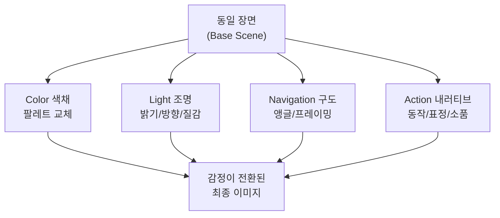
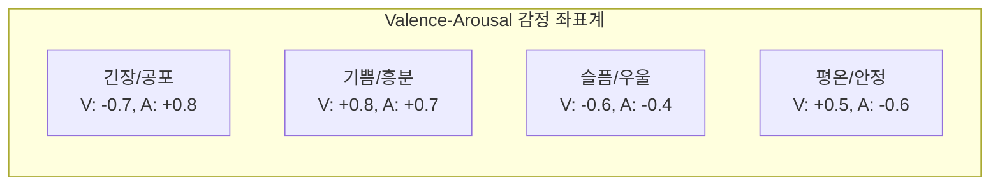
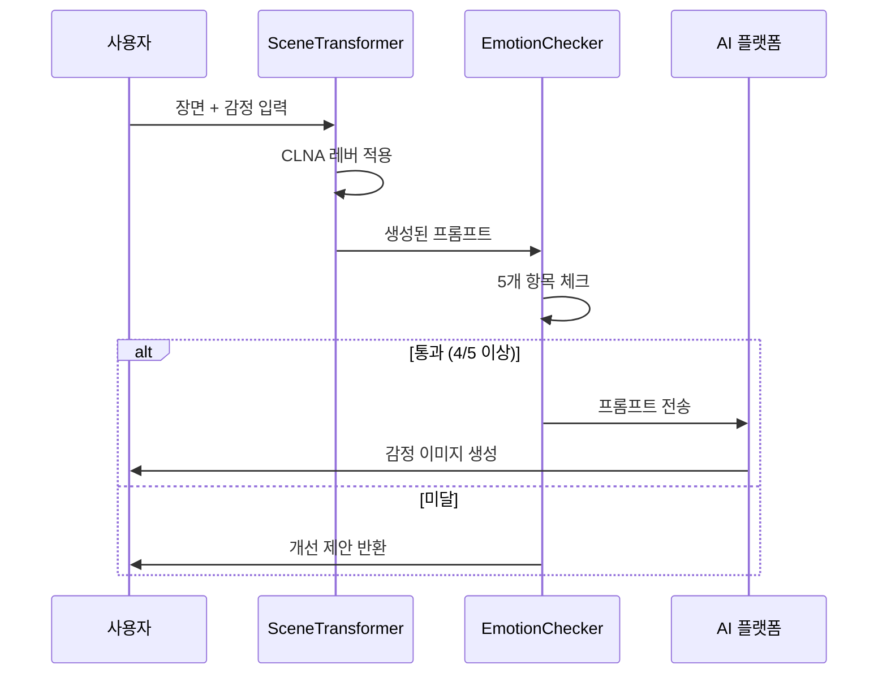

# 감정 전달 실전 — 동일 장면, 다른 감정

> 같은 장면도 프롬프트 하나로 기쁨, 슬픔, 긴장, 평온이 된다

## 개요

이 섹션은 Ch11에서 배운 색채, 조명, 구도, 내러티브 기법을 통합하여 **동일한 장면을 완전히 다른 감정으로 변환**하는 실전 프로젝트입니다. CLNA 프레임워크를 활용해 4가지 감정(기쁨, 슬픔, 긴장, 평온)으로 장면을 재구성하는 프롬프트를 작성하고, 감정 전달력을 검증하는 방법까지 다룹니다.

## CLNA 프레임워크 — 감정 전환의 4대 레버

같은 무대에서 조명, 배경색, 카메라 각도, 배경음악만 바꿔도 관객이 느끼는 감정이 완전히 달라지듯, AI 이미지에서도 4가지 레버를 동시에 조작하면 강력한 감정 전환이 가능합니다.

| 레버 | 약어 | 역할 | 예시 |
|------|------|------|------|
| **Color** (색채) | C | 감정의 온도 결정 | 따뜻한 금빛 vs 차가운 청회색 |
| **Light** (조명) | L | 분위기의 밀도 조절 | 골든아워 vs 흐린 역광 |
| **Navigation** (구도) | N | 시선 방향과 심리적 거리 | 로우앵글 vs 하이앵글 |
| **Action** (내러티브) | A | 이야기 방향 암시 | 뛰어가는 동작 vs 웅크린 자세 |



한두 개만 바꾸면 어정쩡한 결과가 나오지만, 4개를 일관되게 맞추면 완전히 다른 분위기가 만들어집니다.

## 감정별 CLNA 레버 설정

### 기쁨 (Joy)

```
a person standing in a narrow city alley on a rainy day, arms raised,
genuine smile, dynamic movement, wind in hair.
Bright golden hour sunlight, warm rim lighting, soft fill.
Warm golden tones, saturated yellows and oranges, pops of coral.
Shot from slight low angle, rule of thirds with subject in power position,
open framing. Cinematic photography, editorial quality
```


### 슬픔 (Sadness)

```
a person standing in a narrow city alley on a rainy day, hunched shoulders,
downward gaze, stillness, rain drops.
Overcast diffused light, flat grey sky, dim ambient.
Desaturated blue-grey palette, muted tones, cool shadows.
Shot from high angle looking down, off-center with negative space,
closed framing. Cinematic photography, editorial quality
```


### 긴장 (Tension)

```
a person standing in a narrow city alley on a rainy day, clenched fists,
sharp glance over shoulder, frozen mid-motion.
Harsh directional spotlight, deep shadows, flickering light.
High contrast red and black, deep shadows, neon accents.
Shot from dutch angle, tight close-up, leading lines converging on subject.
Cinematic photography, editorial quality
```


### 평온 (Calm)

```
a person standing in a narrow city alley on a rainy day, closed eyes,
gentle breath, hands resting, slow motion feel.
Soft morning light, gentle window light, even diffusion.
Soft pastels, sage green and lavender, low saturation harmony.
Shot from eye-level centered, wide shot with breathing room,
symmetrical balance. Cinematic photography, editorial quality
```


## 기쁨 vs 슬픔 — CLNA 레버 비교

| 레버 | 기쁨 | 슬픔 |
|------|------|------|
| Color | warm golden, saturated yellows/oranges | desaturated blue-grey, muted, cool shadows |
| Light | bright golden hour sunlight, warm rim | overcast diffused, flat grey sky, dim |
| Navigation | slight low angle, open framing | high angle looking down, closed framing |
| Action | arms raised, genuine smile, dynamic | hunched shoulders, downward gaze, stillness |

## Valence-Arousal 감정 좌표계

심리학의 러셀 원형 감정 모델을 활용하면 모든 감정을 **쾌-불쾌(Valence)**와 **각성도(Arousal)** 2축 위의 좌표로 표현할 수 있습니다.



이 좌표를 활용하면 "약간 슬픈" → "매우 슬픈" → "우울한"까지 감정의 강도를 연속적으로 조절하는 프롬프트 설계가 가능합니다.

## 플랫폼별 감정 전환 전략

같은 감정이라도 플랫폼마다 효과적인 접근법이 다릅니다.

| 플랫폼 | 감정 전환 강점 | 추천 전략 |
|--------|--------------|-----------|
| **Midjourney V7** | 미학적 감성 극대화 | 무드를 문장 앞에 배치, `--stylize` 200~750 조절 |
| **ChatGPT** | 대화형 반복 정제 | 첫 생성 후 "더 슬프게", "조명을 어둡게" 단계적 지시 |
| **Gemini** | 스타일 전환 자연스러움 | 추상적 감정보다 구체적 시각 묘사로 접근 |

### 플랫폼별 프롬프트 예시: 카페 창가 장면 — 슬픔

**Midjourney V7** (mood-first 전략):

```
A melancholic scene of a person sitting alone by a cafe window on a rainy
afternoon. Hunched over a cold cup of coffee, distant gaze through
rain-streaked glass. Overcast grey light filtering through, desaturated
blue-grey tones, muted reflections. High angle shot, off-center composition
with empty chair opposite. Cinematic photography --stylize 450
```


**ChatGPT** (대화형 정제):

```
Generate an image of a person sitting alone by a cafe window on a rainy
afternoon. The overall mood should convey deep sadness and loneliness.

Visual direction:
- Character: hunched posture, staring at a cold untouched coffee
- Lighting: overcast grey light through rain-streaked window
- Color palette: desaturated blue-grey, muted cool tones
- Composition: high angle, off-center with empty chair across

Style: Cinematic photography with emotional depth.
```

**Gemini** (구체적 시각 묘사):

```
Create a photograph of a solitary figure at a rain-streaked cafe window.
The person sits hunched, hands wrapped around a cold coffee cup, eyes
unfocused and distant. Grey overcast light washes the scene in cool
blue-grey tones. An empty chair sits across the table. Frame from a
slightly elevated angle with the subject off-center. Muted, desaturated
color palette. Editorial photography style.
```

## 실습: 장면 변환 프로젝트

### 실습 1: 공원 벤치 장면 — 4가지 감정 변환

기본 장면: **"공원 벤치에 앉아 있는 한 사람"**

**기쁨 변환:**

```
A person sitting on a park bench, laughing with head tilted back, autumn
leaves swirling around. Bright golden hour sunlight streaming through
trees, warm amber rim lighting. Saturated warm palette — golden yellows,
burnt orange, coral accents. Low angle shot, rule of thirds, open sky
framing. Cinematic photography, editorial quality
```


**긴장 변환:**

```
A person sitting rigidly on a park bench at night, eyes darting sideways,
hands gripping the seat edge. Single harsh streetlamp casting long sharp
shadows, surrounding darkness. High contrast — cold blue-white light
against pitch black, hints of red from distant neon. Dutch angle, tight
medium shot, converging shadow lines. Cinematic photography
```


### 실습 2: 단일 레버 A/B 테스트

같은 기본 장면에서 **한 가지 레버만** 교체하여 각 레버의 영향력을 비교해 봅시다.

**베이스 (중립):**

```
A person standing at a crosswalk in a city, neutral expression, even
daylight, natural colors, eye-level straight-on shot.
Cinematic photography
```

**Color만 변경 (긴장):**

```
A person standing at a crosswalk in a city, neutral expression, even
daylight, high contrast red and black palette with neon accents,
eye-level straight-on shot. Cinematic photography
```

**Light만 변경 (긴장):**

```
A person standing at a crosswalk in a city, neutral expression, harsh
directional spotlight with deep shadows and flickering light, natural
colors, eye-level straight-on shot. Cinematic photography
```


이 테스트를 통해 보통 **조명(Light)**이 가장 즉각적인 감정 효과를 내고, **색채(Color)**가 가장 지속적인 인상을 남긴다는 것을 확인할 수 있습니다.

## 감정 전달 체크리스트

생성된 프롬프트가 의도한 감정을 제대로 전달하는지 5가지 항목으로 사전 검증합니다.



**체크 항목:**

| 항목 | 기준 | 확인 방법 |
|------|------|-----------|
| 색채 일관성 | 감정에 맞는 색채 키워드 2개 이상 | warm/golden(기쁨), desaturated/grey(슬픔) 등 |
| 조명 설정 | 감정에 맞는 조명 묘사 1개 이상 | sunlight(기쁨), overcast(슬픔), harsh(긴장) 등 |
| 내러티브 요소 | 동작/표정/분위기 묘사 1개 이상 | smile(기쁨), hunched(슬픔), clenched(긴장) 등 |
| 감정 일관성 | 반대 감정 키워드가 섞이지 않음 | 기쁨 프롬프트에 desaturated/dim 없는지 |
| 구도 명시 | 카메라 앵글/구도 지시 포함 | angle, shot, framing, close-up 등 |

## 팁과 주의사항

- **감정 단어 하나로는 부족하다**: "happy scene" 대신 시각적으로 번역된 다중 신호(색채+조명+동작)를 줘야 일관된 감정이 전달됩니다. 시각적 키워드 3개 이상이 감정 형용사 1개보다 더 정확합니다.
- **Midjourney V7은 mood-first**: 무드를 프롬프트 맨 앞에 배치하세요. "A melancholic rainy alley..."로 시작하면 이후 디테일들이 그 감정 맥락 안에서 해석됩니다.
- **A/B 테스트는 레버 하나씩**: 한 번에 하나의 CLNA 레버만 바꿔 비교하면, 해당 장면에서 감정 전환에 가장 큰 영향을 주는 레버를 정확히 파악할 수 있습니다.
- **반대 감정 신호 주의**: 기쁨 프롬프트에 "shadow", "dim" 같은 슬픔 신호가 섞이면 AI가 혼란스러운 결과를 생성합니다. 체크리스트로 모순을 사전에 걸러내세요.
- **ChatGPT는 단계적 접근**: 한 번에 모든 요소를 넣기보다 첫 생성 후 "더 슬프게", "조명을 어둡게" 순차 지시가 효과적입니다.

## 핵심 정리

| 개념 | 설명 |
|------|------|
| CLNA 프레임워크 | Color, Light, Navigation, Action — 감정 전환의 4대 레버 |
| Valence-Arousal 좌표 | 쾌-불쾌(V)와 각성도(A) 2축으로 모든 감정을 좌표화 |
| Mood-first 전략 | Midjourney V7에서 감정/분위기를 프롬프트 맨 앞에 배치 |
| 감정 전달 체크리스트 | 색채, 조명, 내러티브, 일관성, 구도 — 5개 항목 사전 검증 |
| 단일 레버 A/B 테스트 | 한 번에 하나의 레버만 바꿔 감정 영향력 분석 |

## 다음 섹션 미리보기

다음 챕터 [Ch12. 실전 포트폴리오 프로젝트](12-ch12-실전-포트폴리오-프로젝트/01-01-프로젝트-기획-브리프에서-무드보드까지.md)에서는 크리에이티브 브리프 작성부터 무드보드 구성, 브랜드 비주얼 에셋 제작까지 — 실제 포트폴리오에 넣을 수 있는 완성도 높은 프로젝트를 수행합니다. CLNA 프레임워크와 감정 전달 체크리스트가 프로젝트 품질의 핵심 도구가 됩니다.
