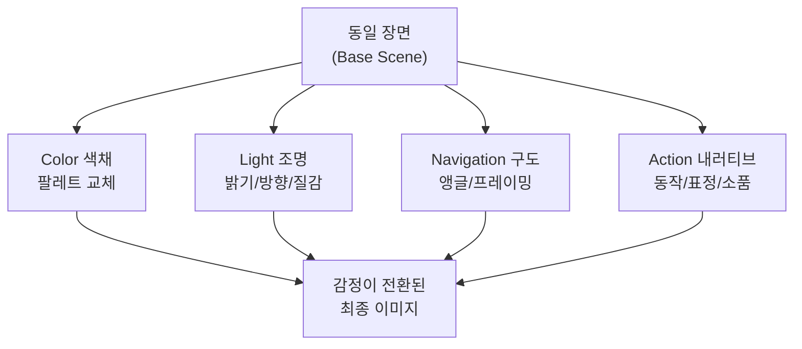
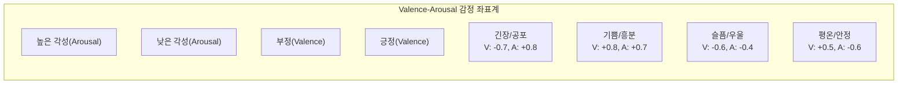
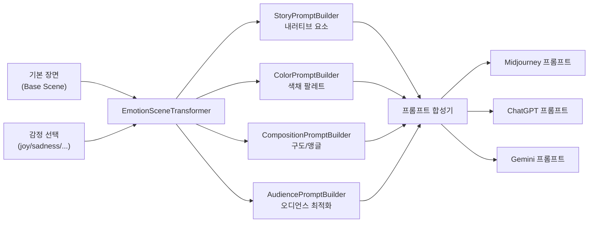
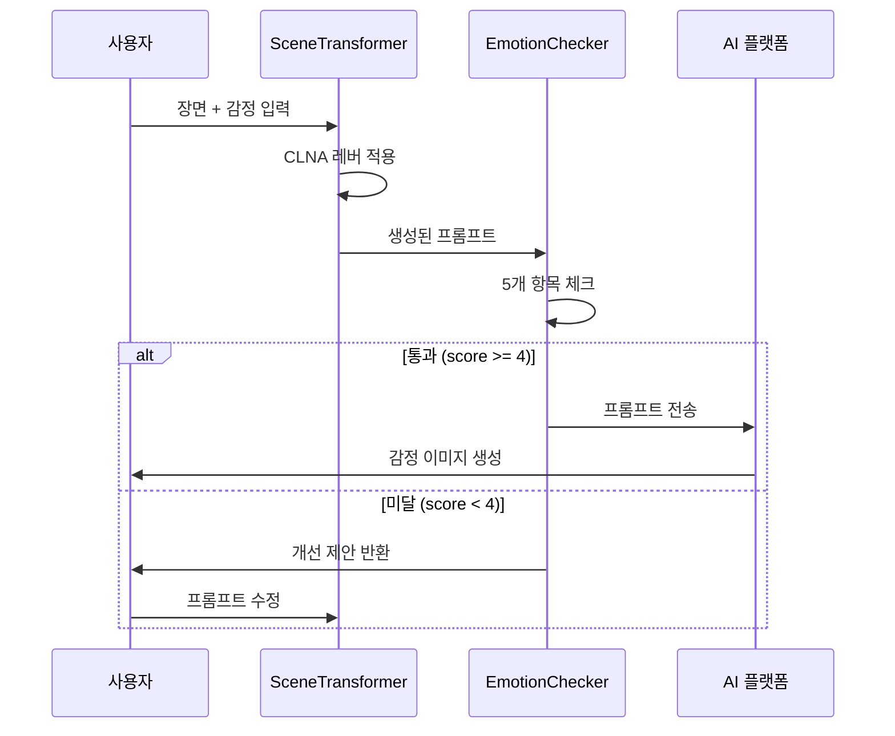
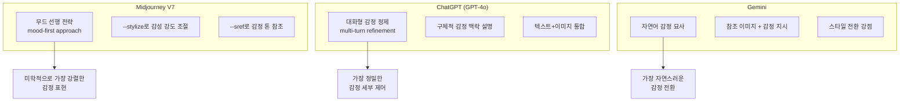

# 감정 전달 실전 — 동일 장면, 다른 감정

> 같은 장면도 프롬프트 하나로 기쁨, 슬픔, 긴장, 평온이 된다 — Ch11 전체 기법을 통합하는 종합 실전 프로젝트

## 개요

이 섹션은 Ch11에서 배운 모든 기법을 하나로 엮는 **그랜드 피날레**입니다. 시각적 스토리텔링, 색채 심리학, 구도와 시선 유도, 타깃 오디언스 분석 — 이 네 가지 축을 동시에 조작하여 "똑같은 장면"을 완전히 다른 감정으로 변환하는 실전 프로젝트를 진행합니다.

**선수 지식**:
- [시각적 스토리텔링의 원리](11-시각적-스토리텔링과-감정-전달/01-01-시각적-스토리텔링의-원리.md)의 NAR 프레임워크
- [색채 심리학과 감정 팔레트](11-시각적-스토리텔링과-감정-전달/02-02-색채-심리학과-감정-팔레트.md)의 EmotionColorPalette
- [구도와 시선 유도](11-시각적-스토리텔링과-감정-전달/03-03-구도와-시선-유도로-메시지-강화.md)의 CompositionPromptBuilder
- [타깃 오디언스 분석](11-시각적-스토리텔링과-감정-전달/04-04-타깃-오디언스-분석과-비주얼-공감-설계.md)의 AudiencePromptBuilder

**학습 목표**:
- 동일 장면을 4가지 감정(기쁨, 슬픔, 긴장, 평온)으로 재생성하는 프롬프트 작성
- 프롬프트의 어떤 요소가 감정 전환의 핵심 레버인지 분석
- 재사용 가능한 감정 전달 체크리스트와 통합 프롬프트 엔진 구축

## 왜 알아야 할까?

실무에서 AI 이미지를 활용할 때, 같은 제품이나 장면을 여러 감정 톤으로 만들어야 하는 상황은 생각보다 자주 옵니다. 계절별 캠페인, A/B 테스트, 타깃별 맞춤 비주얼 — 이 모든 것이 **"같은 장면, 다른 감정"** 문제입니다.

단순히 "happy" 또는 "sad"를 프롬프트에 붙이는 건 초급자의 접근이에요. 진짜 감정 전환은 색채, 구도, 조명, 내러티브 요소가 **동시에** 바뀌어야 설득력이 생기거든요. 마치 영화 감독이 같은 세트에서 조명과 카메라 앵글만 바꿔서 전혀 다른 분위기를 만드는 것처럼요.

ICCV 2025에서 발표된 EmotiCrafter 연구는 Valence-Arousal(쾌-불쾌, 각성도) 2차원 모델로 감정을 수치화하여 이미지를 생성하는 방법을 제안했습니다. 이 섹션에서는 그 학술적 모델을 실무 프롬프트 엔지니어링으로 번역하여, 누구나 사용할 수 있는 도구로 만들어 봅니다.

## 핵심 개념

### 개념 1: 감정 전환의 4대 레버 — CLNA 프레임워크

> 💡 **비유**: 같은 무대에서 공연하는 연극을 떠올려 보세요. 배우(인물)는 그대로인데, 조명이 바뀌고, 무대 배경색이 바뀌고, 카메라 각도가 바뀌고, 배경음악이 바뀌면 — 관객이 느끼는 감정은 완전히 달라집니다. AI 이미지 생성에서도 똑같은 원리가 작동합니다.

동일 장면의 감정을 바꾸는 핵심 레버는 4가지입니다. 이를 **CLNA 프레임워크**라고 부릅니다.

| 레버 | 약어 | 역할 | 예시 |
|------|------|------|------|
| **Color** (색채) | C | 감정의 온도를 결정 | 따뜻한 금빛 vs 차가운 청회색 |
| **Light** (조명) | L | 분위기의 밀도를 조절 | 골든아워 vs 흐린 역광 |
| **Navigation** (구도) | N | 시선의 방향과 심리적 거리 | 로우앵글 영웅샷 vs 하이앵글 고립감 |
| **Action** (내러티브) | A | 이야기의 방향을 암시 | 뛰어가는 동작 vs 웅크린 자세 |

> 📊 **그림 1**: CLNA 프레임워크 — 감정 전환의 4대 레버



이 4가지 레버를 **동시에** 조작할 때 감정 전환이 가장 강력해집니다. 한두 개만 바꾸면 "비슷한데 뭔가 다른" 어정쩡한 결과가 나오고, 4개를 일관되게 맞추면 "완전히 다른 세계"가 열리거든요.

```python
# CLNA 프레임워크 — 감정 전환 레버 정의
CLNA_LEVERS = {
    "color": {
        "joy":     "warm golden tones, saturated yellows and oranges, pops of coral",
        "sadness": "desaturated blue-grey palette, muted tones, cool shadows",
        "tension": "high contrast red and black, deep shadows, neon accents",
        "calm":    "soft pastels, sage green and lavender, low saturation harmony"
    },
    "light": {
        "joy":     "bright golden hour sunlight, warm rim lighting, soft fill",
        "sadness": "overcast diffused light, flat grey sky, dim ambient",
        "tension": "harsh directional spotlight, deep shadows, flickering light",
        "calm":    "soft morning light, gentle window light, even diffusion"
    },
    "navigation": {
        "joy":     "slight low angle, rule of thirds with subject in power position, open framing",
        "sadness": "high angle looking down, off-center with negative space, closed framing",
        "tension": "dutch angle, tight close-up, leading lines converging on subject",
        "calm":    "eye-level centered, wide shot with breathing room, symmetrical balance"
    },
    "action": {
        "joy":     "arms raised, genuine smile, dynamic movement, wind in hair",
        "sadness": "hunched shoulders, downward gaze, stillness, rain drops",
        "tension": "clenched fists, sharp glance over shoulder, frozen mid-motion",
        "calm":    "closed eyes, gentle breath, hands resting, slow motion feel"
    }
}
```

### 개념 2: Valence-Arousal 감정 좌표계

> 💡 **비유**: 감정을 지도 위의 좌표로 찍는다고 상상해 보세요. 가로축은 "기분이 좋다 ↔ 나쁘다"(Valence), 세로축은 "흥분된다 ↔ 차분하다"(Arousal). 모든 감정은 이 2차원 지도 위에 점 하나로 표현할 수 있습니다.

이 모델은 심리학의 **러셀 원형 감정 모델(Russell's Circumplex Model)**에서 나왔습니다. ICCV 2025의 EmotiCrafter 논문이 바로 이 V-A 모델을 AI 이미지 생성에 적용한 연구인데요, 우리는 이 개념을 프롬프트 엔지니어링 레벨에서 활용합니다.

> 📊 **그림 2**: Valence-Arousal 감정 좌표계



```python
from dataclasses import dataclass
from typing import Dict, Tuple

@dataclass
class EmotionCoordinate:
    """Valence-Arousal 좌표로 감정을 표현"""
    name: str           # 감정 이름
    valence: float      # -1.0(부정) ~ +1.0(긍정)
    arousal: float      # -1.0(이완) ~ +1.0(각성)
    
    @property
    def quadrant(self) -> str:
        """감정이 속한 사분면 반환"""
        if self.valence >= 0 and self.arousal >= 0:
            return "고각성-긍정"   # 기쁨, 흥분, 환희
        elif self.valence < 0 and self.arousal >= 0:
            return "고각성-부정"   # 긴장, 분노, 공포
        elif self.valence < 0 and self.arousal < 0:
            return "저각성-부정"   # 슬픔, 우울, 권태
        else:
            return "저각성-긍정"   # 평온, 안정, 만족

# 4대 감정 좌표 정의
EMOTION_COORDS: Dict[str, EmotionCoordinate] = {
    "joy":     EmotionCoordinate("기쁨",  valence=0.8,  arousal=0.7),
    "sadness": EmotionCoordinate("슬픔",  valence=-0.6, arousal=-0.4),
    "tension": EmotionCoordinate("긴장",  valence=-0.7, arousal=0.8),
    "calm":    EmotionCoordinate("평온",  valence=0.5,  arousal=-0.6),
}
```

### 개념 3: 통합 프롬프트 엔진 — EmotionSceneTransformer

> 💡 **비유**: 음악에서 같은 멜로디를 장조(Major)로 연주하면 밝고, 단조(Minor)로 연주하면 슬프죠? EmotionSceneTransformer는 "기본 장면"이라는 멜로디를 받아서, 감정이라는 "조성(Key)"을 바꿔주는 편곡가와 같습니다.

이 클래스는 Ch11에서 만든 모든 빌더를 통합합니다.

> 📊 **그림 3**: EmotionSceneTransformer 통합 아키텍처



```python
from typing import List, Optional

class EmotionSceneTransformer:
    """동일 장면을 다른 감정으로 변환하는 통합 엔진"""
    
    def __init__(self, base_scene: str):
        """
        Args:
            base_scene: 감정 중립적인 기본 장면 설명
                        예: "도시 골목길에 서 있는 한 사람"
        """
        self.base_scene = base_scene
        self.clna = CLNA_LEVERS
        self.coords = EMOTION_COORDS
    
    def transform(self, emotion: str, platform: str = "midjourney") -> str:
        """기본 장면을 특정 감정으로 변환한 프롬프트 생성
        
        Args:
            emotion: 감정 키 ("joy", "sadness", "tension", "calm")
            platform: 대상 플랫폼 ("midjourney", "chatgpt", "gemini")
        """
        if emotion not in self.clna["color"]:
            raise ValueError(f"지원하지 않는 감정: {emotion}")
        
        # CLNA 4대 레버에서 감정별 키워드 추출
        color = self.clna["color"][emotion]
        light = self.clna["light"][emotion]
        nav = self.clna["navigation"][emotion]
        action = self.clna["action"][emotion]
        coord = self.coords[emotion]
        
        # 플랫폼별 프롬프트 포맷팅
        if platform == "midjourney":
            return self._format_midjourney(emotion, color, light, nav, action)
        elif platform == "chatgpt":
            return self._format_chatgpt(emotion, color, light, nav, action)
        else:
            return self._format_generic(emotion, color, light, nav, action)
    
    def _format_midjourney(self, emotion: str, color: str, 
                            light: str, nav: str, action: str) -> str:
        """Midjourney V7 스타일: 자연어 기반, 무드 선행"""
        coord = self.coords[emotion]
        mood_prefix = f"Mood: {coord.name} --"
        
        # V7은 자연어 설명을 선호 (키워드 나열 대신)
        prompt = (
            f"{self.base_scene}, {action}. "
            f"{light}, {color}. "
            f"Shot from {nav}. "
            f"Cinematic photography, editorial quality"
        )
        return prompt
    
    def _format_chatgpt(self, emotion: str, color: str,
                         light: str, nav: str, action: str) -> str:
        """ChatGPT 스타일: 상세 문단 + 감정 맥락 설명"""
        coord = self.coords[emotion]
        
        prompt = (
            f"Generate an image of {self.base_scene}. "
            f"The overall mood should convey {coord.name} "
            f"(emotional intensity: {'high' if coord.arousal > 0 else 'low'}). "
            f"\n\nVisual direction:\n"
            f"- Character action: {action}\n"
            f"- Lighting: {light}\n"
            f"- Color palette: {color}\n"
            f"- Composition: {nav}\n"
            f"\nStyle: Cinematic photography with emotional depth."
        )
        return prompt
    
    def _format_generic(self, emotion: str, color: str,
                         light: str, nav: str, action: str) -> str:
        """범용 포맷"""
        return (
            f"[Scene] {self.base_scene}\n"
            f"[Emotion] {self.coords[emotion].name}\n"
            f"[Color] {color}\n"
            f"[Light] {light}\n"
            f"[Composition] {nav}\n"
            f"[Action] {action}"
        )
    
    def generate_all_emotions(self, platform: str = "midjourney") -> dict:
        """4가지 감정 변형을 한번에 생성"""
        return {
            emotion: self.transform(emotion, platform)
            for emotion in self.clna["color"].keys()
        }
    
    def compare_levers(self, emotion_a: str, emotion_b: str) -> dict:
        """두 감정 간 CLNA 레버 차이 분석"""
        diff = {}
        for lever in ["color", "light", "navigation", "action"]:
            diff[lever] = {
                emotion_a: self.clna[lever][emotion_a],
                emotion_b: self.clna[lever][emotion_b]
            }
        return diff
```

### 개념 4: 감정 전달 체크리스트 — EmotionDeliveryChecker

> 💡 **비유**: 요리사가 요리를 내보내기 전에 "맛 체크리스트"를 확인하듯, 감정 전달 이미지도 "발송 전 최종 점검"이 필요합니다. 간이 안 맞은 요리가 식탁에 오르면 안 되듯, 감정이 제대로 전달되지 않는 이미지는 프로젝트의 목적을 망칩니다.

생성된 프롬프트가 의도한 감정을 제대로 전달할 수 있는지 사전에 검증하는 체크리스트 시스템입니다.

> 📊 **그림 4**: 감정 전달 검증 흐름



```python
@dataclass
class CheckResult:
    """체크 항목 결과"""
    item: str           # 체크 항목명
    passed: bool        # 통과 여부
    detail: str         # 상세 설명
    suggestion: str     # 개선 제안 (실패 시)

class EmotionDeliveryChecker:
    """감정 전달 체크리스트 — 프롬프트 품질 사전 검증"""
    
    # 감정별 필수 키워드 (최소 포함 기준)
    EMOTION_SIGNALS = {
        "joy": {
            "color_signals": ["warm", "golden", "bright", "saturated", "yellow", "orange"],
            "light_signals": ["sunlight", "golden hour", "bright", "warm"],
            "mood_signals": ["smile", "raised", "dynamic", "movement", "laughter"],
        },
        "sadness": {
            "color_signals": ["desaturated", "muted", "grey", "blue", "cool", "faded"],
            "light_signals": ["overcast", "dim", "diffused", "flat", "grey"],
            "mood_signals": ["hunched", "downward", "still", "rain", "alone", "solitary"],
        },
        "tension": {
            "color_signals": ["contrast", "red", "black", "dark", "neon", "shadow"],
            "light_signals": ["harsh", "spotlight", "shadow", "flickering", "dramatic"],
            "mood_signals": ["clenched", "sharp", "frozen", "edge", "tight", "narrow"],
        },
        "calm": {
            "color_signals": ["soft", "pastel", "gentle", "muted", "sage", "lavender"],
            "light_signals": ["soft", "morning", "gentle", "window", "diffusion", "even"],
            "mood_signals": ["closed eyes", "resting", "slow", "breath", "peaceful", "serene"],
        }
    }
    
    def check(self, prompt: str, intended_emotion: str) -> List[CheckResult]:
        """프롬프트의 감정 전달력을 5개 항목으로 체크"""
        prompt_lower = prompt.lower()
        results = []
        
        if intended_emotion not in self.EMOTION_SIGNALS:
            return [CheckResult("emotion", False, "알 수 없는 감정", "지원 감정: joy, sadness, tension, calm")]
        
        signals = self.EMOTION_SIGNALS[intended_emotion]
        
        # 1. 색채 신호 체크
        color_hits = [s for s in signals["color_signals"] if s in prompt_lower]
        results.append(CheckResult(
            "색채 일관성",
            len(color_hits) >= 2,
            f"감지된 색채 키워드: {color_hits}",
            "감정에 맞는 색채 키워드를 2개 이상 포함하세요"
        ))
        
        # 2. 조명 신호 체크
        light_hits = [s for s in signals["light_signals"] if s in prompt_lower]
        results.append(CheckResult(
            "조명 설정",
            len(light_hits) >= 1,
            f"감지된 조명 키워드: {light_hits}",
            "감정에 맞는 조명 설명을 추가하세요"
        ))
        
        # 3. 분위기/동작 신호 체크
        mood_hits = [s for s in signals["mood_signals"] if s in prompt_lower]
        results.append(CheckResult(
            "내러티브 요소",
            len(mood_hits) >= 1,
            f"감지된 분위기 키워드: {mood_hits}",
            "인물의 동작, 표정, 분위기 묘사를 추가하세요"
        ))
        
        # 4. 모순 신호 체크 (반대 감정 키워드가 섞여 있는지)
        opposite = {"joy": "sadness", "sadness": "joy", "tension": "calm", "calm": "tension"}
        opp_emotion = opposite[intended_emotion]
        opp_signals = self.EMOTION_SIGNALS[opp_emotion]
        contradictions = []
        for category in opp_signals.values():
            contradictions.extend([s for s in category if s in prompt_lower])
        results.append(CheckResult(
            "감정 일관성 (모순 없음)",
            len(contradictions) <= 1,
            f"반대 감정 키워드 감지: {contradictions}" if contradictions else "모순 없음",
            "반대 감정의 키워드를 제거하세요"
        ))
        
        # 5. 구도 키워드 존재 체크
        composition_keywords = ["angle", "shot", "framing", "close-up", "wide", 
                                "centered", "rule of thirds", "low angle", "high angle",
                                "dutch", "symmetr"]
        comp_hits = [k for k in composition_keywords if k in prompt_lower]
        results.append(CheckResult(
            "구도 명시",
            len(comp_hits) >= 1,
            f"감지된 구도 키워드: {comp_hits}",
            "카메라 앵글이나 구도 지시를 추가하세요"
        ))
        
        return results
    
    def score(self, prompt: str, intended_emotion: str) -> float:
        """0~5점 스코어 반환"""
        results = self.check(prompt, intended_emotion)
        return sum(1 for r in results if r.passed)
    
    def report(self, prompt: str, intended_emotion: str) -> str:
        """사람이 읽기 쉬운 리포트 반환"""
        results = self.check(prompt, intended_emotion)
        total = self.score(prompt, intended_emotion)
        
        lines = [f"=== 감정 전달 체크 리포트 ({intended_emotion}) ==="]
        lines.append(f"총점: {total}/5\n")
        
        for r in results:
            status = "PASS" if r.passed else "FAIL"
            lines.append(f"[{status}] {r.item}: {r.detail}")
            if not r.passed:
                lines.append(f"  -> 제안: {r.suggestion}")
        
        if total >= 4:
            lines.append("\n결과: 감정 전달력 양호 — 생성을 진행하세요!")
        else:
            lines.append("\n결과: 감정 전달력 부족 — 위 제안을 반영하여 수정하세요.")
        
        return "\n".join(lines)
```

### 개념 5: 플랫폼별 감정 전환 전략 비교

같은 감정을 전달하더라도, 플랫폼마다 **가장 효과적인 전략**이 다릅니다. 2026년 기준으로 각 플랫폼의 감정 제어 특성을 정리해 봅시다.

> 📊 **그림 5**: 플랫폼별 감정 제어 강점 비교



| 플랫폼 | 감정 전환 강점 | 추천 전략 | 주의점 |
|--------|--------------|-----------|--------|
| **Midjourney V7** | 미학적 감성 극대화 | 무드를 문장 앞에, `--stylize` 200~750 범위 조절 | 키워드 나열 대신 자연어 문장 사용 |
| **ChatGPT** | 대화형 반복 정제 | 첫 생성 후 "더 슬프게", "조명을 어둡게" 지시 | 한 번에 모든 요소 넣기보다 단계적 접근 |
| **Gemini** | 스타일 전환 자연스러움 | 감정 맥락을 풍부하게 설명 | 추상적 감정보다 구체적 시각 묘사가 효과적 |

## 실습: 직접 해보기

Ch11의 모든 기법을 통합하여, **"비 오는 도시 골목길에 서 있는 한 사람"**이라는 기본 장면을 4가지 감정으로 변환해 봅시다.

```run:python
# === Ch11 종합 실습: 동일 장면, 4가지 감정 변환 ===

# 기본 장면 정의
base_scene = "a person standing in a narrow city alley on a rainy day"

# EmotionSceneTransformer 인스턴스 생성
transformer = EmotionSceneTransformer(base_scene)

# 4가지 감정으로 Midjourney 프롬프트 생성
print("=" * 60)
print("동일 장면 → 4가지 감정 변환 (Midjourney V7)")
print("=" * 60)
print(f"\n기본 장면: {base_scene}\n")

emotions = ["joy", "sadness", "tension", "calm"]
emotion_labels = {"joy": "기쁨", "sadness": "슬픔", "tension": "긴장", "calm": "평온"}

for emo in emotions:
    prompt = transformer.transform(emo, platform="midjourney")
    coord = EMOTION_COORDS[emo]
    print(f"--- {emotion_labels[emo]} (V:{coord.valence:+.1f}, A:{coord.arousal:+.1f}) ---")
    print(f"{prompt}\n")
```

```output
============================================================
동일 장면 → 4가지 감정 변환 (Midjourney V7)
============================================================

기본 장면: a person standing in a narrow city alley on a rainy day

--- 기쁨 (V:+0.8, A:+0.7) ---
a person standing in a narrow city alley on a rainy day, arms raised, genuine smile, dynamic movement, wind in hair. bright golden hour sunlight, warm rim lighting, soft fill, warm golden tones, saturated yellows and oranges, pops of coral. Shot from slight low angle, rule of thirds with subject in power position, open framing. Cinematic photography, editorial quality

--- 슬픔 (V:-0.6, A:-0.4) ---
a person standing in a narrow city alley on a rainy day, hunched shoulders, downward gaze, stillness, rain drops. overcast diffused light, flat grey sky, dim ambient, desaturated blue-grey palette, muted tones, cool shadows. Shot from high angle looking down, off-center with negative space, closed framing. Cinematic photography, editorial quality

--- 긴장 (V:-0.7, A:+0.8) ---
a person standing in a narrow city alley on a rainy day, clenched fists, sharp glance over shoulder, frozen mid-motion. harsh directional spotlight, deep shadows, flickering light, high contrast red and black, deep shadows, neon accents. Shot from dutch angle, tight close-up, leading lines converging on subject. Cinematic photography, editorial quality

--- 평온 (V:+0.5, A:-0.6) ---
a person standing in a narrow city alley on a rainy day, closed eyes, gentle breath, hands resting, slow motion feel. soft morning light, gentle window light, even diffusion, soft pastels, sage green and lavender, low saturation harmony. Shot from eye-level centered, wide shot with breathing room, symmetrical balance. Cinematic photography, editorial quality
```

이제 생성된 프롬프트를 체크리스트로 검증해 봅시다.

```run:python
# === 감정 전달 체크리스트 검증 ===

checker = EmotionDeliveryChecker()

# "긴장" 감정 프롬프트 검증
tension_prompt = transformer.transform("tension", platform="midjourney")
print(checker.report(tension_prompt, "tension"))
print()

# "기쁨" 감정 프롬프트 검증
joy_prompt = transformer.transform("joy", platform="midjourney")
print(checker.report(joy_prompt, "joy"))
```

```output
=== 감정 전달 체크 리포트 (tension) ===
총점: 5/5

[PASS] 색채 일관성: 감지된 색채 키워드: ['contrast', 'red', 'black', 'dark', 'neon', 'shadow']
[PASS] 조명 설정: 감지된 조명 키워드: ['harsh', 'spotlight', 'shadow', 'flickering']
[PASS] 내러티브 요소: 감지된 분위기 키워드: ['clenched', 'sharp', 'frozen', 'tight']
[PASS] 감정 일관성 (모순 없음): 모순 없음
[PASS] 구도 명시: 감지된 구도 키워드: ['close-up', 'dutch']

결과: 감정 전달력 양호 — 생성을 진행하세요!

=== 감정 전달 체크 리포트 (joy) ===
총점: 5/5

[PASS] 색채 일관성: 감지된 색채 키워드: ['warm', 'golden', 'saturated', 'yellow', 'orange']
[PASS] 조명 설정: 감지된 조명 키워드: ['sunlight', 'golden hour', 'bright', 'warm']
[PASS] 내러티브 요소: 감지된 분위기 키워드: ['smile', 'raised', 'dynamic', 'movement']
[PASS] 감정 일관성 (모순 없음): 모순 없음
[PASS] 구도 명시: 감지된 구도 키워드: ['angle', 'rule of thirds', 'low angle']

결과: 감정 전달력 양호 — 생성을 진행하세요!
```

마지막으로, 두 감정 간 레버 차이를 비교 분석해 봅시다.

```run:python
# === 감정 간 CLNA 레버 차이 분석 ===

diff = transformer.compare_levers("joy", "sadness")
print("=== 기쁨 vs 슬픔: CLNA 레버 비교 ===\n")

for lever, values in diff.items():
    print(f"[{lever.upper()}]")
    print(f"  기쁨: {values['joy']}")
    print(f"  슬픔: {values['sadness']}")
    print()
```

```output
=== 기쁨 vs 슬픔: CLNA 레버 비교 ===

[COLOR]
  기쁨: warm golden tones, saturated yellows and oranges, pops of coral
  슬픔: desaturated blue-grey palette, muted tones, cool shadows

[LIGHT]
  기쁨: bright golden hour sunlight, warm rim lighting, soft fill
  슬픔: overcast diffused light, flat grey sky, dim ambient

[NAVIGATION]
  기쁨: slight low angle, rule of thirds with subject in power position, open framing
  슬픔: high angle looking down, off-center with negative space, closed framing

[ACTION]
  기쁨: arms raised, genuine smile, dynamic movement, wind in hair
  슬픔: hunched shoulders, downward gaze, stillness, rain drops
```

## 더 깊이 알아보기

### 러셀의 원형 감정 모델 — 감정을 좌표로 찍다

1980년, 심리학자 **제임스 러셀(James A. Russell)**은 모든 감정을 "쾌-불쾌(Valence)"와 "각성도(Arousal)" 2축으로 설명할 수 있다는 **원형 감정 모델(Circumplex Model of Affect)**을 제안했습니다. 당시 심리학계는 기본 감정이 6개(에크만의 모델)인지, 연속적 스펙트럼인지를 두고 논쟁 중이었는데요.

러셀의 모델은 "분노"와 "공포"처럼 서로 다른 감정도 "부정적이고 각성이 높다"는 같은 좌표 근처에 위치한다는 걸 보여줬습니다. 이 단순한 2차원 지도가 45년이 지난 지금, AI 이미지 생성의 감정 제어에 그대로 활용되고 있다는 게 놀랍지 않나요?

2025년 ICCV에서 발표된 **EmotiCrafter**는 바로 이 V-A 좌표를 텍스트 임베딩에 주입하여, 같은 프롬프트에서 감정만 연속적으로 변화시키는 기술을 선보였습니다. V-A 값을 슬라이더처럼 조절하면, "약간 슬픈" → "매우 슬픈" → "우울한"으로 감정의 강도가 연속적으로 바뀌는 이미지를 생성할 수 있죠.

### 쿨레쇼프 효과 — 맥락이 감정을 만든다

1920년대 소비에트 영화감독 **레프 쿨레쇼프(Lev Kuleshov)**는 유명한 실험을 했습니다. 같은 배우의 무표정한 얼굴 사진을, 수프 접시 → 관 속 시체 → 소파에 누운 여인과 번갈아 보여줬더니, 관객들은 각각 "배고파하는 표정", "슬픈 표정", "욕망의 표정"이라고 해석했습니다. 얼굴은 완전히 동일했는데도요!

이것이 바로 **쿨레쇼프 효과(Kuleshov Effect)**입니다. 우리가 CLNA 프레임워크로 하는 것도 정확히 같은 원리예요 — "같은 장면"이라는 얼굴 위에, 색채·조명·구도·소품이라는 "맥락"을 바꿔서 전혀 다른 감정을 만들어내는 것이니까요.

## 흔한 오해와 팁

> ⚠️ **흔한 오해**: "happy"나 "sad" 같은 감정 단어 하나만 넣으면 감정이 바뀐다?
> 
> 감정 형용사 하나는 AI에게 약한 신호(weak signal)입니다. "happy scene" 대신 "warm golden sunlight, person with arms raised in celebration, saturated warm palette"처럼 시각적으로 번역된 다중 신호를 줘야 일관된 감정이 나옵니다. 연구에 따르면 시각적 키워드 3개 이상이 감정 형용사 1개보다 더 정확한 감정 전달을 만들어냅니다.

> 💡 **알고 계셨나요?**: Midjourney V7에서는 **무드를 프롬프트 맨 앞에** 배치하는 "mood-first" 전략이 효과적입니다. V7의 자연어 이해 능력이 향상되면서, 프롬프트의 첫 문장이 전체 이미지의 감정 방향을 크게 좌우하게 됐거든요. "A melancholic rainy alley..."로 시작하면, 이후 디테일들이 그 감정 맥락 안에서 해석됩니다.

> 🔥 **실무 팁**: 감정 A/B 테스트를 할 때는 **한 번에 하나의 CLNA 레버만 바꿔보세요**. 색채만 바꾼 버전, 조명만 바꾼 버전, 구도만 바꾼 버전을 각각 만들어 비교하면, "이 장면에서 감정 전환에 가장 큰 영향을 주는 레버가 무엇인지" 정확히 파악할 수 있습니다. 보통 **조명(Light)**이 가장 즉각적인 효과를 내고, **색채(Color)**가 가장 지속적인 인상을 남깁니다.

## 핵심 정리

| 개념 | 설명 |
|------|------|
| CLNA 프레임워크 | Color, Light, Navigation, Action — 감정 전환의 4대 레버 |
| Valence-Arousal 좌표 | 쾌-불쾌(V)와 각성도(A) 2축으로 모든 감정을 좌표화 |
| EmotionSceneTransformer | Ch11의 모든 빌더를 통합, 동일 장면을 다른 감정으로 변환 |
| EmotionDeliveryChecker | 5개 항목(색채, 조명, 내러티브, 일관성, 구도) 사전 검증 |
| Mood-first 전략 | Midjourney V7에서 감정/분위기를 프롬프트 맨 앞에 배치 |
| 쿨레쇼프 효과 | 동일 장면 + 다른 맥락 = 다른 감정 인식 (1920년대 영화 이론) |
| 단일 레버 A/B 테스트 | 한 번에 하나의 레버만 바꿔 감정 영향력 분석 |

## 다음 섹션 미리보기

Ch11에서 쌓은 시각적 스토리텔링과 감정 전달 기법은, 이제 [Ch12 실전 포트폴리오 프로젝트](12-실전-포트폴리오-프로젝트/01-01-프로젝트-기획-브리프에서-무드보드까지.md)에서 본격적으로 활용됩니다. 다음 챕터에서는 크리에이티브 브리프 작성부터 무드보드 구성, 브랜드 비주얼 에셋 제작, 캠페인 비주얼까지 — 실제 포트폴리오에 넣을 수 있는 완성도 높은 프로젝트를 수행합니다. Ch11에서 배운 감정 전달 체크리스트와 CLNA 프레임워크가 프로젝트의 품질을 좌우하는 핵심 도구가 될 거예요.

## 참고 자료

- [EmotiCrafter: Text-to-Emotional-Image Generation based on Valence-Arousal Model (ICCV 2025)](https://arxiv.org/abs/2501.05710) - V-A 좌표 기반 감정 이미지 생성의 학술적 기반. 프롬프트 엔지니어링에서 감정 제어의 이론적 근거
- [Midjourney Prompt Remix — Start with Mood (2026)](https://medium.com/@libelune/prompt-remix-in-midjourney-v7-start-with-mood-add-style-and-build-a-masterpiece-a33c4b6c8a9b) - V7에서 mood-first 전략의 실전 가이드. 감정 기반 프롬프트 구조화 방법론
- [How Colors, Composition, and Framing Influence Emotions](https://www.story-boards.ai/content-hub/blog/how-colors-composition-and-framing-influence-emotions-and-audience) - 색채, 구도, 프레이밍이 감정에 미치는 영향을 체계적으로 정리한 가이드
- [AI Image Generation Prompt Engineering — Proper Techniques (Medium)](https://medium.com/@david-ocean/ai-image-generation-prompt-engineering-are-you-applying-proper-prompt-techniques-when-generating-0753d0ee3666) - AI 이미지 프롬프트 엔지니어링의 실전 테크닉 모음
- [Color Theory in AI: Master Color Palettes with Prompts](https://artsmart.ai/blog/color-theory-in-ai/) - AI 이미지 생성에서 색채 이론을 프롬프트로 적용하는 실용 가이드

---
### 🔗 Related Sessions
- [emotioncolorpalette](11-시각적-스토리텔링과-감정-전달/02-02-색채-심리학과-감정-팔레트.md) (prerequisite)
- [colorpromptbuilder](11-시각적-스토리텔링과-감정-전달/02-02-색채-심리학과-감정-팔레트.md) (prerequisite)
- [compositionpromptbuilder](11-시각적-스토리텔링과-감정-전달/03-03-구도와-시선-유도로-메시지-강화.md) (prerequisite)
- [audiencepromptbuilder](11-시각적-스토리텔링과-감정-전달/04-04-타깃-오디언스-분석과-비주얼-공감-설계.md) (prerequisite)
- [emotion_composition_presets](11-시각적-스토리텔링과-감정-전달/03-03-구도와-시선-유도로-메시지-강화.md) (prerequisite)
- [color_temperature_map](11-시각적-스토리텔링과-감정-전달/02-02-색채-심리학과-감정-팔레트.md) (prerequisite)
