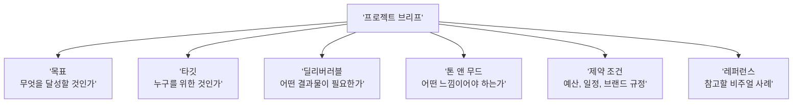
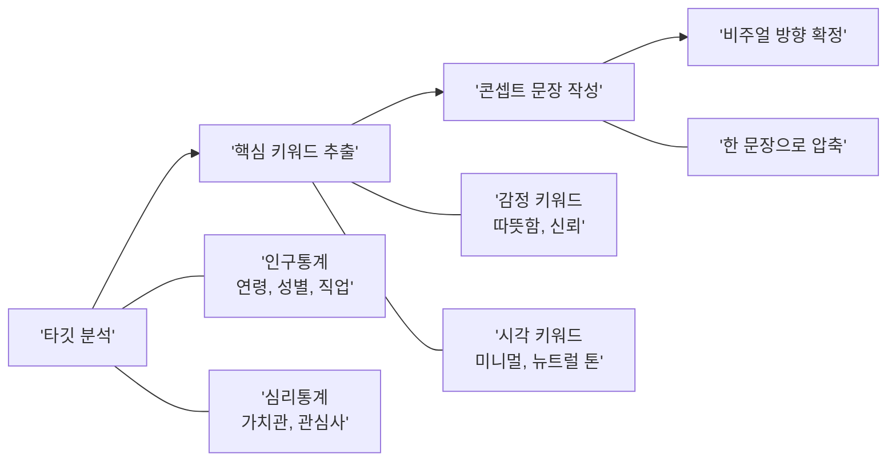
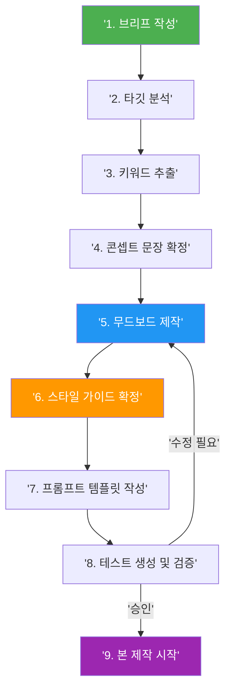

# 프로젝트 기획 — 브리프에서 무드보드까지

> 체계적인 기획이 일관된 비주얼 시스템을 만든다.

## 개요

AI 이미지 생성 프로젝트를 "감"이 아닌 "체계"로 시작하는 방법을 다룹니다. 클라이언트 브리프 분석, 타깃 오디언스 정의, 콘셉트 도출, AI 무드보드 제작, 스타일 가이드 확정까지 전체 기획 워크플로우를 익힙니다.

## 프로젝트 브리프 — 모든 것의 출발점

프로젝트 브리프(Creative Brief)란 **프로젝트의 목표, 타깃, 톤, 제약 조건을 한 장으로 정리한 기획 문서**입니다. 혼자 작업할 때도, 팀과 협업할 때도 — 브리프가 있으면 "같은 것을 만들고 있다"는 합의가 생깁니다.

> 브리프는 여행 계획서와 같습니다. "유럽 여행 가고 싶어"는 막연하지만, "이탈리아 로마 5일, 예산 200만 원, 역사 유적지 중심"이라고 적으면 구체적인 일정이 나옵니다.



| 항목 | 설명 | 예시 |
|------|------|------|
| **프로젝트명** | 프로젝트를 한 줄로 정의 | "2026 여름 신제품 런칭 캠페인" |
| **목표** | 이 비주얼로 달성하려는 것 | "Z세대 대상 브랜드 인지도 향상" |
| **타깃 오디언스** | 누구에게 보여줄 것인가 | "20-30대 여성, 친환경 관심층" |
| **톤 앤 무드** | 감정적 방향 | "모던, 미니멀, 따뜻함" |
| **딜리버러블** | 필요한 결과물 목록 | "SNS 카드 5종, 배너 3종" |
| **레퍼런스** | 참고 이미지나 브랜드 | "Aesop, 무인양품 스타일" |
| **제약 조건** | 지켜야 할 규칙 | "브랜드 컬러 #2E4057 필수 사용" |

ChatGPT를 활용해 브리프 초안을 빠르게 잡을 수 있습니다.

```
친환경 화장품 브랜드 TERRA의 신제품 런칭을 위한 크리에이티브 브리프를 작성해줘.
타깃은 20-30대 여성, 톤은 모던하고 따뜻한 자연 느낌이야.
딜리버러블은 SNS 카드 5종과 배너 3종이고, 참고 브랜드는 Aesop과 무인양품이야.
```


## 타깃 분석에서 콘셉트 도출까지

브리프를 작성했다면 **타깃 분석 → 키워드 추출 → 콘셉트 문장 확정** 3단계를 거칩니다.



**1단계: 타깃 분석** — 인구통계학적 정보(나이, 성별, 직업)와 심리통계학적 정보(가치관, 라이프스타일)를 함께 파악합니다.

```
TERRA 브랜드의 타깃 오디언스를 분석해줘.
인구통계(연령, 성별, 직업, 소득)와 심리통계(가치관, 라이프스타일, 관심사)를
표로 정리하고, 이 타깃이 선호하는 비주얼 스타일을 추천해줘.
```

**2단계: 키워드 추출** — 타깃 분석에서 나온 정보를 **감정 키워드**(신뢰, 설렘, 편안함)와 **시각 키워드**(파스텔 톤, 둥근 형태, 자연광)로 분류합니다.

```
아래 타깃 분석 결과에서 감정 키워드 5개와 시각 키워드 5개를 추출해줘.
감정 키워드: 타깃이 느끼길 원하는 감정
시각 키워드: 그 감정을 표현할 시각적 요소(색감, 질감, 구도 등)

[타깃 분석 결과 붙여넣기]
```

**3단계: 콘셉트 문장 작성** — 키워드를 **한 문장**으로 압축합니다. 이 문장이 프로젝트 전체의 비주얼 나침반이 됩니다.

- 나쁜 예: "예쁜 이미지를 만든다"
- 좋은 예: "도시 속 작은 자연 — 바쁜 일상 속 숨 쉬는 순간을 파스텔 톤의 미니멀한 일러스트로 표현한다"

```
아래 감정 키워드와 시각 키워드를 조합해 프로젝트 콘셉트 문장 3가지를 만들어줘.
각 문장은 20자 이내의 메인 카피 + 부연 설명 형태로.

감정: 신뢰, 편안함, 자연스러움, 정직, 따뜻함
시각: 뉴트럴 톤, 자연광, 여백, 부드러운 곡선, 식물 모티프
```


## AI로 무드보드 제작하기

전통적으로 무드보드는 Pinterest에서 레퍼런스를 수집해 Figma에 배치하는 방식이었지만, AI 도구를 활용하면 훨씬 빠릅니다.

**ChatGPT로 무드보드 만들기** — 자연어로 반복 수정이 쉽고 콘셉트 탐색에 강합니다.

```
친환경 화장품 브랜드의 무드보드를 만들어줘.
4분할 구성으로: 왼쪽 위는 색상 팔레트(뉴트럴 톤, 세이지 그린 포인트),
오른쪽 위는 타이포그래피 샘플(모던 세리프),
아래 두 칸은 제품 촬영 레퍼런스(자연광, 식물 배경)
```


```
이 무드보드에서 색상 톤은 유지하되, 전체적으로 더 미니멀하게 수정해줘.
타이포그래피 영역에 sans-serif도 추가해서 대비를 보여줘.
```

**Midjourney로 무드보드 만들기** — 미학적 완성도가 높아 핵심 비주얼 제작에 적합합니다.

```
a moodboard for eco-friendly skincare brand, pastel earth tones,
sage green accents, minimal composition, natural textures,
soft lighting --ar 16:9 --stylize 200
```


```
a product photography moodboard, neutral background, botanical elements,
soft natural lighting, clean minimal layout, earth tone color palette
--ar 16:9 --sref [레퍼런스 URL]
```

**Adobe Firefly Boards** — AI 생성, 리믹스, 스타일 레퍼런스를 하나의 캔버스에서 처리합니다. 텍스트 프롬프트로 이미지를 생성하고 캔버스에 바로 배치, Describe Image로 기존 이미지를 프롬프트로 변환할 수 있습니다.

## 스타일 가이드 확정

무드보드가 "느낌"을 보여준다면, 스타일 가이드는 "규칙"을 정의합니다. AI 이미지 생성에서는 프롬프트에 같은 스타일 키워드를 반복 사용하기 때문에, 스타일 가이드가 곧 **프롬프트 템플릿의 기반**이 됩니다.

| 항목 | 내용 | AI 생성 시 활용법 |
|------|------|------------------|
| 컬러 팔레트 | 주색 1-2, 보조색 2-3, 강조색 1 | 프롬프트에 색상 키워드로 삽입 |
| 비주얼 스타일 | 일러스트/포토리얼/3D/벡터 등 | `digital illustration`, `photorealistic` 등 |
| 구도 원칙 | 중앙 배치, 룰 오브 서드 등 | `centered composition`, `rule of thirds` |
| 조명 | 자연광, 스튜디오, 골든아워 등 | `soft natural lighting`, `golden hour` |
| 분위기 키워드 | 따뜻함, 차분함, 역동적 등 | 프롬프트 마지막에 분위기 키워드 추가 |
| Midjourney 파라미터 | `--ar`, `--stylize`, `--sref` 값 | 모든 생성에 동일 파라미터 적용 |
| 금지 요소 | 피해야 할 스타일, 색상, 요소 | 네거티브 프롬프트 또는 `--no`에 명시 |

ChatGPT로 스타일 가이드 초안을 생성할 수 있습니다.

```
아래 무드보드 콘셉트를 바탕으로 AI 이미지 생성용 스타일 가이드를 만들어줘.
포함 항목: 컬러 팔레트(HEX), 비주얼 스타일, 구도, 조명, 분위기 키워드,
Midjourney 고정 파라미터, 금지 요소

콘셉트: "도시 속 작은 자연 — 파스텔 톤의 미니멀한 자연 비주얼"
타깃: 20-30대 여성, 친환경 관심층
```


## 기획에서 제작까지 — 전체 워크플로우



핵심은 **8번 "테스트 생성 및 검증"**입니다. 스타일 가이드 확정 후 바로 본 제작에 들어가지 말고, 3~5장의 테스트 이미지를 먼저 생성해 방향을 확인하세요.

```
[스타일 가이드의 고정 키워드를 넣어 테스트 프롬프트 작성]
eco-friendly skincare product on marble surface, botanical elements,
soft natural lighting, neutral earth tones, minimal composition,
clean negative space --ar 4:5 --stylize 150
```


## 실습: 적용해보기

### 활동 1: 프로젝트 브리프 작성

가상 시나리오 — 친환경 화장품 브랜드 "TERRA"의 신제품 런칭용 SNS 비주얼 에셋을 제작합니다.

| 항목 | 작성란 |
|------|--------|
| 프로젝트명 | (예: TERRA 신제품 런칭 비주얼) |
| 목표 | (이 비주얼로 무엇을 달성할 것인가?) |
| 타깃 오디언스 | (인구통계 + 심리통계) |
| 톤 앤 무드 | (3개 키워드) |
| 딜리버러블 | (종류와 수량) |
| 레퍼런스 | (참고 브랜드 2-3개) |
| 제약 조건 | (필수 규칙) |

### 활동 2: 콘셉트 도출 및 무드보드 제작

1. 브리프에서 감정 키워드 5개 + 시각 키워드 5개를 추출
2. 키워드를 한 문장의 콘셉트 문장으로 압축
3. ChatGPT와 Midjourney에 각각 무드보드 생성 프롬프트를 실행하고 결과를 비교

```
[ChatGPT용]
이 콘셉트의 무드보드를 4분할로 만들어줘: [콘셉트 문장]
색상 팔레트, 타이포그래피, 제품 장면, 배경 텍스처로 구성해줘.
```

```
[Midjourney용]
a moodboard for [concept], 4 grid layout, color palette,
typography sample, product scene, texture reference --ar 16:9
```

## 팁과 주의사항

- **개인 프로젝트에도 브리프를 작성하세요.** 글로 정리하는 순간 모호한 생각이 구체화되고, AI 프롬프트도 훨씬 정확해집니다.
- **무드보드는 완성도보다 방향이 중요합니다.** 레이아웃에 시간을 쏟기보다 "빠르게 여러 버전" 만들고 적합한 것을 고르세요.
- **"Do"와 "Don't" 보드를 함께 만드세요.** 하지 말아야 할 방향을 정리하면 네거티브 프롬프트(`--no`)에 바로 활용할 수 있습니다.
- **스타일 가이드는 개인 프로젝트에서도 필수입니다.** AI 생성은 매번 결과가 달라지므로 가이드 없이는 일관성 유지가 어렵습니다.
- **테스트 생성을 건너뛰지 마세요.** 이 단계에서 수정하면 1시간, 본 제작 후 수정하면 하루가 걸립니다.

## 핵심 정리

| 개념 | 설명 |
|------|------|
| 프로젝트 브리프 | 목표, 타깃, 톤, 딜리버러블, 레퍼런스, 제약 조건을 한 장으로 정리한 기획 문서 |
| 타깃 분석 | 인구통계 + 심리통계를 파악하여 비주얼 방향의 근거를 마련하는 과정 |
| 콘셉트 문장 | 감정 키워드 + 시각 키워드를 한 문장으로 압축한 프로젝트의 비주얼 나침반 |
| 무드보드 | 색상, 타이포그래피, 레퍼런스를 모아 시각적 방향을 공유하는 도구 |
| 스타일 가이드 | 컬러, 구도, 조명, 분위기 등 시각적 규칙을 정의한 문서. 프롬프트 템플릿의 기반 |
| 테스트 생성 | 본 제작 전 3-5장의 이미지로 방향을 검증하는 필수 단계 |

## 다음 섹션 미리보기

다음 섹션 [브랜드 비주얼 에셋 프로젝트](12-ch12-실전-포트폴리오-프로젝트/02-02-브랜드-비주얼-에셋-프로젝트.md)에서는 확정한 브리프와 스타일 가이드를 바탕으로 로고 콘셉트, SNS 비주얼 카드, 제품 목업 등 브랜드 비주얼 에셋을 실제로 제작합니다.
