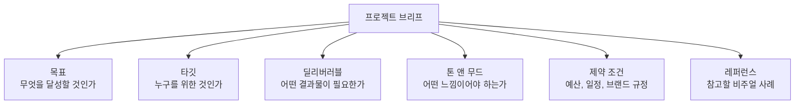
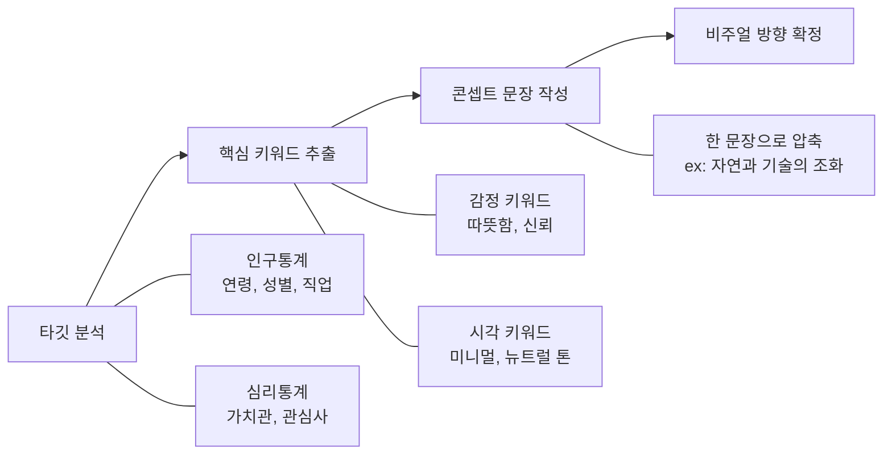
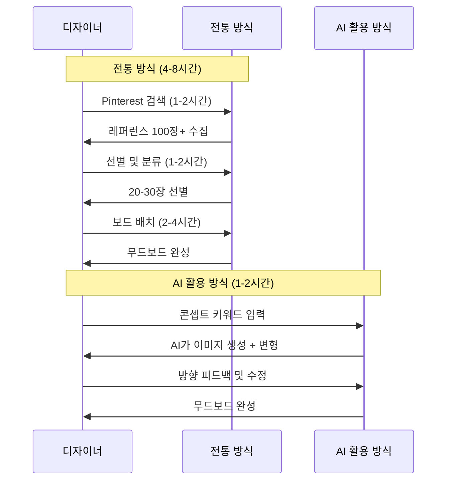
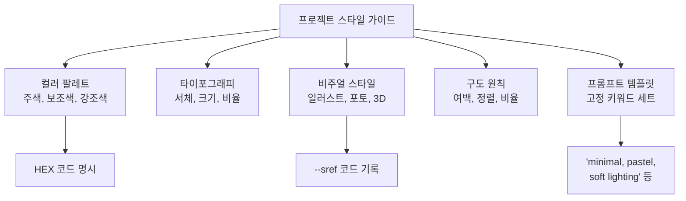
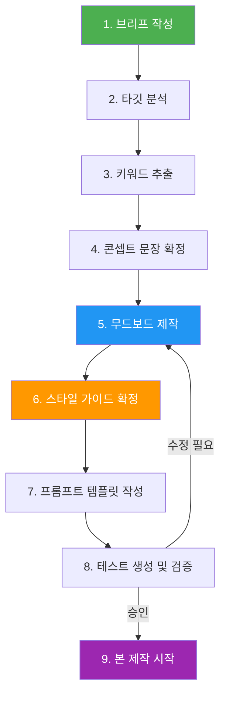

# 프로젝트 기획 — 브리프에서 무드보드까지

> 실전 프로젝트의 출발점, 브리프 작성부터 AI 무드보드 제작까지 전체 기획 프로세스를 익힙니다.

## 개요

이 섹션에서는 AI 이미지 생성 프로젝트를 "감"이 아닌 "체계"로 시작하는 방법을 배웁니다. 클라이언트 브리프를 분석하고, 타깃 오디언스를 정의하고, 콘셉트를 도출한 뒤, AI 도구를 활용해 무드보드와 스타일 가이드를 빠르게 완성하는 전체 워크플로우를 다룹니다.

**선수 지식**:
- [프롬프트 6요소 프레임워크](02-ch2-프롬프트-구조-마스터/01-01-프롬프트-해부학-6요소-프레임워크.md)의 기본 구조
- [시각적 스토리텔링의 원리](11-ch11-시각적-스토리텔링과-감정-전달/01-01-시각적-스토리텔링의-원리.md)에서 배운 내러티브 설계
- [타깃 오디언스 분석과 비주얼 공감 설계](11-ch11-시각적-스토리텔링과-감정-전달/04-04-타깃-오디언스-분석과-비주얼-공감-설계.md)에서 익힌 독자 중심 사고

**학습 목표**:
- 프로젝트 브리프의 핵심 요소를 이해하고 직접 작성할 수 있다
- 브리프에서 비주얼 콘셉트를 논리적으로 도출하는 프로세스를 수행할 수 있다
- AI 도구(ChatGPT, Midjourney, Firefly Boards)를 활용해 무드보드를 빠르게 제작할 수 있다
- 프로젝트 전체를 관통하는 스타일 가이드를 확정할 수 있다

## 왜 알아야 할까?

"아, 그냥 멋진 이미지 하나 만들면 되는 거 아닌가요?"

많은 분이 AI 이미지 생성을 처음 실무에 적용할 때 이렇게 생각하시는데요. 하지만 실제 프로젝트에서는 이미지 "하나"가 아니라 **일관된 비주얼 시스템**이 필요합니다. 로고, 배너, SNS 카드, 제품 목업까지 — 이 모든 것이 하나의 브랜드 톤으로 묶여야 하거든요.

기획 없이 바로 생성에 뛰어들면 어떤 일이 벌어질까요? 10장의 이미지를 만들었는데 스타일이 전부 다르고, 클라이언트가 "이건 우리 브랜드 느낌이 아닌데요"라고 하면 처음부터 다시 시작해야 합니다. 시간과 에너지의 낭비죠.

프로젝트 기획은 **방향을 정하는 나침반** 역할을 합니다. 브리프로 목적지를 확인하고, 무드보드로 경로를 시각화하고, 스타일 가이드로 규칙을 세우면 — 이후 모든 생성 작업이 일관되고 효율적으로 흘러갑니다. 2026년 현재, Adobe Firefly Boards 같은 AI 무드보드 도구가 등장하면서 기획 단계의 속도가 획기적으로 빨라졌습니다. 과거에는 며칠 걸리던 무드보드 제작이 이제 몇 시간이면 끝나거든요.

## 핵심 개념

### 개념 1: 프로젝트 브리프 — 모든 것의 출발점

> 💡 **비유**: 브리프는 여행 계획서와 같습니다. "유럽 여행 가고 싶어"는 막연하지만, "이탈리아 로마에서 5일간, 예산 200만 원, 역사 유적지 중심"이라고 적으면 구체적인 일정이 나오죠. 프로젝트 브리프도 마찬가지입니다. "멋진 이미지 만들어주세요"가 아니라, 누구를 위해, 어떤 목적으로, 어떤 느낌의 비주얼이 필요한지를 명확히 정리하는 문서입니다.

프로젝트 브리프(Creative Brief)란 **프로젝트의 목표, 타깃, 톤, 제약 조건을 한 장으로 정리한 기획 문서**입니다. 혼자 작업할 때도, 팀과 협업할 때도, 클라이언트와 소통할 때도 — 브리프가 있으면 "우리가 같은 것을 만들고 있다"는 합의가 만들어집니다.

> 📊 **그림 1**: 프로젝트 브리프의 핵심 구성 요소

**브리프의 7대 필수 항목**을 살펴볼까요?

| 항목 | 설명 | 예시 |
|------|------|------|
| **프로젝트명** | 프로젝트를 한 줄로 정의 | "2026 여름 신제품 런칭 캠페인" |
| **목표** | 이 비주얼로 달성하려는 것 | "Z세대 대상 브랜드 인지도 향상" |
| **타깃 오디언스** | 누구에게 보여줄 것인가 | "20-30대 여성, 친환경 관심층" |
| **톤 앤 무드** | 감정적 방향 | "모던, 미니멀, 따뜻함" |
| **딜리버러블** | 필요한 결과물 목록 | "SNS 카드 5종, 배너 3종" |
| **레퍼런스** | 참고 이미지나 브랜드 | "Aesop, 무인양품 스타일" |
| **제약 조건** | 지켜야 할 규칙 | "브랜드 컬러 #2E4057 필수 사용" |

> 🔥 **실무 팁**: 개인 프로젝트라도 브리프를 작성하세요. "나는 내가 뭘 원하는지 아니까 괜찮아"라고 생각하기 쉽지만, 글로 정리하는 순간 모호했던 생각이 구체화됩니다. 특히 AI에게 프롬프트를 줄 때, 브리프가 있으면 훨씬 정확한 지시를 내릴 수 있어요.

### 개념 2: 타깃 분석에서 콘셉트 도출까지

> 💡 **비유**: 선물을 고를 때를 떠올려보세요. 같은 "생일 선물"이라도 5살 조카에게 줄 것과 60대 부모님께 드릴 것은 완전히 다르잖아요? 비주얼 콘셉트도 마찬가지입니다. 타깃이 누구냐에 따라 색감, 구도, 분위기가 전부 달라져야 합니다.

브리프를 작성했다면, 이제 **타깃 분석 → 키워드 추출 → 콘셉트 문장 확정**이라는 3단계를 거쳐야 합니다.

> 📊 **그림 2**: 타깃 분석에서 콘셉트 도출까지의 프로세스

**1단계: 타깃 분석**

[타깃 오디언스 분석과 비주얼 공감 설계](11-ch11-시각적-스토리텔링과-감정-전달/04-04-타깃-오디언스-분석과-비주얼-공감-설계.md)에서 배운 방법을 활용합니다. 인구통계학적 정보(나이, 성별, 직업)와 심리통계학적 정보(가치관, 라이프스타일, 관심사)를 함께 파악하세요.

**2단계: 키워드 추출**

타깃 분석에서 나온 정보를 **감정 키워드**와 **시각 키워드** 두 축으로 분류합니다.

- 감정 키워드: 타깃이 느끼길 원하는 감정 (예: 신뢰, 설렘, 편안함)
- 시각 키워드: 그 감정을 표현할 시각적 요소 (예: 파스텔 톤, 둥근 형태, 자연광)

[색채 심리학과 감정 팔레트](11-ch11-시각적-스토리텔링과-감정-전달/02-02-색채-심리학과-감정-팔레트.md)에서 배운 색상-감정 매핑을 여기서 적극 활용할 수 있습니다.

**3단계: 콘셉트 문장 작성**

추출한 키워드들을 **한 문장**으로 압축합니다. 이 문장이 프로젝트 전체의 비주얼 나침반이 됩니다.

- 나쁜 예: "예쁜 이미지를 만든다"
- 좋은 예: "도시 속 작은 자연 — 바쁜 일상 속 숨 쉬는 순간을 파스텔 톤의 미니멀한 일러스트로 표현한다"

### 개념 3: AI로 무드보드 제작하기

> 💡 **비유**: 무드보드는 인테리어 시작 전에 만드는 "분위기 콜라주"와 같습니다. 벽지 샘플, 원단 조각, 페인트 칩을 한 보드에 모아두면 "아, 이런 느낌이구나"가 한눈에 보이잖아요? 디지털 무드보드도 마찬가지로, 색상, 타이포그래피, 질감, 레퍼런스 이미지를 한곳에 모아서 프로젝트의 시각적 방향을 공유하는 도구입니다.

전통적으로 무드보드 제작은 Pinterest나 Behance에서 레퍼런스를 수집하고, Figma나 Canva에 배치하는 방식이었습니다. 하지만 2026년 현재, AI 도구를 활용하면 이 과정이 훨씬 빨라졌는데요.

> 📊 **그림 3**: 전통 방식 vs AI 활용 무드보드 제작 비교

**플랫폼별 무드보드 제작 방법**을 살펴보겠습니다.

**ChatGPT로 무드보드 만들기**

ChatGPT의 대화형 이미지 생성은 무드보드 초안을 잡기에 효과적입니다. [대화형 이미지 생성](03-ch3-chatgpt-이미지-생성-실전/02-02-대화형-이미지-생성-자연어로-그리기.md)에서 배운 자연어 지시를 활용하세요.

- "이 브랜드의 무드보드를 만들어줘. 키워드는: 미니멀, 자연, 따뜻함, 뉴트럴 톤"
- "4분할 구성으로, 왼쪽 위는 색상 팔레트, 오른쪽 위는 타이포그래피 샘플, 아래는 레퍼런스 장면 2개"
- 장점: 자연어로 반복 수정이 쉬움, 콘셉트 탐색에 강함
- 단점: 정밀한 레이아웃 제어가 어려움

**Midjourney로 무드보드 만들기**

Midjourney는 미학적 완성도가 높은 이미지를 빠르게 생성할 수 있어 무드보드의 핵심 비주얼 제작에 적합합니다. [스타일 레퍼런스(--sref)](07-ch7-controlnet과-참조-이미지-활용/04-04-midjourney---sref-스타일-레퍼런스.md)를 활용하면 일관된 스타일의 이미지 세트를 만들 수 있죠.

- `a moodboard for eco-friendly skincare brand, pastel earth tones, minimal composition --ar 16:9 --stylize 200`
- `--sref`로 기존 브랜드 비주얼의 톤을 유지하며 새 이미지 생성
- 장점: 미학적 퀄리티가 높고, 파라미터로 세밀한 제어 가능
- 단점: 대화형 수정이 불가, 텍스트 렌더링 약함

**Adobe Firefly Boards로 무드보드 만들기**

2026년 기준 가장 주목할 도구는 Adobe Firefly Boards입니다. AI 이미지 생성, 리믹스, 스타일 레퍼런스를 하나의 캔버스에서 처리할 수 있거든요.

- 텍스트 프롬프트로 이미지를 직접 생성하고 캔버스에 배치
- 여러 이미지를 선택해 "리믹스"하면 새로운 변형을 자동 생성
- **Describe Image** 기능으로 기존 이미지를 프롬프트로 변환
- **Style Reference**로 특정 스타일을 새 이미지에 적용
- 장점: 생성-편집-배치가 한 플랫폼에서 가능
- 단점: Adobe 구독 필요, 크리에이티브 클라우드 생태계에 종속

### 개념 4: 스타일 가이드 확정

> 💡 **비유**: 스타일 가이드는 요리의 "레시피"와 같습니다. 레시피가 있으면 누가 만들어도 비슷한 맛이 나오듯, 스타일 가이드가 있으면 어떤 AI 도구를 쓰든 일관된 비주얼이 나옵니다. 특히 AI 이미지 생성에서는 프롬프트에 같은 스타일 키워드를 반복적으로 넣어야 하기 때문에, 스타일 가이드가 곧 **프롬프트 템플릿의 기반**이 됩니다.

무드보드가 "느낌"을 보여준다면, 스타일 가이드는 "규칙"을 정의합니다. [브랜드 스타일 가이드 구축](08-ch8-캐릭터브랜드-스타일-일관성-유지/03-03-브랜드-스타일-가이드-구축.md)에서 배운 원칙을 프로젝트 단위로 적용하는 것이죠.

> 📊 **그림 4**: AI 프로젝트 스타일 가이드의 구성 요소

**AI 프로젝트 스타일 가이드에 포함할 항목**:

| 항목 | 내용 | AI 생성 시 활용법 |
|------|------|------------------|
| 컬러 팔레트 | 주색 1-2, 보조색 2-3, 강조색 1 | 프롬프트에 색상 키워드로 삽입 |
| 비주얼 스타일 | 일러스트/포토리얼/3D/벡터 등 | `digital illustration`, `photorealistic` 등 |
| 구도 원칙 | 중앙 배치, 룰 오브 서드 등 | `centered composition`, `rule of thirds` |
| 조명 | 자연광, 스튜디오, 골든아워 등 | `soft natural lighting`, `golden hour` |
| 분위기 키워드 | 따뜻함, 차분함, 역동적 등 | 프롬프트 마지막에 분위기 키워드 추가 |
| Midjourney 파라미터 | `--ar`, `--stylize`, `--sref` 값 | 모든 생성에 동일 파라미터 적용 |
| 금지 요소 | 피해야 할 스타일, 색상, 요소 | 네거티브 프롬프트 또는 `--no`에 명시 |

> ⚠️ **흔한 오해**: "스타일 가이드는 대기업이나 에이전시에서만 필요한 것 아닌가요?" 전혀 아닙니다. 개인 포트폴리오 프로젝트에서도 스타일 가이드가 있으면 5장의 이미지를 만들 때 처음과 마지막 이미지가 같은 세계관에 속하게 됩니다. 특히 AI 생성은 매번 결과가 달라지기 때문에, 스타일 가이드가 없으면 일관성을 유지하기가 훨씬 어렵습니다.

### 개념 5: 기획에서 제작까지 — 전체 워크플로우

지금까지 배운 모든 단계를 하나의 흐름으로 연결해보겠습니다.

> 📊 **그림 5**: 프로젝트 기획 전체 워크플로우

이 워크플로우에서 핵심은 **8번 "테스트 생성 및 검증" 단계**입니다. 스타일 가이드를 확정한 후 바로 본 제작에 들어가는 것이 아니라, 3~5장의 테스트 이미지를 먼저 생성해서 방향이 맞는지 확인하세요. 이 단계에서 수정하면 1시간이면 끝나지만, 본 제작 후 수정하면 하루가 걸립니다.

## 실습: 적용해보기

### 활동 1: 프로젝트 브리프 작성 워크시트

아래 워크시트를 채워 가상의 프로젝트 브리프를 완성해보세요.

**시나리오**: 친환경 화장품 브랜드 "TERRA"가 신제품 라인 런칭을 위한 SNS 비주얼 에셋을 의뢰했습니다.

| 항목 | 작성란 |
|------|--------|
| 프로젝트명 | (예: TERRA 신제품 런칭 비주얼) |
| 목표 | (이 비주얼로 무엇을 달성할 것인가?) |
| 타깃 오디언스 | (누구에게 보여줄 것인가? 인구통계 + 심리통계) |
| 톤 앤 무드 | (어떤 감정을 전달할 것인가? 3개 키워드) |
| 딜리버러블 | (어떤 결과물이 필요한가? 종류와 수량) |
| 레퍼런스 | (참고할 브랜드나 이미지 스타일 2-3개) |
| 제약 조건 | (반드시 지켜야 할 규칙은?) |

### 활동 2: 콘셉트 도출 연습

위에서 작성한 브리프를 바탕으로 다음을 수행하세요:

1. **감정 키워드 5개** 추출하기 (타깃이 느꼈으면 하는 감정)
2. **시각 키워드 5개** 추출하기 (그 감정을 표현할 시각적 요소)
3. 이 키워드들을 **한 문장의 콘셉트 문장**으로 압축하기

### 활동 3: AI 무드보드 제작 도전

위에서 도출한 콘셉트를 바탕으로:

1. **ChatGPT**에 "이 콘셉트의 무드보드를 4분할로 만들어줘"라고 요청하고 결과를 저장
2. **Midjourney**에서 같은 콘셉트로 `a moodboard for [콘셉트] --ar 16:9` 프롬프트를 실행
3. 두 결과를 비교하고 어떤 플랫폼이 이 프로젝트에 더 적합한지 분석

### 토론 질문

- 브리프의 7대 항목 중 가장 작성하기 어려웠던 항목은 무엇이고, 왜 그랬나요?
- AI가 생성한 무드보드와 Pinterest에서 수집한 무드보드의 차이점은 무엇일까요? 각각의 장단점을 토론해보세요.
- "좋은 콘셉트 문장"의 기준은 무엇일까요? 너무 추상적이면 안 되고, 너무 구체적이어도 안 되는 이유를 생각해보세요.

## 더 깊이 알아보기

### 무드보드의 탄생 — 패션에서 디지털까지

무드보드(Moodboard)라는 개념은 원래 **패션 디자인**에서 시작되었습니다. 1930~40년대 패션 디자이너들이 원단 조각, 색상 칩, 잡지 오려붙이기를 코르크보드에 핀으로 꽂아두던 것이 시초인데요. 당시에는 "인스피레이션 보드(Inspiration Board)"라고 불렀습니다.

이것이 본격적으로 "무드보드"라는 이름을 갖게 된 건 1980년대 인테리어 디자인 업계에서입니다. 공간의 "무드(분위기)"를 클라이언트에게 시각적으로 전달하기 위해, 벽지 샘플, 바닥재, 가구 이미지를 한 보드에 모아 제시하던 관행이 자리 잡으면서 "무드보드"라는 용어가 정착했죠.

디지털 시대에 들어서면서 Pinterest(2010년 출시)가 무드보드 문화를 대중화했고, 2024~2025년에는 AI 이미지 생성 도구들이 "수집"이 아닌 "생성" 방식의 무드보드를 가능하게 만들었습니다. Adobe가 2025년 Firefly Boards를 공식 출시하면서, 무드보드는 더 이상 레퍼런스를 "모으는" 작업이 아니라 원하는 비주얼을 "만드는" 작업으로 진화하고 있습니다.

### 크리에이티브 브리프의 기원

크리에이티브 브리프는 1960년대 광고 업계에서 탄생했습니다. 당시 광고 에이전시 DDB(Doyle Dane Bernbach)의 전설적인 아트 디렉터 빌 번벅(Bill Bernbach)이 "광고를 만들기 전에 먼저 문제를 정의하라"는 원칙을 세우면서, 체계적인 브리프 문화가 자리 잡기 시작했는데요. 이전까지는 클라이언트가 "좋은 광고 만들어주세요"라고 하면 크리에이터의 감에 의존했지만, 브리프 시스템 도입 후 "누구에게, 무엇을, 왜" 전달하는지를 먼저 합의하는 프로세스가 업계 표준이 되었습니다.

## 흔한 오해와 팁

> ⚠️ **흔한 오해**: "무드보드는 예쁘게 만들어야 한다." 무드보드의 목적은 **방향 합의**이지, 그 자체가 최종 결과물이 아닙니다. 완벽한 레이아웃에 시간을 쏟기보다, 핵심 키워드와 비주얼 방향이 명확히 전달되는 것이 훨씬 중요합니다. 특히 AI로 빠르게 여러 버전을 만들 수 있는 지금은 "빠르게, 여러 개" 만들고 그중 가장 적합한 것을 고르는 전략이 효과적입니다.

> 💡 **알고 계셨나요?**: 2026년 현재 AI 이미지로만 만든 결과물의 저작권은 여전히 논쟁 중입니다. 미국 저작권청은 "순수하게 AI가 생성한 이미지"에 대해 저작권을 인정하지 않는 입장이지만, 인간의 창의적 기여(프롬프트 설계, 편집, 재구성)가 충분히 들어갔다면 보호받을 수 있다는 판례도 나오고 있습니다. 기획 단계에서부터 "내 창의적 기여"를 문서화해두면, 나중에 상업적 활용 시 큰 도움이 됩니다. 이 주제는 [AI 비주얼의 저작권·윤리·상업적 활용](12-ch12-실전-포트폴리오-프로젝트/04-04-ai-비주얼의-저작권윤리상업적-활용.md)에서 더 자세히 다룹니다.

> 🔥 **실무 팁**: 무드보드를 만들 때 **"하고 싶은 것"과 "하지 말아야 할 것"을 함께 정리**하세요. "Do" 보드와 "Don't" 보드를 나란히 만들면 방향이 훨씬 명확해집니다. AI 생성 시에도 네거티브 프롬프트나 `--no` 파라미터에 "Don't" 보드의 키워드를 그대로 활용할 수 있어 효율적입니다.

## 핵심 정리

| 개념 | 설명 |
|------|------|
| 프로젝트 브리프 | 목표, 타깃, 톤, 딜리버러블, 레퍼런스, 제약 조건을 한 장으로 정리한 기획 문서 |
| 타깃 분석 | 인구통계 + 심리통계를 파악하여 비주얼 방향의 근거를 마련하는 과정 |
| 콘셉트 문장 | 감정 키워드 + 시각 키워드를 한 문장으로 압축한 프로젝트의 비주얼 나침반 |
| 무드보드 | 색상, 타이포그래피, 레퍼런스 이미지를 모아 프로젝트의 시각적 방향을 공유하는 도구 |
| AI 무드보드 | ChatGPT, Midjourney, Firefly Boards 등으로 레퍼런스를 "수집"이 아닌 "생성"하는 방식 |
| 스타일 가이드 | 컬러, 구도, 조명, 분위기 등 시각적 규칙을 정의한 문서. AI 프롬프트 템플릿의 기반 |
| 테스트 생성 | 본 제작 전 3-5장의 이미지로 방향을 검증하는 필수 단계 |

## 다음 섹션 미리보기

기획이 끝났으니 이제 본격적으로 만들 차례입니다! 다음 섹션 [브랜드 비주얼 에셋 프로젝트](12-ch12-실전-포트폴리오-프로젝트/02-02-브랜드-비주얼-에셋-프로젝트.md)에서는 이번 섹션에서 확정한 브리프와 스타일 가이드를 바탕으로, 로고 콘셉트, SNS 비주얼 카드, 제품 목업 등 **브랜드 비주얼 에셋을 실제로 제작**하는 과정을 다룹니다. 기획 문서가 실제 결과물로 변환되는 순간을 직접 경험해보세요.

## 참고 자료

- [Adobe Firefly Boards — AI 무드보드 제작 도구](https://www.adobe.com/products/firefly/features/moodboard.html) - Firefly Boards의 공식 기능 소개. 리믹스, 스타일 레퍼런스, Describe Image 등 핵심 기능을 확인할 수 있습니다.
- [Character Consistency in AI: Cohesive IP Design Guide 2025 (Lovart)](https://www.lovart.ai/blog/ai-character-consistency) - 캐릭터 일관성을 위한 레퍼런스 시트 제작법과 스타일 가이드 구축 전략을 다룹니다.
- [Creative Brief Template: Step-by-Step Guide (Monday.com)](https://monday.com/blog/project-management/creative-brief-template/) - 크리에이티브 브리프의 구성 요소와 작성법을 단계별로 설명합니다.
- [AI for Graphic Designers in 2026 (House of GAI)](https://www.houseofgai.com/blog/ai-for-graphic-designers-2026) - 2026년 디자이너의 AI 활용 워크플로우와 무드보드를 포함한 기획 단계의 변화를 다룹니다.
- [About Firefly Boards (Adobe Help Center)](https://helpx.adobe.com/firefly/web/create-mood-boards/firefly-boards/about-firefly-boards.html) - Firefly Boards의 상세 사용법과 스타일 레퍼런스 기능에 대한 공식 문서입니다.

---
### 🔗 Related Sessions
- [프롬프트](01-ch1-ai-이미지-생성-개론/01-01-생성형-ai가-바꾸는-디자인-워크플로우.md) (prerequisite)
- [시각적_스토리텔링](11-ch11-시각적-스토리텔링과-감정-전달/01-01-시각적-스토리텔링의-원리.md) (prerequisite)
