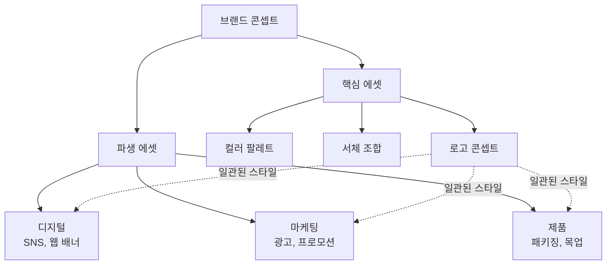
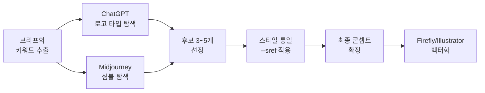
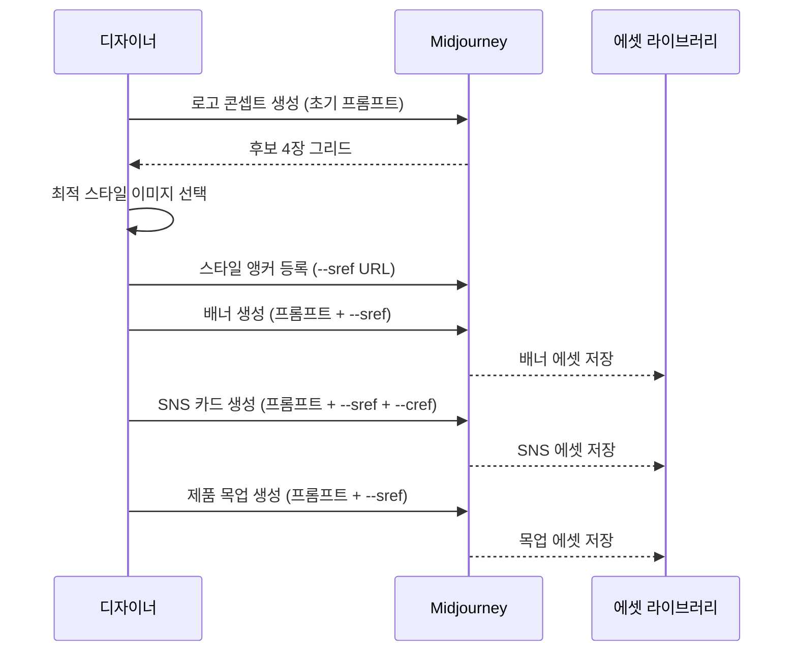
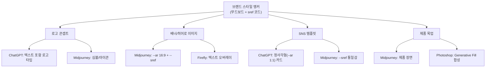
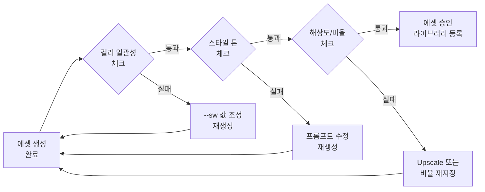

# 브랜드 비주얼 에셋 프로젝트

> 가상 브랜드를 위한 로고 콘셉트, 배너, SNS 템플릿, 제품 목업을 AI로 제작하며 일관된 비주얼 아이덴티티를 구축합니다.

## 개요

이 섹션에서는 [이전 섹션](12-ch12-실전-포트폴리오-프로젝트/01-01-프로젝트-기획-브리프에서-무드보드까지.md)에서 완성한 프로젝트 브리프와 스타일 가이드를 바탕으로, 가상 브랜드의 핵심 비주얼 에셋을 실제로 제작합니다. 로고 콘셉트부터 배너, SNS 템플릿, 제품 목업까지 — 브랜드가 세상에 나갈 때 필요한 모든 시각 자산을 AI 도구들을 조합해 만들어보는 실전 프로젝트입니다.

**선수 지식**:
- [프로젝트 기획 — 브리프에서 무드보드까지](12-ch12-실전-포트폴리오-프로젝트/01-01-프로젝트-기획-브리프에서-무드보드까지.md)의 브리프 작성법과 스타일 가이드
- [Midjourney --sref 스타일 레퍼런스](07-ch7-controlnet과-참조-이미지-활용/04-04-midjourney---sref-스타일-레퍼런스.md)와 [--cref 캐릭터 레퍼런스](07-ch7-controlnet과-참조-이미지-활용/05-05-midjourney---cref-캐릭터-레퍼런스.md)의 기본 사용법
- [브랜드 스타일 가이드 구축](08-ch8-캐릭터브랜드-스타일-일관성-유지/03-03-브랜드-스타일-가이드-구축.md)에서 배운 일관성 원칙

**학습 목표**:
- 브랜드 비주얼 에셋의 종류와 각각의 제작 전략을 이해한다
- ChatGPT, Midjourney, Firefly를 조합한 멀티 플랫폼 에셋 제작 워크플로우를 설계한다
- `--sref`와 `--cref`를 전략적으로 활용해 브랜드 일관성을 유지하며 다양한 포맷의 에셋을 생성한다
- 하나의 브랜드 콘셉트에서 10개 이상의 실무 에셋을 도출한다

## 왜 알아야 할까?

브랜드는 로고 하나로 완성되지 않습니다. 실제로 브랜드가 세상에 나가려면 명함, SNS 프로필, 배너, 제품 포장, 광고 이미지 등 수십 가지의 비주얼 에셋이 필요하거든요. 전통적인 방식으로는 디자이너가 하나하나 만들어야 했고, 소규모 팀이라면 외주비만 수백만 원이 들기도 했습니다.

AI 이미지 생성 도구의 등장으로 이 과정이 극적으로 바뀌었습니다. 한 사람이 하루 만에 브랜드의 핵심 비주얼 에셋 세트 전체를 프로토타이핑할 수 있게 된 거죠. 물론 AI가 최종 로고 파일을 벡터로 뽑아주진 않습니다. 하지만 **콘셉트 탐색 → 방향 확정 → 에셋 초안 제작**까지의 과정에서 AI는 엄청난 시간을 절약해줍니다. 특히 Midjourney의 `--sref`와 `--cref`를 활용하면, 한번 잡은 스타일을 모든 에셋에 걸쳐 일관되게 유지할 수 있어요.

이 섹션을 마치면 여러분은 "브리프 한 장으로 브랜드 비주얼 세트를 뽑아낼 수 있는 사람"이 됩니다. 이것이야말로 AI 시대 비주얼 크리에이터의 핵심 경쟁력이에요.

## 핵심 개념

### 개념 1: 브랜드 비주얼 에셋 체계 — "얼굴, 옷, 무대"

> 💡 **비유**: 브랜드를 한 사람이라고 생각해보세요. **로고**는 그 사람의 얼굴이고, **컬러와 타이포그래피**는 즐겨 입는 옷 스타일이며, **배너·SNS·목업**은 그 사람이 서 있는 무대입니다. 얼굴은 어디서든 알아볼 수 있어야 하고, 옷 스타일은 일관되어야 하며, 무대는 상황에 따라 달라지되 그 사람다움을 잃지 않아야 합니다.

브랜드 비주얼 에셋은 크게 **핵심 에셋(Core Assets)**과 **파생 에셋(Derivative Assets)**으로 나뉩니다.

| 구분 | 에셋 종류 | 역할 |
|------|-----------|------|
| 핵심 에셋 | 로고 콘셉트, 심볼, 컬러 팔레트, 서체 조합 | 브랜드 정체성의 뼈대 |
| 파생 에셋 — 디지털 | SNS 프로필, 커버 이미지, 포스트 템플릿 | 온라인 존재감 |
| 파생 에셋 — 마케팅 | 배너, 광고 이미지, 프로모션 카드 | 고객 유입 |
| 파생 에셋 — 제품 | 패키징 목업, 굿즈 시안, 매장 사이니지 | 물리적 접점 |

> 📊 **그림 1**: 브랜드 비주얼 에셋의 계층 구조

핵심 에셋이 확정되면, 파생 에셋은 그 핵심을 다양한 맥락에 맞춰 변주하는 것입니다. AI 도구를 활용할 때 가장 중요한 점은 **핵심 에셋을 먼저 확정한 뒤, 그것을 레퍼런스로 파생 에셋을 생성**하는 순서를 지키는 것이에요. 순서를 뒤집으면 에셋마다 제각각인 "프랑켄슈타인 브랜드"가 탄생합니다.

### 개념 2: 로고 콘셉트 — AI로 방향 잡기

> 💡 **비유**: 로고 디자인을 집 짓기에 비유하면, AI가 해주는 건 **건축 모형(스케일 모델)** 만들기입니다. 실제 건물(벡터 로고 파일)은 전문 도구로 지어야 하지만, "이런 느낌의 집을 짓고 싶다"를 빠르게 시각화하는 데는 AI가 압도적이에요.

AI로 로고를 만들 때 가장 흔한 실수는 "최종 로고를 AI로 완성하려는 것"입니다. 현재 AI 이미지 생성 도구는 래스터 이미지를 출력하기 때문에, 인쇄용 벡터 로고를 직접 만들 수 없어요. 하지만 **콘셉트 탐색**에는 놀라울 정도로 효과적입니다.

**플랫폼별 로고 콘셉트 전략**:

| 플랫폼 | 강점 | 활용법 |
|--------|------|--------|
| ChatGPT (GPT-4o) | 텍스트 렌더링, 대화형 반복 | 브랜드명이 포함된 로고 타입 탐색, 색상·레이아웃 빠른 변주 |
| Midjourney | 미학적 완성도, 스타일 제어 | 심볼/아이콘 콘셉트, `--sref`로 스타일 고정 후 변형 탐색 |
| Adobe Firefly | 상업적 안전성, 벡터 변환 용이 | 최종 후보 리파인, Adobe Illustrator 연계 |

> 📊 **그림 2**: 로고 콘셉트 탐색 워크플로우

ChatGPT로 로고를 탐색할 때는 구체적인 지시가 핵심입니다. "로고 만들어줘"가 아니라, 브랜드의 핵심 가치, 타깃 고객, 선호하는 스타일 방향을 명확히 전달해야 합니다. 예를 들어 "미니멀한 기하학적 심볼 + 산세리프 서체, 네이비(#1A237E)와 골드(#FFD700) 조합의 프리미엄 느낌"처럼 구체적으로요.

Midjourney에서는 `--stylize` 값을 낮게(50~100) 설정해서 프롬프트에 충실한 결과를 얻고, 마음에 드는 결과가 나오면 그 이미지를 `--sref`로 등록해 같은 스타일의 변형들을 탐색하는 방식이 효과적입니다.

> ⚠️ **흔한 오해**: "AI가 만든 로고를 바로 명함에 넣어도 된다" — AI 로고는 래스터(픽셀) 이미지입니다. 인쇄하면 해상도 문제가 발생하고, 크기 조절 시 깨집니다. AI 결과물은 반드시 **방향 탐색용 콘셉트**로 활용하고, 최종 로고는 Illustrator 같은 벡터 도구로 재제작하세요.

### 개념 3: --sref + --cref 듀얼 전략 — 브랜드 일관성의 핵심 무기

> 💡 **비유**: 영화 촬영에서 `--sref`는 **촬영 감독(DP)**이고, `--cref`는 **배우**입니다. 촬영 감독이 조명, 색감, 분위기를 일정하게 유지하면(=`--sref`), 배우가 다른 장면에서 연기해도(=`--cref`) 같은 영화처럼 느껴지죠. 두 가지를 함께 쓰면, "같은 캐릭터가 같은 세계관 안에서 다양한 상황에 있는" 느낌을 만들 수 있습니다.

Midjourney의 `--sref`(Style Reference)와 `--cref`(Character Reference)를 동시에 활용하는 것은 브랜드 에셋 제작에서 가장 강력한 전략입니다.

**각 파라미터의 역할**:

| 파라미터 | 제어 대상 | 가중치 파라미터 | 범위 | 기본값 |
|----------|-----------|----------------|------|--------|
| `--sref` | 색감, 질감, 조명, 전체 미학 | `--sw` | 0~1000 | 100 |
| `--cref` | 캐릭터 외형, 얼굴, 체형 | `--cw` | 0~100 | 100 |

**듀얼 전략의 실전 활용**:

1단계. **스타일 앵커 확보**: 브랜드 무드보드에서 가장 잘 맞는 이미지 1~2장을 `--sref`용으로 선정
2단계. **마스코트/캐릭터 고정**: 브랜드 캐릭터가 있다면 최적의 이미지를 `--cref`용으로 선정
3단계. **동시 적용**: `prompt --sref [스타일이미지URL] --sw 150 --cref [캐릭터이미지URL] --cw 80`

> 📊 **그림 3**: --sref와 --cref 듀얼 전략 적용 흐름

**sref 코드 활용 팁**: Midjourney에는 숫자 코드로 된 스타일 레퍼런스도 있습니다. `--sref random`으로 생성된 코드 중 브랜드에 맞는 것을 발견하면, 해당 코드를 기록해두고 모든 에셋 생성에 재사용할 수 있어요. 이미지 URL 대신 `--sref 12345`처럼 코드를 사용하면 더 안정적인 결과를 얻을 수 있습니다.

**다중 스타일 레퍼런스**: 여러 이미지를 가중치와 함께 조합할 수도 있습니다. `--sref urlA::2 urlB::3`처럼 콜론 두 개 뒤에 비율을 적으면, A의 스타일 20% + B의 스타일 30%를 혼합한 결과를 얻게 됩니다.

### 개념 4: 멀티 플랫폼 에셋 제작 워크플로우

> 💡 **비유**: 요리사가 하나의 기본 육수(스톡)로 라멘도 만들고, 리소토도 만들고, 카레도 만들듯이 — 하나의 브랜드 스타일 앵커에서 다양한 에셋을 파생시키는 것이 멀티 플랫폼 워크플로우의 핵심입니다.

각 에셋 유형마다 최적의 AI 도구가 다릅니다. 한 플랫폼에서 모든 것을 해결하려 하기보다, **각 도구의 강점을 조합**하는 것이 실무의 핵심이에요.

> 📊 **그림 4**: 에셋 유형별 최적 플랫폼 매핑

**에셋별 제작 가이드**:

**배너/히어로 이미지**: 웹사이트 상단이나 광고 배너에 사용할 와이드 이미지입니다. Midjourney에서 `--ar 16:9` 또는 `--ar 21:9`로 와이드 비율을 지정하고, `--sref`로 브랜드 스타일을 적용합니다. 텍스트가 들어갈 공간이 필요하다면 "with negative space on the left for text overlay"처럼 여백을 지정하세요.

**SNS 템플릿**: Instagram은 1:1 또는 4:5, Facebook 커버는 약 2.6:1, LinkedIn 배너는 4:1이 표준입니다. 같은 콘셉트를 다양한 비율로 생성할 때 `--sref`를 고정하면 비율이 달라져도 통일감이 유지됩니다.

**제품 목업**: "product mockup" 키워드와 함께 구체적인 제품 형태(커피 패키지, 화장품 병, 에코백 등)를 지정합니다. [Ch9에서 배운 Photoshop의 Generative Fill](09-ch9-adobe-photoshop-firefly-리터치-워크플로우/02-02-photoshop-generative-fill-마스터.md)을 활용하면 AI 생성 이미지 위에 로고를 자연스럽게 합성할 수 있어요.

### 개념 5: 에셋 품질 검증과 일관성 체크

> 💡 **비유**: 패션 브랜드의 품질 검수(QC) 라인을 떠올려보세요. 아무리 예쁜 옷이라도 실밥이 삐져나오거나, 같은 라인인데 색상이 미묘하게 다르면 불량입니다. 브랜드 에셋도 마찬가지로 **일관성 검수**가 필수예요.

AI로 여러 에셋을 생성하다 보면, `--sref`를 사용하더라도 미세한 차이가 발생합니다. 체계적인 검증 프로세스가 필요한 이유죠.

> 📊 **그림 5**: 에셋 품질 검증 프로세스

**일관성 체크리스트**:
- **컬러 매치**: 브랜드 팔레트의 주요 색상이 모든 에셋에서 유사한 톤으로 나타나는가?
- **스타일 톤**: 미니멀한 브랜드인데 갑자기 과도한 장식이 들어간 에셋은 없는가?
- **무드 통일**: 전체 에셋을 한 화면에 늘어놓았을 때 "한 브랜드"로 느껴지는가?
- **해상도**: 각 용도에 맞는 해상도를 충족하는가? (SNS 최소 1080px, 인쇄 300dpi)
- **텍스트 가독성**: 로고나 텍스트가 포함된 에셋에서 글자가 정확하게 렌더링되었는가?

모든 에셋을 한곳에 모아 "브랜드 에셋 보드"를 만들어 전체적인 통일감을 확인하는 것이 좋습니다. Figma, Miro, 또는 단순히 하나의 PPT 슬라이드에 모아 놓는 것만으로도 일관성 문제를 빠르게 발견할 수 있어요.

> 🔥 **실무 팁**: `--sw`(Style Weight) 값은 브랜드 에셋 작업에서 기본값(100)보다 살짝 높은 **120~200** 사이가 좋습니다. 너무 낮으면 스타일이 약하게 적용되고, 너무 높으면(500 이상) 프롬프트의 내용보다 스타일이 압도해 원하는 구도나 구성을 만들기 어려워집니다.

## 실습: 적용해보기

### 실습 프로젝트: "Bloom Botanicals" 브랜드 에셋 세트 제작

가상의 식물 기반 스킨케어 브랜드 "Bloom Botanicals"를 위한 비주얼 에셋 세트를 제작해봅시다.

**브리프 요약**:
- 브랜드명: Bloom Botanicals
- 콘셉트: "자연에서 찾은 과학적 아름다움"
- 타깃: 25~40세 친환경 소비자
- 컬러: 세이지 그린(#9CAF88), 크림 화이트(#FFF8F0), 테라코타(#C67B5C)
- 무드: 미니멀, 내추럴, 프리미엄

**단계별 활동**:

**1단계 — 로고 콘셉트 탐색 (ChatGPT)**
다음 프롬프트를 참고하여 ChatGPT에서 3가지 방향의 로고 콘셉트를 생성하세요:
- 방향 A: 식물 잎사귀를 활용한 심볼 + 산세리프 로고타입
- 방향 B: 꽃봉오리 형태의 미니멀 아이콘
- 방향 C: 보타닉 일러스트레이션 스타일의 엠블럼

**2단계 — 스타일 앵커 확보 (Midjourney)**
Midjourney에서 브랜드 무드에 맞는 이미지를 생성하고, 가장 잘 맞는 결과물의 URL을 `--sref`로 등록하세요. 또는 `--sref random`을 5~10회 시도하여 브랜드에 맞는 스타일 코드를 발견하세요.

**3단계 — 에셋 세트 생성**
확보한 `--sref`를 모든 프롬프트에 적용하며 다음 에셋을 생성하세요:

| 에셋 | 비율 | 플랫폼 | 핵심 키워드 |
|------|------|--------|-------------|
| 웹 히어로 배너 | --ar 16:9 | Midjourney | botanical ingredients, soft light, negative space |
| Instagram 포스트 | --ar 1:1 | Midjourney/ChatGPT | product flat lay, sage green background |
| Instagram 스토리 | --ar 9:16 | Midjourney | vertical botanical pattern |
| 제품 목업 (세럼 병) | --ar 3:4 | Midjourney | glass serum bottle, minimalist |
| 패키징 박스 | --ar 1:1 | Midjourney | kraft paper box, botanical print |

**4단계 — 일관성 검증**
생성된 모든 에셋을 한 화면에 모아 다음 질문에 답하세요:
- 전체적인 컬러 톤이 일관되는가?
- "한 브랜드"로 느껴지는가?
- 약한 에셋이 있다면 어떤 파라미터를 조정해야 할까?

### 토론 질문

1. AI로 생성한 로고 콘셉트를 실제 사업에 사용하려면 어떤 추가 과정이 필요할까요?
2. `--sref`만 사용했을 때와 `--sref` + `--cref`를 함께 사용했을 때, 브랜드 에셋의 일관성에 어떤 차이가 있을까요?
3. 하나의 브랜드에서 플랫폼(ChatGPT, Midjourney, Firefly)을 혼용할 때, 스타일 불일치를 최소화하는 전략은 무엇일까요?

## 더 깊이 알아보기

### 브랜드 아이덴티티 디자인의 변화 — Paul Rand에서 AI까지

현대 로고 디자인의 아버지라 불리는 **폴 랜드(Paul Rand)**는 IBM, UPS, ABC 방송의 로고를 만든 전설적 디자이너입니다. 그는 1956년 IBM 로고를 디자인할 때 "로고는 설명하는 것이 아니라, 식별하는 것이다(A logo does not explain, it identifies)"라는 유명한 말을 남겼죠. 당시 하나의 로고를 확정하는 데 수개월이 걸렸고, 수십 장의 스케치를 거쳐야 했습니다.

2012년 영국의 디자인 에이전시 **Pentagram**이 Instagram 리브랜딩을 진행했을 때도 프로젝트 기간은 약 9개월이었습니다. 그런데 2024년 이후, AI 도구를 활용한 브랜드 콘셉트 탐색은 수 시간이면 수십 가지 방향을 시각화할 수 있게 되었어요. 물론 최종 결정과 벡터화는 여전히 사람의 몫이지만, **탐색의 속도와 폭**이 혁명적으로 달라진 겁니다.

놀랍게도, 이런 변화를 가장 적극적으로 수용하는 곳은 대형 에이전시가 아니라 **1~3인 규모의 소규모 스튜디오와 프리랜서**들입니다. AI가 "큰 팀의 리소스"를 "한 사람의 도구"로 바꿔놓은 셈이죠.

### sref 코드의 탄생 비화

Midjourney의 스타일 레퍼런스 기능은 V5.2에서 처음 도입되었는데, 초기에는 이미지 URL만 지원했습니다. 그런데 사용자 커뮤니티에서 "마음에 드는 스타일을 발견해도, 원본 이미지를 잃어버리면 같은 스타일을 다시 쓸 수 없다"는 불만이 쏟아졌어요. 이에 Midjourney 팀은 **숫자 코드 기반 sref 시스템**을 도입했고, `--sref random` 기능을 통해 우연히 발견한 스타일도 코드로 영구 저장할 수 있게 만들었습니다. 이후 [sref-midjourney.com](https://sref-midjourney.com/) 같은 커뮤니티 사이트에서 수천 개의 sref 코드가 공유되며 하나의 생태계가 형성되었죠.

## 흔한 오해와 팁

> ⚠️ **흔한 오해**: "AI로 만든 이미지를 그대로 로고로 쓸 수 있다" — AI 생성 이미지는 래스터 포맷이라 확대하면 깨집니다. 또한 AI 생성 로고는 의도치 않게 기존 브랜드와 유사해질 위험이 있어요. AI 결과물은 반드시 **콘셉트 탐색 → 인간 검증 → 벡터 재제작** 과정을 거쳐야 합니다.

> 💡 **알고 계셨나요?**: Midjourney의 `--sref random`을 사용하면 매번 새로운 스타일 코드가 적용됩니다. 그런데 이 코드는 생성 후 `/info` 또는 이미지 메타데이터에서 확인할 수 있어요. 마음에 드는 "우연의 스타일"을 발견하면 반드시 코드를 메모해두세요 — 다시는 같은 코드를 우연히 만나기 어렵거든요.

> 🔥 **실무 팁**: 브랜드 에셋을 한 번에 다 만들지 마세요. **핵심 에셋(로고 콘셉트 + 컬러 확인용 이미지 1~2장) → 검증 → 파생 에셋 확장** 순서로 진행하세요. 중간 검증 없이 20장을 한꺼번에 만들면, 초반 방향이 틀렸을 때 전부 다시 만들어야 합니다.

> 🔥 **실무 팁**: 여러 플랫폼을 혼용할 때는 **Midjourney에서 스타일 앵커를 잡고, 그 결과물을 다른 플랫폼에 참조 이미지로 업로드**하는 방식이 효과적입니다. ChatGPT에 "이 이미지와 같은 스타일로"라고 업로드하거나, Firefly에서 스타일 레퍼런스로 활용하면 플랫폼 간 스타일 차이를 줄일 수 있어요.

## 핵심 정리

| 개념 | 설명 |
|------|------|
| 핵심 에셋 vs 파생 에셋 | 로고·컬러·서체가 핵심, 배너·SNS·목업은 핵심에서 파생 |
| AI 로고의 한계 | 콘셉트 탐색에 최적, 최종 로고는 벡터 재제작 필수 |
| --sref(Style Reference) | 색감·질감·분위기를 고정하는 스타일 앵커, --sw로 강도 조절(0~1000) |
| --cref(Character Reference) | 캐릭터 외형을 고정, --cw로 강도 조절(0~100) |
| 듀얼 전략 | --sref + --cref 동시 적용으로 스타일과 캐릭터 모두 일관되게 유지 |
| sref 코드 | 숫자 코드로 스타일 영구 저장, --sref random으로 탐색 |
| 멀티 플랫폼 전략 | 각 도구의 강점에 맞춰 에셋 유형별로 플랫폼 배분 |
| 일관성 검증 | 모든 에셋을 한 화면에 모아 컬러·톤·무드 통일성 확인 |

## 다음 섹션 미리보기

브랜드 에셋 세트가 완성되었다면, 다음 단계는 이것을 활용한 **캠페인 비주얼과 영상 콘텐츠 제작**입니다. [다음 섹션](12-ch12-실전-포트폴리오-프로젝트/03-03-캠페인-비주얼과-영상-콘텐츠-제작.md)에서는 브랜드 에셋을 기반으로 시즌 캠페인 이미지를 제작하고, [Ch10에서 배운 Midjourney 영상 생성](10-ch10-midjourney-영상-생성/01-01-midjourney-비디오-모델-소개.md) 기술을 활용해 짧은 브랜드 모션 클립까지 만들어봅니다.

## 참고 자료

- [Midjourney Style Reference 공식 문서](https://docs.midjourney.com/hc/en-us/articles/32180011136653-Style-Reference) - --sref 파라미터의 사용법, --sw 가중치, 다중 레퍼런스 설정 등 공식 레퍼런스
- [Midjourney Character Reference 공식 문서](https://docs.midjourney.com/hc/en-us/articles/32162917505293-Character-Reference) - --cref 파라미터와 --cw 가중치의 공식 사용 가이드
- [Midjourney SREF Codes Library & Cheatsheet](https://sref-midjourney.com/cheatsheet) - 커뮤니티가 공유하는 수천 개의 sref 코드와 결과 미리보기
- [Character Consistency in AI: Cohesive IP Design Guide 2025 (Lovart)](https://www.lovart.ai/blog/ai-character-consistency) - AI 이미지에서 캐릭터와 브랜드 일관성을 유지하는 전략 가이드
- [Midjourney Omni-Reference Guide — --cref & --sref (ImaginePro)](https://www.imaginepro.ai/blog/2025/7/midjourney-omni-reference-guide) - V7/V8의 Omni Reference 시스템에서 cref와 sref를 동시에 활용하는 고급 가이드
- [Midjourney Parameter List 공식 문서](https://docs.midjourney.com/hc/en-us/articles/32859204029709-Parameter-List) - --ar, --stylize, --chaos 등 모든 파라미터 종합 레퍼런스

---
### 🔗 Related Sessions
- [프로젝트_브리프](12-ch12-실전-포트폴리오-프로젝트/01-01-프로젝트-기획-브리프에서-무드보드까지.md) (prerequisite)
- [ai_무드보드](12-ch12-실전-포트폴리오-프로젝트/01-01-프로젝트-기획-브리프에서-무드보드까지.md) (prerequisite)
- [프로젝트_스타일_가이드](12-ch12-실전-포트폴리오-프로젝트/01-01-프로젝트-기획-브리프에서-무드보드까지.md) (prerequisite)
