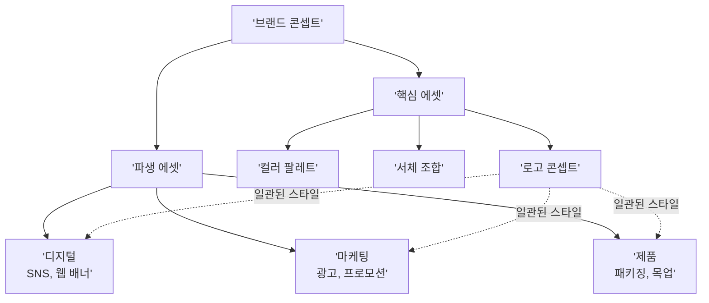
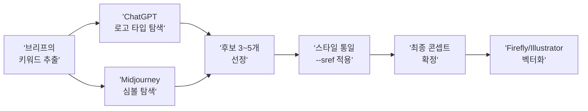
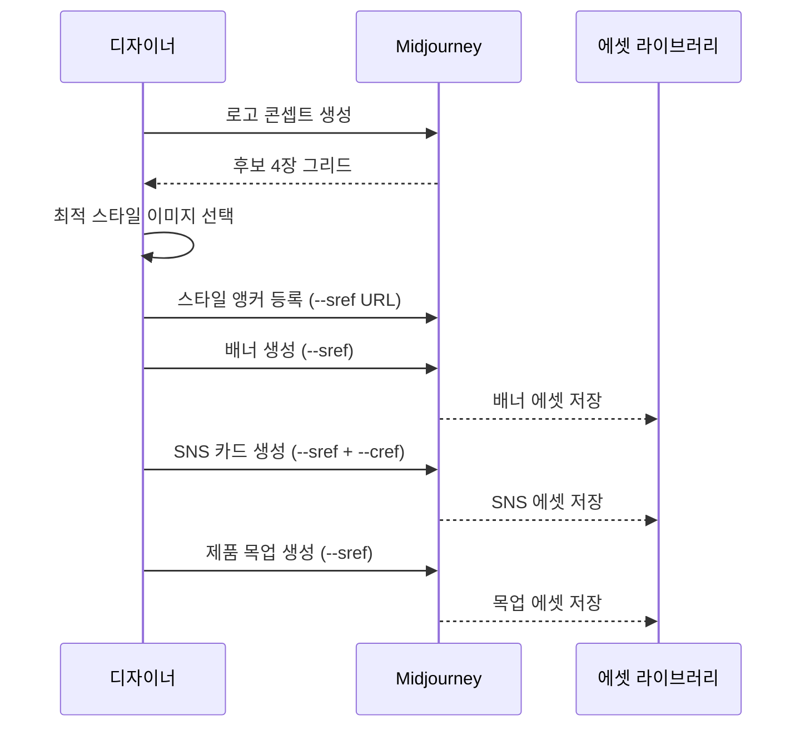

# 브랜드 비주얼 에셋 프로젝트

> 하나의 브랜드 콘셉트에서 로고, 배너, SNS 템플릿, 제품 목업까지 — AI로 일관된 비주얼 에셋 세트를 만듭니다.

## 개요

이 섹션에서는 프로젝트 브리프와 스타일 가이드를 바탕으로 가상 브랜드의 핵심 비주얼 에셋을 실제로 제작합니다. 로고 콘셉트부터 배너, SNS 템플릿, 제품 목업까지 브랜드가 세상에 나갈 때 필요한 시각 자산을 AI 도구들을 조합해 만들어보는 실전 프로젝트입니다. `--sref`와 `--cref` 듀얼 전략으로 모든 에셋의 일관성을 유지하는 방법을 익힙니다.

## 브랜드 비주얼 에셋 체계

브랜드 비주얼 에셋은 **핵심 에셋(Core Assets)**과 **파생 에셋(Derivative Assets)**으로 나뉩니다. 브랜드를 한 사람이라고 생각하면, 로고는 얼굴이고 컬러와 타이포그래피는 옷 스타일이며 배너와 SNS는 그 사람이 서 있는 무대입니다.

| 구분 | 에셋 종류 | 역할 |
|------|-----------|------|
| 핵심 에셋 | 로고 콘셉트, 심볼, 컬러 팔레트, 서체 조합 | 브랜드 정체성의 뼈대 |
| 파생 에셋 — 디지털 | SNS 프로필, 커버 이미지, 포스트 템플릿 | 온라인 존재감 |
| 파생 에셋 — 마케팅 | 배너, 광고 이미지, 프로모션 카드 | 고객 유입 |
| 파생 에셋 — 제품 | 패키징 목업, 굿즈 시안, 매장 사이니지 | 물리적 접점 |



핵심 에셋을 먼저 확정한 뒤 그것을 레퍼런스로 파생 에셋을 생성하는 순서를 반드시 지켜야 합니다. 순서를 뒤집으면 에셋마다 제각각인 브랜드가 됩니다.

## 로고 콘셉트 — AI로 방향 잡기

AI로 로고를 만들 때 가장 흔한 실수는 최종 로고를 AI로 완성하려는 것입니다. AI는 래스터 이미지를 출력하므로 인쇄용 벡터 로고를 직접 만들 수 없지만, **콘셉트 탐색**에는 압도적으로 효과적입니다.

| 플랫폼 | 강점 | 활용법 |
|--------|------|--------|
| ChatGPT (GPT-4o) | 텍스트 렌더링, 대화형 반복 | 브랜드명 포함 로고 타입 탐색 |
| Midjourney | 미학적 완성도, 스타일 제어 | 심볼/아이콘 콘셉트, --sref 변형 탐색 |
| Adobe Firefly | 상업적 안전성, 벡터 변환 용이 | 최종 후보 리파인, Illustrator 연계 |



ChatGPT로 로고를 탐색할 때의 프롬프트 예시입니다.

```
Design a minimalist logo for "Bloom Botanicals", a plant-based skincare brand.
Style: geometric botanical symbol + clean sans-serif logotype.
Colors: sage green (#9CAF88), cream white (#FFF8F0), terracotta accent (#C67B5C).
Mood: natural, premium, scientific elegance.
White background, centered composition.
```


Midjourney에서는 `--stylize` 값을 낮게(50~100) 설정해 프롬프트에 충실한 결과를 얻습니다.

```
minimalist botanical logo mark, single leaf forming letter B, geometric clean lines, sage green and cream palette, white background --ar 1:1 --stylize 50 --v 6.1
```


## --sref + --cref 듀얼 전략

Midjourney의 `--sref`(Style Reference)와 `--cref`(Character Reference)를 동시에 활용하는 것은 브랜드 에셋 제작의 핵심 전략입니다.

| 파라미터 | 제어 대상 | 가중치 파라미터 | 범위 | 기본값 |
|----------|-----------|----------------|------|--------|
| `--sref` | 색감, 질감, 조명, 전체 미학 | `--sw` | 0~1000 | 100 |
| `--cref` | 캐릭터 외형, 얼굴, 체형 | `--cw` | 0~100 | 100 |

**듀얼 전략 적용 순서**:

1단계. **스타일 앵커 확보**: 브랜드 무드보드에서 가장 잘 맞는 이미지를 `--sref`용으로 선정
2단계. **마스코트/캐릭터 고정**: 브랜드 캐릭터가 있다면 최적의 이미지를 `--cref`용으로 선정
3단계. **동시 적용**:

```
botanical skincare product arrangement, soft natural lighting, premium minimal composition --sref [스타일이미지URL] --sw 150 --cref [캐릭터이미지URL] --cw 80 --ar 16:9
```

`--sref random`으로 생성된 코드 중 브랜드에 맞는 것을 발견하면 코드를 기록해두고 모든 에셋에 재사용합니다. 이미지 URL 대신 `--sref 12345`처럼 코드를 사용하면 더 안정적입니다.



## 멀티 플랫폼 에셋 제작

각 에셋 유형마다 최적의 AI 도구와 프롬프트 전략이 다릅니다.

**배너/히어로 이미지** — 웹사이트 상단이나 광고에 사용할 와이드 이미지입니다.

```
botanical skincare ingredients floating in soft light, sage green and cream tones, clean editorial composition, negative space on left for text overlay --ar 16:9 --sref [앵커URL] --sw 150
```


**SNS 포스트 (Instagram 1:1)** — 같은 콘셉트를 정사각형 비율로 변환합니다.

```
flat lay of botanical skincare products on sage green linen, top-down view, soft shadows, minimalist styling --ar 1:1 --sref [앵커URL] --sw 150
```


**Instagram 스토리 (9:16)** — 세로 비율의 모바일 최적화 콘텐츠입니다.

```
vertical botanical pattern, sage green leaves on cream background, seamless elegant pattern for story background --ar 9:16 --sref [앵커URL]
```


**제품 목업 (세럼 병)** — 구체적인 제품 형태를 지정합니다.

```
minimalist glass serum bottle with botanical label, sage green liquid, kraft paper box beside it, soft studio lighting, premium product photography --ar 3:4 --sref [앵커URL] --sw 180
```


**패키징 박스** — 물리적 접점의 브랜드 경험을 시각화합니다.

```
kraft paper skincare packaging box with minimalist botanical illustration, sage green ink on natural paper, premium unboxing moment --ar 1:1 --sref [앵커URL]
```


**텍스트 포함 에셋 (ChatGPT 활용)** — 텍스트 렌더링이 필요한 에셋은 ChatGPT가 유리합니다.

```
Create a promotional card for "Bloom Botanicals" spring launch.
Include the text "Nature Meets Science" as headline.
Sage green (#9CAF88) background, cream white text, botanical leaf accents.
Square format, clean modern layout.
```

## 실습: "Bloom Botanicals" 에셋 세트 제작

가상의 식물 기반 스킨케어 브랜드를 위한 에셋 세트를 단계별로 제작합니다.

**브리프 요약**:
- 브랜드명: Bloom Botanicals
- 콘셉트: "자연에서 찾은 과학적 아름다움"
- 타깃: 25~40세 친환경 소비자
- 컬러: 세이지 그린(#9CAF88), 크림 화이트(#FFF8F0), 테라코타(#C67B5C)

**1단계 — 로고 콘셉트 탐색**: ChatGPT에서 3가지 방향(심볼+산세리프, 미니멀 아이콘, 엠블럼)의 로고 콘셉트를 생성합니다.

**2단계 — 스타일 앵커 확보**: Midjourney에서 `--sref random`을 5~10회 시도하여 브랜드에 맞는 스타일 코드를 발견합니다.

```
natural botanical skincare mood, soft sage green palette, premium minimalist --sref random --ar 1:1
```

**3단계 — 에셋 세트 생성**: 확보한 `--sref`를 모든 프롬프트에 적용하며 다음 에셋을 생성합니다.

| 에셋 | 비율 | 플랫폼 | 핵심 키워드 |
|------|------|--------|-------------|
| 웹 히어로 배너 | --ar 16:9 | Midjourney | botanical ingredients, soft light, negative space |
| Instagram 포스트 | --ar 1:1 | Midjourney/ChatGPT | product flat lay, sage green background |
| Instagram 스토리 | --ar 9:16 | Midjourney | vertical botanical pattern |
| 제품 목업 (세럼 병) | --ar 3:4 | Midjourney | glass serum bottle, minimalist |
| 패키징 박스 | --ar 1:1 | Midjourney | kraft paper box, botanical print |

**4단계 — 일관성 검증**: 생성된 모든 에셋을 한 화면에 모아 컬러 톤 일관성, 브랜드 통일감, 약한 에셋의 파라미터 조정 필요 여부를 확인합니다.


## 팁과 주의사항

- **AI 로고는 콘셉트 전용**: AI 생성 이미지는 래스터 포맷이라 확대하면 깨집니다. 최종 로고는 반드시 Illustrator 등으로 벡터 재제작하세요.
- **--sw 값은 120~200 사이**: 기본값(100)보다 살짝 높으면 스타일이 잘 적용됩니다. 500 이상은 프롬프트 내용을 압도하므로 주의하세요.
- **단계적으로 제작**: 핵심 에셋(로고 + 컬러 확인용 1~2장) → 검증 → 파생 에셋 확장 순서로 진행하세요. 중간 검증 없이 20장을 한꺼번에 만들면 초반 방향이 틀렸을 때 전부 재작업입니다.
- **sref random 코드 메모 필수**: `--sref random`으로 마음에 드는 스타일을 발견하면 즉시 코드를 기록하세요. 같은 코드를 우연히 다시 만나기는 거의 불가능합니다.
- **플랫폼 간 스타일 통일**: Midjourney에서 스타일 앵커를 잡고, 그 결과물을 ChatGPT나 Firefly에 참조 이미지로 업로드하면 플랫폼 간 스타일 차이를 줄일 수 있습니다.
- **다중 스타일 레퍼런스**: `--sref urlA::2 urlB::3`처럼 여러 이미지를 가중치와 함께 조합할 수 있습니다.

## 핵심 정리

| 개념 | 설명 |
|------|------|
| 핵심 에셋 vs 파생 에셋 | 로고, 컬러, 서체가 핵심이고 배너, SNS, 목업은 핵심에서 파생 |
| AI 로고의 한계 | 콘셉트 탐색에 최적, 최종 로고는 벡터 재제작 필수 |
| --sref(Style Reference) | 색감, 질감, 분위기를 고정하는 스타일 앵커, --sw로 강도 조절 |
| --cref(Character Reference) | 캐릭터 외형을 고정, --cw로 강도 조절 |
| 듀얼 전략 | --sref + --cref 동시 적용으로 스타일과 캐릭터 모두 일관 유지 |
| sref 코드 | 숫자 코드로 스타일 영구 저장, --sref random으로 탐색 |
| 멀티 플랫폼 전략 | 도구의 강점에 맞춰 에셋 유형별로 플랫폼 배분 |
| 일관성 검증 | 모든 에셋을 한 화면에 모아 컬러, 톤, 무드 통일성 확인 |

## 다음 섹션 미리보기

브랜드 에셋 세트가 완성되었다면, 다음은 이것을 활용한 **캠페인 비주얼과 영상 콘텐츠 제작**입니다. 브랜드 에셋을 기반으로 시즌 캠페인 이미지를 제작하고, Midjourney 영상 생성 기술을 활용해 짧은 브랜드 모션 클립까지 만들어봅니다.
