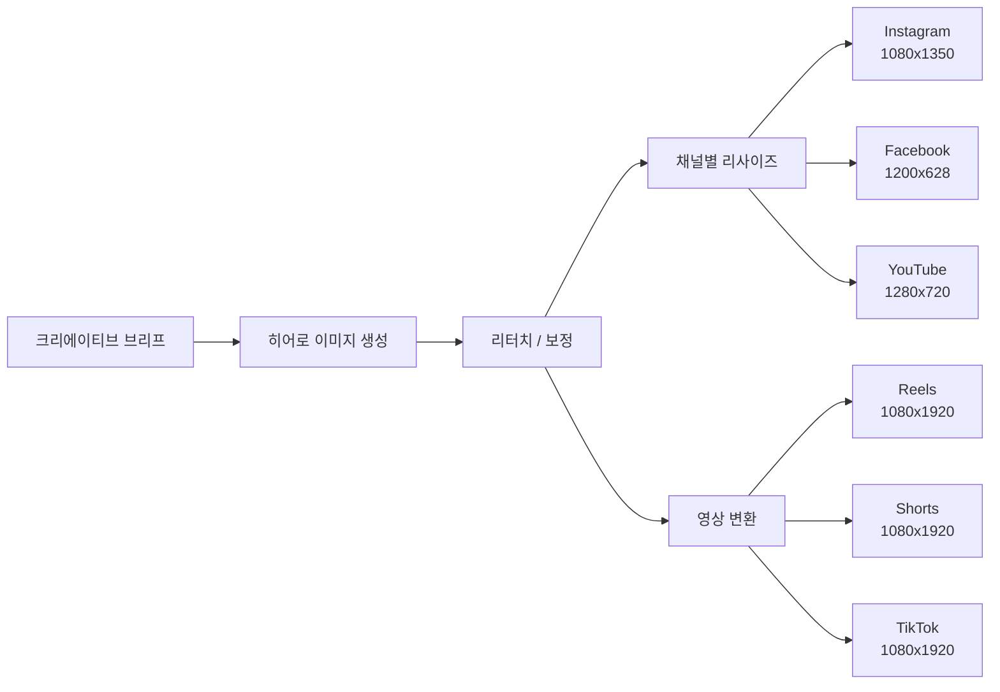
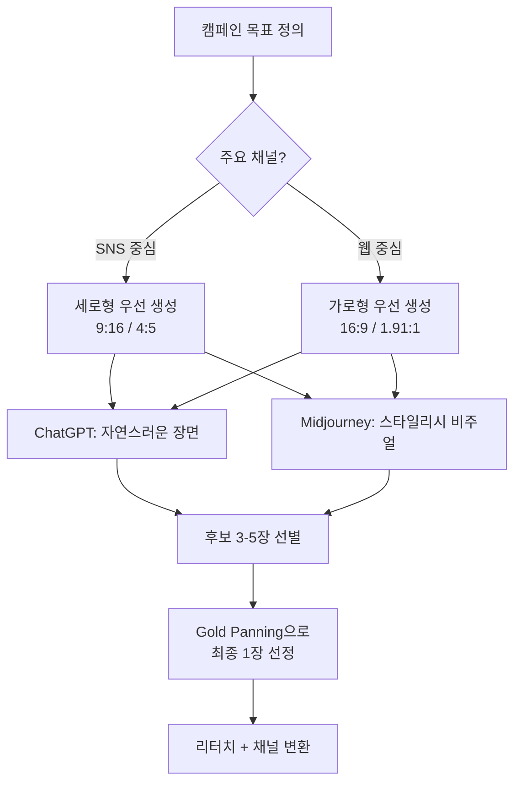
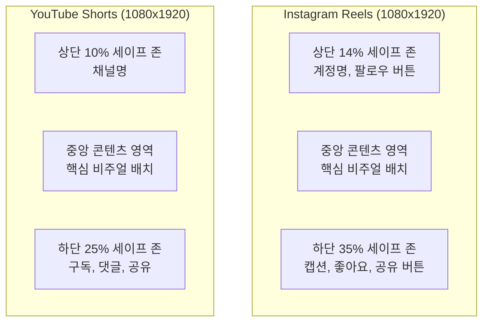

# 03. 캠페인 비주얼과 영상 콘텐츠 제작

> 하나의 콘셉트에서 출발해 수십 개의 채널 최적화 에셋을 만들어내는 것이 AI 시대 캠페인의 핵심이다.

## 개요

이 섹션에서는 브랜드 에셋을 기반으로 **실제 마케팅 캠페인에 투입할 히어로 이미지와 숏폼 영상**을 제작합니다. 단일 콘셉트에서 Instagram, YouTube, Facebook 등 채널별 최적 사이즈로 변환하고, Midjourney 영상 생성으로 정지 이미지를 숏폼 영상으로 전환하는 전 과정을 다룹니다.

## 캠페인 비주얼 파이프라인

캠페인 비주얼 파이프라인은 **단일 크리에이티브 콘셉트**에서 출발하여 다양한 채널에 맞는 에셋을 체계적으로 생산하는 워크플로우입니다.



### 채널별 비주얼 스펙

| 채널 | 사이즈 | 비율 | 유형 |
|------|--------|------|------|
| Instagram Feed | 1080x1350 | 4:5 | 이미지 |
| Instagram Story | 1080x1920 | 9:16 | 이미지/영상 |
| Instagram Reels | 1080x1920 | 9:16 | 영상 (최대 3분) |
| Facebook Feed | 1200x628 | 1.91:1 | 이미지 |
| YouTube Thumbnail | 1280x720 | 16:9 | 이미지 |
| YouTube Shorts | 1080x1920 | 9:16 | 영상 (최대 60초) |
| Web Hero | 1920x1080 | 16:9 | 이미지 |

## 히어로 이미지 생성 전략

히어로 이미지는 캠페인의 **핵심 비주얼**입니다. 이 한 장에서 나머지 모든 에셋이 파생되므로, 가장 공을 들여야 하는 단계입니다.



### Midjourney 히어로 프롬프트 (16:9 웹 히어로)

```
a woman in a sunlit botanical garden, holding a glass serum bottle
with golden liquid, dewdrops on petals, serene, luxurious, natural,
golden hour atmosphere, commercial photography, editorial quality,
soft volumetric lighting, shallow depth of field,
8k --ar 16:9 --v 7 --s 300 --sref [브랜드 코드]
```


### ChatGPT 히어로 프롬프트

```
Create a high-end commercial photograph: a woman in a sunlit
botanical garden, holding a glass serum bottle with golden liquid,
dewdrops on petals. The mood should be serene, luxurious, natural.
Use soft, volumetric lighting with a shallow depth of field.
The image should feel like an editorial spread in a luxury magazine.
Aspect ratio: 16:9.
```

### Instagram Feed 프롬프트 (4:5 세로형)

```
a woman in a sunlit botanical garden, holding a glass serum bottle
with golden liquid, dewdrops on petals, serene, luxurious, natural
atmosphere, commercial photography, centered composition,
soft golden lighting --ar 4:5 --v 7 --s 300
--sref [브랜드 코드] --style raw
```


### 세로형 영상용 프롬프트 (9:16 Reels/Shorts)

```
a woman in a sunlit botanical garden, holding a glass serum bottle
with golden liquid, dewdrops on petals, serene, luxurious, natural
atmosphere, cinematic vertical composition, subject centered in frame,
top and bottom 30 percent should be background only,
soft bokeh --ar 9:16 --v 7 --s 250 --sref [브랜드 코드]
```


### Facebook 광고 프롬프트 (1.91:1 가로형)

```
a woman in a sunlit botanical garden, holding a glass serum bottle
with golden liquid, dewdrops on petals, serene, luxurious atmosphere,
commercial photography, wide composition with negative space on right,
soft lighting --ar 191:100 --v 7 --s 300 --sref [브랜드 코드]
```

### YouTube 썸네일 프롬프트 (16:9 + 텍스트 공간)

```
a woman in a sunlit botanical garden, holding a glass serum bottle
with golden liquid, serene, luxurious atmosphere,
commercial photography, editorial quality,
soft volumetric lighting, shallow depth of field,
negative space on the right side for text overlay,
8k --ar 16:9 --v 7 --s 300 --sref [브랜드 코드]
```


## 채널별 세이프 존

각 플랫폼은 UI 요소(프로필 아이콘, 좋아요 버튼, 캡션 영역)가 이미지 위에 겹치기 때문에, 핵심 요소가 가려지지 않는 영역을 확보해야 합니다.



16:9 가로형 이미지를 9:16 세로로 단순 크롭하면 핵심 피사체가 잘려나갑니다. 주요 비율(16:9, 4:5, 9:16)별로 **처음부터 다른 프롬프트**를 사용하는 것이 가장 좋습니다.

### 세이프 존 대응 프롬프트 (Instagram Reels)

```
[기본 프롬프트], subject centered in upper half of frame,
bottom third should be background only,
no important elements near edges
--ar 9:16 --v 7 --s 250
```

### 세이프 존 대응 프롬프트 (YouTube Shorts)

```
[기본 프롬프트], subject centered in middle of frame,
bottom quarter should be soft bokeh background,
top area clean without text or details
--ar 9:16 --v 7 --s 250
```

## Midjourney 영상 변환

Midjourney V1 영상 모델은 **이미지를 입력받아 5초 영상 클립을 생성**하며, 4초 단위로 최대 21초까지 확장할 수 있습니다.

| 채널 | 권장 Motion | 권장 길이 | 크레딧 | 핵심 주의사항 |
|------|------------|----------|--------|-------------|
| Instagram Reels | Low | 5~9초 | 8~12 | 하단 35% 비움, 루프 재생 고려 |
| YouTube Shorts | High | 15~17초 | 16~20 | 하단 25% 비움, 역동적 무브먼트 |
| TikTok | High | 9~13초 | 12~16 | 스크롤 후킹 3초 내, 하단 20% 비움 |
| Instagram Story | Low | 5초 | 8 | 상단 14% + 하단 20% 비움 |

### 영상 변환 프롬프트 (Low Motion - 제품 포커스)

```
/video [이미지 URL] --motion low
```

생성된 5초 클립에서 자연스러운 움직임(바람에 흔들리는 꽃잎, 빛의 변화)이 나오면 성공입니다.

### 영상 확장 프롬프트

```
/video [영상 URL] --extend
```

4초씩 확장하여 Reels용 9초, Shorts용 17초 영상을 만들 수 있습니다.

### 영상 변환용 이미지 최적화 프롬프트

```
a woman in a sunlit botanical garden, holding a glass serum bottle,
gentle breeze moving through leaves, soft particle dust in sunlight,
cinematic still moment, photorealistic,
minimal text or graphics in frame
--ar 9:16 --v 7 --s 200
```


움직임 힌트를 프롬프트에 포함하면(gentle breeze, particle dust) 영상 변환 시 더 자연스러운 모션이 생성됩니다.

## 실습: Summer Bloom 캠페인 파이프라인

가상 스킨케어 브랜드 "Bloom Botanics"의 여름 캠페인을 실행해봅시다.

**캠페인 브리프**
- 캠페인명: Summer Bloom 2026
- 목표: 신제품 보태니컬 세럼 런칭 (인지도)
- 타깃: 25-35세 여성, 클린뷰티 관심층
- 무드: serene, luxurious, natural, golden hour
- 브랜드 컬러: #D4A574 (골드), #2D5016 (딥그린), #F5E6D3 (크림)

**Step 1: 히어로 이미지 생성** — Midjourney에서 아래 프롬프트로 4장 생성 후 Gold Panning으로 최종 1장 선정

```
a woman in a sunlit botanical garden, holding a glass serum bottle
with golden liquid, dewdrops on petals around her,
serene, luxurious, natural, golden hour atmosphere,
commercial photography, editorial quality,
soft volumetric lighting, shallow depth of field,
8k --ar 16:9 --v 7 --s 300 --sref [브랜드 코드]
```

**Step 2: 채널별 변형 프롬프트 생성** — 위 표의 비율별로 프롬프트를 조정하여 각 채널용 이미지를 별도 생성합니다.

**Step 3: 영상 변환** — 세로형(9:16) 이미지를 Midjourney V1으로 변환

```
/video [세로형 이미지 URL] --motion low
```

**Step 4: 영상 확장** — 5초 클립을 채널별 권장 길이로 확장

```
/video [5초 클립 URL] --extend
```


**비용 추정**

| 채널 | 영상 길이 | 예상 크레딧 |
|------|----------|------------|
| Instagram Reels | 9초 | 12.0 |
| YouTube Shorts | 17초 | 20.0 |
| TikTok | 13초 | 16.0 |
| Instagram Story | 5초 | 8.0 |
| **합계** | | **56.0** |

## 팁과 주의사항

> **세이프 존 필수 확인**: Instagram Reels의 세이프 존은 하단 35%까지 차지합니다. 화면의 1/3 이상이므로, 제품이나 핵심 텍스트를 이미지 중앙~상단에 배치하세요. 프롬프트에 "subject centered in upper half of frame, bottom third should be background only"를 추가하면 생성 단계에서 예방할 수 있습니다.

> **채널별 별도 생성 권장**: 하나의 이미지를 단순 리사이즈하면 핵심 피사체가 잘리거나 구도가 어색해집니다. 주요 비율(16:9, 4:5, 9:16)별로 처음부터 다른 프롬프트를 사용하세요.

> **영상 크레딧 사전 계산**: Midjourney V1 영상 모델은 이미지 1장 대비 8배 크레딧을 소모합니다. 캠페인 전체에 필요한 영상 수와 확장 횟수를 미리 계산하지 않으면 월 크레딧을 빠르게 소진합니다.

> **영상 변환 이미지 팁**: 움직임 힌트(gentle breeze, flowing fabric, soft particles)를 원본 이미지 프롬프트에 포함하면 영상 전환 시 더 자연스러운 모션을 얻을 수 있습니다. 텍스트나 로고가 포함된 이미지는 영상 변환 시 왜곡되므로 피하세요.

## 핵심 정리

| 개념 | 설명 |
|------|------|
| 캠페인 비주얼 파이프라인 | 단일 콘셉트 → 히어로 생성 → 리터치 → 채널별 변환 → 영상 전환의 체계적 워크플로우 |
| 히어로 이미지 | 캠페인의 대표 비주얼. 모든 채널 에셋의 원본이 되므로 가장 높은 품질로 생성 |
| 채널별 스펙 | Instagram Feed 4:5, Story/Reels 9:16, Facebook 1.91:1, YouTube 16:9 등 |
| 세이프 존 | UI 요소가 겹치는 영역. Instagram Reels 하단 35%, YouTube Shorts 하단 25% |
| Midjourney V1 영상 | Image-to-Video 모델. 5초 기본, 4초씩 최대 21초 확장. Low/High Motion 선택 |
| 스마트 크롭 | 종횡비가 다른 채널로 변환 시 중앙 기준 크롭 후 리사이즈하는 기법 |

## 다음 섹션 미리보기

캠페인 비주얼을 만들었다면, 이제 **법적으로 안전하게 사용할 수 있는지** 확인할 차례입니다. 다음 섹션에서는 AI 생성 이미지의 저작권 이슈, 각 플랫폼의 상업적 사용 약관, 윤리적 가이드라인을 정리합니다.
