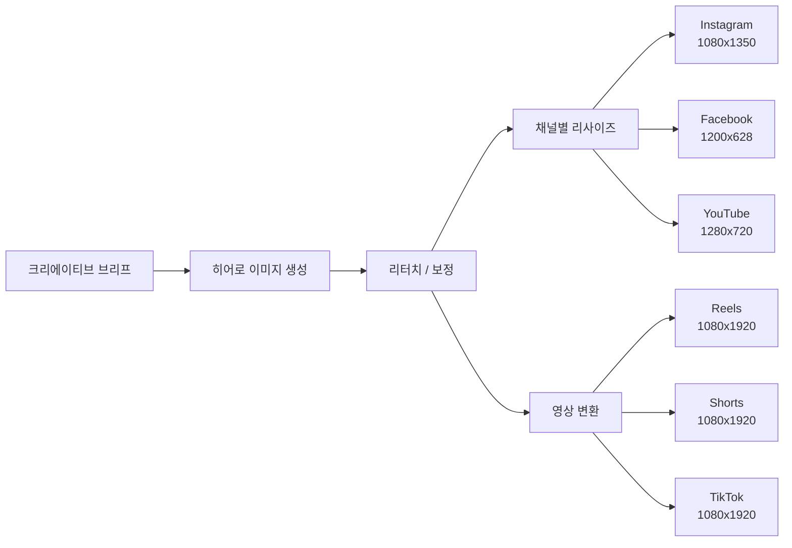
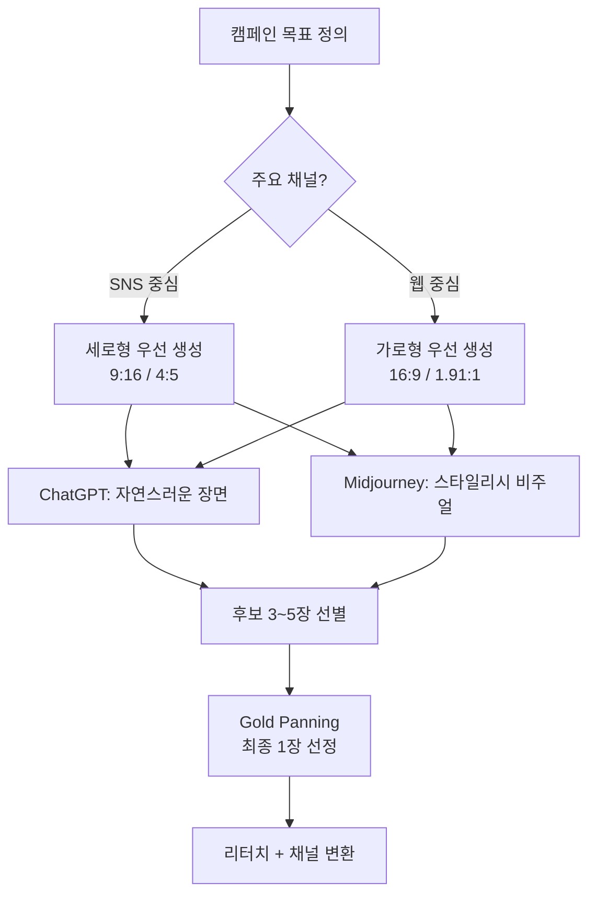
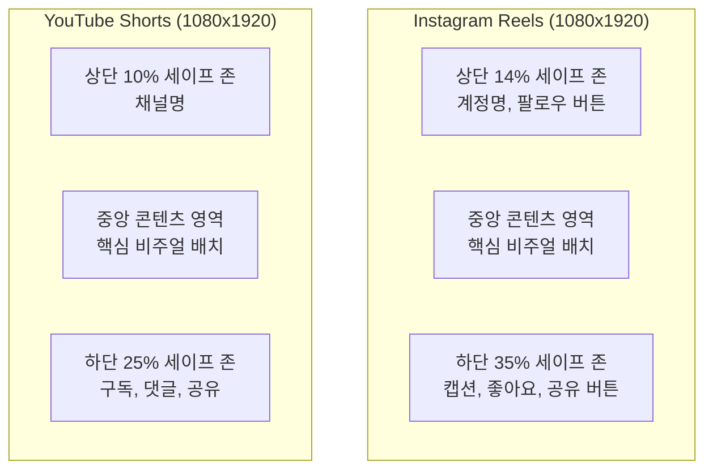
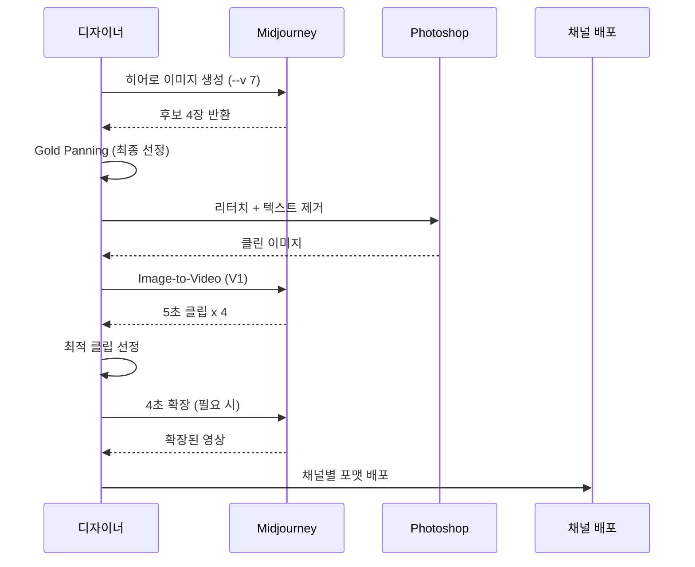
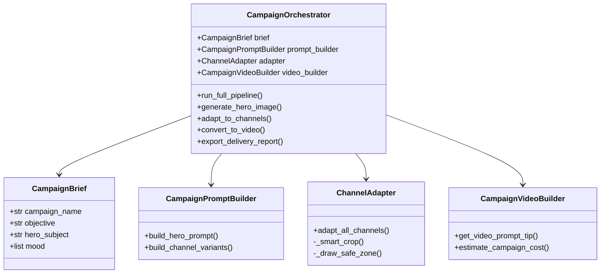

# 03. 캠페인 비주얼과 영상 콘텐츠 제작

> 마케팅 캠페인의 히어로 이미지부터 숏폼 영상까지, AI 생성 → 리터치 → 영상 변환의 풀 파이프라인을 채널별로 최적화하여 실행합니다.

## 개요

이 섹션에서는 앞서 만든 브랜드 에셋을 기반으로 **실제 마케팅 캠페인에 투입할 히어로 이미지와 숏폼 영상**을 제작합니다. 단일 콘셉트에서 출발해 Instagram, YouTube, Facebook 등 채널별 최적 사이즈로 변환하고, Midjourney의 영상 생성 기능으로 정지 이미지에 생명을 불어넣는 전 과정을 다룹니다.

**선수 지식**: [브랜드 비주얼 에셋 프로젝트](12-실전-포트폴리오-프로젝트/02-02-브랜드-비주얼-에셋-프로젝트.md)에서 다룬 `brand_asset_kit`과 `sref_cref_strategy`, [숏폼 영상 콘텐츠 제작 프로젝트](10-midjourney-영상-생성/05-05-숏폼-영상-콘텐츠-제작-프로젝트.md)에서 배운 Midjourney 영상 생성 기초

**학습 목표**:
- 캠페인 비주얼 파이프라인의 전체 흐름을 설계하고 자동화할 수 있다
- 히어로 이미지를 생성하고 채널별 사이즈로 최적화할 수 있다
- Midjourney V1 영상 모델로 정지 이미지를 숏폼 영상으로 변환할 수 있다
- 채널별 세이프 존과 UI 오버레이 차이를 반영한 콘텐츠를 제작할 수 있다

## 왜 알아야 할까?

2026년 현재, 마케팅 팀이 하나의 캠페인을 런칭할 때 필요한 비주얼 에셋은 평균 **20~50개**에 달합니다. Instagram 피드, 스토리, 릴스, Facebook 광고, YouTube 썸네일과 Shorts, 웹사이트 히어로 배너까지 — 같은 메시지를 전달하면서도 **채널마다 다른 사이즈와 포맷**으로 제작해야 하죠.

전통적으로 이 작업은 디자이너가 하나하나 리사이즈하고 레이아웃을 조정하며 수일이 걸렸습니다. 하지만 AI 이미지 생성과 자동화 파이프라인을 결합하면, **하나의 콘셉트에서 출발해 수십 개의 채널 최적화 에셋을 몇 시간 안에** 만들어낼 수 있습니다. 여기에 Midjourney의 영상 생성까지 더하면, 정지 이미지가 스크롤을 멈추게 하는 숏폼 영상으로 변신합니다.

이번 섹션은 그 전체 파이프라인을 처음부터 끝까지 직접 구축하는 시간입니다.

## 핵심 개념

### 개념 1: 캠페인 비주얼 파이프라인 — 하나에서 수십 개로

> 💡 **비유**: 요리사가 하나의 레시피로 도시락, 코스 요리, 뷔페 메뉴를 만드는 것과 같습니다. 재료(콘셉트)는 같지만, 담는 그릇(채널)에 따라 플레이팅이 달라지는 거죠.

캠페인 비주얼 파이프라인은 **단일 크리에이티브 콘셉트**에서 출발하여 다양한 채널에 맞는 에셋을 체계적으로 생산하는 워크플로우입니다. 핵심은 "한 번 만들고 여러 번 변환"하는 효율성에 있습니다.

> 📊 **그림 1**: 캠페인 비주얼 파이프라인 전체 흐름



파이프라인을 Python으로 구조화하면 각 단계를 독립적으로 관리하고, 새 채널이 추가되어도 설정만 바꾸면 됩니다.

```python
from dataclasses import dataclass, field
from typing import Optional
from enum import Enum

class ChannelType(Enum):
    """지원하는 마케팅 채널"""
    INSTAGRAM_FEED = "instagram_feed"
    INSTAGRAM_STORY = "instagram_story"
    INSTAGRAM_REELS = "instagram_reels"
    FACEBOOK_FEED = "facebook_feed"
    FACEBOOK_STORY = "facebook_story"
    YOUTUBE_THUMBNAIL = "youtube_thumbnail"
    YOUTUBE_SHORTS = "youtube_shorts"
    WEB_HERO = "web_hero"

@dataclass
class ChannelSpec:
    """채널별 이미지/영상 규격"""
    channel: ChannelType
    width: int
    height: int
    aspect_ratio: str
    safe_zone_top: float = 0.0     # 상단 세이프 존 비율
    safe_zone_bottom: float = 0.0  # 하단 세이프 존 비율
    safe_zone_side: float = 0.0    # 좌우 세이프 존 비율
    is_video: bool = False
    max_duration_sec: int = 0      # 영상일 때 최대 길이

# 2026년 기준 채널별 스펙 정의
CHANNEL_SPECS: dict[ChannelType, ChannelSpec] = {
    ChannelType.INSTAGRAM_FEED: ChannelSpec(
        ChannelType.INSTAGRAM_FEED, 1080, 1350, "4:5",
        safe_zone_top=0.0, safe_zone_bottom=0.0
    ),
    ChannelType.INSTAGRAM_STORY: ChannelSpec(
        ChannelType.INSTAGRAM_STORY, 1080, 1920, "9:16",
        safe_zone_top=0.14, safe_zone_bottom=0.20
    ),
    ChannelType.INSTAGRAM_REELS: ChannelSpec(
        ChannelType.INSTAGRAM_REELS, 1080, 1920, "9:16",
        safe_zone_top=0.14, safe_zone_bottom=0.35, safe_zone_side=0.06,
        is_video=True, max_duration_sec=180
    ),
    ChannelType.FACEBOOK_FEED: ChannelSpec(
        ChannelType.FACEBOOK_FEED, 1200, 628, "1.91:1"
    ),
    ChannelType.YOUTUBE_THUMBNAIL: ChannelSpec(
        ChannelType.YOUTUBE_THUMBNAIL, 1280, 720, "16:9"
    ),
    ChannelType.YOUTUBE_SHORTS: ChannelSpec(
        ChannelType.YOUTUBE_SHORTS, 1080, 1920, "9:16",
        safe_zone_top=0.10, safe_zone_bottom=0.25,
        is_video=True, max_duration_sec=60
    ),
    ChannelType.WEB_HERO: ChannelSpec(
        ChannelType.WEB_HERO, 1920, 1080, "16:9"
    ),
}
```

### 개념 2: 히어로 이미지 생성 전략 — 캠페인의 얼굴

> 💡 **비유**: 히어로 이미지는 영화 포스터와 같습니다. 한 장의 이미지가 전체 캠페인의 톤, 메시지, 감정을 압축해서 전달해야 하죠. 관객이 포스터를 보고 "이 영화 봐야겠다"고 느끼는 것처럼, 사용자가 히어로 이미지를 보고 스크롤을 멈추게 만들어야 합니다.

히어로 이미지는 캠페인의 **핵심 비주얼**입니다. 이 한 장에서 나머지 모든 에셋이 파생되므로, 가장 공을 들여야 하는 단계입니다. [프롬프트 해부학 6요소 프레임워크](02-프롬프트-구조-마스터/01-01-프롬프트-해부학-6요소-프레임워크.md)에서 배운 구조를 캠페인 맥락에 맞게 확장합니다.

> 📊 **그림 2**: 히어로 이미지 생성 의사결정 흐름



캠페인 프롬프트를 체계적으로 관리하는 `CampaignPromptBuilder`를 만들어봅시다.

```python
@dataclass
class CampaignBrief:
    """캠페인 크리에이티브 브리프"""
    campaign_name: str
    objective: str           # 인지도, 전환, 참여 등
    target_audience: str
    key_message: str
    mood: list[str]          # 감정 키워드
    brand_colors: list[str]  # 헥스 코드
    style_reference: str     # --sref용 URL 또는 코드
    hero_subject: str        # 히어로 이미지의 주제
    cta_text: str            # Call-to-Action 문구

@dataclass
class CampaignPromptBuilder:
    """캠페인 브리프에서 플랫폼별 프롬프트를 생성"""
    brief: CampaignBrief
    
    def build_hero_prompt(self, platform: str = "midjourney") -> str:
        """히어로 이미지용 메인 프롬프트 생성"""
        mood_str = ", ".join(self.brief.mood)
        
        if platform == "midjourney":
            prompt = (
                f"{self.brief.hero_subject}, "
                f"{mood_str} atmosphere, "
                f"commercial photography, editorial quality, "
                f"soft volumetric lighting, shallow depth of field, "
                f"8k resolution --ar 16:9 --v 7 --s 300 "
                f"--sref {self.brief.style_reference}"
            )
        elif platform == "chatgpt":
            prompt = (
                f"Create a high-end commercial photograph: {self.brief.hero_subject}. "
                f"The mood should be {mood_str}. "
                f"Use soft, volumetric lighting with a shallow depth of field. "
                f"The image should feel like an editorial spread in a luxury magazine. "
                f"Aspect ratio: 16:9."
            )
        elif platform == "gemini":
            prompt = (
                f"Generate a photorealistic commercial image of {self.brief.hero_subject}. "
                f"Mood: {mood_str}. Style: high-end editorial photography. "
                f"Lighting: soft volumetric. Color palette: warm tones with "
                f"brand accent colors. 16:9 aspect ratio."
            )
        return prompt
    
    def build_channel_variants(self) -> dict[str, str]:
        """채널별 프롬프트 변형 생성"""
        base = self.build_hero_prompt()
        variants = {}
        
        # Instagram 피드: 4:5 세로형
        variants["instagram_feed"] = base.replace(
            "--ar 16:9", "--ar 4:5"
        ) + " --style raw"
        
        # Instagram 스토리: 9:16 풀스크린
        variants["instagram_story"] = base.replace(
            "--ar 16:9", "--ar 9:16"
        )
        
        # Facebook 피드: 1.91:1 가로형
        variants["facebook_feed"] = base.replace(
            "--ar 16:9", "--ar 191:100"
        )
        
        # YouTube 썸네일: 16:9 + 텍스트 공간
        variants["youtube_thumbnail"] = base + (
            " negative space on the right side for text overlay"
        )
        
        return variants
```

```run:python
# 실제 캠페인 브리프 예시
brief = {
    "campaign_name": "Summer Bloom 2026",
    "objective": "신제품 인지도",
    "hero_subject": "a woman in a sunlit garden holding a botanical skincare bottle",
    "mood": ["serene", "luxurious", "natural"],
    "style_reference": "random_code_1234",
    "platform": "midjourney"
}

mood_str = ", ".join(brief["mood"])
prompt = (
    f"{brief['hero_subject']}, "
    f"{mood_str} atmosphere, "
    f"commercial photography, editorial quality, "
    f"soft volumetric lighting, shallow depth of field, "
    f"8k resolution --ar 16:9 --v 7 --s 300 "
    f"--sref {brief['style_reference']}"
)

print("=== Hero Prompt ===")
print(prompt)
print(f"\n총 길이: {len(prompt)}자")
```

```output
=== Hero Prompt ===
a woman in a sunlit garden holding a botanical skincare bottle, serene, luxurious, natural atmosphere, commercial photography, editorial quality, soft volumetric lighting, shallow depth of field, 8k resolution --ar 16:9 --v 7 --s 300 --sref random_code_1234

총 길이: 252자
```

### 개념 3: 채널별 리사이즈와 세이프 존 — 같은 그림, 다른 무대

> 💡 **비유**: 같은 공연이라도 소극장, 야외무대, TV 방송에서는 조명과 카메라 앵글이 달라집니다. 비주얼 에셋도 마찬가지로 — 같은 이미지를 Instagram, Facebook, YouTube에 올릴 때 각 플랫폼의 "무대 규격"에 맞춰야 합니다.

채널 최적화에서 가장 중요한 개념이 **세이프 존(Safe Zone)**입니다. 각 플랫폼은 UI 요소(프로필 아이콘, 좋아요 버튼, 캡션 영역)가 이미지 위에 겹치기 때문에, 핵심 요소가 가려지지 않는 영역을 확보해야 합니다.

> 📊 **그림 3**: 플랫폼별 세이프 존 비교



Pillow를 사용해 히어로 이미지를 채널별로 자동 리사이즈하는 시스템을 만들어봅시다.

```python
from PIL import Image, ImageDraw, ImageFont
from pathlib import Path

@dataclass
class ChannelAdapter:
    """히어로 이미지를 채널별 규격으로 변환"""
    hero_image_path: str
    output_dir: str = "campaign_output"
    
    def _smart_crop(self, img: Image.Image, target_w: int, target_h: int) -> Image.Image:
        """중앙 기준 스마트 크롭 + 리사이즈"""
        img_ratio = img.width / img.height
        target_ratio = target_w / target_h
        
        if img_ratio > target_ratio:
            # 이미지가 더 넓음 → 좌우 크롭
            new_w = int(img.height * target_ratio)
            left = (img.width - new_w) // 2
            img = img.crop((left, 0, left + new_w, img.height))
        else:
            # 이미지가 더 높음 → 상하 크롭
            new_h = int(img.width / target_ratio)
            top = (img.height - new_h) // 2
            img = img.crop((0, top, img.width, top + new_h))
        
        return img.resize((target_w, target_h), Image.LANCZOS)
    
    def _draw_safe_zone(self, img: Image.Image, spec: ChannelSpec) -> Image.Image:
        """디버그용: 세이프 존을 시각적으로 표시"""
        overlay = img.copy()
        draw = ImageDraw.Draw(overlay, 'RGBA')
        w, h = img.size
        
        # 상단 세이프 존 (빨간색 반투명)
        if spec.safe_zone_top > 0:
            top_h = int(h * spec.safe_zone_top)
            draw.rectangle([0, 0, w, top_h], fill=(255, 0, 0, 60))
        
        # 하단 세이프 존
        if spec.safe_zone_bottom > 0:
            bot_h = int(h * spec.safe_zone_bottom)
            draw.rectangle([0, h - bot_h, w, h], fill=(255, 0, 0, 60))
        
        # 좌우 세이프 존
        if spec.safe_zone_side > 0:
            side_w = int(w * spec.safe_zone_side)
            draw.rectangle([0, 0, side_w, h], fill=(255, 165, 0, 40))
            draw.rectangle([w - side_w, 0, w, h], fill=(255, 165, 0, 40))
        
        return overlay
    
    def adapt_all_channels(
        self,
        channels: list[ChannelType],
        show_safe_zones: bool = False
    ) -> dict[str, str]:
        """히어로 이미지를 지정된 채널들로 변환"""
        hero = Image.open(self.hero_image_path)
        output_dir = Path(self.output_dir)
        output_dir.mkdir(parents=True, exist_ok=True)
        results = {}
        
        for channel in channels:
            spec = CHANNEL_SPECS[channel]
            adapted = self._smart_crop(hero, spec.width, spec.height)
            
            if show_safe_zones:
                adapted = self._draw_safe_zone(adapted, spec)
            
            filename = f"{spec.channel.value}_{spec.width}x{spec.height}.png"
            path = output_dir / filename
            adapted.save(str(path), quality=95)
            results[spec.channel.value] = str(path)
        
        return results
```

```run:python
# 채널별 스펙 요약 출력
specs_data = {
    "Instagram Feed":   {"size": "1080x1350", "ratio": "4:5",    "type": "이미지"},
    "Instagram Story":  {"size": "1080x1920", "ratio": "9:16",   "type": "이미지/영상"},
    "Instagram Reels":  {"size": "1080x1920", "ratio": "9:16",   "type": "영상 (최대 3분)"},
    "Facebook Feed":    {"size": "1200x628",  "ratio": "1.91:1", "type": "이미지"},
    "YouTube Thumbnail":{"size": "1280x720",  "ratio": "16:9",   "type": "이미지"},
    "YouTube Shorts":   {"size": "1080x1920", "ratio": "9:16",   "type": "영상 (최대 60초)"},
    "Web Hero":         {"size": "1920x1080", "ratio": "16:9",   "type": "이미지"},
}

print("=== 2026 채널별 비주얼 스펙 ===\n")
print(f"{'채널':<20} {'사이즈':<12} {'비율':<8} {'유형'}")
print("-" * 60)
for channel, info in specs_data.items():
    print(f"{channel:<20} {info['size']:<12} {info['ratio']:<8} {info['type']}")
```

```output
=== 2026 채널별 비주얼 스펙 ===

채널                 사이즈       비율     유형
------------------------------------------------------------
Instagram Feed       1080x1350    4:5      이미지
Instagram Story      1080x1920    9:16     이미지/영상
Instagram Reels      1080x1920    9:16     영상 (최대 3분)
Facebook Feed        1200x628     1.91:1   이미지
YouTube Thumbnail    1280x720     16:9     이미지
YouTube Shorts       1080x1920    9:16     영상 (최대 60초)
Web Hero             1920x1080    16:9     이미지
```

### 개념 4: Midjourney 영상 변환 — 정지 이미지에 숨결 불어넣기

> 💡 **비유**: 사진첩의 사진이 해리포터의 움직이는 초상화처럼 살아 움직이기 시작하는 것을 상상해보세요. Midjourney V1 영상 모델이 바로 그 마법을 부립니다.

Midjourney는 2025년 6월 V1 영상 모델을 출시했습니다. 이 모델은 **이미지를 입력받아 5초 영상 클립을 생성**하며, 4초 단위로 최대 21초까지 확장할 수 있습니다. [Midjourney 비디오 모델 소개](10-midjourney-영상-생성/01-01-midjourney-비디오-모델-소개.md)에서 배운 기초를 캠페인 실전에 적용해봅시다.

> 📊 **그림 4**: 이미지-to-영상 캠페인 워크플로우



영상 변환 프롬프트와 설정을 관리하는 클래스를 구축합니다.

```python
@dataclass
class VideoConversionConfig:
    """Midjourney 영상 변환 설정"""
    motion_level: str = "low"    # "low" 또는 "high"
    target_duration: int = 5     # 초 단위 (5, 9, 13, 17, 21)
    extend_count: int = 0        # 확장 횟수 (4초씩)
    
    @property
    def total_duration(self) -> int:
        return self.target_duration + (self.extend_count * 4)
    
    @property
    def estimated_credits(self) -> float:
        """영상 생성에 필요한 예상 크레딧 (이미지 대비 8배)"""
        base_credits = 8.0  # 이미지 1장 = 1 크레딧, 영상 = 8 크레딧
        extend_credits = self.extend_count * 4.0
        return base_credits + extend_credits

@dataclass
class CampaignVideoBuilder:
    """캠페인용 영상 변환 파이프라인"""
    brief: CampaignBrief
    
    # 채널별 권장 영상 설정
    CHANNEL_VIDEO_PRESETS: dict = field(default_factory=lambda: {
        "instagram_reels": VideoConversionConfig(
            motion_level="low", target_duration=5, extend_count=1  # 9초
        ),
        "youtube_shorts": VideoConversionConfig(
            motion_level="high", target_duration=5, extend_count=3  # 17초
        ),
        "tiktok": VideoConversionConfig(
            motion_level="high", target_duration=5, extend_count=2  # 13초
        ),
        "instagram_story": VideoConversionConfig(
            motion_level="low", target_duration=5, extend_count=0   # 5초
        ),
    })
    
    def get_video_prompt_tip(self, channel: str) -> str:
        """채널별 영상 전환 시 유의사항"""
        tips = {
            "instagram_reels": (
                "- Low Motion 권장: 제품 클로즈업에 은은한 움직임\n"
                "- 상단 14% + 하단 35%에 핵심 요소 배치 금지\n"
                "- 5~9초가 완성도 높음 (루프 재생 고려)"
            ),
            "youtube_shorts": (
                "- High Motion 가능: 역동적 카메라 무브먼트\n"
                "- 하단 25%에 구독/좋아요 버튼 겹침 주의\n"
                "- 15~17초 권장 (짧지만 임팩트 있게)"
            ),
            "tiktok": (
                "- High Motion 권장: 트렌디하고 다이내믹한 무브\n"
                "- 9~15초 최적 (스크롤 후킹 3초 내 결정)\n"
                "- 하단 20%에 텍스트/로고 배치 금지"
            ),
        }
        return tips.get(channel, "일반 설정 사용")
    
    def estimate_campaign_cost(self, channels: list[str]) -> dict:
        """캠페인 전체 영상 크레딧 예상"""
        total = 0.0
        breakdown = {}
        for ch in channels:
            config = self.CHANNEL_VIDEO_PRESETS.get(ch)
            if config:
                cost = config.estimated_credits
                breakdown[ch] = {
                    "duration": f"{config.total_duration}초",
                    "credits": cost
                }
                total += cost
        breakdown["total_credits"] = total
        return breakdown
```

### 개념 5: 멀티 채널 배포 자동화 — 한 번에 끝내기

> 💡 **비유**: 출판사가 같은 원고로 하드커버, 페이퍼백, e-book, 오디오북을 한꺼번에 내는 것처럼, 하나의 캠페인 콘셉트에서 모든 채널 에셋을 동시에 찍어내는 자동화 시스템입니다.

전체 파이프라인을 하나로 엮는 오케스트레이터를 구축합니다. 이 클래스는 브리프 입력부터 채널별 에셋 출력까지 전 과정을 관리합니다.

> 📊 **그림 5**: 캠페인 오케스트레이터 클래스 구조



```python
import json
from datetime import datetime

@dataclass
class CampaignOrchestrator:
    """캠페인 비주얼 생성 전체 파이프라인 오케스트레이터"""
    brief: CampaignBrief
    output_dir: str = "campaign_output"
    
    def __post_init__(self):
        self.prompt_builder = CampaignPromptBuilder(self.brief)
        self.video_builder = CampaignVideoBuilder(self.brief)
        self.delivery_log: list[dict] = []
    
    def generate_prompts(self) -> dict[str, str]:
        """1단계: 모든 채널용 프롬프트 생성"""
        hero = self.prompt_builder.build_hero_prompt("midjourney")
        variants = self.prompt_builder.build_channel_variants()
        
        all_prompts = {"hero_midjourney": hero, **variants}
        
        # 프롬프트 저장
        prompt_path = Path(self.output_dir) / "prompts.json"
        prompt_path.parent.mkdir(parents=True, exist_ok=True)
        with open(prompt_path, "w", encoding="utf-8") as f:
            json.dump(all_prompts, f, ensure_ascii=False, indent=2)
        
        self._log("prompt_generation", f"{len(all_prompts)}개 프롬프트 생성")
        return all_prompts
    
    def adapt_hero_to_channels(
        self,
        hero_path: str,
        channels: list[ChannelType]
    ) -> dict[str, str]:
        """2단계: 히어로 이미지를 채널별로 변환"""
        adapter = ChannelAdapter(hero_path, self.output_dir)
        results = adapter.adapt_all_channels(channels)
        
        self._log("channel_adaptation", f"{len(results)}개 채널 에셋 생성")
        return results
    
    def plan_video_conversions(self, channels: list[str]) -> dict:
        """3단계: 영상 변환 계획 및 비용 추정"""
        cost = self.video_builder.estimate_campaign_cost(channels)
        
        for ch in channels:
            tip = self.video_builder.get_video_prompt_tip(ch)
            self._log("video_plan", f"[{ch}] {tip[:50]}...")
        
        return cost
    
    def export_delivery_report(self) -> str:
        """최종 딜리버리 리포트 생성"""
        report = {
            "campaign": self.brief.campaign_name,
            "generated_at": datetime.now().isoformat(),
            "log": self.delivery_log,
        }
        
        report_path = Path(self.output_dir) / "delivery_report.json"
        with open(report_path, "w", encoding="utf-8") as f:
            json.dump(report, f, ensure_ascii=False, indent=2)
        
        return str(report_path)
    
    def _log(self, phase: str, message: str):
        self.delivery_log.append({
            "phase": phase,
            "message": message,
            "timestamp": datetime.now().isoformat()
        })
```

## 실습: 직접 해보기

가상 스킨케어 브랜드 "Bloom Botanics"의 여름 캠페인을 위한 전체 파이프라인을 실행해봅시다.

```run:python
from dataclasses import dataclass, field
from datetime import datetime
import json

# === 1단계: 캠페인 브리프 정의 ===
campaign = {
    "name": "Summer Bloom 2026",
    "objective": "신제품 보태니컬 세럼 런칭",
    "target": "25-35세 여성, 클린뷰티 관심층",
    "hero_subject": "a woman in a sunlit botanical garden, holding a glass serum bottle with golden liquid, dewdrops on petals",
    "mood": ["serene", "luxurious", "natural", "golden hour"],
    "brand_colors": ["#D4A574", "#2D5016", "#F5E6D3"],
    "sref": "random_code_5678",
}

# === 2단계: 플랫폼별 프롬프트 생성 ===
mood_str = ", ".join(campaign["mood"])
prompts = {}

# Midjourney 히어로 (16:9)
prompts["hero_web"] = (
    f"{campaign['hero_subject']}, {mood_str} atmosphere, "
    f"commercial photography, editorial quality, "
    f"soft volumetric lighting, shallow depth of field, "
    f"8k --ar 16:9 --v 7 --s 300 --sref {campaign['sref']}"
)

# Instagram Feed (4:5)
prompts["instagram_feed"] = (
    f"{campaign['hero_subject']}, {mood_str} atmosphere, "
    f"commercial photography, centered composition, "
    f"soft golden lighting --ar 4:5 --v 7 --s 300 "
    f"--sref {campaign['sref']} --style raw"
)

# YouTube Shorts / Reels (9:16)
prompts["vertical_video"] = (
    f"{campaign['hero_subject']}, {mood_str} atmosphere, "
    f"cinematic vertical composition, subject centered in frame, "
    f"top and bottom 30 percent should be background only, "
    f"soft bokeh --ar 9:16 --v 7 --s 250 --sref {campaign['sref']}"
)

# Facebook 광고 (1.91:1)
prompts["facebook_ad"] = (
    f"{campaign['hero_subject']}, {mood_str} atmosphere, "
    f"commercial photography, wide composition with negative space on right, "
    f"soft lighting --ar 191:100 --v 7 --s 300 --sref {campaign['sref']}"
)

# === 3단계: 결과 출력 ===
print(f"캠페인: {campaign['name']}")
print(f"목표: {campaign['objective']}")
print(f"타깃: {campaign['target']}")
print(f"\n{'='*60}")
print(f"생성된 프롬프트: {len(prompts)}개\n")

for name, prompt in prompts.items():
    print(f"[{name}]")
    print(f"  {prompt[:80]}...")
    print(f"  길이: {len(prompt)}자\n")

# === 4단계: 영상 변환 비용 추정 ===
video_channels = {
    "instagram_reels": {"duration": 9, "credits": 12.0},
    "youtube_shorts": {"duration": 17, "credits": 20.0},
    "tiktok": {"duration": 13, "credits": 16.0},
    "instagram_story": {"duration": 5, "credits": 8.0},
}

print(f"{'='*60}")
print("영상 변환 비용 추정\n")
total_credits = 0
for ch, info in video_channels.items():
    print(f"  {ch:<20} {info['duration']:>2}초  {info['credits']:>5.1f} 크레딧")
    total_credits += info["credits"]
print(f"  {'합계':<20} {'':>3}  {total_credits:>5.1f} 크레딧")
```

```output
캠페인: Summer Bloom 2026
목표: 신제품 보태니컬 세럼 런칭
타깃: 25-35세 여성, 클린뷰티 관심층

============================================================
생성된 프롬프트: 4개

[hero_web]
  a woman in a sunlit botanical garden, holding a glass serum bottle with golden...
  길이: 246자

[instagram_feed]
  a woman in a sunlit botanical garden, holding a glass serum bottle with golden...
  길이: 237자

[vertical_video]
  a woman in a sunlit botanical garden, holding a glass serum bottle with golden...
  길이: 285자

[facebook_ad]
  a woman in a sunlit botanical garden, holding a glass serum bottle with golden...
  길이: 260자

============================================================
영상 변환 비용 추정

  instagram_reels        9초   12.0 크레딧
  youtube_shorts        17초   20.0 크레딧
  tiktok                13초   16.0 크레딧
  instagram_story        5초    8.0 크레딧
  합계                         56.0 크레딧
```

실제 이미지가 생성된 후 채널별 리사이즈를 실행하는 코드입니다.

```python
from PIL import Image, ImageDraw

# 테스트용 히어로 이미지 생성 (실제로는 AI 생성 이미지 사용)
hero = Image.new("RGB", (1920, 1080), color="#D4A574")
draw = ImageDraw.Draw(hero)
# 중앙에 가상 제품 영역 표시
draw.ellipse([810, 390, 1110, 690], fill="#2D5016")
draw.text((860, 520), "PRODUCT", fill="white")
hero.save("hero_test.png")

# 채널별 리사이즈 실행
target_sizes = {
    "instagram_feed":  (1080, 1350),
    "instagram_story": (1080, 1920),
    "facebook_feed":   (1200, 628),
    "youtube_thumb":   (1280, 720),
    "web_hero":        (1920, 1080),
}

for channel, (w, h) in target_sizes.items():
    # 스마트 크롭: 비율에 맞게 중앙 크롭 후 리사이즈
    img = hero.copy()
    img_ratio = img.width / img.height
    target_ratio = w / h
    
    if img_ratio > target_ratio:
        new_w = int(img.height * target_ratio)
        left = (img.width - new_w) // 2
        img = img.crop((left, 0, left + new_w, img.height))
    else:
        new_h = int(img.width / target_ratio)
        top = (img.height - new_h) // 2
        img = img.crop((0, top, img.width, top + new_h))
    
    result = img.resize((w, h), Image.LANCZOS)
    result.save(f"campaign_output/{channel}_{w}x{h}.png")
    print(f"[완료] {channel}: {w}x{h}")
```

## 더 깊이 알아보기

### Nike의 AI 캠페인 혁명

2024년, Nike는 "Never Done Evolving" 캠페인에서 AI를 전면 도입했습니다. 전통적으로 하나의 글로벌 캠페인 비주얼을 만드는 데 수주가 걸리던 작업을, AI 이미지 생성을 활용해 **며칠 만에 수백 개의 비주얼 탐색**을 완료했죠. 디자이너와 운동선수가 함께 AI 생성 결과를 검토하며 최적의 콘셉트를 골라내는 "인간-AI 협업 모델"을 정립했습니다.

흥미로운 건 Nike가 AI를 **대체**가 아닌 **가속기**로 사용했다는 점입니다. 최종 에셋은 여전히 인간 크리에이터가 다듬었지만, 탐색과 프로토타이핑 단계를 AI가 담당함으로써 크리에이티브 팀이 "고르는 일"에 집중할 수 있었습니다. 이것이 바로 이번 섹션에서 구축하는 파이프라인의 철학이기도 합니다.

### "Hero Image"의 유래

"히어로 이미지"라는 용어는 원래 웹 디자인에서 왔습니다. 2000년대 중반 Apple이 웹사이트 상단에 제품 하나를 크게 띄우는 레이아웃을 대중화하면서, 이 대형 배너 이미지를 "hero shot"이라 부르기 시작했죠. 사진 용어에서 빌려온 이 표현은 — 광고 사진에서 제품의 가장 매력적인 한 컷을 "hero shot"이라 부르던 전통에서 온 것입니다. 지금은 온/오프라인을 막론하고 캠페인의 대표 이미지를 통칭하는 마케팅 표준 용어가 되었습니다.

## 흔한 오해와 팁

> ⚠️ **흔한 오해**: "하나의 이미지를 그냥 리사이즈하면 모든 채널에 쓸 수 있다"고 생각하는 분이 많습니다. 하지만 16:9 가로형 이미지를 9:16 세로로 단순 크롭하면 핵심 피사체가 잘려나갑니다. **채널별 구도를 고려한 별도 생성 또는 스마트 크롭이 필수**입니다. 가능하면 주요 비율(16:9, 4:5, 9:16)별로 처음부터 다른 프롬프트를 사용하세요.

> 💡 **알고 계셨나요?**: Midjourney V1 영상 모델은 이미지 1장 생성 대비 **8배의 크레딧**을 소모합니다. 캠페인 전체에 필요한 영상 수와 확장 횟수를 미리 계산하지 않으면, 월 크레딧을 순식간에 소진할 수 있습니다. 위 실습의 `estimate_campaign_cost()` 같은 비용 추정을 반드시 먼저 실행하세요.

> 🔥 **실무 팁**: Instagram Reels의 세이프 존은 **하단 35%**까지 차지합니다. 이건 화면의 1/3 이상이에요! 제품이나 핵심 텍스트를 이미지 중앙~상단에 배치하는 습관을 들이세요. Midjourney 프롬프트에 "subject centered in upper half of frame, bottom third should be background only"를 추가하면 세이프 존 문제를 생성 단계에서 예방할 수 있습니다.

## 핵심 정리

| 개념 | 설명 |
|------|------|
| 캠페인 비주얼 파이프라인 | 단일 콘셉트 → 히어로 생성 → 리터치 → 채널별 변환 → 영상 전환의 체계적 워크플로우 |
| 히어로 이미지 | 캠페인의 대표 비주얼. 모든 채널 에셋의 원본이 되므로 가장 높은 품질로 생성 |
| 채널별 스펙 | Instagram Feed 4:5, Story/Reels 9:16, Facebook 1.91:1, YouTube 16:9 등 플랫폼마다 다른 규격 |
| 세이프 존 | UI 요소가 겹치는 영역. Instagram Reels 하단 35%, YouTube Shorts 하단 25% 등 |
| Midjourney V1 영상 | Image-to-Video 모델. 5초 기본, 4초씩 최대 21초 확장. Low/High Motion 선택 |
| 스마트 크롭 | 종횡비가 다른 채널로 변환 시 중앙 기준 크롭 후 리사이즈하는 기법 |
| `CampaignOrchestrator` | 브리프 → 프롬프트 → 이미지 변환 → 영상 계획 → 딜리버리까지 관리하는 오케스트레이터 |

## 다음 섹션 미리보기

캠페인 비주얼을 마음껏 만들었다면, 이제 **법적으로 안전하게 사용할 수 있는지** 확인해야 합니다. [AI 비주얼의 저작권·윤리·상업적 활용](12-실전-포트폴리오-프로젝트/04-04-ai-비주얼의-저작권윤리상업적-활용.md)에서는 AI 생성 이미지의 저작권 이슈, 각 플랫폼의 상업적 사용 약관, 윤리적 가이드라인을 정리합니다. 멋진 에셋을 만들고도 법적 문제로 사용하지 못하는 일이 없도록, 반드시 알아둬야 할 내용입니다.

## 참고 자료

- [Midjourney Video 공식 문서](https://docs.midjourney.com/hc/en-us/articles/37460773864589-Video) - V1 영상 모델의 사용법, Motion 설정, 확장 방법 공식 가이드
- [Hootsuite Social Media Image Sizes Guide (2026)](https://blog.hootsuite.com/social-media-image-sizes-guide/) - 매월 업데이트되는 전 플랫폼 이미지/영상 규격 총정리
- [Kapwing Social Media Video Aspect Ratios (2026)](https://www.kapwing.com/resources/social-media-video-aspect-ratios-and-sizes-the-2025-guide/) - 채널별 영상 비율과 세이프 존 가이드
- [Sprout Social Video Specs Guide](https://sproutsocial.com/insights/social-media-video-specs-guide/) - Facebook, Instagram, TikTok, YouTube 등 전 플랫폼 영상 스펙 상세
- [Superside AI Marketing Campaigns 2026](https://www.superside.com/blog/ai-marketing-campaigns) - 2026년 주요 AI 마케팅 캠페인 사례 분석

---
### 🔗 Related Sessions
- [creative_brief](12-실전-포트폴리오-프로젝트/01-01-프로젝트-기획-브리프에서-무드보드까지.md) (prerequisite)
- [moodboard_prompt_builder](12-실전-포트폴리오-프로젝트/01-01-프로젝트-기획-브리프에서-무드보드까지.md) (prerequisite)
- [brand_asset_kit](12-실전-포트폴리오-프로젝트/02-02-브랜드-비주얼-에셋-프로젝트.md) (prerequisite)
- [sref_cref_strategy](12-실전-포트폴리오-프로젝트/02-02-브랜드-비주얼-에셋-프로젝트.md) (prerequisite)
