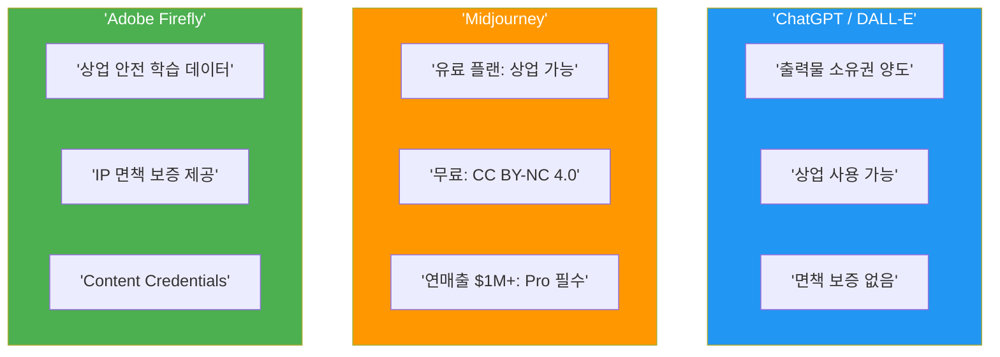
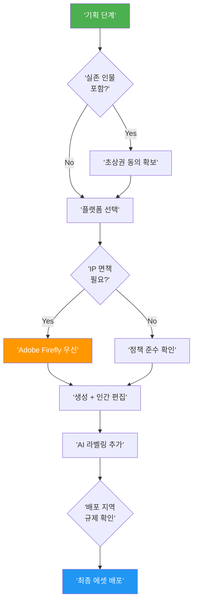

# 04. AI 비주얼의 저작권·윤리·상업적 활용

> AI로 만든 이미지, 과연 내 것일까? — 저작권부터 플랫폼 정책, 윤리적 리스크까지 안전한 활용 가이드

## 개요

AI 생성 이미지를 상업적으로 활용하려면 저작권, 플랫폼 정책, 윤리 규제라는 세 가지 관문을 통과해야 합니다. 이 섹션에서는 각 관문의 핵심 기준을 정리하고, 실무에서 법적 리스크를 최소화하는 워크플로우를 구축합니다.

## AI 생성물의 저작권 — 누가 저작자인가?

미국 저작권청(USCO)은 AI 생성물의 보호 수준을 세 단계로 구분합니다:

1. **순수 AI 생성물**: 저작권 보호 불가 — 프롬프트만 입력한 결과물
2. **AI 보조 창작물**: 사례별 판단 — 인간의 "의미 있는 창작적 기여"가 핵심
3. **AI 도구 활용물**: 보호 가능 — AI를 도구로 활용하고 인간이 최종 표현을 결정


**Thaler v. Perlmutter** 사건이 이 구도를 확정지었습니다. 2025년 D.C. 항소법원이 "저작권법의 저작자는 인간만 해당한다"고 만장일치 판결했고, 2026년 3월 대법원이 상고를 기각하면서 판례가 확정됐습니다.

한국저작권위원회도 2025년 6월 안내서를 통해, 순수 AI 생성물은 저작권 등록이 불가하고 인간의 창작적 기여가 입증되어야 한다는 입장을 밝혔습니다.

### 저작권 보호를 강화하는 프롬프트 전략

AI 결과물에 인간의 창작적 기여를 더하는 실전 접근법입니다.

```
A cozy Korean cafe interior, warm afternoon light streaming through large windows,
wooden furniture with green plants, watercolor painting style with soft edges
```


이 결과물을 Photoshop에서 구도를 재구성하고, 색감을 조정하고, 브랜드 요소를 합성하면 "인간의 창작적 기여"가 인정될 가능성이 높아집니다.

```
Same cafe scene but camera angle shifted to low perspective from table height,
emphasizing the coffee cup in foreground with shallow depth of field,
background patrons softly blurred
```


## 플랫폼별 상업적 사용 정책

각 플랫폼의 정책 차이를 정확히 이해하지 않으면 계약 위반이나 법적 분쟁에 휘말릴 수 있습니다.

| 항목 | ChatGPT | Midjourney | Gemini | Adobe Firefly |
|------|---------|------------|--------|---------------|
| **상업 사용** | 가능 | 유료만 가능 | 가능 | 가능 |
| **소유권** | 사용자 양도 | 사용자 (유료) | 사용자 | 사용자 |
| **IP 면책** | 없음 | 없음 | 없음 | 있음 (최대 $3M) |
| **학습 데이터** | 비공개 | 비공개 | 비공개 | 라이선스/퍼블릭 도메인 |
| **AI 표시** | 메타데이터 | 없음 | SynthID | Content Credentials |
| **대기업 제한** | 없음 | 연매출 $1M+ Pro 필수 | 없음 | 없음 |



### 플랫폼별 상업용 프롬프트 예시

Adobe Firefly에서 IP 면책이 보장되는 상업용 에셋:

```
Professional product photography of a minimalist skincare bottle on marble surface,
soft studio lighting, clean white background, commercial advertising style
```


Midjourney 유료 플랜에서의 브랜드 캠페인 비주얼:

```
Brand campaign hero image, diverse group of young professionals collaborating
in modern open office, natural lighting, editorial photography style --ar 16:9 --v 6
```


## 학습 데이터 윤리와 딥페이크 리스크

**Getty Images v. Stability AI** 판결은 학습 데이터 윤리의 핵심 기준을 제시했습니다. 영국 법원은 AI 모델의 가중치가 학습 이미지의 "복사본"이 아니라고 판단했지만, Getty 워터마크가 재현된 것은 상표권 침해로 인정했습니다. 즉, 학습 과정 자체보다 **출력물이 기존 저작물을 재현하는지**가 더 중요한 판단 기준입니다.

### 글로벌 AI 생성물 규제

| 규제 | 지역 | 핵심 내용 | 시행 시기 |
|------|------|-----------|-----------|
| TAKE IT DOWN Act | 미국 | 비동의 딥페이크 형사처벌, 플랫폼 48시간 삭제 의무 | 2025.05 |
| EU AI Act Art.50 | EU | AI 생성물 기계판독 표시, 딥페이크 라벨링 | 2026.08 |
| AI 기본법 | 한국 | AI 생성물 표시 의무, 고성능 AI 리스크 관리 | 2026.01 |

### 감정 조작 리스크

비주얼 스토리텔링 기법은 브랜드 커뮤니케이션의 강력한 도구이지만, 의도적으로 오용하면 윤리적 문제가 됩니다. 크리에이터로서 핵심 질문: **"이 비주얼이 보는 사람의 감정을 '전달'하는 건가, '조작'하는 건가?"**

감정 전달이 정당한 프롬프트:

```
Heartwarming scene of grandmother teaching grandchild to cook traditional Korean food,
warm kitchen lighting, genuine smiles, documentary photography style
```


감정 조작에 해당할 수 있는 프롬프트 (주의):

```
Elderly person sitting alone in dark room looking desperately at empty medicine bottle,
dramatic shadows emphasizing loneliness and fear, hyper-realistic
```

이런 이미지를 건강보조제 광고에 사용하면 취약 계층의 심리적 약점을 악용하는 감정 조작에 해당할 수 있습니다.

## 안전한 상업 활용 워크플로우



## 실습: 상업용 에셋의 법적 안전성 확보

실제 프로젝트에서 활용할 수 있는 상업용 프롬프트를 단계별로 작성해봅시다.

**Step 1**: Adobe Firefly에서 IP 면책이 보장되는 기본 에셋 생성

```
Clean flat-lay product arrangement of organic tea collection on light wooden table,
overhead shot, natural daylight, minimalist packaging design visible,
commercial catalog photography
```


**Step 2**: 브랜드 톤에 맞게 변형 프롬프트 작성

```
Same tea collection arrangement but with warm autumn color grading,
add dried flowers and cinnamon sticks as props, cozy lifestyle mood,
shallow depth of field focusing on hero product
```


**Step 3**: 캠페인용 히어로 이미지 생성

```
Lifestyle scene of person enjoying tea moment by window on rainy day,
steam rising from ceramic cup, soft focus on rain drops on glass,
warm interior vs cool exterior contrast, editorial magazine style
```


**Step 4**: 소셜미디어용 정사각형 변형

```
Close-up of hands holding warm tea cup, top-down angle,
steam forming artistic swirls, autumn leaves scattered around,
Instagram-optimized square composition, warm tones
```


**체크리스트** — 각 에셋에 대해 확인:

- 사용한 플랫폼의 상업 라이선스 조건 충족 여부
- 인간의 창작적 기여 (편집, 구도 결정, 합성) 기록
- 배포 지역의 AI 생성물 표시 규제 준수
- Content Credentials 또는 메타데이터에 AI 사용 이력 기록

## 팁과 주의사항

- 프롬프트는 "지시"이지 "표현"이 아닙니다. 프롬프트를 아무리 정교하게 써도 그것만으로 저작권이 인정되지 않습니다. 반드시 인간의 후편집을 거쳐 창작적 기여를 추가하세요.
- Midjourney 무료 티어 결과물은 **CC BY-NC 4.0**이 적용되어 상업 사용이 명시적으로 금지됩니다. 상업 프로젝트에는 반드시 유료 구독이 필요합니다.
- 상업 프로젝트 법적 안전 3단계 전략: (1) Adobe Firefly로 기본 에셋 생성 (IP 면책), (2) Photoshop에서 인간 편집 (저작권 보호 강화), (3) Content Credentials로 AI 사용 이력 기록 (규제 준수).
- 클라이언트 계약서에 반드시 **"AI 생성 도구 사용 고지"** 조항을 넣으세요. 사후에 밝혀지면 신뢰 문제가 되지만, 사전에 고지하면 투명성이 됩니다.
- 감정을 강하게 자극하는 AI 비주얼을 광고에 사용할 때는 **"이 이미지가 없어도 메시지가 성립하는가?"** 테스트를 해보세요. 비주얼 없이 메시지가 성립하지 않는다면 감정 조작에 해당할 가능성이 높습니다.
- EU AI Act는 이미지뿐 아니라 텍스트, 오디오, 영상 등 모든 AI 생성물에 라벨링 의무를 부과합니다. 글로벌 배포 시 반드시 확인하세요.

## 핵심 정리

| 개념 | 설명 |
|------|------|
| AI 저작권 | 순수 AI 생성물은 저작권 보호 불가. 인간의 의미 있는 창작적 기여가 핵심 |
| Thaler v. Perlmutter | AI 저작자 부정 확정 판례 (2026.03 대법원 상고 기각) |
| ChatGPT 정책 | 상업 사용 가능, 소유권 양도, IP 면책 없음 |
| Midjourney 정책 | 유료만 상업 가능, 연매출 $1M+ Pro 필수, IP 면책 없음 |
| Adobe Firefly | 라이선스 데이터 학습, IP 면책 보증 (최대 $3M), Content Credentials |
| Getty v. Stability AI | 영국: AI 가중치는 복사본 아님 (Getty 대부분 패소) |
| 감정 조작 리스크 | 감정 전달 vs 조작 경계 인식 필수. 취약 계층 타겟팅 주의 |
| EU AI Act Art.50 | AI 생성물 기계판독 표시 의무 (2026.08 시행) |
| 한국 AI 기본법 | AI 생성물 표시 의무, 고성능 AI 리스크 관리 (2026.01 시행) |
| TAKE IT DOWN Act | 비동의 딥페이크 형사처벌, 플랫폼 48시간 삭제 의무 |
| 안전한 활용 전략 | Firefly(면책) + 인간 편집(저작권) + 라벨링(규제) |

## 다음 섹션 미리보기

마지막 섹션 [포트폴리오 완성과 다음 단계](12-실전-포트폴리오-프로젝트/05-05-포트폴리오-완성과-다음-단계.md)에서는 지금까지 만든 모든 에셋을 하나의 전문가 포트폴리오로 엮어내는 방법을 다룹니다. 케이스 스터디 작성법, 포트폴리오 구성, AI 비주얼 크리에이터 커리어 로드맵까지 이 코스의 마무리입니다.
