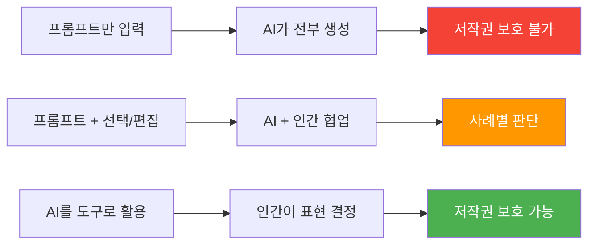
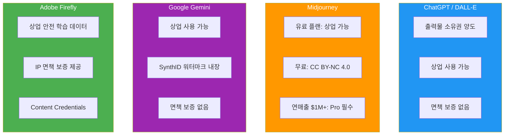
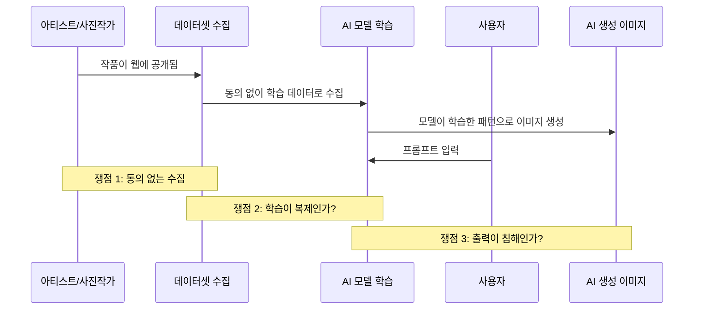
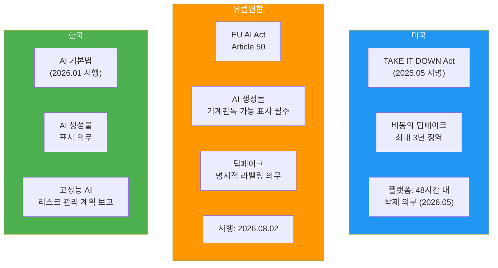
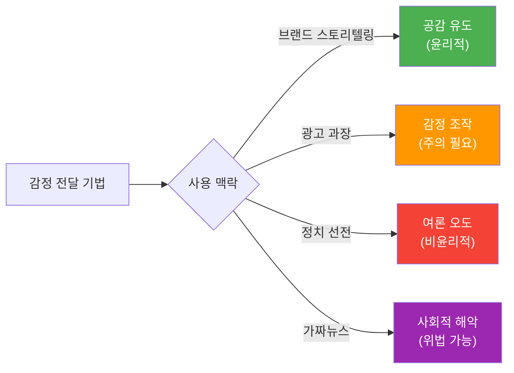
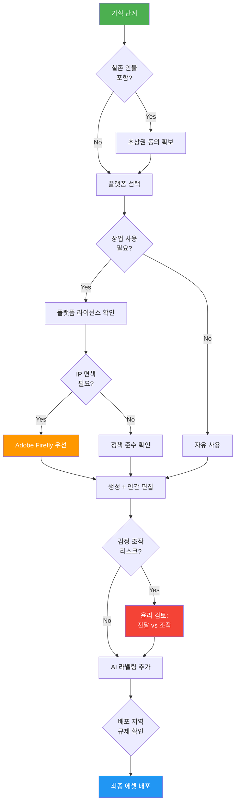

# 04. AI 비주얼의 저작권·윤리·상업적 활용

> AI로 만든 이미지, 과연 내 것일까? — 저작권 현황부터 플랫폼별 상업 정책, 윤리적 리스크까지 안전한 활용 가이드

## 개요

이 섹션에서는 AI 생성 이미지를 둘러싼 법적·윤리적 쟁점을 체계적으로 정리합니다. 앞서 [캠페인 비주얼과 영상 콘텐츠 제작](12-실전-포트폴리오-프로젝트/03-03-캠페인-비주얼과-영상-콘텐츠-제작.md)에서 멋진 에셋을 만들어봤는데요, 이제 그 에셋을 **법적으로 안전하게** 쓸 수 있는지 확인할 차례입니다.

**선수 지식**: Ch1~Ch10의 플랫폼별 이미지/영상 생성 경험, [브랜드 비주얼 에셋 프로젝트](12-실전-포트폴리오-프로젝트/02-02-브랜드-비주얼-에셋-프로젝트.md)의 상업용 에셋 제작 경험

**학습 목표**:
- AI 생성 이미지의 저작권 보호 현황과 "인간 저작자" 요건을 이해한다
- ChatGPT, Midjourney, Gemini, Firefly의 상업적 사용 정책 차이를 비교한다
- 학습 데이터 윤리와 딥페이크 리스크에 대응하는 가이드라인을 수립한다
- 감정 전달 기법의 윤리적 경계와 오용 가능성을 인식한다
- Python으로 상업 활용 적합성을 자동 검증하는 체크리스트 시스템을 구축한다

## 왜 알아야 할까?

2024년, 한 디자이너가 Midjourney로 만든 광고 이미지를 클라이언트에게 납품했습니다. 몇 달 뒤 경쟁사가 거의 동일한 이미지를 사용하고 있었죠. 소송을 걸려 했지만, 변호사의 답변은 충격적이었습니다 — "AI가 만든 이미지는 저작권 보호를 받기 어렵습니다."

이건 가상의 시나리오가 아닙니다. 2025년 미국 D.C. 항소법원은 **Thaler v. Perlmutter** 사건에서 "AI는 저작자가 될 수 없다"고 확정했고, 2026년 3월 미국 대법원이 상고를 기각하면서 이 판결이 최종 확정됐습니다. 여러분이 프롬프트를 아무리 정교하게 짰더라도, 그 결과물의 법적 보호는 **생각보다 훨씬 불확실**합니다.

[프로젝트 기획](12-실전-포트폴리오-프로젝트/01-01-프로젝트-기획-브리프에서-무드보드까지.md)부터 [캠페인 비주얼 제작](12-실전-포트폴리오-프로젝트/03-03-캠페인-비주얼과-영상-콘텐츠-제작.md)까지 공들여 만든 에셋이 법적 분쟁에 휘말리지 않으려면, 지금부터 배울 내용이 **반드시** 필요합니다.

## 핵심 개념

### 개념 1: AI 생성물의 저작권 — "누가 저작자인가?"

> 💡 **비유**: 여러분이 자판기에 동전을 넣고 버튼을 누르면 음료가 나오죠. 그 음료를 "내가 만들었다"고 할 수 있을까요? 저작권법은 AI 생성물을 비슷하게 봅니다 — 프롬프트는 "동전을 넣는 행위"이고, 실제 "창작"은 AI가 한 것이라는 거죠.

미국 저작권청(USCO)은 2025년 1월 보고서에서 명확한 기준을 제시했습니다:

1. **순수 AI 생성물**: 저작권 보호 불가 — 프롬프트만 입력한 결과물
2. **AI 보조 창작물**: 사례별 판단 — 인간의 "의미 있는 창작적 기여"가 핵심
3. **AI 도구 활용물**: 보호 가능 — AI를 포토샵처럼 도구로 활용하고 인간이 최종 표현을 결정

> 📊 **그림 1**: AI 생성물의 저작권 보호 스펙트럼



**Thaler v. Perlmutter 사건**이 이 구도를 확정지었습니다. Stephen Thaler는 자신의 AI 시스템 "Creativity Machine"이 만든 그림 *A Recent Entrance to Paradise*의 저작권 등록을 신청했지만, 법원은 "저작권법의 '저작자'는 인간만 해당한다"고 판결했습니다. 2025년 3월 D.C. 항소법원이 이를 만장일치로 확인했고, 2026년 3월 대법원이 상고를 기각하면서 판례가 확정됐습니다.

> ⚠️ **흔한 오해**: "프롬프트를 아주 정교하게 썼으니 내 저작물이다" — 아닙니다. 미국 저작권청은 프롬프트 입력만으로는 충분한 창작적 기여로 인정하지 않습니다. 프롬프트는 "지시"이지 "표현"이 아니거든요.

한국도 비슷한 흐름입니다. 한국저작권위원회는 2025년 6월 「생성형 AI 저작물 저작권 등록 안내서」를 발간하며, 순수 AI 생성물은 저작권 등록이 불가하고 인간의 창작적 기여가 입증되어야 한다는 입장을 밝혔습니다.

```python
# AI 생성물의 저작권 보호 가능성 평가 체계
from dataclasses import dataclass, field
from enum import Enum
from typing import Optional


class CopyrightLevel(Enum):
    """저작권 보호 수준"""
    NOT_PROTECTABLE = "보호 불가"       # 순수 AI 생성
    CASE_BY_CASE = "사례별 판단"        # AI + 인간 협업
    LIKELY_PROTECTABLE = "보호 가능성 높음"  # AI를 도구로 활용


@dataclass
class CreationProcess:
    """창작 과정 기록"""
    prompt_only: bool = False            # 프롬프트만 입력했는가?
    human_selection: bool = False         # 다수 결과 중 선택/큐레이션 했는가?
    human_editing: bool = False           # 포토샵 등으로 후편집 했는가?
    human_composition: bool = False       # 구도/레이아웃을 인간이 결정했는가?
    iterative_refinement: int = 0         # 반복 수정 횟수
    ai_tool_name: str = ""               # 사용한 AI 도구
    description: str = ""                 # 창작 과정 설명


def assess_copyright(process: CreationProcess) -> tuple[CopyrightLevel, str]:
    """창작 과정을 분석하여 저작권 보호 수준을 평가"""
    # 인간의 창작적 기여 점수 계산
    score = 0
    reasons = []

    if process.human_composition:
        score += 3
        reasons.append("구도/레이아웃을 인간이 결정")
    if process.human_editing:
        score += 3
        reasons.append("후편집으로 표현 수정")
    if process.human_selection and process.iterative_refinement >= 3:
        score += 2
        reasons.append(f"반복 수정 {process.iterative_refinement}회 + 선택적 큐레이션")
    elif process.human_selection:
        score += 1
        reasons.append("결과물 선택/큐레이션")
    if process.iterative_refinement >= 5:
        score += 1
        reasons.append("5회 이상 반복 정제")

    # 판정
    if process.prompt_only and score == 0:
        return (CopyrightLevel.NOT_PROTECTABLE,
                "프롬프트만 입력 — 인간의 창작적 기여 부족")
    elif score >= 4:
        return (CopyrightLevel.LIKELY_PROTECTABLE,
                f"보호 가능성 높음: {', '.join(reasons)}")
    else:
        return (CopyrightLevel.CASE_BY_CASE,
                f"사례별 판단 필요: {', '.join(reasons)}")
```

```run:python
# 세 가지 시나리오 테스트
from dataclasses import dataclass
from enum import Enum

class CopyrightLevel(Enum):
    NOT_PROTECTABLE = "보호 불가"
    CASE_BY_CASE = "사례별 판단"
    LIKELY_PROTECTABLE = "보호 가능성 높음"

@dataclass
class CreationProcess:
    prompt_only: bool = False
    human_selection: bool = False
    human_editing: bool = False
    human_composition: bool = False
    iterative_refinement: int = 0
    ai_tool_name: str = ""

def assess_copyright(process):
    score = 0
    reasons = []
    if process.human_composition:
        score += 3; reasons.append("구도 결정")
    if process.human_editing:
        score += 3; reasons.append("후편집")
    if process.human_selection and process.iterative_refinement >= 3:
        score += 2; reasons.append(f"반복 {process.iterative_refinement}회+큐레이션")
    elif process.human_selection:
        score += 1; reasons.append("큐레이션")
    if process.iterative_refinement >= 5:
        score += 1; reasons.append("5회+ 정제")
    if process.prompt_only and score == 0:
        return (CopyrightLevel.NOT_PROTECTABLE, "인간 기여 부족")
    elif score >= 4:
        return (CopyrightLevel.LIKELY_PROTECTABLE, ", ".join(reasons))
    else:
        return (CopyrightLevel.CASE_BY_CASE, ", ".join(reasons))

# 시나리오 1: 프롬프트만 입력
s1 = CreationProcess(prompt_only=True, ai_tool_name="Midjourney")
level, reason = assess_copyright(s1)
print(f"시나리오 1 (프롬프트만): {level.value} — {reason}")

# 시나리오 2: 선택 + 약간의 수정
s2 = CreationProcess(human_selection=True, iterative_refinement=3, ai_tool_name="ChatGPT")
level, reason = assess_copyright(s2)
print(f"시나리오 2 (선택+수정): {level.value} — {reason}")

# 시나리오 3: 구도 결정 + 후편집 + 반복 정제
s3 = CreationProcess(human_composition=True, human_editing=True,
                     iterative_refinement=8, ai_tool_name="Firefly")
level, reason = assess_copyright(s3)
print(f"시나리오 3 (도구 활용): {level.value} — {reason}")
```

```output
시나리오 1 (프롬프트만): 보호 불가 — 인간 기여 부족
시나리오 2 (선택+수정): 사례별 판단 — 반복 3회+큐레이션
시나리오 3 (도구 활용): 보호 가능성 높음 — 구도 결정, 후편집, 5회+ 정제
```

### 개념 2: 플랫폼별 상업적 사용 정책

> 💡 **비유**: 같은 "렌터카"라도 회사마다 보험 조건이 다르듯, AI 플랫폼마다 상업적 사용 조건이 천차만별입니다. 어떤 곳은 "맘껏 쓰세요"이고, 어떤 곳은 "연매출 100만 달러 넘으면 프로 플랜 필수"입니다.

각 플랫폼의 정책을 정확히 이해하지 않으면 계약 위반이나 법적 분쟁에 휘말릴 수 있습니다. 2026년 3월 기준 주요 플랫폼의 상업 정책을 비교해보겠습니다.

> 📊 **그림 2**: 플랫폼별 상업적 사용 정책 비교



핵심 차이를 표로 정리하면 이렇습니다:

| 항목 | ChatGPT | Midjourney | Gemini | Adobe Firefly |
|------|---------|------------|--------|---------------|
| **상업 사용** | 가능 | 유료만 가능 | 가능 | 가능 |
| **소유권** | 사용자 양도 | 사용자 (유료) | 사용자 | 사용자 |
| **독점성** | 없음 | 없음 | 없음 | 없음 |
| **IP 면책** | 없음 | 없음 | 없음 | 있음 (최대 $3M) |
| **학습 데이터** | 비공개 | 비공개 | 비공개 | 라이선스/퍼블릭 도메인 |
| **AI 표시** | 메타데이터 | 없음 | SynthID | Content Credentials |
| **대기업 제한** | 없음 | 연매출 $1M+ Pro 필수 | 없음 | 없음 |

> 🔥 **실무 팁**: 클라이언트 프로젝트에서 **법적 리스크를 최소화**하려면 Adobe Firefly가 가장 안전합니다. IP 면책 보증이 있는 유일한 플랫폼이거든요. 반면 Midjourney 무료 티어로 만든 이미지를 상업적으로 쓰면 **라이선스 위반**입니다.

```python
# 플랫폼별 상업 사용 정책 검증 시스템
from dataclasses import dataclass, field


@dataclass
class PlatformPolicy:
    """플랫폼별 상업 사용 정책"""
    name: str
    commercial_allowed: bool
    requires_paid_plan: bool
    ip_indemnification: bool
    indemnification_limit: int = 0          # USD
    revenue_threshold: int = 0              # 이 이상이면 상위 플랜 필수
    required_plan_above_threshold: str = ""
    ai_labeling: str = ""                   # AI 생성 표시 방식
    training_data_licensed: bool = False     # 학습 데이터 라이선스 여부


# 2026년 3월 기준 플랫폼 정책 데이터
PLATFORM_POLICIES = {
    "chatgpt": PlatformPolicy(
        name="ChatGPT / DALL-E",
        commercial_allowed=True,
        requires_paid_plan=False,
        ip_indemnification=False,
        ai_labeling="메타데이터",
    ),
    "midjourney": PlatformPolicy(
        name="Midjourney",
        commercial_allowed=True,
        requires_paid_plan=True,  # 무료는 CC BY-NC
        ip_indemnification=False,
        revenue_threshold=1_000_000,
        required_plan_above_threshold="Pro ($60/mo) 이상",
        ai_labeling="없음 (Pro: Stealth Mode)",
    ),
    "gemini": PlatformPolicy(
        name="Google Gemini",
        commercial_allowed=True,
        requires_paid_plan=False,
        ip_indemnification=False,
        ai_labeling="SynthID 디지털 워터마크",
    ),
    "firefly": PlatformPolicy(
        name="Adobe Firefly",
        commercial_allowed=True,
        requires_paid_plan=False,
        ip_indemnification=True,
        indemnification_limit=3_000_000,  # Enterprise ETLA
        ai_labeling="Content Credentials (C2PA)",
        training_data_licensed=True,
    ),
}


@dataclass
class CommercialUseCheck:
    """상업 사용 적합성 검증 결과"""
    platform: str
    is_allowed: bool
    warnings: list[str] = field(default_factory=list)
    recommendations: list[str] = field(default_factory=list)
    risk_level: str = "LOW"  # LOW, MEDIUM, HIGH


def check_commercial_viability(
    platform_key: str,
    is_paid_user: bool,
    annual_revenue: int = 0,
    needs_indemnification: bool = False,
    target_region: str = "global",
) -> CommercialUseCheck:
    """상업 사용 적합성을 검증하고 가이드라인을 제공"""
    policy = PLATFORM_POLICIES.get(platform_key)
    if not policy:
        return CommercialUseCheck(
            platform=platform_key,
            is_allowed=False,
            warnings=[f"알 수 없는 플랫폼: {platform_key}"],
            risk_level="HIGH",
        )

    result = CommercialUseCheck(platform=policy.name, is_allowed=True)

    # 유료 플랜 필수 여부
    if policy.requires_paid_plan and not is_paid_user:
        result.is_allowed = False
        result.warnings.append("무료 티어 — 상업 사용 불가 (CC BY-NC 4.0)")
        result.risk_level = "HIGH"
        return result

    # 매출 기준 상위 플랜 필수 여부
    if policy.revenue_threshold and annual_revenue > policy.revenue_threshold:
        result.warnings.append(
            f"연매출 ${annual_revenue:,} > ${policy.revenue_threshold:,} "
            f"— {policy.required_plan_above_threshold} 필수"
        )
        result.risk_level = "MEDIUM"

    # IP 면책 보증 필요 여부
    if needs_indemnification and not policy.ip_indemnification:
        result.warnings.append("IP 면책 보증 없음 — 저작권 침해 리스크는 사용자 부담")
        result.recommendations.append("Adobe Firefly 사용 고려 (IP 면책 최대 $3M)")
        result.risk_level = "MEDIUM"
    elif policy.ip_indemnification:
        result.recommendations.append(
            f"IP 면책 보증 제공 (최대 ${policy.indemnification_limit:,})"
        )

    # 학습 데이터 안전성
    if not policy.training_data_licensed:
        result.warnings.append("학습 데이터 라이선스 미공개 — 학습 데이터 출처 리스크 존재")

    # 지역별 규제
    if target_region in ("eu", "global"):
        result.recommendations.append(
            "EU AI Act (2026.08 시행) — AI 생성물 라벨링 의무 확인 필요"
        )
    if target_region in ("kr", "global"):
        result.recommendations.append(
            "한국 AI 기본법 (2026.01 시행) — AI 생성물 표시 의무 확인 필요"
        )

    # 종합 리스크
    if not result.warnings:
        result.risk_level = "LOW"

    return result
```

```run:python
# 실제 시나리오 검증
from dataclasses import dataclass, field

@dataclass
class CommercialUseCheck:
    platform: str
    is_allowed: bool
    warnings: list = field(default_factory=list)
    recommendations: list = field(default_factory=list)
    risk_level: str = "LOW"

# 시나리오: 연매출 $2M 기업이 Midjourney 무료로 광고 제작
print("=== 시나리오 1: Midjourney 무료 + 대기업 ===")
r = CommercialUseCheck(platform="Midjourney", is_allowed=False,
    warnings=["무료 티어 — 상업 사용 불가 (CC BY-NC 4.0)"],
    risk_level="HIGH")
print(f"허용: {r.is_allowed} | 리스크: {r.risk_level}")
for w in r.warnings:
    print(f"  경고: {w}")

# 시나리오: Adobe Firefly로 클라이언트 에셋 제작
print("\n=== 시나리오 2: Adobe Firefly + IP 면책 필요 ===")
r2 = CommercialUseCheck(platform="Adobe Firefly", is_allowed=True,
    recommendations=["IP 면책 보증 제공 (최대 $3,000,000)"],
    risk_level="LOW")
print(f"허용: {r2.is_allowed} | 리스크: {r2.risk_level}")
for rec in r2.recommendations:
    print(f"  추천: {rec}")

# 시나리오: ChatGPT로 글로벌 캠페인
print("\n=== 시나리오 3: ChatGPT + 글로벌 배포 ===")
r3 = CommercialUseCheck(platform="ChatGPT / DALL-E", is_allowed=True,
    warnings=["학습 데이터 라이선스 미공개"],
    recommendations=["EU AI Act (2026.08) AI 생성물 라벨링 의무 확인",
                     "한국 AI 기본법 (2026.01) AI 생성물 표시 의무 확인"],
    risk_level="MEDIUM")
print(f"허용: {r3.is_allowed} | 리스크: {r3.risk_level}")
for w in r3.warnings:
    print(f"  경고: {w}")
for rec in r3.recommendations:
    print(f"  추천: {rec}")
```

```output
=== 시나리오 1: Midjourney 무료 + 대기업 ===
허용: False | 리스크: HIGH
  경고: 무료 티어 — 상업 사용 불가 (CC BY-NC 4.0)

=== 시나리오 2: Adobe Firefly + IP 면책 필요 ===
허용: True | 리스크: LOW
  추천: IP 면책 보증 제공 (최대 $3,000,000)

=== 시나리오 3: ChatGPT + 글로벌 배포 ===
허용: True | 리스크: MEDIUM
  경고: 학습 데이터 라이선스 미공개
  추천: EU AI Act (2026.08) AI 생성물 라벨링 의무 확인
  추천: 한국 AI 기본법 (2026.01) AI 생성물 표시 의무 확인
```

### 개념 3: 학습 데이터 윤리 — 누구의 그림으로 배웠나?

> 💡 **비유**: 요리사가 다른 셰프의 레시피를 몰래 복사해서 자기 요리책을 내면 문제가 되겠죠? AI 이미지 모델의 학습 과정도 비슷한 논쟁 위에 있습니다. 수백만 아티스트의 작품으로 "배웠는데", 그 아티스트들에게 허락을 받았는지가 핵심 쟁점입니다.

가장 대표적인 사건이 **Getty Images v. Stability AI** 소송입니다.

> 📊 **그림 3**: 학습 데이터 윤리의 핵심 논쟁 구도



**Getty Images v. Stability AI**의 결과는 의외였습니다:
- **영국 판결 (2025년 11월)**: Getty가 대부분 패소. 법원은 AI 모델의 가중치(weights)가 학습 이미지의 "복사본"이 아니라고 판단했습니다. 다만 소수의 이미지에서 Getty 워터마크가 재현된 것은 **상표권 침해**로 인정됐습니다.
- **미국 소송**: 북부 캘리포니아 연방법원에서 진행 중 (2026년 2월 기각 신청 심리).

이 판결의 핵심 시사점은 — 학습 과정 자체보다 **출력물이 기존 저작물을 재현하는지**가 더 중요한 판단 기준이 된다는 겁니다.

```python
# 학습 데이터 윤리 리스크 평가
from dataclasses import dataclass


@dataclass
class TrainingDataRisk:
    """학습 데이터 관련 윤리 리스크 평가"""
    platform: str
    data_source_transparent: bool       # 학습 데이터 출처 공개 여부
    uses_licensed_data: bool            # 라이선스된 데이터만 사용하는지
    opt_out_available: bool             # 아티스트 옵트아웃 가능 여부
    known_lawsuits: list[str]           # 알려진 소송
    risk_score: int = 0                 # 0-10 (10이 가장 위험)

    def evaluate(self) -> str:
        """리스크를 종합 평가"""
        self.risk_score = 0
        if not self.data_source_transparent:
            self.risk_score += 3
        if not self.uses_licensed_data:
            self.risk_score += 3
        if not self.opt_out_available:
            self.risk_score += 2
        self.risk_score += min(len(self.known_lawsuits), 2)

        if self.risk_score <= 2:
            return "낮음 — 상업 사용에 적합"
        elif self.risk_score <= 5:
            return "중간 — 주의하여 사용"
        else:
            return "높음 — 법적 검토 권장"


# 플랫폼별 학습 데이터 리스크
training_risks = {
    "firefly": TrainingDataRisk(
        platform="Adobe Firefly",
        data_source_transparent=True,
        uses_licensed_data=True,        # Adobe Stock + 퍼블릭 도메인
        opt_out_available=True,
        known_lawsuits=[],
    ),
    "midjourney": TrainingDataRisk(
        platform="Midjourney",
        data_source_transparent=False,
        uses_licensed_data=False,
        opt_out_available=False,
        known_lawsuits=["Anderson v. Stability AI (집단소송)"],
    ),
    "stable_diffusion": TrainingDataRisk(
        platform="Stable Diffusion (Stability AI)",
        data_source_transparent=False,  # LAION-5B 기반
        uses_licensed_data=False,
        opt_out_available=True,         # Spawning.ai 옵트아웃
        known_lawsuits=["Getty v. Stability AI", "Anderson v. Stability AI"],
    ),
}
```

> 💡 **알고 계셨나요?**: Adobe Firefly는 학습 데이터 윤리 논란을 피하기 위해 **처음부터 Adobe Stock의 라이선스 이미지와 퍼블릭 도메인 콘텐츠만**으로 학습했습니다. 이 전략 덕분에 유일하게 IP 면책 보증을 제공할 수 있게 됐죠. "돈이 더 들더라도 정정당당하게" 접근한 셈입니다.

### 개념 4: 딥페이크, 감정 조작, 그리고 AI 윤리 규제

> 💡 **비유**: 칼은 요리에도 쓰이고 범죄에도 쓰입니다. AI 이미지 생성도 마찬가지인데요, 문제는 이 "칼"이 너무 날카로워져서 전문가도 진짜와 구별하기 어려운 이미지를 만들 수 있게 됐다는 겁니다.

딥페이크 사건은 2024년에 전년 대비 **257%** 급증했고, 2025년 1분기만으로도 2024년 전체를 넘어섰습니다. 이에 따라 각국의 규제가 빠르게 강화되고 있습니다.

> 📊 **그림 4**: 글로벌 AI 생성물 규제 지도



**주요 규제 정리:**

| 규제 | 지역 | 핵심 내용 | 시행 시기 |
|------|------|-----------|-----------|
| TAKE IT DOWN Act | 미국 | 비동의 딥페이크 형사처벌, 플랫폼 48시간 삭제 의무 | 2025.05 (플랫폼: 2026.05) |
| EU AI Act Art.50 | EU | AI 생성물 기계판독 표시, 딥페이크 라벨링 | 2026.08 |
| AI 기본법 | 한국 | AI 생성물 표시 의무, 고성능 AI 리스크 관리 | 2026.01 |
| 주법 (47개 주) | 미국 | 딥페이크 형사/민사 처벌 (주별 상이) | 2024~2025 |

#### 비주얼 스토리텔링의 감정 조작 리스크

딥페이크만큼 주목받지는 않지만, 점점 중요해지는 윤리적 이슈가 있습니다 — 바로 AI 비주얼의 **감정 조작(Emotional Manipulation)** 문제입니다. Ch11에서 배운 비주얼 스토리텔링 기법을 떠올려보세요. 색채 심리, 구도를 통한 시선 유도, 감정을 극대화하는 조명과 표정 — 이런 기법들은 브랜드 커뮤니케이션에서 강력한 도구이지만, 의도적으로 오용하면 심각한 윤리적 문제가 됩니다.

> 📊 **그림 4-1**: 감정 전달 기법의 윤리적 스펙트럼



특히 **광고**와 **정치** 맥락에서 리스크가 큽니다:

- **광고 분야**: AI가 타겟 소비자의 심리적 취약점을 파고드는 비주얼을 대량 생성할 수 있습니다. 예를 들어, 건강 불안을 극대화하는 이미지로 불필요한 보조제를 판매하거나, 노인 대상으로 외로움을 자극하는 비주얼로 과잉 소비를 유도하는 것이죠. 전통적인 광고도 감정에 호소했지만, AI는 **개인화된 감정 타겟팅**을 대규모로 가능하게 만든다는 점에서 차원이 다릅니다.

- **정치 맥락**: 2024년 미국 대선에서 AI 생성 이미지가 후보자의 이미지를 왜곡하는 데 광범위하게 사용됐습니다. 실제로 일어나지 않은 장면을 사실적으로 만들어 유권자의 감정적 반응을 유도하는 것이죠. AI가 만든 "트럼프가 흑인 유권자들에게 둘러싸인 사진"이나 "가짜 재난 현장의 정치인 사진" 등이 대표적 사례입니다.

이 코스에서 배운 감정 전달 기법은 **정당한 스토리텔링**을 위해 설계된 것이지만, 같은 기술이 수신자를 오도하는 데 쓰일 수 있다는 점을 항상 인식해야 합니다. 크리에이터로서 스스로에게 물어야 할 핵심 질문은 이것입니다: **"이 비주얼이 보는 사람의 감정을 '전달'하는 건가, '조작'하는 건가?"**

> ⚠️ **흔한 오해**: "감정을 자극하는 비주얼은 다 나쁜 거 아닌가?" — 아닙니다. 감정 전달은 모든 시각 커뮤니케이션의 본질입니다. 문제가 되는 건 **사실을 왜곡하거나**, **취약 계층을 타겟으로 심리적 약점을 악용**하거나, **허위 맥락을 사실인 것처럼 제시**하는 경우입니다. 진정성 있는 감정 전달과 의도적 감정 조작의 경계를 항상 의식하세요.

```python
# 딥페이크 리스크 체크 & 규제 준수 검증
from dataclasses import dataclass, field


@dataclass
class ContentEthicsCheck:
    """AI 생성 콘텐츠의 윤리/규제 준수 체크"""
    contains_real_person: bool = False      # 실존 인물 포함
    person_consent_obtained: bool = False   # 본인 동의 여부
    is_intimate_content: bool = False       # 친밀한/성적 콘텐츠
    could_mislead_as_real: bool = False     # 실제로 오인될 가능성
    ai_label_included: bool = False         # AI 생성 표시 포함
    targets_emotional_vulnerability: bool = False  # 감정적 취약점 타겟팅
    target_regions: list[str] = field(default_factory=list)  # 배포 지역


def evaluate_ethics(check: ContentEthicsCheck) -> dict:
    """윤리/규제 준수 여부를 평가"""
    issues = []
    blockers = []  # 절대 진행 불가
    actions = []   # 조치 필요

    # 실존 인물 + 동의 없음
    if check.contains_real_person and not check.person_consent_obtained:
        if check.is_intimate_content:
            blockers.append(
                "TAKE IT DOWN Act 위반 — 비동의 친밀한 딥페이크는 형사 처벌 대상"
            )
        else:
            issues.append("실존 인물 초상권/퍼블리시티권 침해 가능성")
            actions.append("본인 동의 또는 초상 사용 라이선스 확보 필요")

    # 감정적 취약점 타겟팅
    if check.targets_emotional_vulnerability:
        issues.append(
            "감정적 취약점 타겟팅 — 비주얼이 수신자를 오도하거나 "
            "심리적 약점을 악용할 수 있음"
        )
        actions.append(
            "광고/캠페인 윤리 검토: 감정 전달 vs 감정 조작 경계 확인"
        )

    # AI 라벨링 미포함
    if not check.ai_label_included:
        if "eu" in check.target_regions:
            actions.append("EU AI Act — AI 생성물 기계판독 가능 표시 의무 (2026.08)")
        if "kr" in check.target_regions:
            actions.append("한국 AI 기본법 — AI 생성물 표시 의무 (2026.01)")

    # 오인 가능성
    if check.could_mislead_as_real and not check.ai_label_included:
        issues.append("실제 콘텐츠로 오인될 가능성 — 라벨링 필수")

    return {
        "can_proceed": len(blockers) == 0,
        "blockers": blockers,
        "issues": issues,
        "required_actions": actions,
    }
```

### 개념 5: 안전한 상업 활용 워크플로우

> 💡 **비유**: 건물을 지을 때 설계 단계에서 안전 검토를 하듯, AI 비주얼 프로젝트도 **기획 단계부터** 법적·윤리적 체크를 내장해야 합니다. 완성된 뒤에 "이거 써도 되나?" 물으면 이미 늦거든요.

[프로젝트 기획](12-실전-포트폴리오-프로젝트/01-01-프로젝트-기획-브리프에서-무드보드까지.md)에서 배운 크리에이티브 브리프에 법적 체크리스트를 통합하는 것이 핵심입니다.

> 📊 **그림 5**: 안전한 상업 활용 워크플로우



## 실습: 직접 해보기

[브랜드 비주얼 에셋 프로젝트](12-실전-포트폴리오-프로젝트/02-02-브랜드-비주얼-에셋-프로젝트.md)에서 만든 `BrandAssetKit`과 통합하여, 에셋 생성 전에 법적 적합성을 자동 검증하는 시스템을 구축해봅시다.

```python
"""
AI 비주얼 상업 활용 적합성 검증 시스템
- 플랫폼 정책, 저작권, 윤리 규제를 통합 검증
- 프로젝트 기획 단계에서 사전 점검용
"""
from dataclasses import dataclass, field
from enum import Enum
from datetime import date
from typing import Optional


# ── 1. 데이터 모델 ──────────────────────────────────────
class RiskLevel(Enum):
    LOW = "LOW"
    MEDIUM = "MEDIUM"
    HIGH = "HIGH"
    BLOCKED = "BLOCKED"


class Platform(Enum):
    CHATGPT = "chatgpt"
    MIDJOURNEY = "midjourney"
    GEMINI = "gemini"
    FIREFLY = "firefly"


@dataclass
class AssetComplianceReport:
    """에셋별 법적 적합성 보고서"""
    asset_name: str
    platform: str
    risk_level: RiskLevel
    copyright_status: str
    commercial_cleared: bool
    ethics_cleared: bool
    warnings: list[str] = field(default_factory=list)
    actions_required: list[str] = field(default_factory=list)
    checked_date: str = field(default_factory=lambda: str(date.today()))

    def summary(self) -> str:
        """한 줄 요약"""
        status = "통과" if self.commercial_cleared and self.ethics_cleared else "검토 필요"
        return (
            f"[{self.risk_level.value}] {self.asset_name} "
            f"({self.platform}) — {status}"
        )


# ── 2. 통합 검증 엔진 ──────────────────────────────────
@dataclass
class ProjectComplianceConfig:
    """프로젝트 수준 컴플라이언스 설정"""
    project_name: str
    platforms_used: list[str]
    target_regions: list[str]           # "us", "eu", "kr", "global"
    annual_revenue: int = 0             # 기업 연매출 (USD)
    is_paid_user: dict = field(default_factory=dict)  # 플랫폼별 유료 여부
    contains_real_persons: bool = False
    person_consent: bool = False
    human_editing_applied: bool = False  # 인간 후편집 여부
    needs_indemnification: bool = False
    emotional_targeting: bool = False    # 감정적 취약점 타겟팅 여부


def run_compliance_check(config: ProjectComplianceConfig) -> list[AssetComplianceReport]:
    """프로젝트의 모든 플랫폼에 대해 통합 컴플라이언스 검증"""
    reports = []

    for platform_key in config.platforms_used:
        warnings = []
        actions = []
        risk = RiskLevel.LOW
        commercial_ok = True
        ethics_ok = True

        # ── 저작권 평가 ──
        if config.human_editing_applied:
            copyright_status = "사례별 판단 (인간 편집 적용)"
        else:
            copyright_status = "보호 불가 (순수 AI 생성)"
            warnings.append("저작권 보호 불확실 — 인간의 창작적 기여 추가 권장")

        # ── 플랫폼 상업 정책 ──
        paid = config.is_paid_user.get(platform_key, False)

        if platform_key == "midjourney":
            if not paid:
                commercial_ok = False
                risk = RiskLevel.BLOCKED
                warnings.append("Midjourney 무료 — 상업 사용 불가 (CC BY-NC 4.0)")
            elif config.annual_revenue > 1_000_000:
                actions.append("연매출 $1M 초과 — Pro/Mega 플랜 필수")
                risk = RiskLevel.MEDIUM

        if platform_key == "firefly":
            if config.needs_indemnification:
                actions.append("Enterprise 플랜으로 IP 면책 보증 활성화 권장")

        # ── 윤리/규제 ──
        if config.contains_real_persons and not config.person_consent:
            ethics_ok = False
            risk = RiskLevel.HIGH
            warnings.append("실존 인물 포함 — 초상권 동의 미확보")

        # ── 감정 조작 리스크 ──
        if config.emotional_targeting:
            warnings.append("감정 타겟팅 감지 — 취약 계층 대상 감정 조작 리스크 검토 필요")
            actions.append("윤리 검토: 감정 '전달' vs '조작' 경계 확인")
            if risk == RiskLevel.LOW:
                risk = RiskLevel.MEDIUM

        # ── 지역별 라벨링 ──
        if "eu" in config.target_regions or "global" in config.target_regions:
            actions.append("EU AI Act Art.50 — AI 생성물 라벨링 의무 (2026.08)")
        if "kr" in config.target_regions or "global" in config.target_regions:
            actions.append("한국 AI 기본법 — AI 생성물 표시 의무 (2026.01)")

        reports.append(AssetComplianceReport(
            asset_name=f"{config.project_name}_{platform_key}",
            platform=platform_key,
            risk_level=risk,
            copyright_status=copyright_status,
            commercial_cleared=commercial_ok,
            ethics_cleared=ethics_ok,
            warnings=warnings,
            actions_required=actions,
        ))

    return reports


def print_compliance_dashboard(reports: list[AssetComplianceReport]) -> None:
    """컴플라이언스 대시보드 출력"""
    print("=" * 60)
    print("   AI 비주얼 컴플라이언스 대시보드")
    print("=" * 60)

    for r in reports:
        # 리스크 레벨별 마커
        marker = {"LOW": "●", "MEDIUM": "▲", "HIGH": "■", "BLOCKED": "✖"}
        icon = marker.get(r.risk_level.value, "?")
        print(f"\n{icon} {r.summary()}")
        print(f"  저작권: {r.copyright_status}")

        if r.warnings:
            for w in r.warnings:
                print(f"  [경고] {w}")
        if r.actions_required:
            for a in r.actions_required:
                print(f"  [조치] {a}")

    # 종합 판정
    blocked = [r for r in reports if r.risk_level == RiskLevel.BLOCKED]
    high = [r for r in reports if r.risk_level == RiskLevel.HIGH]
    print("\n" + "-" * 60)
    if blocked:
        print(f"  결과: {len(blocked)}건 차단 — 해당 플랫폼 상업 사용 불가")
    elif high:
        print(f"  결과: {len(high)}건 고위험 — 법적 검토 후 진행")
    else:
        print("  결과: 모든 플랫폼 상업 사용 가능 (조치사항 확인 필요)")
    print("=" * 60)
```

```run:python
# 실전 시나리오: 글로벌 캠페인 프로젝트
from dataclasses import dataclass, field
from enum import Enum

class RiskLevel(Enum):
    LOW = "LOW"; MEDIUM = "MEDIUM"; HIGH = "HIGH"; BLOCKED = "BLOCKED"

@dataclass
class Report:
    name: str; platform: str; risk: RiskLevel
    copyright: str; commercial_ok: bool; ethics_ok: bool
    warnings: list = field(default_factory=list)
    actions: list = field(default_factory=list)

# 시나리오: 연매출 $2M 스타트업의 글로벌 캠페인
reports = [
    Report("campaign_midjourney", "Midjourney", RiskLevel.MEDIUM,
           "사례별 판단 (인간 편집 적용)", True, True,
           [], ["연매출 $1M 초과 — Pro/Mega 플랜 필수",
                "EU AI Act — AI 생성물 라벨링 의무",
                "한국 AI 기본법 — AI 생성물 표시 의무"]),
    Report("campaign_firefly", "Adobe Firefly", RiskLevel.LOW,
           "사례별 판단 (인간 편집 적용)", True, True,
           [], ["IP 면책 보증 활성화 권장"]),
    Report("campaign_chatgpt", "ChatGPT", RiskLevel.LOW,
           "사례별 판단 (인간 편집 적용)", True, True,
           ["학습 데이터 출처 리스크"],
           ["EU AI Act — AI 생성물 라벨링 의무"]),
]

print("=" * 55)
print("   AI 비주얼 컴플라이언스 대시보드")
print("=" * 55)
markers = {"LOW": "●", "MEDIUM": "▲", "HIGH": "■", "BLOCKED": "✖"}
for r in reports:
    icon = markers[r.risk.value]
    status = "통과" if r.commercial_ok and r.ethics_ok else "검토 필요"
    print(f"\n{icon} [{r.risk.value}] {r.name} ({r.platform}) — {status}")
    print(f"  저작권: {r.copyright}")
    for w in r.warnings:
        print(f"  [경고] {w}")
    for a in r.actions:
        print(f"  [조치] {a}")
print("\n" + "-" * 55)
print("  결과: 모든 플랫폼 상업 사용 가능 (조치사항 확인 필요)")
print("=" * 55)
```

```output
=======================================================
   AI 비주얼 컴플라이언스 대시보드
=======================================================

▲ [MEDIUM] campaign_midjourney (Midjourney) — 통과
  저작권: 사례별 판단 (인간 편집 적용)
  [조치] 연매출 $1M 초과 — Pro/Mega 플랜 필수
  [조치] EU AI Act — AI 생성물 라벨링 의무
  [조치] 한국 AI 기본법 — AI 생성물 표시 의무

● [LOW] campaign_firefly (Adobe Firefly) — 통과
  저작권: 사례별 판단 (인간 편집 적용)
  [조치] IP 면책 보증 활성화 권장

● [LOW] campaign_chatgpt (ChatGPT) — 통과
  저작권: 사례별 판단 (인간 편집 적용)
  [경고] 학습 데이터 출처 리스크
  [조치] EU AI Act — AI 생성물 라벨링 의무
-------------------------------------------------------
  결과: 모든 플랫폼 상업 사용 가능 (조치사항 확인 필요)
=======================================================
```

## 더 깊이 알아보기

### "원숭이 셀카" 사건 — 저작권의 근본 질문

AI 저작권 논쟁의 선구자는 사실 AI가 아니라 **원숭이**였습니다. 2011년, 영국 사진작가 David Slater가 인도네시아에서 원숭이가 자신의 카메라로 찍은 셀카 사진의 저작권을 주장했습니다. PETA(동물윤리단체)는 원숭이에게 저작권이 있다고 소송을 걸었고, 미국 제9 항소법원은 2018년 "동물은 저작권을 소유할 수 없다"고 판결했습니다.

이 "원숭이 셀카" 판례(*Naruto v. Slater*)가 바로 **Thaler v. Perlmutter**에서 "AI도 저작자가 될 수 없다"는 논리의 기반이 됐습니다. 저작권법은 처음부터 "인간의 창작"을 전제로 설계됐고, 원숭이든 AI든 인간이 아닌 존재의 창작물에는 같은 원칙이 적용된 겁니다.

### Content Credentials — "디지털 영양성분 표시"의 탄생

Adobe가 주도한 C2PA(Coalition for Content Provenance and Authenticity)는 2019년에 시작됐습니다. 당시 딥페이크 기술이 급격히 발전하면서, Adobe의 CTO Abhay Parasnis는 "사진에 찍힌 장소와 시간이 EXIF 데이터로 기록되듯, AI 생성 여부도 기록돼야 한다"고 제안했죠. 이 아이디어가 Microsoft, BBC, Intel 등과 함께 표준화되어 지금의 Content Credentials가 됐습니다. 식품에 영양성분 표시가 의무인 것처럼, 디지털 콘텐츠에도 "원산지 표시"를 붙이자는 발상이었습니다.

### 한국 AI 기본법 — 19개 법안의 통합

한국의 AI 기본법은 국회에서 **19개의 개별 AI 법안**이 난립하던 상황에서 이를 하나로 통합한 결과물입니다. 2024년 12월에 통과되어 2026년 1월 22일부터 시행됐는데, 과학기술정보통신부(MSIT)가 총괄합니다. 특히 10^26 FLOPS 이상의 "고성능 AI"에 대해 리스크 관리 계획 보고를 의무화한 것이 특징입니다. 이는 EU AI Act의 영향을 받으면서도 한국 특유의 "진흥과 규제의 균형"을 추구한 접근법으로 평가받고 있습니다.

## 흔한 오해와 팁

> ⚠️ **흔한 오해**: "AI 이미지에 내 프롬프트가 들어갔으니 저작권이 인정된다" — 프롬프트는 **지시(instruction)**이지 **표현(expression)**이 아닙니다. "파란 하늘에 빨간 집을 그려줘"라는 지시는 무한한 표현이 가능하고, 최종 표현을 결정한 건 AI입니다. 저작권은 **표현**에만 부여됩니다.

> ⚠️ **흔한 오해**: "Midjourney로 만든 건 다 상업 사용 가능하다" — 무료 티어 사용자의 결과물은 **CC BY-NC 4.0** 라이선스가 적용됩니다. Non-Commercial, 즉 상업 사용이 **명시적으로 금지**됩니다. 반드시 유료 구독이 필요합니다.

> 💡 **알고 계셨나요?**: EU AI Act는 AI가 생성한 텍스트도 규제 대상에 포함합니다. "공익과 관련된 사안"에 대해 AI가 쓴 글을 발행할 때도 AI 생성 표시가 필수입니다. 이미지뿐 아니라 텍스트, 오디오, 영상 모두 해당되죠.

> 🔥 **실무 팁**: 상업 프로젝트에서 법적 안전성을 최대화하려면 이 **3단계 전략**을 쓰세요: (1) Adobe Firefly로 기본 에셋 생성 (IP 면책), (2) Photoshop에서 인간 편집으로 창작적 기여 확보 (저작권 보호 강화), (3) Content Credentials로 AI 사용 이력 투명하게 기록 (규제 준수).

> 🔥 **실무 팁**: 클라이언트 계약서에 반드시 **"AI 생성 도구 사용 고지"** 조항을 넣으세요. 사후에 밝혀지면 신뢰 문제가 되지만, 사전에 고지하면 투명성이 됩니다.

> 🔥 **실무 팁**: 감정을 강하게 자극하는 AI 비주얼을 광고에 사용할 때는 **"이 이미지가 없어도 메시지가 성립하는가?"** 테스트를 해보세요. 감정적 비주얼이 메시지를 보강하는 것이라면 괜찮지만, 비주얼 없이는 메시지 자체가 성립하지 않는다면 감정 조작에 해당할 가능성이 높습니다.

## 핵심 정리

| 개념 | 설명 |
|------|------|
| AI 저작권 | 순수 AI 생성물은 저작권 보호 불가. 인간의 의미 있는 창작적 기여가 핵심 |
| Thaler v. Perlmutter | AI 저작자 부정 확정 판례 (2026.03 대법원 상고 기각) |
| ChatGPT 정책 | 상업 사용 가능, 소유권 양도, IP 면책 없음 |
| Midjourney 정책 | 유료만 상업 가능, 연매출 $1M+ Pro 필수, IP 면책 없음 |
| Gemini 정책 | 상업 사용 가능, SynthID 워터마크, IP 면책 없음 |
| Adobe Firefly | 라이선스 데이터 학습, IP 면책 보증 (최대 $3M), Content Credentials |
| Getty v. Stability AI | 영국: AI 가중치는 복사본 아님 (Getty 대부분 패소). 미국: 진행 중 |
| 감정 조작 리스크 | 비주얼 스토리텔링 기법이 광고·정치에서 감정 조작에 오용될 위험. 전달 vs 조작 경계 인식 필수 |
| EU AI Act Art.50 | AI 생성물 기계판독 표시 의무 (2026.08 시행) |
| 한국 AI 기본법 | AI 생성물 표시 의무, 고성능 AI 리스크 관리 (2026.01 시행) |
| TAKE IT DOWN Act | 비동의 딥페이크 형사처벌, 플랫폼 48시간 삭제 의무 |
| Content Credentials | C2PA 표준 기반 AI 생성 이력 기록 (Adobe 주도) |
| 안전한 활용 전략 | Firefly(면책) + 인간 편집(저작권) + 윤리 검토 + 라벨링(규제) |

## 다음 섹션 미리보기

지금까지 기획부터 에셋 제작, 캠페인 배포, 법적 안전까지 전 과정을 다뤘습니다. 마지막 섹션 [포트폴리오 완성과 다음 단계](12-실전-포트폴리오-프로젝트/05-05-포트폴리오-완성과-다음-단계.md)에서는 이 모든 것을 하나의 **전문가 포트폴리오**로 엮어내는 방법을 다룹니다. 케이스 스터디 작성법, 포트폴리오 사이트 구성, 그리고 AI 비주얼 크리에이터로서의 커리어 로드맵까지 — 이 코스의 대미를 장식할 실전 가이드입니다.

## 참고 자료

- [US Copyright Office — AI and Copyright (공식 포털)](https://www.copyright.gov/ai/) - 미국 저작권청의 AI 관련 정책, 보고서, 등록 가이드를 종합 제공
- [Thaler v. Perlmutter — D.C. Circuit 판결문 (PDF)](https://media.cadc.uscourts.gov/opinions/docs/2025/03/23-5233.pdf) - AI 저작자 부정 확정 판결의 원문
- [OpenAI Terms of Use](https://openai.com/policies/row-terms-of-use/) - ChatGPT/DALL-E 출력물의 소유권과 상업 사용 조건
- [Midjourney Terms of Service](https://docs.midjourney.com/hc/en-us/articles/32083055291277-Terms-of-Service) - 유/무료 티어별 상업 사용 정책과 라이선스 조건
- [Adobe Firefly — Commercially Safe AI](https://business.adobe.com/products/firefly-business/firefly-ai-approach.html) - Adobe의 라이선스 학습 데이터 전략과 IP 면책 보증 설명
- [EU AI Act Article 50 — Transparency Obligations](https://artificialintelligenceact.eu/article/50/) - AI 생성물 라벨링 의무 원문
- [한국 AI 기본법 — Cooley Overview (영문)](https://www.cooley.com/news/insight/2026/2026-01-27-south-koreas-ai-basic-act-overview-and-key-takeaways) - 한국 AI 기본법의 핵심 조항과 시사점
- [Getty Images v. Stability AI — Mayer Brown 분석](https://www.mayerbrown.com/en/insights/publications/2025/11/getty-images-v-stability-ai-what-the-high-courts-decision-means-for-rights-holders-and-ai-developers) - 영국 고등법원 판결의 의미와 시사점

---
### 🔗 Related Sessions
- [creative_brief](12-실전-포트폴리오-프로젝트/01-01-프로젝트-기획-브리프에서-무드보드까지.md) (prerequisite)
- [brand_asset_kit](12-실전-포트폴리오-프로젝트/02-02-브랜드-비주얼-에셋-프로젝트.md) (prerequisite)
- [campaign_prompt_builder](12-실전-포트폴리오-프로젝트/03-03-캠페인-비주얼과-영상-콘텐츠-제작.md) (prerequisite)
