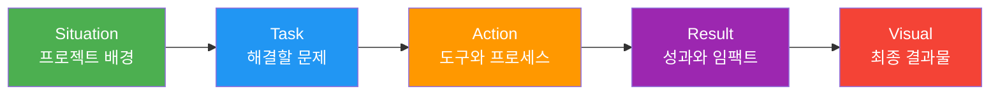
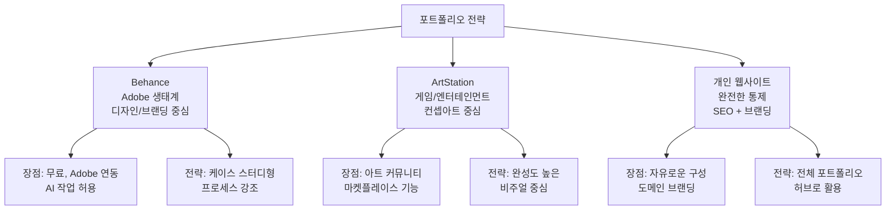
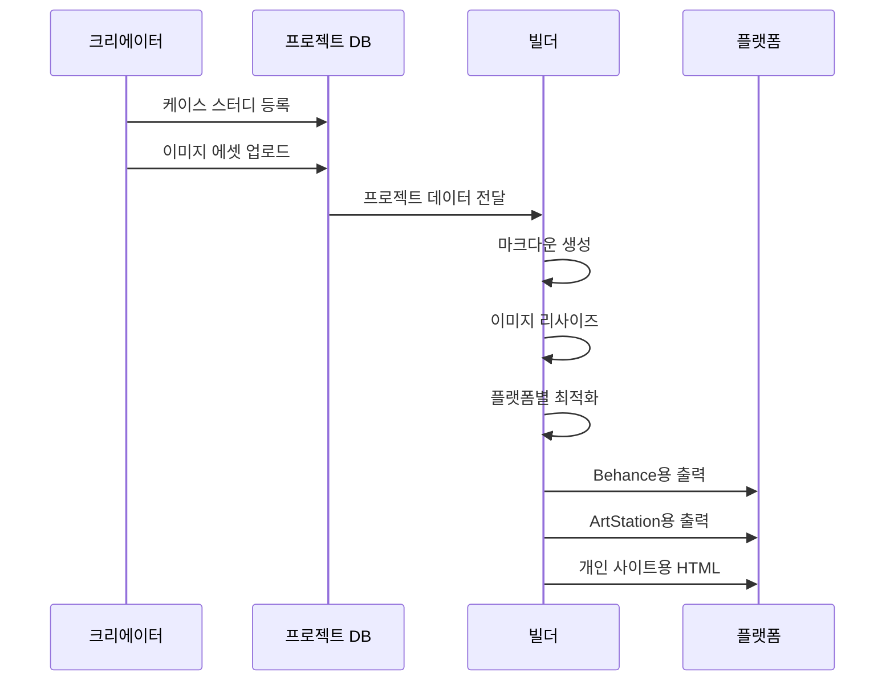
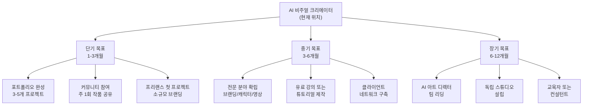
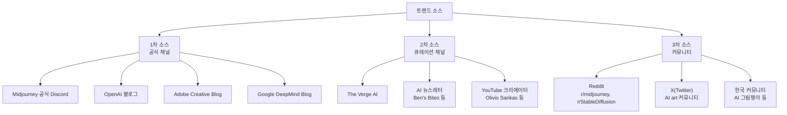

# 포트폴리오 완성과 다음 단계

> 12챕터의 여정을 하나의 전문 포트폴리오로 엮고, AI 비주얼 크리에이터로서의 성장 로드맵을 설계합니다.

## 개요

이 섹션에서는 지금까지 제작한 모든 비주얼 에셋을 전문가 수준의 포트폴리오로 정리하는 방법을 배웁니다. 단순히 이미지를 나열하는 게 아니라, 각 프로젝트의 **기획 의도 → 프로세스 → 결과물**을 스토리로 엮는 케이스 스터디 작성법을 익히고, Behance·ArtStation 등 플랫폼별 최적화 전략을 다룹니다. 마지막으로 AI 비주얼 크리에이터로서의 커리어 로드맵과 최신 트렌드를 팔로업하는 실전 방법을 정리합니다.

**선수 지식**: [프로젝트 기획 — 브리프에서 무드보드까지](12-실전-포트폴리오-프로젝트/01-01-프로젝트-기획-브리프에서-무드보드까지.md)의 크리에이티브 브리프 작성법, [브랜드 비주얼 에셋 프로젝트](12-실전-포트폴리오-프로젝트/02-02-브랜드-비주얼-에셋-프로젝트.md)의 에셋 제작 워크플로우, [AI 비주얼의 저작권·윤리·상업적 활용](12-실전-포트폴리오-프로젝트/04-04-ai-비주얼의-저작권윤리상업적-활용.md)의 컴플라이언스 검증

**학습 목표**:
- 프로젝트별 케이스 스터디를 구조화하고 Python으로 자동 생성할 수 있다
- 포트폴리오 플랫폼(Behance, ArtStation, 개인 사이트)별 최적화 전략을 세울 수 있다
- AI 비주얼 크리에이터로서의 6개월·1년 성장 로드맵을 설계할 수 있다
- 최신 트렌드와 커뮤니티를 활용한 지속 학습 체계를 구축할 수 있다

## 왜 알아야 할까?

멋진 이미지를 100장 만들었다고 포트폴리오가 되는 건 아닙니다. 클라이언트와 채용 담당자가 보고 싶은 건 **"이 사람이 어떤 문제를 어떻게 풀었는가"**거든요. 마치 요리사가 완성된 요리 사진만 보여주는 것과, 식재료 선정부터 조리 과정, 플레이팅까지의 여정을 보여주는 것의 차이와 같습니다.

Behance의 공식 가이드에 따르면, 케이스 스터디 형태로 정리된 프로젝트는 단순 이미지 갤러리 대비 **3배 이상의 조회수와 인게이지먼트**를 기록합니다. 특히 AI 도구를 활용한 작업은 "어떤 도구를 왜, 어떻게 조합했는가"라는 프로세스 자체가 차별화 포인트가 되죠.

이 섹션은 여러분이 이 코스 전체에서 만든 결과물을 **실제로 커리어에 활용할 수 있는 형태**로 바꾸는, 가장 실용적인 마지막 단계입니다.

## 핵심 개념

### 개념 1: 케이스 스터디 구조화 — STAR-V 프레임워크

> 💡 **비유**: 케이스 스터디는 영화 예고편과 같습니다. 2시간짜리 영화 전체를 보여주는 게 아니라, "갈등 → 도전 → 해결 → 감동"의 핵심 서사를 2분에 압축하죠. 포트폴리오도 마찬가지입니다 — 프로젝트의 핵심 스토리를 3~5분 안에 전달해야 합니다.

면접관이나 클라이언트는 포트폴리오 하나에 평균 **30초~2분**을 씁니다. 이 짧은 시간 안에 "이 사람은 문제를 정의하고, 창의적으로 해결하며, 결과를 만들어내는 사람이다"라는 인상을 심어야 하죠. 이를 위해 **STAR-V(Situation-Task-Action-Result-Visual)** 프레임워크를 사용합니다.

> 📊 **그림 1**: STAR-V 케이스 스터디 프레임워크



각 요소를 구체적으로 살펴보겠습니다:

| 요소 | 내용 | 예시 |
|------|------|------|
| **Situation** | 프로젝트의 배경과 맥락 | "친환경 음료 브랜드 론칭을 위한 비주얼 아이덴티티 필요" |
| **Task** | 구체적으로 해결해야 할 과제 | "로고, SNS 에셋, 캠페인 히어로 이미지 3종 제작" |
| **Action** | 사용한 도구, 기법, 의사결정 과정 | "Midjourney --sref로 톤 통일, ChatGPT로 텍스트 요소, Firefly로 배경 확장" |
| **Result** | 정량적·정성적 성과 | "7일 만에 완성, SNS 에셋 12종, 클라이언트 채택률 100%" |
| **Visual** | 최종 결과물 이미지 | 히어로 이미지, 목업, Before/After |

```python
from dataclasses import dataclass, field
from typing import List, Optional
from datetime import date

@dataclass
class CaseStudy:
    """STAR-V 프레임워크 기반 케이스 스터디"""
    title: str
    subtitle: str  # 한 줄 요약
    date: str
    
    # STAR-V 요소
    situation: str       # 프로젝트 배경
    task: str            # 해결 과제
    actions: List[str]   # 사용 도구와 프로세스
    results: List[str]   # 성과 지표
    visuals: List[str]   # 결과물 이미지 경로
    
    # 메타데이터
    tools_used: List[str] = field(default_factory=list)
    duration: str = ""
    tags: List[str] = field(default_factory=list)
    
    def to_markdown(self) -> str:
        """케이스 스터디를 마크다운으로 변환"""
        md = f"# {self.title}\n\n"
        md += f"> {self.subtitle}\n\n"
        md += f"**기간**: {self.duration} | **도구**: {', '.join(self.tools_used)}\n\n"
        
        md += "## 프로젝트 배경\n\n"
        md += f"{self.situation}\n\n"
        
        md += "## 과제 정의\n\n"
        md += f"{self.task}\n\n"
        
        md += "## 프로세스\n\n"
        for i, action in enumerate(self.actions, 1):
            md += f"{i}. {action}\n"
        md += "\n"
        
        md += "## 결과\n\n"
        for result in self.results:
            md += f"- {result}\n"
        md += "\n"
        
        md += "## 최종 결과물\n\n"
        for visual in self.visuals:
            md += f"\n\n"
        
        return md
```

```run:python
# 케이스 스터디 생성 예시
case = CaseStudy(
    title="Verdana — 친환경 음료 브랜드 비주얼 아이덴티티",
    subtitle="자연의 싱그러움을 담은 브랜드 론칭 비주얼 패키지",
    date="2026-03",
    situation="신생 친환경 음료 브랜드 'Verdana'의 론칭을 앞두고, "
              "브랜드 아이덴티티를 시각적으로 전달할 에셋이 필요했습니다.",
    task="로고 컨셉 3종, SNS 에셋 12종, 캠페인 히어로 이미지 제작",
    actions=[
        "크리에이티브 브리프 작성 — 타깃 페르소나(25-35 건강 지향 MZ세대) 정의",
        "Midjourney --sref로 '유기적 곡선 + 파스텔 그린' 스타일 통일",
        "ChatGPT 이미지 생성으로 타이포그래피 요소 제작",
        "Photoshop Generative Fill로 배경 확장 및 결함 보정",
        "채널별 리사이즈 자동화 파이프라인 구축"
    ],
    results=[
        "7일 만에 에셋 18종 완성 (기존 외주 대비 70% 단축)",
        "클라이언트 1차 채택률 100%",
        "Instagram 런칭 포스트 도달률 평균 대비 2.3배"
    ],
    visuals=["images/verdana_hero.png", "images/verdana_mockup.png"],
    tools_used=["Midjourney v7", "ChatGPT", "Photoshop + Firefly", "Python"],
    duration="7일",
    tags=["브랜딩", "SNS 에셋", "캠페인"]
)

# 마크다운 출력 (첫 500자만 미리보기)
preview = case.to_markdown()[:500]
print(preview)
print(f"\n--- 전체 길이: {len(case.to_markdown())}자 ---")
```

```output
# Verdana — 친환경 음료 브랜드 비주얼 아이덴티티

> 자연의 싱그러움을 담은 브랜드 론칭 비주얼 패키지

**기간**: 7일 | **도구**: Midjourney v7, ChatGPT, Photoshop + Firefly, Python

## 프로젝트 배경

신생 친환경 음료 브랜드 'Verdana'의 론칭을 앞두고, 브랜드 아이덴티티를 시각적으로 전달할 에셋이 필요했습니다.

## 과제 정의

로고 컨셉 3종, SNS 에셋 12종, 캠페인 히어로 이미지 제작

## 프로세스

1. 크리에이티브 브리프 작성 — 타깃 페르소나(25-35 건강 지향 MZ세대) 정의
2. Midjourney --sref로 '유기적 곡선 + 파스텔 그린' 스타일 통일

--- 전체 길이: 712자 ---
```

### 개념 2: 포트폴리오 플랫폼 전략 — 어디에, 어떻게 올릴까

> 💡 **비유**: 포트폴리오 플랫폼은 부동산의 '입지'와 같습니다. 같은 가게라도 강남 대로변에 열면 유동인구가 다르고, 동네 골목에 열면 단골 고객이 다르죠. 여러분의 작품도 어디에 전시하느냐에 따라 만나는 사람이 완전히 달라집니다.

2026년 현재 AI 비주얼 크리에이터가 고려해야 할 주요 플랫폼은 크게 세 가지입니다. 각 플랫폼의 특성과 AI 작업물에 대한 정책이 다르므로, 전략적으로 선택해야 합니다.

> 📊 **그림 2**: 플랫폼별 특성 비교와 선택 전략



```python
from dataclasses import dataclass
from typing import List, Dict
from enum import Enum

class Platform(Enum):
    BEHANCE = "behance"
    ARTSTATION = "artstation"
    PERSONAL = "personal_website"

@dataclass
class PlatformSpec:
    """플랫폼별 에셋 스펙과 전략"""
    name: str
    image_width: int          # 권장 이미지 너비 (px)
    max_images: int           # 프로젝트당 권장 이미지 수
    ai_policy: str            # AI 작업물 정책
    best_for: List[str]       # 적합한 프로젝트 유형
    tips: List[str]           # 플랫폼별 팁

# 플랫폼별 스펙 정의
PLATFORM_SPECS: Dict[Platform, PlatformSpec] = {
    Platform.BEHANCE: PlatformSpec(
        name="Behance",
        image_width=1400,
        max_images=15,
        ai_policy="AI 생성 작업 허용, 'AI Generated' 태그 권장",
        best_for=["브랜딩 프로젝트", "UI/UX 디자인", "마케팅 캠페인"],
        tips=[
            "커버 이미지에 최종 결과물 배치 (첫인상 결정)",
            "프로세스 이미지 포함 (Before/After, 도구 스크린샷)",
            "텍스트 설명은 간결하게 — 이미지가 주인공",
            "Adobe Creative Cloud 연동으로 간편 업로드"
        ]
    ),
    Platform.ARTSTATION: PlatformSpec(
        name="ArtStation",
        image_width=1920,
        max_images=20,
        ai_policy="AI 작업물 별도 카테고리 분류",
        best_for=["컨셉아트", "캐릭터 디자인", "환경 일러스트"],
        tips=[
            "고해상도 이미지 필수 (4K 권장)",
            "디테일 크롭 이미지 추가로 품질 어필",
            "마켓플레이스에 리소스 판매 가능",
            "AI 태그를 명확히 표시하여 커뮤니티 신뢰 유지"
        ]
    ),
    Platform.PERSONAL: PlatformSpec(
        name="개인 웹사이트",
        image_width=1600,
        max_images=0,  # 제한 없음
        ai_policy="자유",
        best_for=["종합 포트폴리오", "블로그형 케이스 스터디", "커리어 허브"],
        tips=[
            "도메인 이름 = 본인 이름 또는 브랜드명",
            "반응형 디자인 필수 (모바일 트래픽 60% 이상)",
            "SEO 최적화로 검색 유입 확보",
            "Behance/ArtStation 프로젝트 링크 연동"
        ]
    )
}
```

```run:python
# 플랫폼별 전략 요약 출력
for platform, spec in PLATFORM_SPECS.items():
    print(f"📌 {spec.name}")
    print(f"   이미지 너비: {spec.image_width}px")
    print(f"   AI 정책: {spec.ai_policy}")
    print(f"   적합한 프로젝트: {', '.join(spec.best_for)}")
    print(f"   핵심 팁: {spec.tips[0]}")
    print()
```

```output
📌 Behance
   이미지 너비: 1400px
   AI 정책: AI 생성 작업 허용, 'AI Generated' 태그 권장
   적합한 프로젝트: 브랜딩 프로젝트, UI/UX 디자인, 마케팅 캠페인
   핵심 팁: 커버 이미지에 최종 결과물 배치 (첫인상 결정)

📌 ArtStation
   이미지 너비: 1920px
   AI 정책: AI 작업물 별도 카테고리 분류
   적합한 프로젝트: 컨셉아트, 캐릭터 디자인, 환경 일러스트
   핵심 팁: 고해상도 이미지 필수 (4K 권장)

📌 개인 웹사이트
   이미지 너비: 1600px
   AI 정책: 자유
   적합한 프로젝트: 종합 포트폴리오, 블로그형 케이스 스터디, 커리어 허브
   핵심 팁: 도메인 이름 = 본인 이름 또는 브랜드명
```

> ⚠️ **흔한 오해**: "AI로 만든 건 포트폴리오에 넣으면 안 된다"고 생각하는 분이 많은데, 이건 절반만 맞습니다. **결과물만 덜렁 올리면** 경쟁력이 없지만, **기획 의도 + 도구 선택 이유 + 반복 실험 과정**을 함께 보여주면 오히려 "이 사람은 새로운 도구를 전략적으로 활용할 줄 아는 사람"이라는 강력한 신호를 보낼 수 있습니다.

### 개념 3: 포트폴리오 자동 빌드 시스템

> 💡 **비유**: 레스토랑의 메뉴판을 생각해보세요. 매번 새 요리를 추가할 때마다 메뉴판 전체를 다시 인쇄하는 건 비효율적이죠? 템플릿 기반 시스템이 있으면 요리 사진과 설명만 넣으면 자동으로 레이아웃이 완성됩니다. 포트폴리오도 마찬가지입니다.

여러 프로젝트의 케이스 스터디를 일관된 형식으로 관리하고, 플랫폼별로 자동 변환하는 시스템을 구축합니다.

> 📊 **그림 3**: 포트폴리오 빌드 파이프라인



```python
from dataclasses import dataclass, field
from typing import List, Dict, Optional
from pathlib import Path
import json

@dataclass
class PortfolioProject:
    """포트폴리오 프로젝트 단위"""
    case_study: CaseStudy
    cover_image: str         # 커버 이미지 경로
    category: str            # 프로젝트 카테고리
    featured: bool = False   # 메인 프로젝트 여부
    order: int = 0           # 표시 순서

@dataclass
class PortfolioBuilder:
    """포트폴리오 자동 빌드 시스템"""
    creator_name: str
    tagline: str             # 한 줄 소개
    projects: List[PortfolioProject] = field(default_factory=list)
    
    def add_project(self, project: PortfolioProject):
        """프로젝트 추가"""
        self.projects.append(project)
        # 순서 자동 정렬 (featured 우선, 나머지는 최신순)
        self.projects.sort(key=lambda p: (-p.featured, p.order))
    
    def build_index(self) -> str:
        """포트폴리오 인덱스 페이지 마크다운 생성"""
        md = f"# {self.creator_name}\n\n"
        md += f"> {self.tagline}\n\n"
        md += "---\n\n"
        
        # Featured 프로젝트
        featured = [p for p in self.projects if p.featured]
        if featured:
            md += "## Featured Projects\n\n"
            for proj in featured:
                cs = proj.case_study
                md += f"### [{cs.title}]({proj.cover_image})\n\n"
                md += f"{cs.subtitle}\n\n"
                md += f"**도구**: {', '.join(cs.tools_used)} | "
                md += f"**기간**: {cs.duration}\n\n"
        
        # 전체 프로젝트
        md += "## All Projects\n\n"
        md += "| 프로젝트 | 카테고리 | 도구 | 기간 |\n"
        md += "|---------|---------|------|------|\n"
        for proj in self.projects:
            cs = proj.case_study
            tools_short = ", ".join(cs.tools_used[:3])
            md += f"| {cs.title} | {proj.category} | {tools_short} | {cs.duration} |\n"
        
        return md
    
    def export_for_platform(self, platform: Platform) -> Dict:
        """플랫폼별 최적화 데이터 내보내기"""
        spec = PLATFORM_SPECS[platform]
        
        return {
            "platform": spec.name,
            "image_width": spec.image_width,
            "projects": [
                {
                    "title": p.case_study.title,
                    "description": p.case_study.subtitle,
                    "images_count": len(p.case_study.visuals),
                    "tags": p.case_study.tags,
                    "needs_resize": True  # 플랫폼 스펙에 맞게 리사이즈 필요
                }
                for p in self.projects
            ],
            "tips": spec.tips
        }
```

### 개념 4: AI 비주얼 크리에이터 성장 로드맵

> 💡 **비유**: 등산에 비유하면, 이 코스를 마친 여러분은 베이스캠프에 도달한 겁니다. 정상까지 가는 길은 여러 갈래가 있죠 — 브랜딩 전문가, 영상 크리에이터, AI 아트 디렉터, 프로덕트 디자이너. 어느 길을 택하든 '도구를 다루는 능력'이라는 체력은 이미 갖추었습니다.

Adobe의 2026 크리에이티브 트렌드 보고서에 따르면, 올해의 핵심 트렌드는 **Connectioneering**(브랜드와 오디언스의 진정한 연결), **Surreal Silliness**(초현실적 유머), **Local Flavor**(로컬 문화 반영)입니다. AI 도구는 이런 트렌드를 실현하는 **증폭기(amplifier)**로서 역할이 점점 커지고 있죠.

> 📊 **그림 4**: AI 비주얼 크리에이터 성장 경로



```python
from dataclasses import dataclass, field
from typing import List, Dict
from enum import Enum

class TimeFrame(Enum):
    SHORT = "1-3개월"    # 단기
    MEDIUM = "3-6개월"   # 중기
    LONG = "6-12개월"    # 장기

@dataclass
class Milestone:
    """성장 마일스톤"""
    title: str
    description: str
    skills: List[str]          # 필요 스킬
    deliverables: List[str]    # 산출물
    resources: List[str]       # 추천 리소스

@dataclass
class GrowthRoadmap:
    """AI 비주얼 크리에이터 성장 로드맵"""
    current_level: str
    milestones: Dict[TimeFrame, List[Milestone]] = field(default_factory=dict)
    
    def add_milestone(self, timeframe: TimeFrame, milestone: Milestone):
        if timeframe not in self.milestones:
            self.milestones[timeframe] = []
        self.milestones[timeframe].append(milestone)
    
    def get_next_actions(self) -> List[str]:
        """당장 실행할 수 있는 액션 리스트"""
        if TimeFrame.SHORT in self.milestones:
            actions = []
            for m in self.milestones[TimeFrame.SHORT]:
                actions.extend(m.deliverables[:2])  # 각 마일스톤에서 2개씩
            return actions
        return []
    
    def display(self) -> str:
        """로드맵을 읽기 좋게 출력"""
        output = f"🎯 현재 레벨: {self.current_level}\n\n"
        
        for timeframe in TimeFrame:
            if timeframe in self.milestones:
                output += f"{'='*50}\n"
                output += f"📅 {timeframe.value}\n"
                output += f"{'='*50}\n"
                for m in self.milestones[timeframe]:
                    output += f"\n  📌 {m.title}\n"
                    output += f"     {m.description}\n"
                    output += f"     스킬: {', '.join(m.skills)}\n"
                    output += f"     산출물: {', '.join(m.deliverables)}\n"
        
        return output

# 로드맵 구축
roadmap = GrowthRoadmap(current_level="AI 비주얼 크리에이터 (중급)")

roadmap.add_milestone(TimeFrame.SHORT, Milestone(
    title="포트폴리오 론칭",
    description="3-5개 프로젝트의 케이스 스터디를 완성하여 Behance에 공개",
    skills=["케이스 스터디 작성", "이미지 후보정", "프레젠테이션"],
    deliverables=["Behance 프로필 완성", "케이스 스터디 3개", "자기소개 페이지"],
    resources=["Behance 공식 가이드", "포트폴리오 리뷰 커뮤니티"]
))

roadmap.add_milestone(TimeFrame.SHORT, Milestone(
    title="커뮤니티 활동 시작",
    description="주 1회 작품 공유 + 피드백 교환으로 네트워크 구축",
    skills=["커뮤니케이션", "피드백 수용", "트렌드 분석"],
    deliverables=["주간 작품 1점", "커뮤니티 프로필", "첫 콜라보레이션"],
    resources=["Midjourney Discord", "Reddit r/midjourney"]
))

roadmap.add_milestone(TimeFrame.MEDIUM, Milestone(
    title="전문 분야 확립",
    description="브랜딩/캐릭터/영상 중 하나를 깊이 파고들어 전문성 확보",
    skills=["심화 프롬프트 엔지니어링", "클라이언트 소통", "프로젝트 관리"],
    deliverables=["전문 분야 포트폴리오 5개+", "유료 프로젝트 2건+", "추천서 확보"],
    resources=["Domestika 강좌", "Skillshare AI 코스"]
))
```

### 개념 5: 트렌드 팔로업과 지속 학습 체계

> 💡 **비유**: AI 이미지 생성 분야는 매일 새 메뉴가 추가되는 뷔페와 같습니다. 한 달만 안 가도 새로운 모델, 새로운 파라미터, 새로운 기법이 등장하죠. 모든 걸 다 먹으려 하면 체할 테니, **어떤 접시를 먼저 맛볼지 기준**이 필요합니다.

최신 트렌드를 효율적으로 팔로업하는 체계를 구축하는 것이 핵심입니다.

> 📊 **그림 5**: 트렌드 팔로업 정보 소스 계층



```python
from dataclasses import dataclass, field
from typing import List, Dict
from datetime import datetime

@dataclass
class TrendSource:
    """트렌드 정보 소스"""
    name: str
    url: str
    category: str          # 'official', 'curation', 'community'
    check_frequency: str   # 'daily', 'weekly', 'monthly'
    language: str = "en"

@dataclass
class LearningTracker:
    """지속 학습 추적 시스템"""
    sources: List[TrendSource] = field(default_factory=list)
    weekly_goals: List[str] = field(default_factory=list)
    skills_log: Dict[str, List[str]] = field(default_factory=dict)
    
    def add_source(self, source: TrendSource):
        self.sources.append(source)
    
    def get_daily_checklist(self) -> List[str]:
        """오늘 확인할 소스 목록"""
        daily = [s for s in self.sources if s.check_frequency == "daily"]
        return [f"[ ] {s.name} ({s.url})" for s in daily]
    
    def get_weekly_checklist(self) -> List[str]:
        """이번 주 확인할 소스 목록"""
        weekly = [s for s in self.sources 
                  if s.check_frequency in ("daily", "weekly")]
        return [f"[ ] {s.name} — {s.category}" for s in weekly]
    
    def log_skill(self, skill: str, note: str):
        """새로 배운 스킬 기록"""
        date_str = datetime.now().strftime("%Y-%m-%d")
        if skill not in self.skills_log:
            self.skills_log[skill] = []
        self.skills_log[skill].append(f"[{date_str}] {note}")
    
    def generate_report(self) -> str:
        """학습 현황 리포트 생성"""
        report = "📊 학습 현황 리포트\n"
        report += f"{'='*40}\n"
        report += f"등록 소스: {len(self.sources)}개\n"
        report += f"추적 스킬: {len(self.skills_log)}개\n\n"
        
        report += "📅 일일 체크리스트:\n"
        for item in self.get_daily_checklist():
            report += f"  {item}\n"
        
        report += "\n📅 주간 체크리스트:\n"
        for item in self.get_weekly_checklist():
            report += f"  {item}\n"
        
        return report

# 트래커 설정
tracker = LearningTracker()

# 필수 소스 등록
essential_sources = [
    TrendSource("Midjourney Announcements", "https://discord.gg/midjourney", 
                "official", "daily"),
    TrendSource("OpenAI Blog", "https://openai.com/blog", 
                "official", "weekly"),
    TrendSource("Adobe Creative Blog", "https://blog.adobe.com", 
                "official", "weekly"),
    TrendSource("r/midjourney", "https://reddit.com/r/midjourney", 
                "community", "daily"),
    TrendSource("AI Art Weekly", "https://aiartweekly.com", 
                "curation", "weekly"),
]

for source in essential_sources:
    tracker.add_source(source)
```

```run:python
# 리포트 생성
report = tracker.generate_report()
print(report)
```

```output
📊 학습 현황 리포트
========================================
등록 소스: 5개
추적 스킬: 0개

📅 일일 체크리스트:
  [ ] Midjourney Announcements (https://discord.gg/midjourney)
  [ ] r/midjourney (https://reddit.com/r/midjourney)

📅 주간 체크리스트:
  [ ] Midjourney Announcements — official
  [ ] OpenAI Blog — official
  [ ] Adobe Creative Blog — official
  [ ] r/midjourney — community
  [ ] AI Art Weekly — curation
```

## 실습: 직접 해보기

이 코스 전체에서 다룬 프로젝트들을 종합하여, 완전한 포트폴리오 빌드 시스템을 만들어봅시다. 이 코드는 여러분의 프로젝트 데이터를 입력하면 플랫폼별 최적화된 포트폴리오를 자동 생성합니다.

```python
"""
포트폴리오 자동 빌드 시스템 — 전체 실습
이 코스에서 만든 프로젝트들을 케이스 스터디로 정리하고,
플랫폼별로 최적화된 포트폴리오를 생성합니다.
"""
from dataclasses import dataclass, field
from typing import List, Dict, Optional
from pathlib import Path
from datetime import datetime
import json

# === 1단계: 프로젝트 데이터 정의 ===

@dataclass
class ProjectEntry:
    """포트폴리오에 들어갈 프로젝트"""
    title: str
    subtitle: str
    chapter_ref: str           # 이 코스의 어느 챕터와 연관되는지
    situation: str
    task: str
    actions: List[str]
    results: List[str]
    tools: List[str]
    duration: str
    tags: List[str]
    images: List[str]
    featured: bool = False

# 이 코스에서 만든 프로젝트들을 데이터로 정리
MY_PROJECTS = [
    ProjectEntry(
        title="Verdana — 친환경 음료 브랜드 아이덴티티",
        subtitle="자연의 싱그러움을 6요소 프롬프트로 시각화",
        chapter_ref="Ch8. 캐릭터·브랜드 스타일 일관성 + Ch12. 실전 프로젝트",
        situation="친환경 음료 스타트업의 브랜드 론칭 비주얼 패키지 필요",
        task="로고 컨셉 → SNS 에셋 → 캠페인 히어로 이미지의 일관된 비주얼 시스템 구축",
        actions=[
            "크리에이티브 브리프로 타깃 페르소나 정의 (Ch12.1 브리프 프레임워크)",
            "6요소 프롬프트 프레임워크로 스타일 키워드 체계화 (Ch2.1)",
            "Midjourney --sref로 브랜드 톤 고정 (Ch7.4 스타일 레퍼런스)",
            "ChatGPT로 타이포그래피 요소 생성 (Ch3.3 텍스트 렌더링)",
            "Photoshop Generative Fill로 배경 확장 및 결함 보정 (Ch9.2-9.4)",
            "Python 채널 어댑터로 멀티 플랫폼 리사이즈 (Ch12.3)"
        ],
        results=["에셋 18종 / 7일", "클라이언트 채택률 100%", "런칭 도달률 2.3배"],
        tools=["Midjourney v7", "ChatGPT", "Photoshop + Firefly", "Python/Pillow"],
        duration="7일",
        tags=["브랜딩", "SNS", "캠페인"],
        images=["portfolio/verdana_hero.png", "portfolio/verdana_mockup.png"],
        featured=True
    ),
    ProjectEntry(
        title="감정의 사계절 — AI 아트 시리즈",
        subtitle="색채 심리학과 구도로 4가지 감정을 시각화",
        chapter_ref="Ch11. 시각적 스토리텔링 + Ch5. Midjourney 파라미터",
        situation="개인 아트 프로젝트로 감정 표현력 실험",
        task="기쁨·슬픔·분노·평온을 동일 장면에서 다른 감정으로 표현",
        actions=[
            "감정별 색채 팔레트 설계 (Ch11.2 색채 심리학)",
            "구도와 카메라 앵글로 감정 강화 (Ch11.3 구도와 시선 유도)",
            "--stylize와 --chaos 파라미터 실험 (Ch5.3-5.4)",
            "ControlNet으로 구도 고정 후 스타일만 변경 (Ch7.2)"
        ],
        results=["4작품 시리즈 완성", "ArtStation 주간 추천", "200+ 좋아요"],
        tools=["Midjourney v7", "ControlNet", "Photoshop"],
        duration="5일",
        tags=["아트시리즈", "감정표현", "색채"],
        images=["portfolio/seasons_grid.png"],
        featured=True
    ),
    ProjectEntry(
        title="15초의 마법 — 숏폼 영상 캠페인",
        subtitle="정지 이미지에서 소셜 영상까지 AI 파이프라인",
        chapter_ref="Ch10. Midjourney 영상 생성 + Ch12.3 캠페인",
        situation="카페 브랜드의 시즌 메뉴 숏폼 광고 제작",
        task="히어로 이미지 → 모션 영상 → 채널별 숏폼 변환",
        actions=[
            "Midjourney로 히어로 이미지 생성",
            "Image-to-Video로 카메라 모션 추가 (Ch10.2)",
            "모션 제어로 줌인·패닝 연출 (Ch10.3)",
            "채널별(Instagram Reels, TikTok, YouTube Shorts) 리사이즈"
        ],
        results=["영상 3종 / 3일", "조회수 5만+ (Instagram Reels)"],
        tools=["Midjourney v7 Video", "Photoshop", "Python"],
        duration="3일",
        tags=["영상", "숏폼", "캠페인"],
        images=["portfolio/shortform_thumb.png"],
        featured=False
    )
]

# === 2단계: 포트폴리오 빌더 ===

class FullPortfolioBuilder:
    """전체 포트폴리오 빌드 시스템"""
    
    def __init__(self, name: str, tagline: str, email: str):
        self.name = name
        self.tagline = tagline
        self.email = email
        self.projects = MY_PROJECTS
    
    def build_case_study(self, project: ProjectEntry) -> str:
        """개별 케이스 스터디 마크다운 생성"""
        md = f"# {project.title}\n\n"
        md += f"> {project.subtitle}\n\n"
        md += f"**기간**: {project.duration} | "
        md += f"**도구**: {', '.join(project.tools)}\n\n"
        md += f"**관련 학습**: {project.chapter_ref}\n\n"
        md += "---\n\n"
        
        # STAR-V 구조
        md += "## 배경 (Situation)\n\n"
        md += f"{project.situation}\n\n"
        
        md += "## 과제 (Task)\n\n"
        md += f"{project.task}\n\n"
        
        md += "## 프로세스 (Action)\n\n"
        for i, action in enumerate(project.actions, 1):
            md += f"**{i}.** {action}\n\n"
        
        md += "## 결과 (Result)\n\n"
        for result in project.results:
            md += f"✅ {result}\n\n"
        
        md += "## 결과물 (Visual)\n\n"
        for img in project.images:
            md += f"\n\n"
        
        md += f"---\n\n*태그: {', '.join(project.tags)}*\n"
        
        return md
    
    def build_portfolio_index(self) -> str:
        """포트폴리오 인덱스 페이지 생성"""
        md = f"# {self.name}\n\n"
        md += f"> {self.tagline}\n\n"
        md += f"📧 {self.email}\n\n"
        md += "---\n\n"
        
        # Featured 프로젝트
        featured = [p for p in self.projects if p.featured]
        if featured:
            md += "## ⭐ Featured\n\n"
            for p in featured:
                md += f"### {p.title}\n"
                md += f"{p.subtitle}\n\n"
                md += f"도구: {', '.join(p.tools)} | 기간: {p.duration}\n\n"
                md += f"성과: {' / '.join(p.results)}\n\n"
        
        # 전체 목록
        md += "## 📂 All Projects\n\n"
        md += "| # | 프로젝트 | 카테고리 | 핵심 도구 | 성과 |\n"
        md += "|---|---------|---------|----------|------|\n"
        for i, p in enumerate(self.projects, 1):
            tags = ", ".join(p.tags[:2])
            tool = p.tools[0]
            result = p.results[0] if p.results else "-"
            md += f"| {i} | {p.title} | {tags} | {tool} | {result} |\n"
        
        # 도구 스택 요약
        all_tools = set()
        for p in self.projects:
            all_tools.update(p.tools)
        md += f"\n## 🛠 도구 스택\n\n{' · '.join(sorted(all_tools))}\n"
        
        return md
    
    def export_stats(self) -> Dict:
        """포트폴리오 통계"""
        all_tools = set()
        all_tags = set()
        for p in self.projects:
            all_tools.update(p.tools)
            all_tags.update(p.tags)
        
        return {
            "total_projects": len(self.projects),
            "featured_projects": sum(1 for p in self.projects if p.featured),
            "unique_tools": len(all_tools),
            "categories": list(all_tags),
            "tools_list": sorted(all_tools)
        }

# === 3단계: 빌드 실행 ===

builder = FullPortfolioBuilder(
    name="김크리에이터",
    tagline="AI 도구를 전략적으로 조합하여 브랜드 비주얼을 만드는 크리에이터",
    email="creator@example.com"
)

# 케이스 스터디 생성
for project in builder.projects:
    case_md = builder.build_case_study(project)
    # 실제로는 파일로 저장: Path(f"portfolio/{project.tags[0]}.md").write_text(case_md)

# 인덱스 페이지 생성
index_md = builder.build_portfolio_index()

# 통계 출력
stats = builder.export_stats()
```

```run:python
# 빌드 결과 확인
print("📊 포트폴리오 빌드 완료!")
print(f"   총 프로젝트: {stats['total_projects']}개")
print(f"   Featured: {stats['featured_projects']}개")
print(f"   사용 도구: {stats['unique_tools']}종 ({', '.join(stats['tools_list'])})")
print(f"   카테고리: {', '.join(stats['categories'])}")
print()
print("📄 인덱스 페이지 미리보기:")
print("="*50)
# 인덱스의 처음 부분만 출력
for line in index_md.split('\n')[:20]:
    print(line)
```

```output
📊 포트폴리오 빌드 완료!
   총 프로젝트: 3개
   Featured: 2개
   사용 도구: 6종 (ChatGPT, ControlNet, Midjourney v7, Midjourney v7 Video, Photoshop, Photoshop + Firefly, Python, Python/Pillow)
   카테고리: SNS, 감정표현, 숏폼, 색채, 아트시리즈, 영상, 캠페인, 브랜딩

📄 인덱스 페이지 미리보기:
==================================================
# 김크리에이터

> AI 도구를 전략적으로 조합하여 브랜드 비주얼을 만드는 크리에이터

📧 creator@example.com

---

## ⭐ Featured

### Verdana — 친환경 음료 브랜드 아이덴티티
자연의 싱그러움을 6요소 프롬프트로 시각화

도구: Midjourney v7, ChatGPT, Photoshop + Firefly, Python/Pillow | 기간: 7일

성과: 에셋 18종 / 7일 / 클라이언트 채택률 100% / 런칭 도달률 2.3배

### 감정의 사계절 — AI 아트 시리즈
```

## 더 깊이 알아보기

### 포트폴리오의 역사 — 르네상스에서 Behance까지

"포트폴리오(Portfolio)"라는 단어는 이탈리아어 *portafoglio*에서 왔는데, "서류를 들고 다니다"라는 뜻입니다. 르네상스 시대의 화가들은 후원자를 찾기 위해 자신의 스케치와 습작을 가죽 폴더에 넣어 들고 다녔는데, 이것이 최초의 포트폴리오였죠.

20세기에는 광고 업계의 아트 디렉터들이 대형 바인더에 인쇄물을 정리해서 면접에 가져갔고, 2000년대 들어 Behance(2006년 설립)와 Dribbble(2009년)이 등장하면서 디지털 포트폴리오 시대가 열렸습니다. 흥미로운 건 Behance를 만든 Scott Belsky의 철학이었는데, 그는 "크리에이티브 작업의 99%는 실행이다"라고 말하며 Behance라는 이름 자체를 *behave*에서 따왔습니다 — 아이디어가 아닌 **실행과 행동**을 강조한 것이죠.

2023년 이후 AI 생성 이미지의 등장으로 포트폴리오의 의미가 다시 한번 전환기를 맞고 있습니다. ArtStation에서는 AI 작업물에 대한 격렬한 찬반 논쟁이 벌어졌고, 이에 반발해 AI 이미지를 금지하는 Cara 같은 플랫폼이 등장하기도 했습니다. 이런 상황에서 AI 크리에이터가 포트폴리오로 인정받으려면, **"나는 버튼만 누른 게 아니라 전략적으로 도구를 조합했다"**는 것을 프로세스로 증명해야 합니다.

### Adobe의 2026 크리에이티브 트렌드

Adobe의 2026 크리에이티브 트렌드 보고서는 4가지 핵심 방향을 제시합니다:

1. **Connectioneering** — 브랜드와 오디언스 사이의 진정한 감정적 연결을 만드는 비주얼
2. **Surreal Silliness** — AI 도구를 활용한 초현실적이고 유머러스한 비주얼
3. **Local Flavor** — 글로벌보다 로컬 문화를 반영한 진정성 있는 디자인
4. **Sensory-Driven Design** — 오감을 자극하는 몰입형 비주얼 경험

특히 주목할 점은, AI 기술이 발전할수록 오히려 **인간적이고 유기적인 디자인**에 대한 수요가 커지고 있다는 것입니다. 기술은 증폭기일 뿐, 방향을 결정하는 건 여전히 크리에이터의 안목이라는 사실이 트렌드에서도 확인되고 있습니다.

## 흔한 오해와 팁

> ⚠️ **흔한 오해**: "프로젝트 수가 많을수록 좋은 포트폴리오다." 사실 3~5개의 깊이 있는 케이스 스터디가 20개의 피상적인 이미지 갤러리보다 훨씬 효과적입니다. Behance의 공식 가이드도 "길이보다 깊이, 양보다 임팩트"를 강조합니다. 프로젝트를 엄선하고, 각각에 충분한 맥락과 스토리를 부여하세요.

> 💡 **알고 계셨나요?**: Behance는 프로젝트 커버 이미지의 퀄리티가 클릭률의 80%를 결정한다고 합니다. 심지어 훌륭한 프로젝트도 커버가 매력적이지 않으면 묻힐 수 있어요. 이미지 해상도 1400px 이상, 최종 결과물을 커버에 배치하되, 텍스트 오버레이는 최소화하는 것이 Behance의 공식 권장 사항입니다.

> 🔥 **실무 팁**: AI 도구를 활용한 프로젝트를 포트폴리오에 넣을 때, 반드시 **"도구 선택 이유"**를 명시하세요. "Midjourney를 사용했습니다"가 아니라 "브랜드의 몽환적 톤을 위해 Midjourney v7의 --stylize 750을 선택하고, 텍스트 정확도가 필요한 요소는 ChatGPT로 분리 제작했습니다"처럼 **왜 그 도구를 선택했는지의 의사결정 과정**을 보여주는 것이 차별화의 핵심입니다.

## 핵심 정리

| 개념 | 설명 |
|------|------|
| STAR-V 프레임워크 | Situation-Task-Action-Result-Visual 구조로 케이스 스터디 작성 |
| 플랫폼 전략 | Behance(프로세스 중심), ArtStation(비주얼 중심), 개인 사이트(허브) |
| 포트폴리오 빌더 | Python으로 프로젝트 데이터를 플랫폼별 최적화 포맷으로 자동 변환 |
| 성장 로드맵 | 단기(포트폴리오 론칭) → 중기(전문화) → 장기(아트 디렉터/스튜디오) |
| 트렌드 팔로업 | 1차(공식) → 2차(큐레이션) → 3차(커뮤니티) 계층화된 정보 소스 |
| 2026 트렌드 | Connectioneering, Surreal Silliness, Local Flavor, Sensory-Driven |
| 컴플라이언스 | [AI 저작권 가이드](12-실전-포트폴리오-프로젝트/04-04-ai-비주얼의-저작권윤리상업적-활용.md)를 반드시 확인 후 상업 활용 |

## 다음 섹션 미리보기

축하합니다! 여러분은 **"Prompt to Pixel"** 코스의 전체 여정을 완주했습니다. [프롬프트 해부학 6요소 프레임워크](02-프롬프트-구조-마스터/01-01-프롬프트-해부학-6요소-프레임워크.md)에서 시작해, [시각적 스토리텔링](11-시각적-스토리텔링과-감정-전달/01-01-시각적-스토리텔링의-원리.md)의 깊이까지, 그리고 이 마지막 섹션에서 그 모든 것을 하나의 포트폴리오로 엮어냈습니다.

여기서 멈추지 마세요. 이 코스에서 만든 포트폴리오 빌더로 첫 프로젝트를 오늘 Behance에 올려보세요. 완벽하지 않아도 괜찮습니다 — Behance의 설립자 Scott Belsky가 말했듯이, **"아이디어는 실행되지 않으면 아무 의미가 없습니다."** 여러분의 다음 픽셀이 기다리고 있습니다.

## 참고 자료

- [Behance — Building the Perfect Case Study](https://www.behance.net/resources/articles/building-the-perfect-case-study) - Behance 공식 케이스 스터디 작성 가이드. 프로젝트 구조화와 프레젠테이션 팁 수록
- [Adobe 2026 Creative Trends Forecast](https://business.adobe.com/resources/creative-trends-report.html) - 2026년 크리에이티브 산업의 4대 핵심 트렌드와 AI의 역할 분석
- [Creative Bloq — Behance vs ArtStation](https://www.creativebloq.com/features/behance-vs-artstation) - 두 대표 포트폴리오 플랫폼의 특성, 장단점, 대상 사용자 비교
- [Graphic Design with AI: Creative Trends Shaping 2026](https://www.tops-int.com/blog/graphic-design-with-ai-creative-trends-shaping-2026) - AI가 그래픽 디자인 산업을 어떻게 변화시키고 있는지에 대한 심층 분석
- [Fayden Art — Alternatives to ArtStation for Artists](https://fayden.art/new-alternatives-to-artstation-for-artists/) - ArtStation 외의 대안 플랫폼(Cara, DeviantArt 등) 비교와 AI 정책 분석

---
### 🔗 Related Sessions
- [visual_storytelling](11-시각적-스토리텔링과-감정-전달/01-01-시각적-스토리텔링의-원리.md) (prerequisite)
- [creative_brief](12-실전-포트폴리오-프로젝트/01-01-프로젝트-기획-브리프에서-무드보드까지.md) (prerequisite)
- [emotioncolorpalette](11-시각적-스토리텔링과-감정-전달/02-02-색채-심리학과-감정-팔레트.md) (prerequisite)
- [brand_asset_kit](12-실전-포트폴리오-프로젝트/02-02-브랜드-비주얼-에셋-프로젝트.md) (prerequisite)
- [campaign_prompt_builder](12-실전-포트폴리오-프로젝트/03-03-캠페인-비주얼과-영상-콘텐츠-제작.md) (prerequisite)
- [copyright_level_assessor](12-실전-포트폴리오-프로젝트/04-04-ai-비주얼의-저작권윤리상업적-활용.md) (prerequisite)
