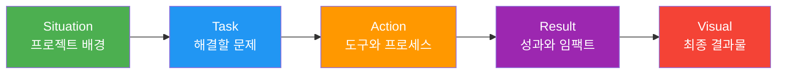
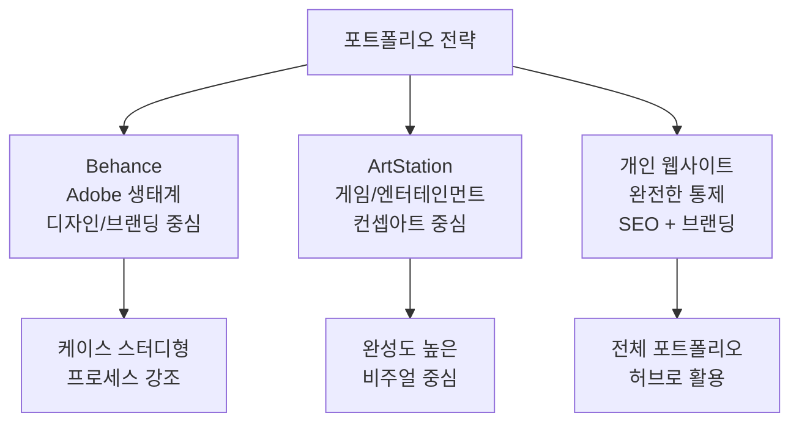
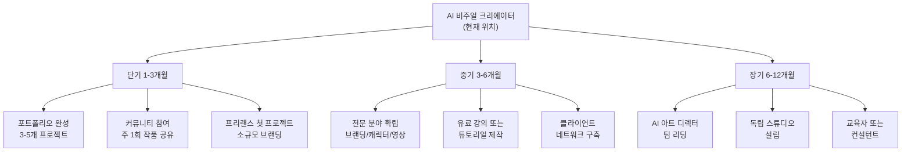

# 포트폴리오 완성과 다음 단계

> 12챕터의 여정을 하나의 전문 포트폴리오로 엮고, AI 비주얼 크리에이터로서의 성장 로드맵을 설계합니다.

## 개요

이 섹션에서는 코스 전체에서 제작한 비주얼 에셋을 전문가 수준의 포트폴리오로 정리합니다. 프로젝트의 기획 의도부터 결과물까지를 케이스 스터디로 엮는 방법을 익히고, Behance와 ArtStation 등 플랫폼별 최적화 전략과 성장 로드맵을 다룹니다.

## 케이스 스터디 구조화 — STAR-V 프레임워크

면접관이나 클라이언트는 포트폴리오 하나에 평균 30초~2분을 씁니다. 이 짧은 시간 안에 "문제를 정의하고, 창의적으로 해결하며, 결과를 만들어내는 사람"이라는 인상을 심어야 합니다. **STAR-V(Situation-Task-Action-Result-Visual)** 프레임워크가 이를 가능하게 합니다.



| 요소 | 내용 | 예시 |
|------|------|------|
| **Situation** | 프로젝트의 배경과 맥락 | "친환경 음료 브랜드 론칭을 위한 비주얼 아이덴티티 필요" |
| **Task** | 구체적으로 해결해야 할 과제 | "로고, SNS 에셋, 캠페인 히어로 이미지 3종 제작" |
| **Action** | 사용한 도구, 기법, 의사결정 과정 | "Midjourney --sref로 톤 통일, ChatGPT로 텍스트, Firefly로 배경 확장" |
| **Result** | 정량적/정성적 성과 | "7일 만에 완성, 에셋 12종, 클라이언트 채택률 100%" |
| **Visual** | 최종 결과물 이미지 | 히어로 이미지, 목업, Before/After |

케이스 스터디의 핵심은 단순 결과물 나열이 아니라 **의사결정 과정의 시각화**입니다. 다음 프롬프트로 케이스 스터디용 프레젠테이션 이미지를 만들어보세요.

```
A clean portfolio case study layout, split into 4 panels showing project progression: mood board, style exploration, refinement, final deliverable. Minimalist design on white background, professional presentation mockup, 16:9 aspect ratio
```


## 포트폴리오 플랫폼 전략

2026년 현재 AI 비주얼 크리에이터가 고려해야 할 주요 플랫폼은 크게 세 가지입니다. 각 플랫폼의 AI 작업물 정책이 다르므로 전략적 선택이 필요합니다.



| 항목 | Behance | ArtStation | 개인 웹사이트 |
|------|---------|------------|-------------|
| **권장 이미지 너비** | 1400px | 1920px (4K 권장) | 1600px |
| **AI 정책** | AI 작업 허용, 태그 권장 | 별도 카테고리 분류 | 자유 |
| **적합한 프로젝트** | 브랜딩, UI/UX, 마케팅 | 컨셉아트, 캐릭터, 환경 | 종합 허브, 블로그형 |
| **핵심 전략** | 프로세스 스토리 강조 | 고해상도 비주얼 중심 | SEO + 외부 링크 연동 |
| **커버 이미지** | 최종 결과물 배치 | 디테일 크롭 추가 | 반응형 디자인 필수 |

### Behance 커버 이미지 만들기

Behance에서 커버 이미지 퀄리티가 클릭률의 80%를 결정합니다. 다음 프롬프트로 프로젝트별 커버를 제작하세요.

```
Professional portfolio cover image for an eco-friendly beverage brand project. Hero product shot with organic green gradient background, elegant typography space on the left third, clean minimalist composition, studio lighting, 1400x1050 resolution
```


```
Dark elegant portfolio cover for a character design series, 4 character portraits arranged in a 2x2 grid with subtle glow effects, fantasy art style, moody lighting, ArtStation trending aesthetic, 1920x1080
```


### Before/After 프로세스 이미지

포트폴리오에서 프로세스를 보여주는 가장 효과적인 방법은 Before/After 비교입니다.

```
Split-screen comparison image: left side showing a rough sketch wireframe of a brand logo in pencil, right side showing the polished final AI-generated logo design with vibrant colors. Clean dividing line in the middle, professional presentation
```


## 프로젝트별 포트폴리오 프레젠테이션

### 브랜딩 프로젝트 프레젠테이션

```
Brand identity mockup presentation: eco-friendly beverage logo on glass bottles, paper bags, and business cards, arranged on a marble surface with natural leaves, top-down flat lay photography style, soft natural lighting
```


```
Social media asset grid showing 9 Instagram posts for a beverage brand campaign, cohesive pastel green color palette, mix of product shots and lifestyle imagery, professional feed layout preview
```


### 아트 시리즈 프레젠테이션

```
Four-panel emotion art series: same forest landscape rendered in four different moods -- joy with warm golden sunlight, sadness with cool blue rain, anger with dramatic red stormy sky, peace with soft purple twilight. Consistent composition, varying color palettes only
```


### 아트 시리즈 디테일 크롭

ArtStation에서는 전체 이미지 외에 디테일 크롭을 추가하면 작업의 정밀도를 어필할 수 있습니다.

```
Extreme close-up detail crop of a fantasy forest painting, focusing on intricate leaf textures and magical light particles, visible brushstroke-like details, high resolution macro view, 4K quality
```


### 영상 프로젝트 프레젠테이션

```
Video production storyboard layout: 6 sequential frames showing a coffee cup advertisement progression from still life to camera zoom-in to steam animation, cinematic film strip presentation style, dark background
```


### 개인 웹사이트 히어로 섹션

개인 사이트의 랜딩 페이지에 사용할 히어로 이미지는 본인의 크리에이티브 정체성을 한눈에 전달해야 합니다.

```
Minimalist personal website hero banner, abstract geometric art composition blending digital and organic elements, gradient from deep navy to soft coral, subtle grid overlay, ultra-wide 21:9 aspect ratio, modern and professional
```


## AI 비주얼 크리에이터 성장 로드맵

이 코스를 마친 여러분은 베이스캠프에 도달한 겁니다. 정상까지 가는 길은 여러 갈래가 있고, 어느 길을 택하든 도구를 다루는 체력은 이미 갖추었습니다.



| 시기 | 목표 | 핵심 액션 | 산출물 |
|------|------|----------|--------|
| **1-3개월** | 포트폴리오 론칭 | Behance에 케이스 스터디 3-5개 공개 | 프로필 + 자기소개 페이지 |
| **1-3개월** | 커뮤니티 활동 | 주 1회 작품 공유 + 피드백 교환 | 첫 콜라보레이션 |
| **3-6개월** | 전문 분야 확립 | 브랜딩/캐릭터/영상 중 하나에 집중 | 유료 프로젝트 2건+ |
| **3-6개월** | 교육 콘텐츠 | 튜토리얼 또는 강의 제작 | 클라이언트 추천서 |
| **6-12개월** | 커리어 확장 | AI 아트 디렉터 또는 독립 스튜디오 | 팀 빌딩 또는 사업자 등록 |

### 트렌드 팔로업 체계

| 소스 레벨 | 채널 | 확인 주기 |
|----------|------|----------|
| **1차 (공식)** | Midjourney Discord, OpenAI Blog, Adobe Creative Blog | 매일~주 1회 |
| **2차 (큐레이션)** | The Verge AI, AI Art Weekly, YouTube 크리에이터 | 주 1회 |
| **3차 (커뮤니티)** | Reddit r/midjourney, X AI art 커뮤니티, 한국 AI 그림쟁이 | 매일 |

2026년 Adobe 크리에이티브 트렌드 보고서의 핵심 키워드는 **Connectioneering**(진정한 연결), **Surreal Silliness**(초현실적 유머), **Local Flavor**(로컬 문화 반영)입니다. AI 도구는 이런 트렌드를 실현하는 증폭기로서 역할이 커지고 있습니다.

특히 주목할 점은 AI 기술이 발전할수록 오히려 인간적이고 유기적인 디자인에 대한 수요가 커지고 있다는 것입니다. 기술은 증폭기일 뿐, 방향을 결정하는 건 여전히 크리에이터의 안목입니다. 포트폴리오에서도 "어떤 도구를 썼는가"보다 "왜 이 방향을 선택했는가"가 더 중요해지고 있습니다.

## 실습: 나만의 포트폴리오 프로젝트 구성

이 코스에서 다룬 프로젝트들을 STAR-V 프레임워크로 정리하고, 플랫폼에 올릴 프레젠테이션 이미지를 제작해보세요.

**1단계: 프로젝트 선정 (3-5개)**

이 코스에서 진행한 프로젝트 중 가장 완성도 높은 것을 선별합니다.

- 브랜딩 프로젝트 (Ch8, Ch12.2)
- 아트 시리즈 (Ch5, Ch11)
- 숏폼 영상 캠페인 (Ch10, Ch12.3)

**2단계: STAR-V 케이스 스터디 작성**

각 프로젝트에 대해 Situation, Task, Action, Result, Visual을 정리합니다.

**3단계: 프레젠테이션 이미지 제작**

```
Professional portfolio hero image: a creative workspace flat lay with a tablet showing AI-generated artwork, color swatches, mood board printouts, and a coffee cup, warm ambient lighting, top-down photography, clean and organized
```


**4단계: 플랫폼별 최적화 업로드**

- Behance: 커버 1400px, 프로세스 이미지 포함, AI Generated 태그
- ArtStation: 4K 해상도, 디테일 크롭 추가, AI 카테고리 분류
- 개인 사이트: 반응형 레이아웃, SEO 메타 태그, 외부 플랫폼 링크

**5단계: 자기소개 비주얼 제작**

포트폴리오의 About 페이지에 사용할 프로필 관련 비주얼도 준비하세요.

```
Creative professional profile banner showing a stylized digital workspace with floating UI elements, color palettes, and 3D design tools, isometric perspective, vibrant but professional color scheme, tech-meets-art aesthetic
```


## 팁과 주의사항

> **양보다 깊이**: 3-5개의 깊이 있는 케이스 스터디가 20개의 이미지 갤러리보다 훨씬 효과적입니다. 프로젝트를 엄선하고 각각에 충분한 맥락과 스토리를 부여하세요.

> **도구 선택 이유 명시**: "Midjourney를 사용했습니다"가 아니라 "브랜드의 몽환적 톤을 위해 Midjourney --stylize 750을 선택하고, 텍스트 정확도가 필요한 요소는 ChatGPT로 분리 제작했습니다"처럼 의사결정 과정을 보여주세요.

> **AI 작업물은 프로세스가 차별화 포인트**: 결과물만 올리면 경쟁력이 없지만, 기획 의도 + 도구 조합 이유 + 반복 실험 과정을 함께 보여주면 "새로운 도구를 전략적으로 활용할 줄 아는 사람"이라는 신호를 줍니다.

> **커버 이미지가 클릭률의 80%를 결정**: 해상도 1400px 이상, 최종 결과물을 커버에 배치하되 텍스트 오버레이는 최소화하세요.

> **컴플라이언스 확인 필수**: 상업 활용 전에 반드시 AI 저작권 가이드를 확인하세요. 플랫폼별 AI 작업물 정책도 수시로 변경되므로 업로드 전 최신 정책을 체크해야 합니다.

## 핵심 정리

| 개념 | 설명 |
|------|------|
| STAR-V 프레임워크 | Situation-Task-Action-Result-Visual 구조로 케이스 스터디 작성 |
| 플랫폼 전략 | Behance(프로세스 중심), ArtStation(비주얼 중심), 개인 사이트(허브) |
| 성장 로드맵 | 단기(포트폴리오 론칭) → 중기(전문화) → 장기(아트 디렉터/스튜디오) |
| 트렌드 팔로업 | 1차(공식) → 2차(큐레이션) → 3차(커뮤니티) 계층화된 정보 소스 |
| 2026 트렌드 | Connectioneering, Surreal Silliness, Local Flavor |
| 프로세스 증명 | Before/After, 도구 선택 이유, 반복 실험 기록이 AI 포트폴리오의 핵심 |

## 코스 마무리

축하합니다. 여러분은 **"Prompt to Pixel"** 코스의 전체 여정을 완주했습니다.

이 코스에서 여러분이 익힌 것들을 돌아보면:

- **프롬프트 구조**: 6요소 프레임워크로 의도를 정확히 전달하는 방법
- **도구 활용**: Midjourney, ChatGPT, Firefly 등 각 도구의 강점을 조합하는 전략
- **스타일 일관성**: --sref, ControlNet, 스타일 가이드로 브랜드 톤을 유지하는 기법
- **시각적 스토리텔링**: 색채 심리학, 구도, 감정 전달의 원리
- **실전 프로젝트**: 브리프 작성부터 에셋 제작, 캠페인 영상까지 완결된 워크플로우
- **포트폴리오**: STAR-V 프레임워크로 작업을 커리어 자산으로 전환하는 방법

여기서 멈추지 마세요. 오늘 바로 첫 프로젝트를 Behance에 올려보세요. 완벽하지 않아도 괜찮습니다. 아이디어는 실행되지 않으면 아무 의미가 없습니다. 여러분의 다음 픽셀이 기다리고 있습니다.
