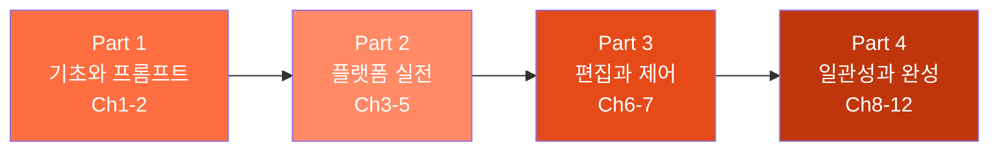

# 2026: Prompt to Pixel

> 논코더 디자이너를 위한 AI 이미지·영상 생성 실전 가이드 — **12챕터 61섹션** 튜토리얼

## 학습 로드맵

> 프롬프트 구조(주제·스타일·구도·조명·매체·분위기)를 마스터한 뒤, ChatGPT·Gemini·Midjourney 각 플랫폼을 실전 활용하고, img2img·인페인팅·아웃페인팅 편집 기법과 ControlNet·참조 이미지 제어를 익힌 후, 캐릭터·브랜드 일관성 유지 전략과 포트폴리오 프로젝트를 완성합니다.

---

## Part 1: 기초와 프롬프트 (Ch1-2, 입문)

**Ch1. AI 이미지 생성 개론**
- [01. 생성형 AI가 바꾸는 디자인 워크플로우](01-ch1-ai-이미지-생성-개론/01-01-생성형-ai가-바꾸는-디자인-워크플로우.md) · [02. 주요 플랫폼 비교 — ChatGPT vs Gemini vs Midjourney](01-ch1-ai-이미지-생성-개론/02-02-주요-플랫폼-비교-chatgpt-vs-gemini-vs-midjourney.md) · [03. Adobe Firefly와 크리에이티브 생태계](01-ch1-ai-이미지-생성-개론/03-03-adobe-firefly와-크리에이티브-생태계.md) · [04. 플랫폼별 계정 설정과 인터페이스 탐색](01-ch1-ai-이미지-생성-개론/04-04-플랫폼별-계정-설정과-인터페이스-탐색.md) · [05. 실무 시나리오별 플랫폼 선택 가이드](01-ch1-ai-이미지-생성-개론/05-05-실무-시나리오별-플랫폼-선택-가이드.md)

**Ch2. 프롬프트 구조 마스터**
- [01. 프롬프트 해부학 — 6요소 프레임워크](02-ch2-프롬프트-구조-마스터/01-01-프롬프트-해부학-6요소-프레임워크.md) · [02. 주제와 스타일 — 무엇을 어떤 느낌으로](02-ch2-프롬프트-구조-마스터/02-02-주제와-스타일-무엇을-어떤-느낌으로.md) · [03. 구도와 앵글 — 시선을 이끄는 프레이밍](02-ch2-프롬프트-구조-마스터/03-03-구도와-앵글-시선을-이끄는-프레이밍.md) · [04. 조명과 매체 — 빛과 질감으로 깊이 더하기](02-ch2-프롬프트-구조-마스터/04-04-조명과-매체-빛과-질감으로-깊이-더하기.md) · [05. 분위기와 감정 키워드 전략](02-ch2-프롬프트-구조-마스터/05-05-분위기와-감정-키워드-전략.md) · [06. 나만의 프롬프트 템플릿 만들기](02-ch2-프롬프트-구조-마스터/06-06-나만의-프롬프트-템플릿-만들기.md)

## Part 2: 플랫폼 실전 (Ch3-5, 초급)

**Ch3. ChatGPT 이미지 생성 실전**
- [01. GPT-4o 이미지 생성의 특징과 강점](03-ch3-chatgpt-이미지-생성-실전/01-01-gpt-4o-이미지-생성의-특징과-강점.md) · [02. 대화형 이미지 생성 — 자연어로 그리기](03-ch3-chatgpt-이미지-생성-실전/02-02-대화형-이미지-생성-자연어로-그리기.md) · [03. 텍스트 렌더링과 타이포그래피 이미지](03-ch3-chatgpt-이미지-생성-실전/03-03-텍스트-렌더링과-타이포그래피-이미지.md) · [04. 이미지 업로드와 편집 — Select 도구 활용](03-ch3-chatgpt-이미지-생성-실전/04-04-이미지-업로드와-편집-select-도구-활용.md) · [05. ChatGPT 이미지 생성 실무 프로젝트](03-ch3-chatgpt-이미지-생성-실전/05-05-chatgpt-이미지-생성-실무-프로젝트.md)

**Ch4. Gemini 이미지 생성 실전**
- [01. Gemini 이미지 생성의 특징과 접근법](04-ch4-gemini-이미지-생성-실전/01-01-gemini-이미지-생성의-특징과-접근법.md) · [02. 고품질 이미지 생성과 스타일 전환](04-ch4-gemini-이미지-생성-실전/02-02-고품질-이미지-생성과-스타일-전환.md) · [03. Gemini 이미지 편집과 변환](04-ch4-gemini-이미지-생성-실전/03-03-gemini-이미지-편집과-변환.md) · [04. ChatGPT vs Gemini 실전 비교와 조합 전략](04-ch4-gemini-이미지-생성-실전/04-04-chatgpt-vs-gemini-실전-비교와-조합-전략.md)

**Ch5. Midjourney 기본과 파라미터 튜닝**
- [01. Midjourney 인터페이스와 기본 생성](05-ch5-midjourney-기본과-파라미터-튜닝/01-01-midjourney-인터페이스와-기본-생성.md) · [02. 종횡비(--ar)와 구도 제어](05-ch5-midjourney-기본과-파라미터-튜닝/02-02-종횡비--ar와-구도-제어.md) · [03. 스타일라이즈(--stylize)와 미학 제어](05-ch5-midjourney-기본과-파라미터-튜닝/03-03-스타일라이즈--stylize와-미학-제어.md) · [04. 카오스(--chaos)와 다양성 탐색](05-ch5-midjourney-기본과-파라미터-튜닝/04-04-카오스--chaos와-다양성-탐색.md) · [05. 네거티브 프롬프트(--no)와 품질 제어](05-ch5-midjourney-기본과-파라미터-튜닝/05-05-네거티브-프롬프트--no와-품질-제어.md) · [06. 파라미터 조합과 Remix·Variation 활용](05-ch5-midjourney-기본과-파라미터-튜닝/06-06-파라미터-조합과-remixvariation-활용.md)

## Part 3: 편집과 제어 (Ch6-7, 중급)

**Ch6. 이미지 편집 기법 — img2img·인페인팅·아웃페인팅**
- [01. img2img — 이미지 기반 변환의 원리](06-ch6-이미지-편집-기법-img2img인페인팅아웃페인팅/01-01-img2img-이미지-기반-변환의-원리.md) · [02. 인페인팅 기초 — 부분 수정의 기술](06-ch6-이미지-편집-기법-img2img인페인팅아웃페인팅/02-02-인페인팅-기초-부분-수정의-기술.md) · [03. 인페인팅 고급 — 복잡한 편집 시나리오](06-ch6-이미지-편집-기법-img2img인페인팅아웃페인팅/03-03-인페인팅-고급-복잡한-편집-시나리오.md) · [04. 아웃페인팅 — 캔버스 확장과 구도 재구성](06-ch6-이미지-편집-기법-img2img인페인팅아웃페인팅/04-04-아웃페인팅-캔버스-확장과-구도-재구성.md) · [05. 편집 기법 조합 실전 프로젝트](06-ch6-이미지-편집-기법-img2img인페인팅아웃페인팅/05-05-편집-기법-조합-실전-프로젝트.md)

**Ch7. ControlNet과 참조 이미지 활용**
- [01. ControlNet 개요 — 참조 이미지로 제어하기](07-ch7-controlnet과-참조-이미지-활용/01-01-controlnet-개요-참조-이미지로-제어하기.md) · [02. 구도와 깊이 제어 — Canny·Depth 활용](07-ch7-controlnet과-참조-이미지-활용/02-02-구도와-깊이-제어-cannydepth-활용.md) · [03. 포즈 제어 — OpenPose와 인물 생성](07-ch7-controlnet과-참조-이미지-활용/03-03-포즈-제어-openpose와-인물-생성.md) · [04. Midjourney --sref 스타일 레퍼런스](07-ch7-controlnet과-참조-이미지-활용/04-04-midjourney---sref-스타일-레퍼런스.md) · [05. Midjourney --cref 캐릭터 레퍼런스](07-ch7-controlnet과-참조-이미지-활용/05-05-midjourney---cref-캐릭터-레퍼런스.md)

## Part 4: 일관성과 완성 (Ch8-12, 고급)

**Ch8. 캐릭터·브랜드 스타일 일관성 유지**
- [01. 캐릭터 일관성의 도전과 전략](08-ch8-캐릭터브랜드-스타일-일관성-유지/01-01-캐릭터-일관성의-도전과-전략.md) · [02. 캐릭터 시트와 턴어라운드 제작](08-ch8-캐릭터브랜드-스타일-일관성-유지/02-02-캐릭터-시트와-턴어라운드-제작.md) · [03. 브랜드 스타일 가이드 구축](08-ch8-캐릭터브랜드-스타일-일관성-유지/03-03-브랜드-스타일-가이드-구축.md) · [04. 시리즈 콘텐츠 제작 워크플로우](08-ch8-캐릭터브랜드-스타일-일관성-유지/04-04-시리즈-콘텐츠-제작-워크플로우.md) · [05. 일관성 실전 프로젝트 — 캐릭터 스토리북](08-ch8-캐릭터브랜드-스타일-일관성-유지/05-05-일관성-실전-프로젝트-캐릭터-스토리북.md)

**Ch9. Adobe Photoshop + Firefly 리터치 워크플로우**
- [01. Adobe Firefly 웹앱 핵심 기능](09-ch9-adobe-photoshop-firefly-리터치-워크플로우/01-01-adobe-firefly-웹앱-핵심-기능.md) · [02. Photoshop Generative Fill 마스터](09-ch9-adobe-photoshop-firefly-리터치-워크플로우/02-02-photoshop-generative-fill-마스터.md) · [03. Generative Expand와 이미지 확장](09-ch9-adobe-photoshop-firefly-리터치-워크플로우/03-03-generative-expand와-이미지-확장.md) · [04. AI 생성 이미지 결함 보정 기법](09-ch9-adobe-photoshop-firefly-리터치-워크플로우/04-04-ai-생성-이미지-결함-보정-기법.md) · [05. 통합 리터치 워크플로우 프로젝트](09-ch9-adobe-photoshop-firefly-리터치-워크플로우/05-05-통합-리터치-워크플로우-프로젝트.md)

**Ch10. Midjourney 영상 생성**
- [01. Midjourney 비디오 모델 소개](10-ch10-midjourney-영상-생성/01-01-midjourney-비디오-모델-소개.md) · [02. Image-to-Video — 정지 이미지에 생명 불어넣기](10-ch10-midjourney-영상-생성/02-02-image-to-video-정지-이미지에-생명-불어넣기.md) · [03. 모션과 카메라 제어](10-ch10-midjourney-영상-생성/03-03-모션과-카메라-제어.md) · [04. 영상 확장과 반복 생성](10-ch10-midjourney-영상-생성/04-04-영상-확장과-반복-생성.md) · [05. 숏폼 영상 콘텐츠 제작 프로젝트](10-ch10-midjourney-영상-생성/05-05-숏폼-영상-콘텐츠-제작-프로젝트.md)

**Ch11. 시각적 스토리텔링과 감정 전달**
- [01. 시각적 스토리텔링의 원리](11-ch11-시각적-스토리텔링과-감정-전달/01-01-시각적-스토리텔링의-원리.md) · [02. 색채 심리학과 감정 팔레트](11-ch11-시각적-스토리텔링과-감정-전달/02-02-색채-심리학과-감정-팔레트.md) · [03. 구도와 시선 유도로 메시지 강화](11-ch11-시각적-스토리텔링과-감정-전달/03-03-구도와-시선-유도로-메시지-강화.md) · [04. 타깃 오디언스 분석과 비주얼 공감 설계](11-ch11-시각적-스토리텔링과-감정-전달/04-04-타깃-오디언스-분석과-비주얼-공감-설계.md) · [05. 감정 전달 실전 — 동일 장면, 다른 감정](11-ch11-시각적-스토리텔링과-감정-전달/05-05-감정-전달-실전-동일-장면-다른-감정.md)

**Ch12. 실전 포트폴리오 프로젝트**
- [01. 프로젝트 기획 — 브리프에서 무드보드까지](12-ch12-실전-포트폴리오-프로젝트/01-01-프로젝트-기획-브리프에서-무드보드까지.md) · [02. 브랜드 비주얼 에셋 프로젝트](12-ch12-실전-포트폴리오-프로젝트/02-02-브랜드-비주얼-에셋-프로젝트.md) · [03. 캠페인 비주얼과 영상 콘텐츠 제작](12-ch12-실전-포트폴리오-프로젝트/03-03-캠페인-비주얼과-영상-콘텐츠-제작.md) · [04. AI 비주얼의 저작권·윤리·상업적 활용](12-ch12-실전-포트폴리오-프로젝트/04-04-ai-비주얼의-저작권윤리상업적-활용.md) · [05. 포트폴리오 완성과 다음 단계](12-ch12-실전-포트폴리오-프로젝트/05-05-포트폴리오-완성과-다음-단계.md)

---

**기술 스택**: ChatGPT (GPT-4o) · Google Gemini · Midjourney · Adobe Firefly · Adobe Photoshop · ControlNet · img2img · 인페인팅 · 아웃페인팅

## 라이선스

© 2026 Jason. All rights reserved.
